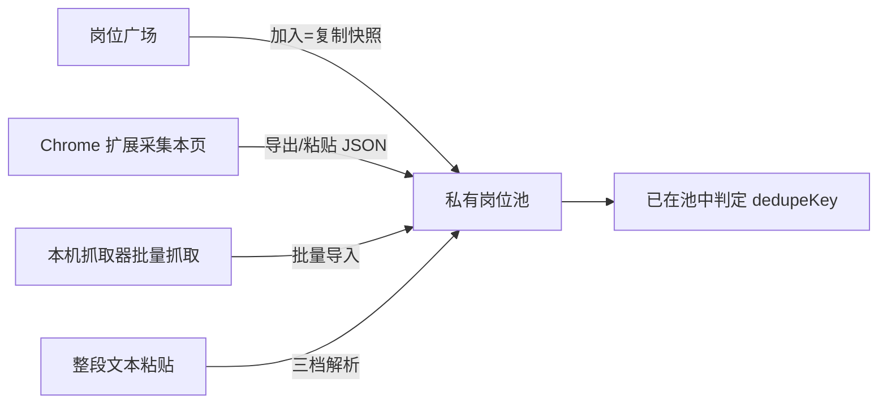
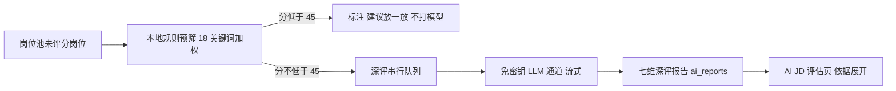
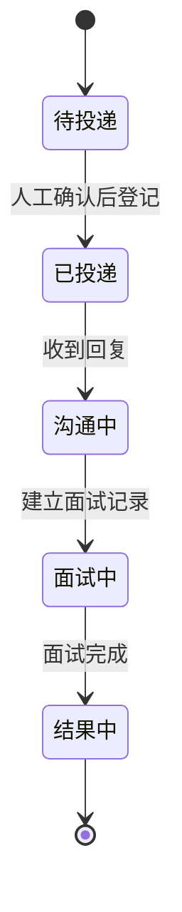
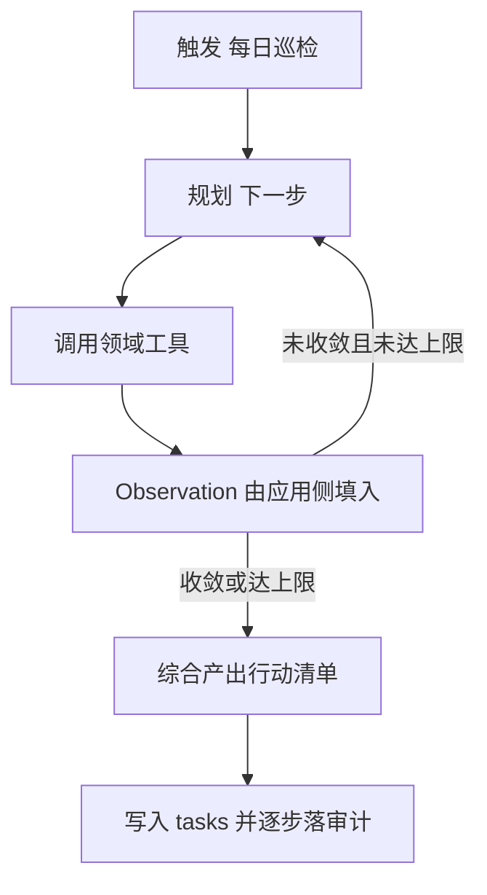

# AICoding 架构设计 · UserStory

> 本文档为《AICoding 架构设计》核心产物之一，定位为**产品需求与用户故事（UserStory）**，把架构能力翻译成产品与研发都能直接消费的「谁、在什么场景下、做成什么事、怎样算做成」。
> 上游输入：已过 G3 的《高层架构设计》（需求概要、需求分析、行业调研、方案决策、业务架构、产品需求及原型），以及已过 G1 的 `material_digest.md`、已过 G2 的 `research_report.md`；
> 下游输出：驱动《系统设计》（Owner：高见远）、《部署设计》（Owner：毕落地）、《安全设计》（Owner：严守正）的具体功能实现。
> Owner：顾全景（product-story-designer）；Gate：G4（中游设计审核）。

| 版本 | 日期 | 作者 | 变更内容 | 评审状态 |
| --- | --- | --- | --- | --- |
| v0.1 | 2026-09-29 | 顾全景 | 初稿：业务背景 / 范围边界 / 功能清单 / 角色与场景 / 用户旅程 / 非功能性需求六章 + 自检附录 | G4 通过 |
| v0.2 | 2026-09-29 | 顾全景 | Phase 6：§6.2 性能待核定项按下游权威值收口 + 附录 B C-1 / C-2 关闭 | G4 通过 |
| v0.3 | 2026-09-29 | 顾全景 | Phase 6 收口：附录 B C-5 引用来源明确为 `research_report.md` §5.2 U-5（区别于《部署设计》U-01~U-05 编号空间）；C-2 标题与依据改为与实际落点匹配，消除「逐接口全分位」的过剩承诺 | G6 待审 |
| v0.4 | 2026-09-29 | 顾全景 | Phase 6 收口：§6.2 表头「目标时延（P50 / P90 / P99）」改为「目标值 / 约束」，使表头值域与实际内容（时延 / 吞吐 / 规模 / 可用性 / 硬约束）相符 | G6 待审 |

> **修订纪律**：本文件以《高层架构设计》已冻结的角色、场景、产品模块、MVP 范围与边界为唯一依据；不新增超出高层架构范围的功能需求。数字口径采用权威值 **518 = 156 + 71 + 79 + 48 + 164（offer-pipeline 129 + agent-platform-java 35，发起人 2026-09-25 复核）**。

---

## 1. 业务背景与价值

### 1.1 业务背景

- **行业与产品**：在线招聘 / 校招实习求职赛道。本系统为「实习管理工作台（internship-workbench）」，线上版本 v0.8.13，已形成五端并存形态（Web 工作台 / 微信小程序 / Chrome MV3 扩展 / 本机抓取器 / 本机网关），沉淀 11 张数据表（10 张私有按账号隔离 + 1 张公共只读 `jobs_public`）与 14 个前端模块，把岗位池 → 投递看板 → 沟通台账 → 面试跟进 → Offer 对比一条线管到底。
- **用户规模**：核心用户为在校应届求职者（含大三在读、2028 届为主）；次级用户为求职辅导运营者与项目发起人 / 产品负责人；外围受影响方为招聘方 HR 与合规 / 平台方（微信、云平台）。
- **触发本次需求的事件**：v0.8.x 系列在 2026-09 密集迭代（岗位广场、微信小程序、本机抓取器、计费与自备 Key、求职智能体四步），能力分散。数字口径已裁决为 **518 = 156 + 71 + 79 + 48 + 164**，唯一权威；本次把已有能力收敛为**可冻结、可交接的高层架构边界**，并以 UserStory 形式把边界翻译为可直接进入系统设计、部署设计、安全设计的产品工作项。
- **本系统在产品矩阵中的位置**：本系统是求职者的**私有工作台 + 公共岗位广场**，在「AI 辅助求职」链路上承担**记录与决策辅助层**职责——上游对接招聘数据通道（扩展 / 本机抓取器 / 公开接口），下游向用户交付岗位池、投递看板与巡检结论；与招聘平台（不对接、不替代）形成清晰边界。
- **部署形态锚定**：经用户 G4 裁决，维持多用户公网 BaaS（单 AZ，MVP）。

### 1.2 行业方案

承接《高层架构设计》§3.1，同类痛点（线索散落、匹配不可证、风控封号）的行业标杆与解决方案：

- **B1 Simplify Copilot（美国 SaaS）**：扩展把 profile 映射到 ATS 表单、AI 生成短答、投递跟踪；核心流程是「人点发送、工具填表」，与本项目「发送键由人按」的交互范式同构，可借鉴其**填表契约与字段映射**思路。
- **B2 Huntr（美国 SaaS）**：Kanban 式投递跟踪 + 扩展「一键裁剪岗位入池」；与本项目「投递看板 + 采集本页岗位」同构，可借鉴其**看板 / 管道信息架构**。
- **B3 career-ops（开源，MIT，加权 4.65 最高）**：岗位 10 维加权 A–F 评级 + ATS 简历生成 + 投递跟踪 + 面试故事库，本地优先、不替用户按发送键；与本项目「AI 只做辅助、发送键由人按、评分两段式」哲学**高度同构**，借鉴方式为模式与设计级，非代码照搬。
- **B5 recruitops-agent（开源，MIT）**：桌面层 / Agent 层 / 采集层 / 数据层的完整求职系统，可借鉴其 **Agent / MCP / RAG 分层与工程规范**，不复刻其 Electron 桌面壳与平台适配矩阵。
- **B4 BossHunter（PolyForm Noncommercial，否决）**：依赖检测规避 + 自动发送 + 回复监听，与本项目已冻结边界正面冲突，且许可证红线（代码一行不得进本仓库），仅可学产品设计与文档治理。
- **行业结论**：无单一方案可覆盖全部需求，本项目采用「B3 模式（评分 / Agent / 防幻觉）+ ATS 公开 JSON 源 + 本项目已有底座（RLS 云后端 + MV3 扩展 + 本机抓取器）」组合，**自动投递 / 自动发送不采纳**。

### 1.3 方案收益与价值

| 项 | 说明 |
| --- | --- |
| 功能模块 | 岗位获取与岗位广场、两段式评分引擎、投递看板与沟通台账、面试跟进与 Offer 对比、求职智能体 ReAct 巡检、防幻觉与事实守门六项业务能力，叠加简历库 / 个人知识库 / 云服务底座 / 采集器底座四项基础能力。 |
| 预期价值收益 | 让在校求职者的线索**不漏投、不漏跟**，把「找工作」从手工台账升级为有依据的决策辅助；补齐两段式评分的外显能力（岗位广场、批量评分、投递看板、ReAct 巡检）；关键动作 100% 留痕（RLS 隔离 + 逐步审计）；单用户 AI 调用成本可控。 |
| 量化标准 | 入池渠道覆盖率 100%（5 类渠道统一入池）；审计覆盖率 100%；单人单日模型调用 ≤ 60 次/日/人（配额三闸）；周活跃投递数 ≥ 2 倍基线（完整版）；冻结评测集 ≥ 1 套且 Hit@1 可复现（完整版）；自动发送次数恒为 0。 |

### 1.4 术语清单

> 统一文档中专有名词的中英文对照与含义（与《系统设计》术语表对齐）。

| 术语 | 英文 / 标识 | 含义 |
| --- | --- | --- |
| 岗位池 | job pool（`jobs`） | 用户私有的岗位集合，按账号 RLS 隔离，新用户初始为空。 |
| 岗位广场 | job square（`jobs_public`） | 公共只读岗位库，所有人可读、无人可写，内容由服务端灌入。 |
| 快照复制 | snapshot copy | 「加入岗位池」= 复制广场岗位快照写入私有池，非引用；广场后续更新不回写私有池。 |
| 去重键 | dedupeKey | 岗位唯一性判定键，用于「已在池中」判定与跨通道去重。 |
| 两段式评分 | two-stage scoring | 第一段本地规则预筛 + 第二段 AI 七维深评。 |
| 预筛阈值 | PREFILTER_THRESHOLD = 45 | 本地预筛分低于 45 直接标注「建议放一放」，不打模型。 |
| 七维深评 | DIMS | AI 深评的七个评估维度，产出可解释的七维报告。 |
| ReAct 巡检 | ReAct loop | 智能体自主多步「推理 + 调用工具」循环，产出今日行动清单。 |
| 硬步数上限 | max_steps | 智能体单任务最大步数硬上限，超限强制终止。 |
| 配额三闸 | quota | 模型调用三道闸：dailyTasks=20 / maxCallsPerTask=8 / maxCallsPerDay=60。 |
| 行级安全 | RLS（Row Level Security） | 数据库按行隔离策略 `owner_id = auth.uid()`，私有表 10 张全部开启。 |
| 归属列 | owner_id | 私有表归属用户列；前端任何写操作均不得传递该列。 |
| 渠道能力边界表 | CHANNEL_CAPABILITIES | 各渠道能力矩阵，「投递」列恒为字面量「人工」（类型上锁死）。 |
| 打招呼硬约束 | GREETING_RULES | 招呼话术的硬性口径约束与数字事实源唯一入口。 |
| 外部文本隔离 | untrusted 三道防线 | 边界 + 声明 + 中和，一切外部文本经 `wrapUntrusted` 包装。 |
| 事实守门 | factGate | 规则版 + 模型版的事实一致性守门，防幻觉。 |
| 网申填写包 | apply kit（`APPLY_KIT_FIELDS`） | 20 个字段的网申自动填充契约，为字段唯一事实源。 |
| 超期未回复 | overdue no-reply | 投递后默认 7 天未回复触发提醒，≥14 天在看板标红。 |

---

## 2. 范围与边界

> 本章与《高层架构设计》§6.1 的 In-Scope / Out-of-Scope **严格一致，不自行增删**。

### 2.1 系统内模块及功能

**In-Scope（本期必做，12 项功能 + 3 项非功能 = 15 项）**：

- **功能项（对齐高层架构 §6.1 F1~F12）**
  - F1 多通道岗位获取（岗位广场 / 扩展采集 / 本机抓取器 / 整段粘贴）
  - F2 渠道能力边界表（投递恒为「人工」，类型上锁死）
  - F3 岗位池管理（私有隔离 + dedupeKey 去重）
  - F4 本地预筛评分（阈值 45，18 个技术关键词加权）
  - F5 AI 七维深评（批量串行）
  - F6 数字口径单点化（GREETING_RULES 唯一事实源）
  - F7 投递看板（阶段流转 + 超期标红）
  - F8 沟通台账（会话时间线 + 招呼话术模板）
  - F9 面试跟进（表单关联投递）
  - F10 Offer 对比（多维对比）
  - F11 求职智能体 ReAct 每日巡检 v1
  - F12 防幻觉与事实守门（untrusted 三道防线 + factGate）
- **非功能项**
  - N1 多端形态（Web + 小程序 + 扩展 + 抓取器）共用一套云后端
  - N2 数据隔离：10 张私有表 RLS（`owner_id = auth.uid()`）
  - N3 配额三闸（dailyTasks=20 / maxCallsPerTask=8 / maxCallsPerDay=60）

**一级功能清单（模块 → 能力）**：

| 系统内模块 | 承载能力 | 对应功能编号 |
| --- | --- | --- |
| 岗位获取与岗位广场 | 多通道入池、渠道边界、公共只读库 | F1, F2, F3, F13 |
| 两段式评分引擎 | 本地预筛、AI 七维深评、冻结评测集 | F4, F5, F14 |
| 投递看板与沟通台账 | 阶段流转、超期标红、会话时间线、招呼话术 | F7, F8 |
| 面试跟进与 Offer 对比 | 面试关联投递、多 Offer 对比、提醒日历 | F9, F10, F18 |
| 求职智能体 ReAct 巡检 | 每日巡检、投递决策、项目教练 | F11, F16 |
| 防幻觉与事实守门 | 外部文本隔离、事实守门、口径治理 | F12, F6 |
| 简历库与个人知识库 | 简历附件与 AI 分析、知识沉淀 | F17 |
| 运营看板 | 推断统计与漏斗归因 | F15 |
| WorkBuddy 云服务底座 | 数据库 / 认证 / 免密钥 LLM | N1, N2 |
| 采集器与站点表底座 | DOM 提取唯一实现 | F1 |

### 2.2 系统外模块及功能

> 当前系统**不覆盖**的能力及原因（对齐高层架构 §6.1 Out-of-Scope O1~O6）。

| 编号 | 不做的事 | 原因 | 后续计划 |
| --- | --- | --- | --- |
| O1 | 自动投递 / 自动发送 | 触碰已冻结不变量，封号与合规风险落到用户真实账号 | 维持冻结边界（经中间确认 X7：用户裁决方案 A，不自动发送） |
| O2 | 回复监听（抓取平台会话） | 需登录态自动化，违反「只读已渲染 DOM」边界 | 不做 |
| O3 | 服务端爬虫 / 云上浏览器内核 | 风控后果落到用户账号，且无合规落点 | 由本机抓取器承担 |
| O4 | 绕验证码 / 风控 / 登录墙 | 属破对方保护措施，法律与封号风险 | 不做 |
| O5 | 检测规避（伪装自动化特征） | 与「不做检测规避」边界冲突，账号风险 | 不做 |
| O6 | 不做对外 SaaS 商用化 / 订阅收费；不否定多用户公网形态本身 | 与「作品可信度优先」定位冲突，合规负担重（经用户 2026-09-29 G4 裁决 X9：维持多用户公网 BaaS 现状，仅收紧对外商用措辞） | 维持多用户公网 BaaS 现状；对外商用待业务确认 |

### 2.3 外部依赖

| 依赖系统 | 提供方 | 依赖能力 | 接入方式 | 接口人 |
| --- | --- | --- | --- | --- |
| WorkBuddy 云服务 | 平台 | 数据库 / 认证 / 免密钥 LLM | SDK（PostgREST 风格），同步 + 流式 | 平台侧支撑；项目侧 Owner 毕落地 |
| 招聘平台页面 | 招聘平台 | 已渲染 DOM 岗位信息 | 扩展 / 本机抓取器读取 DOM（本机、只读） | 无正式接口人（用户自有账号） |
| OfferBiu 公开接口 | 第三方 | 校招岗位 JSON | HTTPS GET | 无接口人（无 SLA） |
| ATS 公开 JSON 源 | 各 ATS 厂商 | 企业岗位 feed | HTTPS GET | 无接口人（无鉴权无 SLA，完整版 F13） |
| 用户自备模型服务 | DeepSeek / Kimi / OpenRouter / 阿里云百炼 / 本机 Ollama | 大模型推理 | 浏览器直发（Key 不过服务端）/ 本机 127.0.0.1 | 用户本人 |
| 微信小程序平台 | 微信开放平台 | 小程序登录通道（手机号短信 / 微信一键）与域名合规 | 小程序 SDK + 云服务网关 | 项目侧 Owner 毕落地 |

---

## 3. 功能清单

> **定位**：全景骨架表，进入「角色 / 场景 / US」之前先看到完整功能版图。本表与《高层架构设计》§6.3 功能清单**互查一致**。

### 3.1 功能清单结构

| 一级模块 | 二级模块 | 功能项 | 优先级（P0/P1/P2） | MVP 范围 | 完整版范围 | 备注 |
| --- | --- | --- | --- | --- | --- | --- |
| 岗位获取 | 多通道岗位获取 | 广场 / 扩展采集 / 抓取器 / 粘贴四通道入池 | P0 | ✅ | ✅ | 对齐 V1；Channel 8 类 |
| 岗位获取 | 渠道能力边界表 | 投递列恒为字面量「人工」，类型锁死 | P0 | ✅ | ✅ | 对齐 V3；类型上锁死 |
| 岗位池 | 私有隔离与去重 | RLS 隔离 + dedupeKey「已在池中」判定 | P0 | ✅ | ✅ | 对齐 V1；加入=复制快照 |
| 评分引擎 | 本地预筛评分 | 阈值 45，18 个技术关键词加权 | P0 | ✅ | ✅ | 对齐 V2；P99 ≤ 1s |
| 评分引擎 | AI 七维深评 | 批量串行，七维可解释报告 | P0 | ✅ | ✅ | 对齐 V2；受 quota 三闸约束 |
| 口径治理 | 数字事实源单点化 | GREETING_RULES 唯一事实源统一 | P0 | ✅ | ✅ | 对齐 V5；已消解（518 唯一权威） |
| 投递看板 | 阶段流转与超期标红 | 五阶段流转 + 超期 ≥ 7 天标红 | P0 | ✅ | ✅ | 对齐 V1；≥14 天标红 |
| 沟通台账 | 会话时间线与招呼话术 | 时间线 + 硬约束话术模板 | P0 | ✅ | ✅ | 对齐 V1；GREETING_RULES |
| 求职智能体 | ReAct 每日巡检 v1 | max_steps 硬上限 + 逐步审计 | P0 | ✅ | ✅ | 对齐 V1；失败重试上限 2 |
| 防幻觉 | 事实守门 | 规则版 + 模型版 + 外部文本隔离 | P0 | ✅ | ✅ | 对齐 V1；三道防线 |
| 面试跟进 | 表单关联投递 | 面试记录关联投递记录 | P1 | ✅ | ✅ | 对齐 V1 |
| Offer 对比 | 多维对比 | 多 Offer 维度对比 | P1 | ✅ | ✅ | 对齐 V1 |
| 岗位获取 | ATS 公开 JSON 直连 | 多源冗余，单源失效可降级 | P1 | ❌ | ✅ | 对齐 V4（完整版 F13） |
| 评分引擎 | 冻结评测集与评分校准 | 可复现 Hit@1 回归 | P1 | ❌ | ✅ | 对齐 V2（完整版 F14） |
| 运营看板 | 推断统计与漏斗归因 | 阶段分布 + 漏斗转化 | P1 | ❌ | ✅ | 对齐 V2（完整版 F15） |
| 项目教练 | 任务包与公开仓库验收 | 生成与验收不打模型 | P2 | ❌ | ✅ | 对齐 V2（完整版 F16） |
| 简历库 | 简历附件与 AI 分析 | 附件解析 + 分析（增强） | P1 | ❌ | ✅ | 对齐 V2（完整版 F17） |
| 提醒日历 | 四类事项汇总 | 面试 / 截止 / 跟进 / 超期 | P2 | ❌ | ✅ | 对齐 V1（完整版 F18） |

**硬指标自述**：P0 即 MVP 范围——上表 F1、F2、F3、F4、F5、F6、F7、F8、F11、F12 全部为 P0 且 MVP 范围列为 ✅；完整版范围由 F13~F18 承接；非功能项 N1~N3 为全局约束，不单列优先级。

> **【中间确认自检 · 第 1 次】** 详见附录 A.1。结论：**未命中**（功能清单逐条承接高层架构 §6.1 / §6.3，未做任何优先级调整或范围增删）。

---

## 4. 角色与场景

### 4.1 角色清单

> 承接《高层架构设计》§2.1 核心角色关注点（5 类角色），不在本阶段新增子角色。

| 角色 | 业务身份 | 主要操作 | 核心关注点 |
| --- | --- | --- | --- |
| 甲方决策者 | 项目发起人 / 产品负责人 | 路线决策、看板审阅、发布、数字口径复核 | 业务结果与「可验证作品」的可信度 |
| 最终用户 A | 在校应届求职者 | 岗位获取、批量评分、投递登记、跟进复盘 | 线索不丢、少踩坑、不漏投不漏跟 |
| 最终用户 B | 求职辅导运营者 | 监控投递节奏与转化、看板干预、黑名单维护 | 风险时效与转化漏斗 |
| 受影响方 · HR | 招聘方 HR | 接收投递与招呼 | 内容真实、不被机械骚扰 |
| 受影响方 · 平台 | 合规 / 平台方（微信、云平台） | 审计、备案、ToS 校验 | 数据驻留、ICP 备案、合规底线 |

### 4.2 关键场景清单

| 编号 | 角色 | 触发条件 | 期望结果 | 频率（日均 / QPS） |
| --- | --- | --- | --- | --- |
| SC-1 | 最终用户 A | 新账号打开岗位池为空 / 刷到新岗位 | 从四通道把岗位灌进私有岗位池 | 日均 1~3 次/人（QPS 见《系统设计》§3.5） |
| SC-2 | 最终用户 A | 岗位池积压一批未评分岗位 | 两段式评分完成并可判读 | 日均 1~2 次/人 |
| SC-3 | 最终用户 A | 决定投递某岗位 | 投递登记入看板并推进阶段 | 日均 0~5 次/人（受节奏守则约束） |
| SC-4 | 最终用户 A / B | 投递后长期无回复 | 超期标红并在总览集中提醒 | 每日打开时触发 |
| SC-5 | 最终用户 A | 每天早晨打开工作台 | ReAct 巡检产出今日行动清单 | 日均 1 次/人 |
| SC-6 | 最终用户 A | 需要在第三方网申页填写 | 填写包导出 + 扩展一键填充（发送由人按） | 日均 0~3 次/人 |
| SC-7 | 受影响方 · HR | 收到用户人工投递的招呼 | 内容真实、非机械骚扰 | 随用户投递量 |

> **【中间确认自检 · 第 2 次】** 详见附录 A.2。结论：**未命中**（角色逐条承接高层架构 §2.1，未做角色细分；场景仅展开既有功能，未改变模块边界）。

---

## 5. 用户旅程（UserStory）

> 每条 US 按七段式展开：**业务场景 / 业务流程 / UE 原型 / 业务逻辑 / 数据描述 / 验收标准 / 外部集成接口**。本阶段覆盖 5 条关键旅程，均取自高层架构 §6.3 的 P0 功能。

### 5.1 US-1 从多通道把岗位灌进岗位池（含广场「加入=复制快照」与去重）

#### 5.1.1 业务场景

- **视角**：最终用户 A（在校应届求职者）。
- **描述逻辑**：校招季每天在 BOSS、实习僧、公司招聘板、校招公开库看到岗位；新账号工作台按账号隔离，岗位池必然为空。用户需要把散落在多源、且「自己看得见的那一屏」上的岗位线索，用四类通道灌进私有岗位池，并能一眼看出哪些已入池，避免重复投递。

#### 5.1.2 业务流程

- Given 用户已登录且岗位池为空，When 在岗位广场浏览公共岗位并点击「加入岗位池」，Then 系统复制该岗位快照写入私有岗位池，卡片置灰显示「已在池中」。
- Given 用户停留在招聘网站结果页或岗位详情页，When 点击扩展「采集本页岗位」，Then 扩展只读当前已渲染 DOM 生成采集 JSON，用户回到工作台粘贴或导入后解析入库。
- Given 用户在本机跑完一轮抓取器，When 通过「批量导入」消费站点 JSON 产出，Then 解析入池并完成跨轮次去重。
- Given 用户手上只有一段岗位文本，When 在岗位池粘贴整段文本（字段上限 5000 字符），Then 按三档解析入池。

#### 5.1.3 UE 原型

- **岗位广场页**：顶部筛选栏（渠道 / 类型 / 行业），下方岗位卡片列表；卡片右上角「加入岗位池」按钮；已入池卡片显示「已在池中」（灰态、不可重复加入）。
- **岗位池页**：批量导入入口（整段粘贴 / 导入 JSON 文件）+ 岗位表格（岗位名 / 公司 / 渠道 / 匹配度）+ 空态引导（5 条一键示例岗位）。
- 页面流转（Mermaid）：

#### 5.1.4 业务逻辑

- 四通道统一归一为 JobDraft → 计算 dedupeKey → 与私有岗位池现有键比对 → 入池或标记「已在池中」。
- 广场加入：读 `jobs_public`（公共只读、无 `owner_id`、无私有字段）→ 复制快照写入 `jobs`（归属列默认 `auth.uid()`）→ 前端写操作**不传** `owner_id`。
- 扩展 / 抓取器：只读浏览器已渲染 DOM；`extension/collector.js` 为唯一提取实现，扩展与抓取器逐字一致（契约测试钉住）。

#### 5.1.5 数据描述

- 输入源：`jobs_public`（公共只读）与外部采集 JSON（`source / channel / site_id / collected_at / jobs / text`）。
- 归一目标：`jobs` 私有表，字段含岗位名 / 公司 / 地点 / 渠道 / 链接 / JD 文本 / `dedupeKey`。
- 关键语义：**加入 = 复制快照**（非引用）；广场后续更新不回写用户私有池；`jobs` 用全部 11 张表之一，小程序端亦使用。

#### 5.1.6 验收标准 AC

- **AC-1（正常路径 · 广场加入）**：Given 用户已登录且岗位广场存在一条未入池岗位，When 用户点击该岗位的「加入岗位池」，Then 系统在私有岗位池生成一条快照记录，卡片状态变为「已在池中」，且该记录归属为当前登录账号。
- **AC-2（正常路径 · 扩展采集）**：Given 用户在招聘结果页已渲染出岗位列表，When 用户点击扩展「采集本页岗位」并回工作台导入，Then 采集到的岗位被解析入池，未采集到内容时提示可手动重试。
- **AC-3（异常路径 · 越权写入被拒）**：Given 前端写操作误传了 `owner_id`，When 提交写入请求，Then RLS 拒绝并返回空数组，前端按失败处理并抛错，岗位不入池。
- **AC-4（异常路径 · 重复加入）**：Given 目标岗位已在池中（dedupeKey 命中），When 用户再次点击「加入岗位池」，Then 系统不产生重复记录，并提示「已在池中」。
- **AC-5（异常路径 · 解析失败拒绝入库）**：Given 粘贴文本无法解析出必填字段，When 用户执行导入，Then 系统拒绝写入并提示缺失字段，不写脏数据。
- **AC-6（异常路径 · 采集受限）**：Given 目标岗位未渲染或位于 iframe 内，When 用户执行采集，Then 返回可采集 0 条并提示需展开页面后重试，不报错中断。

#### 5.1.7 外部集成接口

- **招聘平台页面**：Chrome MV3 扩展仅用 `activeTab` + `scripting` + `storage`，只读当前已渲染 DOM，不发任何网络请求；已知限制（iframe 内岗位、未渲染内容、页面重渲染后标记丢失）由用户手动重试兜底。
- **OfferBiu 公开接口**：HTTPS GET，默认 1.2 秒间隔、不做并发；存在 `previewLimited`、`deadlineAt` 覆盖率约 20% 等上游限制。
- **本机抓取器**：`playwright-core` 驱动本机已装 Edge / Chrome（不下载自带内核），登录态只存本机 `.profile`（不上传、不打印）；产出走采集器 JSON 契约。
- **WorkBuddy 云服务**：`jobs_public` 读与 `jobs` 写，写操作返回空数组视为失败。

### 5.2 US-2 两段式评分（本地预筛 45 → AI 七维深评）与结果判读

#### 5.2.1 业务场景

- **视角**：最终用户 A。
- **描述逻辑**：用户入池一批岗位（如 20 条），希望先用本地规则快速过滤掉明显不匹配的，再对值得投的岗位做深度、可解释的评估，避免无谓的模型成本与决策噪音。

#### 5.2.2 业务流程

- Given 岗位池存在若干未评分岗位，When 用户触发「批量 AI 评分」，Then 系统先执行本地规则预筛并给出本地分，低于阈值 45 的岗位直接标注「建议放一放」。
- Given 某岗位本地分达到或超过 45，When 进入深评队列，Then 系统按批量**串行**执行 AI 七维深评，逐条产出可解释报告。
- Given 深评完成，When 用户打开 AI·JD 评估页，Then 可查看维度分、判定依据与匹配度建议。

#### 5.2.3 UE 原型

- **岗位池页**：批量评分按钮 + 进度与「已评 / 待评 / 建议放一放」计数；岗位行显示本地分与匹配度。
- **AI·JD 评估页**：七维报告卡片（维度分 + 依据展开 + 匹配度 + 建议），低于建议线提示「建议放一放」。
- 评分流水线（Mermaid）：

#### 5.2.4 业务逻辑

- `score.ts`：18 个技术关键词加权 → 本地预筛分；`PREFILTER_THRESHOLD = 45`。
- 深评：经唯一模型入口 `streamChat`（`task` 必填以归属额度）→ 七维 `DIMS` 评估 → 结果写入 `ai_reports`。
- 防幻觉：所有外部文本（JD 等）在组装 prompt 前必须经 `wrapUntrusted` 或专用 `build*UserMessage` 包装；JD 白字注入等风险由三道防线中和。
- 批量评分**串行**执行，避免并发触发平台风控与额度超限。

#### 5.2.5 数据描述

- 输入：`jobs` 行的岗位文本 / JD 文本。
- 中间产物：本地预筛分 `localScore`。
- 输出：`ai_reports` 记录（七维分、依据、匹配度、来源岗位）；额度台账（quota）记录逐次调用归属与用量。

#### 5.2.6 验收标准 AC

- **AC-1（正常路径 · 预筛分流）**：Given 岗位 JD 文本完整且未评分，When 用户触发批量评分，Then 本地预筛分落在 0~100 区间，达到或超过 45 的岗位进入深评，低于 45 的岗位标注「建议放一放」。
- **AC-2（正常路径 · 深评报告）**：Given 某岗位进入深评队列，When 模型返回结果，Then 系统生成七维报告写入 `ai_reports`，并在岗位池与 AI·JD 评估页可读。
- **AC-3（异常路径 · 低分不打模型）**：Given 某岗位本地预筛分低于 45，When 批量评分执行，Then 系统不发起模型调用、不消耗配额，仅做本地标注。
- **AC-4（异常路径 · 配额耗尽拦截）**：Given 当日调用已触及配额三闸任一上限，When 用户继续触发评分，Then 系统拦截并提示当日额度用尽，不发起模型调用。
- **AC-5（异常路径 · 注入被中和）**：Given JD 中含疑似注入指令文本，When 系统组装 prompt，Then 外部文本经 `wrapUntrusted` 三道防线中和，报告不执行其中指令。
- **AC-6（异常路径 · 工具失败重试）**：Given 深评过程中模型流式中断或工具调用失败，When 系统重试，Then 失败重试不超过 2 次；超限则将该岗位标注失败并保留已得部分，不阻塞后续串行任务。

#### 5.2.7 外部集成接口

- **免密钥 LLM 通道**：云服务内置，流式返回，按任务选择模型。
- **用户自备模型通道**：浏览器直发（Key 只在用户设备与厂商之间流动，不过本项目服务端）；或本机 Ollama（仅认 127.0.0.1:11434）。
- **配额三闸**：`dailyTasks=20 / maxCallsPerTask=8 / maxCallsPerDay=60`，为所有模型调用的统一准入控制。

### 5.3 US-3 投递看板登记 → 超期未回复提醒 → 面试跟进

#### 5.3.1 业务场景

- **视角**：最终用户 A（主）、最终用户 B（辅）。
- **描述逻辑**：用户确认某岗位值得投后，需要把投递动作与后续进展沉淀为台账；若投递后长时间没有回复，希望被主动提醒；当收到面试邀约时，希望面试记录能关联回这条投递，形成闭环。

#### 5.3.2 业务流程

- Given 用户已确认某岗位值得投递（匹配度达标、已过发送前自检），When 用户在投递看板登记该投递，Then 系统生成投递记录并进入默认阶段。
- Given 某投递已超过约定周期未获回复，When 超期判定触发，Then 看板卡片标红并在总览集中提醒。
- Given 用户收到面试邀约，When 用户建立面试记录，Then 该记录关联对应投递，投递阶段相应推进。

#### 5.3.3 UE 原型

- **投递看板页**：五阶段列（阶段取自统一常量）；卡片展示岗位、公司、超期天数；超期与 ≥14 天卡片差异标红；支持卡片拖拽流转与登记。
- **沟通台账页**：单条会话时间线 + 「一键填充招呼模板」（话术受硬约束）。
- **面试跟进页**：面试表单（时间 / 形式 / 备注）关联投递记录。
- 看板阶段流转（Mermaid）：

#### 5.3.4 业务逻辑

- 投递记录按下阶段常量 `STAGES` 流转；超期默认 7 天触发提醒，≥14 天在看板标红。
- 渠道能力边界表 `CHANNEL_CAPABILITIES` 的「投递」列恒为字面量「人工」（类型上锁死），系统不代用户提交。
- 招呼话术受 `GREETING_RULES` 硬约束（身份只写届数 + 专业 + 姓名、数字口径唯一、长度贴住对方问题强度）。

#### 5.3.5 数据描述

- `applications`：投递记录（关联岗位、当前阶段、登记与阶段变更时间戳）。
- `messages`：会话时间线（沟通台账）。
- `interviews`：面试记录（关联 `applications`）。
- 跨端一致性：时间口径统一走 `format.ts#parseDate`，Web 与小程序计算「剩 N 天」与超期差值必须为 0。

#### 5.3.6 验收标准 AC

- **AC-1（正常路径 · 登记成功）**：Given 用户已完成发送前自检，When 在投递看板登记投递，Then `applications` 落库、看板出现卡片并进入默认阶段。
- **AC-2（正常路径 · 超期提醒）**：Given 某投递已达超期阈值仍未回复，When 用户打开总览或看板，Then 该卡片标红并出现在「超期未回复」提醒区域。
- **AC-3（正常路径 · 面试关联）**：Given 用户收到面试邀约，When 新建面试记录，Then 面试记录关联到对应投递，投递阶段同步推进。
- **AC-4（异常路径 · 自检未完成阻止推进）**：Given 用户未完成发送前自检清单，When 尝试把岗位标记为「已投递」，Then 系统阻止并提示先完成自检。
- **AC-5（异常路径 · 渠道边界被破坏）**：Given 渠道能力边界表某渠道的「投递」列被改成非「人工」，When 运行类型检查与契约测试，Then 校验直接失败（类型上锁死）。
- **AC-6（异常路径 · 跨端口径漂移）**：Given 用户在 Web 与小程序分别查看同一投递，When 两端计算「剩 N 天」与超期状态，Then 两端结果一致（时区守卫保证差值为 0）。

#### 5.3.7 外部集成接口

- **招聘平台**：投递动作由用户人工在平台完成，系统不代投递、不代发送（经中间确认 X7 已裁决，维持不自动发送）。
- **WorkBuddy 云服务**：`applications` / `messages` / `interviews` 读写，全部按 `owner_id = auth.uid()` RLS 隔离；小程序端使用其中 `applications` / `messages`。

### 5.4 US-4 ReAct 每日巡检产出行动清单

#### 5.4.1 业务场景

- **视角**：最终用户 A。
- **描述逻辑**：用户每天早上希望快速知道「今天该做什么」——哪些投递该跟进、哪些岗位要截止、哪些面试要准备，而不想手动翻遍所有列表。

#### 5.4.2 业务流程

- Given 用户触发「每日巡检」，When 求职智能体运行，Then 智能体自主多步调用领域工具（查跟进、算漏斗、扫截止、排优先级），综合产出带依据的今日行动清单。
- Given 巡检执行过程中，When 每一步产生观察结果，Then 逐步落审计，用户可在执行轨迹中回看。

#### 5.4.3 UE 原型

- **总览页**：「今日行动清单」卡片（行动项 + 依据 + 一键跳转）；「执行轨迹」区展示智能体的逐步推理与工具调用（`AgentSteps` 组件）。
- ReAct 循环（Mermaid）：

#### 5.4.4 业务逻辑

- `agentLoop.runAgent`：Observation 仅由应用侧填入；`max_steps` 硬上限；每步落审计（ActionStep 数组）；工具失败回填重试上限 2；v1 不做跨会话记忆。
- 工具集来自既有 8 个纯函数模块（查跟进、算漏斗、扫截止、排优先级等）；工具注册表描述质量决定巡检成败。
- 模型走目录最低倍率档；每次调用归属额度台账。

#### 5.4.5 数据描述

- 读：`applications` / `messages` / `interviews` / `offers` / `tasks` / `profile`。
- 写：`tasks`（今日行动项）。
- 审计：`ActionStep` 数组（含每步工具调用与 Observation），随执行记录留存，构成关键动作留痕的一部分。

#### 5.4.6 验收标准 AC

- **AC-1（正常路径 · 产出清单）**：Given 存在在途投递与待办，When 用户触发每日巡检，Then 系统产出含依据的今日行动清单并写入 `tasks`。
- **AC-2（正常路径 · 逐步审计）**：Given 巡检正在执行，When 智能体逐步运行，Then 每一步均落审计，用户可在执行轨迹中看到工具调用与 Observation。
- **AC-3（异常路径 · 步数上限终止）**：Given 推理步数达到 `max_steps` 上限仍未收敛，When 智能体继续，Then 系统硬性终止并输出「部分结论 + 未完成说明」，不进入无限循环。
- **AC-4（异常路径 · 工具失败重试）**：Given 某工具调用失败，When 系统回填重试，Then 重试不超过 2 次；超限则跳过该工具并记入审计，继续后续步骤。
- **AC-5（异常路径 · 日额度用尽）**：Given 当日 `maxCallsPerDay=60` 已用尽，When 用户再次触发巡检，Then 系统拦截，不发起任何模型调用。
- **AC-6（异常路径 · 原始 JD 不进决策 prompt）**：Given 智能体执行投递决策类任务，When 组装 prompt，Then 依既定口径不注入原始 JD（决策场景改用 `companyHistory`），且一切外部文本经 `untrusted` 隔离。

#### 5.4.7 外部集成接口

- **免密钥 LLM 通道**：ReAct 循环的推理与工具选择。
- **配额三闸**：`dailyTasks / maxCallsPerTask / maxCallsPerDay`，其中 `maxCallsPerTask` 与 `max_steps` 对齐。
- **agentTools 工具注册表**：领域工具的注册与调用入口。

### 5.5 US-5 网申填写包导出 + 扩展一键填表（发送键由人按）

#### 5.5.1 业务场景

- **视角**：最终用户 A。
- **描述逻辑**：用户决定投递某岗位后，往往需要在第三方网申页面反复填写同样的个人信息与经历；用户希望把已在工作台沉淀的信息一键带到网申页，但**最终提交动作仍由自己亲自按下**。

#### 5.5.2 业务流程

- Given 用户已完善个人目标条件与简历信息，When 选择某岗位生成「网申填写包」并导出，Then 系统按字段契约生成填写包文件。
- Given 用户打开第三方网申页面并导入该填写包，When 点击扩展「一键填充」，Then 扩展自动填充可匹配字段，并跳过复选框 / 单选框 / 文件上传 / 密码框 / 验证码 / 搜索框。
- Given 填充完成，When 用户查看提交按钮，Then 提交 / 发送动作仍由用户手动执行，系统未执行任何发送。

#### 5.5.3 UE 原型

- **网申填写包页**：按字段契约列出的填写项清单 + 「导出填写包」按钮。
- **扩展弹窗（popup）**：导入填写包 + 「一键填充当前页面」+ 填充结果摘要（已填 / 跳过数量）。
- 页面流转（Mermaid）：

#### 5.5.4 业务逻辑

- `APPLY_KIT_FIELDS`（20 字段）为填写包唯一事实源；生成逻辑按清单出字段，映射漏一个则 `tsc -b` 直接失败。
- `extension/content.js` 按可见文案 + placeholder + name + id + aria-label 加权匹配目标字段，自动跳过敏感控件。
- 扩展仅用 `activeTab` + `scripting` + `storage`，数据只写入 `chrome.storage.local`，不发起网络请求；系统**不代提交**（发送键由人按）。

#### 5.5.5 数据描述

- 输入：`profile`（目标条件与身份/经历字段）、`resumes`、岗位上下文。
- 输出：填写包文件（20 字段）。
- 填充过程数据仅存在于 `chrome.storage.local`，不出本机、不入云端。

#### 5.5.6 验收标准 AC

- **AC-1（正常路径 · 生成填写包）**：Given 用户已完善个人信息，When 生成并导出填写包，Then 输出字段与 `APPLY_KIT_FIELDS` 契约完全一致的填写包文件。
- **AC-2（正常路径 · 一键填充）**：Given 用户在网申页导入填写包，When 点击「一键填充」，Then 可匹配字段被填充，摘要显示已填与跳过数量。
- **AC-3（正常路径 · 发送键由人按）**：Given 页面字段已填充完成，When 用户检视提交按钮，Then 提交 / 发送仍由用户手动点击，系统未执行任何自动发送动作。
- **AC-4（异常路径 · 字段契约失配）**：Given 新增或删除字段但未同步映射，When 执行构建，Then `tsc -b` 直接失败（契约强制），阻止带缺陷发版。
- **AC-5（异常路径 · 复杂控件跳过）**：Given 目标字段位于 iframe、富文本编辑器或需联动选择，When 执行一键填充，Then 系统跳过该字段并提示需手动填写，不报错中断。
- **AC-6（异常路径 · 扩展无网络请求）**：Given 审查扩展权限与实现，When 校验扩展行为，Then 权限不含网络访问、扩展不发起任何网络请求。

#### 5.5.7 外部集成接口

- **Chrome MV3 扩展**：仅 `activeTab` + `scripting` + `storage`，只读/只填当前页面，不发网络请求。
- **第三方网申页面**：填充目标，已知限制（iframe、富文本、联动控件）由用户手动兜底。
- **发送边界**：系统只产出填写包与草稿，不代按发送键（经中间确认 X7 已裁决，维持不自动发送）。

> **【中间确认自检 · 第 3 次】** 详见附录 A.3。结论：**未命中**（US 拆分粒度不影响功能清单总数与下游模块边界；未新增任何外部承诺）。

---

## 6. 非功能性需求

### 6.1 易用性需求

- **操作便利性**：主链路（岗位池 → 评分 → 投递登记）操作步数不超过 5 步（承接高层架构 §6.4）。
- **UI 一致性**：统一三组导航（工作台 / 资产 / 配置）；纯手写 CSS，不引入 UI 组件库；状态用 React 内置 hooks；图表用原生 SVG / DOM。
- **引导提示**：岗位池空态提供一键示例岗位引导；批量评分与巡检提供进度与计数。
- **错误反馈**：错误信息透出真实原因（如登录失败不掩盖底层原因）；写操作返回空数组按失败处理并提示；导入解析失败提示缺失字段。
- **无障碍与一致性**：关键操作提供明确文案与状态回显；色彩不仅靠单一颜色区分状态（标红同时给出文字）；键盘可达与字号可读性作为验收关注项（详见 §B 待澄清项）。

### 6.2 性能响应需求

> 说明：本阶段**不新造对外 SLA**。凡上游已给定基线的性能项，直接承接；下游（《系统设计》《部署设计》）已核定的项，引用其权威值。「待核定」项已在 Phase 4/5 收口，本表不再保留未决时态。

| 接口 / 场景 | 目标值 / 约束 | 依据 / 状态 |
| --- | --- | --- |
| 本地预筛评分（纯本地计算） | 单次响应 P99 ≤ 1s | 承接高层架构 §6.4，已给定 |
| 岗位池 / 投递看板列表查询 | 受单账号 QPS ≤ 30 约束 | 见《系统设计》§3.5 限流表 |
| AI 七维深评（单岗位） | 流式返回，首字响应为工程目标（非对外 SLA） | 上游未给基线；受配额三闸约束 |
| ReAct 每日巡检（单次任务） | 受 `max_steps` 与 `maxCallsPerTask=8` 硬约束 | 承接高层架构 §6.3 / §6.1 N3 |
| 模型调用吞吐 | `dailyTasks=20 / maxCallsPerTask=8 / maxCallsPerDay=60` 三闸限流 | 承接高层架构 §6.1 N3，已给定 |
| 接口 QPS / TPS | 单账号 QPS ≤ 30；峰值 QPS 5 → 30 | 见《系统设计》§3.5 / §5.3 |
| 并发用户数 | 由峰值 QPS 与平台可用性 ≥ 99.5%（MVP）共同约束 | 见《系统设计》§5.3 |
| 数据规模上限 | 单用户 ≤ 1 万行；全库 ≤ 500 万行 | 见《系统设计》§5.1 / §5.3 |
| 容量水位线 | 四级水位（60% / 80% / 95% 等） | 见《部署设计》§8.1 |
| 可用性与容灾 | 平台可用性 ≥ 99.5%（MVP）；RTO ≤ 60 min / RPO ≤ 15 min | 见《系统设计》§4.3.2 / §5.3 |

> 说明：上述各项在 Phase 4/5 已由《系统设计》《部署设计》核定，本表引用其权威值，**不复述推导过程**（单一来源原则）。

- **批量评分策略**：AI 深评批量**串行**执行，不以并发换速度，避免触发平台风控与额度超限。
- **降级路径**：第三方数据源（OfferBiu）为单点依赖，失效时以降级到 ATS 直连与本机抓取器兜底（完整版 F13 承接）。

### 6.3 操作与环境需求

- **浏览器兼容性**：Web 端基于 React 19 + Vite 8 构建，运行于现代 Chromium / Firefox / Safari；Chrome 扩展要求支持 MV3 的 Chrome / Edge。
- **网络环境**：Web 端与小程序端一律走 HTTPS；小程序服务器域名必须完成 ICP 备案且仅使用 HTTPS（合规底线）。
- **设备规格**：本机抓取器要求本机已安装 Edge 或 Chrome（`playwright-core` 不下载自带内核）；开发环境 Node.js 不低于 20。
- **运行环境约束**：云端为 WorkBuddy 云服务（无自建服务器、无中间层）；本机侧三件套（扩展 / 抓取器 / 网关）数据不出机；网关只监听 127.0.0.1；小程序 `lazyCodeLoading: "requiredComponents"` 必须置于顶层；经用户 G4 裁决，维持多用户公网 BaaS（单 AZ，MVP）。
- **时区一致性**：跨端时间口径统一，CI 在非 UTC 时区（America/New_York、Asia/Shanghai）复跑测试以守卫一致性。

### 6.4 安全性需求

> 满足相关安全标准。

#### 6.4.1 安全密码设置

- 产品涉及账号密码设置功能时，需支持达到 8 位以上大小写字母 + 数字 + 特殊字符的强度要求。
- 认证相关硬性约定：发码验码分离、重试不重复发码、原样回传 `email` / `verificationId` / `isExistingUser`；不得暴露某邮箱是否已注册。

#### 6.4.2 安全软件架构

- 保证自身结构中各模块的通信安全：Web / 小程序与云服务一律经 HTTPS；本机侧（扩展 / 抓取器 / 网关）不发起对外网络请求或仅访问本机 127.0.0.1。
- 保证组件、用户、资源的认证与访问控制：10 张私有表全部开启 RLS，策略 `owner_id = auth.uid()`，`USING` 与 `WITH CHECK` 均须书写；唯一例外 `jobs_public` 只有一条 `FOR SELECT` 策略、不建写策略。
- 与外系统交互时保证接口安全：限制未经许可的接口访问；使用适当的加密与认证手段；限制外部应用系统可获取的内容；使用安全的通讯协议。

#### 6.4.3 安全设计

- 提供认证授权功能：邮箱验证码 / 邮箱密码（Web），手机号短信 / 微信一键登录（小程序）；前端写操作绝不传递 `owner_id`；写操作返回空数组视为失败。

#### 6.4.4 安全开发

- 对函数入口参数的合法性和准确性进行检查（如网关参数白名单校验、数值钳位、拒绝路径）。
- 进行输入边界检查，限制输入的正确长度和格式（如整段粘贴字符上限、站点 id 白名单）。
- 保证不因代码编写导致出现可被直接利用的高危漏洞。
- 在应用系统输入输出模块中进行适当的过滤，以防范恶意指令和内部信息泄露（如外部文本隔离三道防线、隐私红线不编码个人短板事实）。
- 禁止使用未经授权和验证的代码（许可证白名单，PolyForm Noncommercial 源码一行不得进入本仓库）。
- 保证应用程序不存在任何可绕行安全机制的行为或遗留后门。

#### 6.4.5 安全测试和部署

- 进行安全扫描测试（密钥扫描、依赖与许可证扫描）。
- 进行安全配置基线检查。
- 进行安全功能的测试（含跨端契约测试与 RLS 行为验证）。
- 系统在上线前应不存在高危风险。

#### 6.4.6 数据安全

- **数据存储和传输加密**：在用户密码、身份鉴别信息等重要数据的存储、传输过程进行适当加密，保障信息不被泄露。
- 用户自备模型 Key 只在用户设备与厂商之间流动，不经过本项目任何服务端；导出数据不入仓库。

> **【中间确认自检 · 第 4 次】** 详见附录 A.4。结论：**未命中**（本阶段未新造任何性能 / 并发 / 数据规模对外承诺，未改写功能边界）。

---

## 附录 A：中间确认自检报告

> 依据 `intermediate_confirmation.md` §2.4，在 §3 / §4 / §5 / §6 四处关键章节产出后各插入一次自检：先按 §2.1 判定，再按 §2.3 反向验证 3 问。**本轮四次自检均为「未命中」，未发起 `[中间确认]`**，逐条给出证据如下。

### A.1 自检点一：§3 功能清单完成后

- **§2.1 判定**：§3 功能清单逐条承接《高层架构设计》§6.1 In-Scope 与 §6.3 功能清单（F1~F18，优先级 P0/P1/P2 与 MVP 标记原样承接），未对任何功能做优先级调整或范围增删。三条件中第 3 条「用户诉求 / 上游已冻结未对该决策点做出选择」不成立——上游已冻结。→ 未命中。
- **反向验证 3 问**：
  - **Q1（返工成本）**：若 §3 功能清单被推翻，返工范围仅本文件 §2 / §3 / §4 / §5 的表格与映射列，且必须同步回改上游《高层架构设计》§6.1 / §6.3；本阶段自身切换成本远低于 1 人月。→ 可控。
  - **Q2（可感知性）**：§3 为功能清单骨架表，本身不新增用户可见行为；用户 / 客户 / 监管的感知点完全由上游功能边界决定，本表未新增感知点。→ 感知点未增加。
  - **Q3（与诉求一致性）**：直接引用上游冻结结论——《高层架构设计》§6.3 硬指标「P0 即 MVP 范围」与 §6.1「In-Scope = 15 条 / Out-of-Scope = 6 条」；本表与之一致，未偏离。
- **结论**：未命中，未发起。

### A.2 自检点二：§4 角色与场景清单完成后

- **§2.1 判定**：§4.1 角色清单逐条承接《高层架构设计》§2.1 的 5 类角色（甲方决策者 / 最终用户 A / 最终用户 B / 受影响方 HR / 受影响方平台），**未做角色细分**（未把「管理员」类角色拆分为子角色），故不引起 §3 功能归属与下游模块边界变化。→ 未命中。
- **反向验证 3 问**：
  - **Q1（返工成本）**：若角色定义被推翻，返工范围仅本文件 §4.1 / §4.2 两张表及其在各 US 中的引用，不触及下游《系统设计》模块拆分，切换成本远低于 1 人月。→ 可控。
  - **Q2（可感知性）**：角色为需求侧抽象，用户 / 客户 / 监管不直接感知；本阶段未新增角色可见的产品形态。→ 感知点未增加。
  - **Q3（与诉求一致性）**：直接引用《高层架构设计》§2.1 角色表原文角色名与 Top1 关心点，本表逐条对齐、未增删。→ 一致。
- **结论**：未命中，未发起。

### A.3 自检点三：§5 全部 US 七段式展开完成后

- **§2.1 判定**：本轮选择 5 条关键 US（多通道入池 / 两段式评分 / 投递与超期与面试 / ReAct 巡检 / 网申填写包），均取自上游 P0 功能。US **拆分粒度属于呈现层**，不改变 §3 功能清单总数（F1~F18 不变），也不改变下游模块边界。三条件中「影响下游接口契约 / 模块边界」不成立。→ 未命中。
- **反向验证 3 问**：
  - **Q1（返工成本）**：若调整 US 拆分（如合并或细分某条 US），返工范围仅本文件 §5 的组织结构，§2 / §3 / §4 与下游《系统设计》模块拆分均不受影响；切换成本远低于 1 人月。→ 可控。
  - **Q2（可感知性）**：US 拆分不改变任何一条用户可见交互路径与功能提供与否；用户 / 客户 / 监管感知点为 0 新增。→ 感知点未增加。
  - **Q3（与诉求一致性）**：5 条 US 的验收标准均落在上游已冻结的 P0 功能与既定不变量（阈值 45、配额三闸、max_steps 硬上限、投递恒为人工），未新增超出高层架构范围的功能需求。→ 一致。
- **结论**：未命中，未发起。

### A.4 自检点四：§6 非功能性需求完成后（最后一次完整复核）

- **§2.1 判定**：重点复核 §6.2 性能响应需求。处理方式为：**凡上游已给基线者直接承接**（本地预筛 P99 ≤ 1s 承接高架 §6.4；配额三闸承接高架 §6.1 N3）；**凡上游未给基线者（并发 / QPS / 数据规模上限）不在本阶段自定取值**，而显式列为待核定项交由《系统设计》《部署设计》核定。因此本阶段未就性能目标值形成新的对外承诺。§6.1 / §6.3 / §6.4 均为承接上位约束或安全基线，未改写功能边界。→ 未命中。（Phase 6 收口说明：上述待核定项已按《系统设计》《部署设计》权威值收口，详见 §6.2 与附录 B C-1 / C-2。）
- **反向验证 3 问**：
  - **Q1（返工成本）**：若日后需为并发 / QPS 等补充目标值，仅在 §6.2 表格与待澄清项中增补，不触及 §2~§5 与下游模块设计；切换成本远低于 1 人月。→ 可控。
  - **Q2（可感知性）**：本阶段未新增任何性能 / 并发 / 数据规模数值承诺，用户 / 客户 / 监管在 §6.2 上无新增感知点；唯一承接的 P99 ≤ 1s 与配额三闸均来自上游已冻结产物。→ 感知点未增加。
  - **Q3（与诉求一致性）**：直接引用《高层架构设计》§6.4「本地预筛单次响应 P99 ≤ 1s」与 §6.1 N3「dailyTasks=20 / maxCallsPerTask=8 / maxCallsPerDay=60」原文口径；用户原始诉求未显式提及并发 / QPS 基线，故本阶段**不擅自设定**，与诉求一致。
- **结论**：未命中，未发起。

### A.5 自检结论汇总

| 自检点 | §2.1 判定 | 反向验证 Q1 / Q2 / Q3 | 是否发起 [中间确认] |
| --- | --- | --- | --- |
| §3 功能清单后 | 未命中（逐条承接上游，未调优先级） | 可控 / 感知点未增加 / 一致（有上游原文引用） | 否 |
| §4 角色与场景后 | 未命中（承接 5 类角色，未细分） | 可控 / 感知点未增加 / 一致（有上游原文引用） | 否 |
| §5 US 七段式后 | 未命中（拆分粒度属呈现层） | 可控 / 感知点未增加 / 一致（落在已冻结 P0 与不变量） | 否 |
| §6 非功能需求后 | 未命中（上游无基线者不擅自设定） | 可控 / 感知点未增加 / 一致（承接 P99 ≤ 1s 与配额三闸） | 否 |

> 说明：四轮自检均严格按「先 §2.1 判定、再 §2.3 反向验证 3 问」执行，每问均给出具体证据（含上游原文引用），未出现只答「可控 / 感知不到 / 一致」而无证据的情况。**本阶段未就任何论题发起 `[中间确认]`**；用户已裁决的 X7（维持不自动投递 / 不自动发送）在本文件 §2.2 O1 与 §5.3 / §5.5 按既定结论落地，未重复发起。

---

## 附录 B：待澄清项与人工确认点

> 本表汇总仍需人工确认的开放项（下游已核定项已收口关闭），供 Phase 6 集成交付与人工审核追溯。

| 编号 | 待澄清项 | 说明 | 建议确认方 / 阶段 |
| --- | --- | --- | --- |
| C-1 | 并发用户数、接口 QPS / TPS、数据规模上限 | **已核定**：见《系统设计》§3.5 / §5.3、《部署设计》§8.1 | 已关闭 |
| C-2 | 关键接口时延目标（分位口径） | **已核定**：《系统设计》§5.3 给出列表接口 P95 ≤ 300ms / P99 ≤ 800ms、本地预筛单次 P99 ≤ 1s；AI 深评流式首字响应为工程目标（非对外 SLA）。**不追求逐接口 P50 / P90 / P99 全分位** | 已关闭 |
| C-3 | 无障碍支持的具体等级（对比度、键盘可达、字号） | 作为易用性验收关注项，尚未定级 | 产品设计阶段补充 |
| C-4 | 数字口径（已收口） | **已收口**：518 为唯一权威（用户 2026-09-29 G4 裁决）；F6 已口径单点化 | 无需再确认 |
| C-5 | 小程序服务器域名备案主体一致性 | 域名须 ICP 备案且仅 HTTPS，主体一致性细节待官方指引 | 主理人协调法务 / 官方（对齐 research_report.md §5.2 U-5） |
| C-6 | 完整版 F13~F18 是否维持当前排序 | 本阶段仅承接上游完整版范围，未调整排序 | 用户 / 主理人在 G4 确认 |
| C-7 | AI 未接通时的引导文案 | 尚无上游依据（三份上游与项目源码均无该行为），建议产品设计阶段确认是否补「AI 未接通引导」 | 产品设计阶段确认 |

---

## 附录 C：生成方法论

### C.1 生成流程

| 步骤 | 动作 | 落入章节 |
| --- | --- | --- |
| Step0 | 读取《高层架构设计》全文 + UserStory 模板 + 中间确认协议 + material_digest | — |
| Step1 | 承接业务背景、行业方案、价值与术语 | §1 |
| Step2 | 逐条承接 In-Scope / Out-of-Scope 与外部依赖 | §2 |
| Step3 | 功能清单三层结构与优先级承接（自检 1） | §3 |
| Step4 | 角色清单与关键场景清单承接（自检 2） | §4 |
| Step5 | 5 条 US 七段式展开 + Given/When/Then 验收标准（自检 3） | §5 |
| Step6 | 非功能性需求 6.1~6.4 回收（自检 4） | §6 |
| Step7 | 汇总自检报告、待澄清项与方法论 | 附录 A / B / C |

### C.2 工具与方法

- **输入证据**：完整读取《高层架构设计》（583 行）、`material_digest.md`（481 行）、`research_report.md`（459 行），凡引用均标注来源章节或 `D编号，§章节`。
- **图示**：US 业务流程、评分流水线、看板阶段、ReAct 循环、填写包流转以内联 Mermaid 绘制（markdown 原生渲染，无外部依赖）；如需高保真导出，可由 `diagrams-generator` 输出 PNG / SVG。
- **合规校验**：产出前对照 UserStory 模板硬指标与 `validate_template_compliance.py` 规则自检（角色清单 4 列表格、七段式命中、Given/When/Then、6.1~6.4 同题、无占位符）。

---

**decision: "UserStory 冻结，可进入部署与安全设计"**
