# AICoding 架构设计 · 系统设计

> 本文档为《AICoding 架构设计》核心产物之一，对应**系统架构设计模版**。
> 上游输入：《高层架构设计》（已通过 G3；版本以其 §0 修订记录为准）产出的业务架构、系统定位、能力盘点，以及已过 G1 的 `material_digest.md`、已过 G2 的 `research_report.md`；
> 下游输出：用于驱动《部署设计》《安全设计》《UserStory》的实施。
> 产出者：高见远（system-architect）。

> **模版使用约定（按需裁剪）**：
> - 若实际系统不涉及某章节内容可**整节略过**，并在 §0 修订记录中注明"未启用：§x.x（理由：...）"；
> - 略过章节后，**后续章节序号顺延**，保证最终文档编号连续；
> - 跨章节引用必须同步更新，禁止悬空引用；
> - **不可裁剪的章节**：§1 引言、§2 业务架构、§3.1 应用架构概览、§3.2 模块详细设计、§4.1~§4.3 数据库设计核心三节、§5 部署架构、§7 安全设计。
> - 本系统为**在 v0.8.13 线上基线上升级**的既有系统，非绿地项目；后端 = WorkBuddy 云服务（BaaS，无自建服务器），前端为多端手写栈。故 §3.1.4 工程结构与 §4.5 数据迁移按"既有系统增量演进"口径书写。

---

## 0. 元信息：修订记录

| 文档版本 | 发布日期 | 修订人 | 修订说明 |
| --- | --- | --- | --- |
| v1.0 | 2026-09-29 | 高见远 | 初始版本：完成 §1~§8 全章 + §3.2.M1~M9 模块详细设计；承接《高层架构设计》v0.1 的 F1~F18 功能清单、11 张表基线与 §5.1/§5.2/§5.3 业务闭环；数字口径采用 518 = 156 + 71 + 79 + 48 + 164（发起人 2026-09-25 复核口径；X1 已裁决为唯一权威口径，多用户公网形态 X9 维持现状，均见 §2.2.4） |
| v1.0 | 2026-09-29 | 高见远 | 未启用：无（§4.4 按"客户端本地缓存"口径启用；§4.5 按"既有系统 schema 演进"口径启用，均未整节略过） |
| v1.1 | 2026-09-29 | 高见远 | 数据分级口径修正：邮箱/手机号 L2→L3，修正 §7.2.2 内部不自洽；三份文档统一三级 |
| v1.2 | 2026-09-29 | 高见远 | §5.1 环境数量由 3（dev/uat/prod）修正为 4（补 int = 分支预览发布源，不新增运行单元）；与《部署设计》§2.1 对齐（用户 G5 裁决） |
| v1.3 | 2026-09-29 | 高见远 | Phase 6 一致性修复：头部「上游输入」中《高层架构设计》版本引用由硬编码 v0.1 改为「以其 §0 修订记录为准」，消除上游升 v0.2 后的引用漂移 |
| v1.4 | 2026-09-29 | 高见远 | Phase 6 收口：§2.2.4 冲突登记表补登 X7（自动投递 / 自动发送边界，G3 经中间确认裁决维持不自动发送），补全"本设计涉及的上游冲突项"登记；并消歧「`[中间确认]` 方案 A」与表内「版本 A」的撞号（结论锚定至表内版本 B） |

**填写要求**：每次评审通过新增一行；修订说明必须能定位到具体章节。

---

## 1. 引言

### 1.1 文档目标

- **一句话定位**：本文档定义**实习管理工作台（internship-workbench）** 在交付物中的所有架构设计相关产物。
- **读者对象**：架构师 / 开发 / 运维 / 安全 / 评审委员会。
- **设计范围**：业务架构 + 应用架构 + 数据库设计 + 部署架构 + 网络架构 + 安全设计 + 可观测设计。
- **设计原则（继承上游冻结边界）**：AI 只做辅助、发送键始终由人按；不做自动投递 / 自动发送（经中间确认 X7，用户裁决）；不绕验证码 / 风控 / 登录墙；不做检测规避。
- **部署形态锚定（经用户 2026-09-29 G4 裁决 X9）**：部署形态维持多用户公网 BaaS（单 AZ，MVP），不收敛为单用户私有。

### 1.2 关联文档清单

| 输入类型 | 内容要点 | 在本文档中的用途 | 形式 |
| --- | --- | --- | --- |
| 业务需求 | 《高层架构设计》§1 需求概要、§2 需求分析（角色 / 痛点 P1~P3 / 目标 V1~V5）、§5.3 业务闭环 | 第 2 章业务架构 | 外部文档：`高层架构设计.md`（已过 G3） |
| 非功能性需求 | RLS 账号级隔离、配额三闸（dailyTasks=20 / maxCallsPerTask=8 / maxCallsPerDay=60）、可用性 / RTO / RPO | 第 3.5 / 4.3 / 5 章 | 本文档自带 + `material_digest.md` D2 / D6 |
| 系统定位与边界 | 《高层架构设计》§4.2 系统定位、§6.1 需求边界（In-Scope F1~F12 / Out-of-Scope O1~O6） | 第 2 / 3.1 章 | 外部文档：`高层架构设计.md` |
| 外部系统 API | 招聘平台页面（浏览器已渲染 DOM）、OfferBiu 公开接口（totalItems=22671 / size 硬上限 50 / deadlineAt 覆盖率 20%）、ATS 公开 JSON、微信开放平台 | 第 3.1.3 / 3.2 章 | 本文档自带 + `material_digest.md` D5 / D16 / D20、`research_report.md` §5.1 R-1 |
| 云组件 / 中间件清单 | WorkBuddy 云服务（PostgREST 风格数据库 + RLS + Auth + 免密钥 LLM 通道 + 静态托管） | 第 3.1.3 / 4.3 / 5 / 6 章 | 外部文档：`material_digest.md` D6 / D10 |
| 团队 / 行业规范 | 仓库不变量（D8 §3）、代码约定（D2 §3）、GREETING_RULES 数字口径、契约测试纪律（D2 §4） | 第 4.1 / 7 章 | 外部文档：`material_digest.md` D2 / D8 |
| 技术基线 | React 19 + TypeScript 6 + Vite 8 纯手写栈；agentLoop / agentTools；untrusted.ts 三道防线 | 第 3.1.4 / 3.1.5 章 | 外部文档：`material_digest.md` D1 / D4 / D5 / D18 |

### 1.3 名词与术语表

本表是 **业务名 ↔ 代码对象 ↔ 数据表** 三层映射的唯一索引。

| 业务术语 | 业务定义（≤ 30 字） | 应用层核心对象（§3.3 O-xx） | 数据库表名（§4.2） |
| --- | --- | --- | --- |
| 岗位 | 招聘平台发布的职位条目快照 | O-01 `Job` | `jobs` |
| 公共岗位 | 岗位广场中所有人可读的岗位快照 | O-02 `PublicJob` | `jobs_public` |
| 投递 | 用户对某岗位的求职记录与阶段状态 | O-03 `Application` | `applications` |
| 沟通消息 | 与招聘方会话的时间线条目 | O-04 `Message` | `messages` |
| 面试 | 关联某条投递的面试安排与记录 | O-05 `Interview` | `interviews` |
| Offer | 收到的录用结果与对比维度 | O-06 `Offer` | `offers` |
| 简历 | 用户的简历正文与附件 | O-07 `Resume` | `resumes` |
| 巡检任务 | 智能体每日巡检的执行单元 | O-08 `Task` | `tasks` |
| 评分报告 | 两段式评分产出的七维评估报告 | O-09 `AiReport` | `ai_reports` |
| 知识条目 | 个人知识库的沉淀条目 | O-10 `Knowledge` | `knowledge` |
| 目标条件 | 用户的求职目标与投递节奏配置 | O-11 `Profile` | `profile` |
| 去重键 | 岗位跨通道去重的唯一标识（值对象） | O-12 `DedupeKey` | 落表为 `jobs.dedupe_key` / `applications.dedupe_key` |
| 投递阶段 | 投递在漏斗中的阶段（共享枚举，5 阶段） | O-13 `Stage` | 落表为 `applications.stage` |
| 评分维度 | AI 七维深评的维度（共享枚举） | O-14 `ScoreDimension` | 落表为 `ai_reports.dims` |
| 岗位源适配器 | 外部岗位源到本域模型的归一转换（防腐层） | O-15 `JobFeedAdapter` | 不落表，瞬时转换 |

**填写要求**：§2 业务架构中出现的所有名词、§3 模块名与核心业务对象名、§4 数据表所代表的核心实体，全部能在本表查到且只有一个标准名；任意一行可双向追溯。

---

## 2. 业务架构

> **本章回答**：系统服务什么业务、业务由哪些场景构成、业务的关键流程长什么样。
> **本章不回答**：用什么技术、怎么部署、表怎么建。

### 2.1 业务架构概览

#### 2.1.1 业务全景图

**业务域清单**（6 个业务域，与 §3.2 模块、§4.2 数据库分组保持一致）：

| 业务域 | 核心场景 | 涉及角色 | 与其他业务域的关系 |
| --- | --- | --- | --- |
| 岗位获取域 | 岗位广场浏览、扩展采集、抓取器导入、整段粘贴入池、去重 | 求职者 | 上游：平台底座域（采集器 / 认证）；下游：评分决策域 |
| 评分决策域 | 本地预筛评分、AI 七维深评、评分报告生成 | 求职者 | 上游：岗位获取域、个人资产域；下游：投递跟进域、求职智能体域 |
| 投递跟进域 | 投递登记、看板阶段流转、沟通台账、面试跟进、Offer 对比 | 求职者、求职辅导运营者 | 上游：评分决策域；下游：提醒（完整版 F18） |
| 求职智能体域 | ReAct 每日巡检、行动清单、投递决策建议 | 求职者、求职辅导运营者 | 横切：只读评分决策域 / 投递跟进域 / 个人资产域 |
| 个人资产域 | 简历库、个人知识库、目标条件与节奏配置 | 求职者 | 上游：无；下游：评分决策域、求职智能体域 |
| 平台底座域 | 账号认证、RLS 数据隔离、免密钥 LLM 通道、采集器与站点表底座 | 平台方、求职者 | 被全部业务域依赖（通用域） |

**填写要求**：业务域 3~7 个（本系统 6 个）；业务域名称与第 3 章模块、第 4 章数据库分组保持一致。

**业务全景图**：

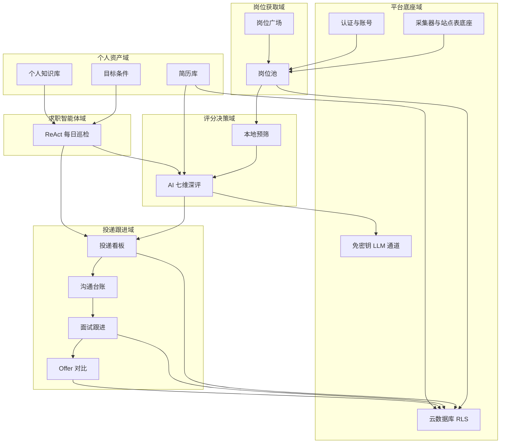
```mermaid
flowchart TB
    subgraph D1[岗位获取域]
        J1[岗位广场]
        J2[岗位池]
    end
    subgraph D2[评分决策域]
        S1[本地预筛]
        S2[AI 七维深评]
    end
    subgraph D3[投递跟进域]
        P1[投递看板]
        P2[沟通台账]
        P3[面试跟进]
        P4[Offer 对比]
    end
    subgraph D4[求职智能体域]
        A1[ReAct 每日巡检]
    end
    subgraph D5[个人资产域]
        R1[简历库]
        R2[个人知识库]
        R3[目标条件]
    end
    subgraph D6[平台底座域]
        F1[认证与账号]
        F2[云数据库 RLS]
        F3[免密钥 LLM 通道]
        F4[采集器与站点表底座]
    end
    J1 --> J2
    J2 --> S1
    S1 --> S2
    S2 --> P1
    P1 --> P2
    P2 --> P3
    P3 --> P4
    R1 --> S2
    R3 --> A1
    R2 --> A1
    A1 --> P1
    A1 --> S2
    F4 --> J2
    F1 --> J2
    J2 --> F2
    S2 --> F3
    P1 --> F2
    P3 --> F2
    P4 --> F2
    R1 --> F2
```

**图示说明**：6 个业务域按上游《高层架构设计》§5.1 三层业务架构收敛——岗位获取域承接"采集与入池"，评分决策域承接"两段式评分"，投递跟进域承接"决策登记与跟进复盘"，求职智能体域与真实性能力横切增强，个人资产域提供评分输入，平台底座域提供 RLS 隔离、认证、LLM 通道与采集器底座。主链路为 岗位广场 → 岗位池 → 本地预筛 → AI 深评 → 投递看板 → 沟通台账 → 面试跟进 → Offer 对比。

### 2.2 领域关系映射

#### 2.2.1 限界上下文清单

| 限界上下文 | 对应业务域 | 域类型 | 覆盖的核心业务实体 | 上下文边界（属于本域 vs 不属于） |
| --- | --- | --- | --- | --- |
| `JobPool-BC` | 岗位获取域 | 支撑域 | O-01 `Job` / O-02 `PublicJob` | 属于：岗位快照字段、去重键、渠道能力边界；不属于：评分结果、投递状态 |
| `Scoring-BC` | 评分决策域 | 核心域 | O-09 `AiReport` | 属于：本地预筛分、七维评分、评分依据；不属于：岗位原始字段、投递动作 |
| `Pipeline-BC` | 投递跟进域 | 支撑域 | O-03 `Application` / O-04 `Message` / O-05 `Interview` / O-06 `Offer` | 属于：阶段流转、会话时间线、面试记录、Offer 对比维度；不属于：岗位评分、简历文件 |
| `Agent-BC` | 求职智能体域 | 核心域 | O-08 `Task` | 属于：ReAct 步骤、行动清单、逐步审计轨迹；不属于：直接写业务表（只读业务数据、只产出建议与任务记录） |
| `Asset-BC` | 个人资产域 | 支撑域 | O-07 `Resume` / O-10 `Knowledge` / O-11 `Profile` | 属于：简历附件、知识条目、目标条件与节奏；不属于：岗位数据、投递数据 |
| `Platform-BC` | 平台底座域 | 通用域 | 账号身份 / 会话 / 配额 / 站点表 | 属于：认证身份、RLS 隔离策略、LLM 通道、采集器站点表；不属于：任何业务语义 |

**域类型说明**：

| 域类型 | 含义 | 投入策略 |
| --- | --- | --- |
| 核心域（Core） | 业务护城河，差异化竞争力所在 | 投入最多资源自研（`Scoring-BC` 可解释评分、`Agent-BC` ReAct 巡检） |
| 支撑域（Supporting） | 必要但非差异化 | 可自研可外采（`JobPool-BC` / `Pipeline-BC` / `Asset-BC`） |
| 通用域（Generic） | 通用能力（账号中心、LLM 通道等） | 优先复用 / 外采（`Platform-BC` 复用 WorkBuddy 云服务） |

#### 2.2.2 上下文映射（Context Mapping）

| 关系编号 | 上游上下文 | 下游上下文 | 关系模式 | 同步方式 | 选择理由 |
| --- | --- | --- | --- | --- | --- |
| C-01 | `JobPool-BC` | `Scoring-BC` | Customer/Supplier | API 同步 | 评分为岗位池下游，岗位快照字段（`dedupe_key` / 岗位正文）须按评分需求稳定供给 |
| C-02 | 招聘平台页面 / OfferBiu / ATS | `JobPool-BC` | ACL 防腐层 | API + 适配器 | 外部 DOM / 异构 JSON 经 `collector.js` + `normalize.mjs` 归一（O-15 `JobFeedAdapter`），外部模型不污染本域 |
| C-03 | 全部业务上下文 | `Platform-BC` | Shared Kernel | 云 SDK / 共享常量 | `owner_id` 隔离字段与 `GREETING_RULES` 数字口径必须全局一致，共享内核最小化 |
| C-04 | WorkBuddy 云服务 | 全部业务上下文 | Conformist | 遵循平台模型 | 无议价能力的强势平台底座，直接遵循其 PostgREST 表 / 认证 / LLM 模型 |
| C-05 | `Scoring-BC` | `Agent-BC` | Published Language | 只读查询契约 | 评分报告以稳定字段集对外暴露，供智能体与看板多个下游共同消费 |

**关系模式说明**：

| 关系模式 | 适用场景 |
| --- | --- |
| Customer/Supplier | 上下游强协作，下游能影响上游迭代节奏（岗位池 → 评分） |
| Conformist | 顺从者，下游完全遵循上游模型（本系统对接 WorkBuddy 云服务） |
| ACL（Anticorruption Layer） | 在本域和外部域之间建适配层，外部模型变化不影响本域（对接招聘平台 / OfferBiu / ATS 时必用） |
| Shared Kernel | 共享内核，多个上下文共享一小块代码 / 模型；维护成本高，慎用（`owner_id` 契约、数字口径常量） |
| Published Language | 上游以标准协议（事件 / Schema）对外暴露，多下游消费（评分报告只读契约） |
| Open Host Service | 上游提供标准 API 接口，类似 Published Language 但通过 RPC |

#### 2.2.3 跨域协作原则

| 原则编号 | 原则 |
| --- | --- |
| P-01 | 核心域 → 支撑域 / 通用域：禁止反向依赖（`Scoring-BC` / `Agent-BC` 不依赖支撑域内部模型） |
| P-02 | 核心域之间：`Scoring-BC` 与 `Agent-BC` 禁止直接耦合，必须通过 Published Language（C-05 评分报告只读契约）解耦 |
| P-03 | 对接外部不可控系统（招聘平台 / OfferBiu / ATS）：必须建 ACL 防腐层（C-02），禁止把外部模型贯穿到本域 |
| P-04 | 全部业务上下文对 `Platform-BC` 的 RLS 隔离字段 `owner_id` 只读遵从，前端写操作一律不传 `owner_id`（D8 §3 不变量） |

#### 2.2.4 冲突登记与裁决

> 登记本设计涉及的上游冲突项及其最终裁决状态，统一口径、避免漂移。

| 冲突编号 | 冲突主题 | 版本 A | 版本 B | 裁决状态与结论 |
| --- | --- | --- | --- | --- |
| X1 | 技术数字口径（测试条数） | 508（146 + 71 + 79 + 48 + 129 + 35） | 518（156 + 71 + 79 + 48 + 164） | 已裁决：518 = 156 + 71 + 79 + 48 + 164 为唯一权威口径（用户 2026-09-29 G4 裁决） |
| X7 | 自动投递 / 自动发送边界 | 版本 A：自动投递 / 自动发送 | 版本 B：仅人工点击发送 | 已裁决：采用"仅人工点击发送"（＝本表**版本 B**；即 `[中间确认]` 项中的**方案 A**）；用户 2026-09-29 G3 阶段裁定，承接仓库 D8 §3 不变量 |
| X9 | 多用户公网形态 | 已实现多用户公网 BaaS | 建议放弃多用户账号体系 | 已裁决：维持多用户公网 BaaS 现状，仅收紧对外商用措辞（用户 2026-09-29 G4 裁决） |

### 2.3 详细业务架构

#### 2.3.1 用例图

**用例图清单**：

| 编号 | 用例图标题 | 涉及业务域 | 源文件位置 |
| --- | --- | --- | --- |
| UC-01 | 求职者 - 岗位获取与入池 | 岗位获取域 | 本文档内联 Mermaid（§2.3.1） |
| UC-02 | 求职者 - 两段式评分 | 评分决策域 | 本文档内联 Mermaid（§2.3.1） |
| UC-03 | 求职者 - 投递跟进闭环 | 投递跟进域 | 本文档内联 Mermaid（§2.3.1） |
| UC-04 | 求职者 / 运营者 - 智能体巡检 | 求职智能体域 | 本文档内联 Mermaid（§2.3.1） |

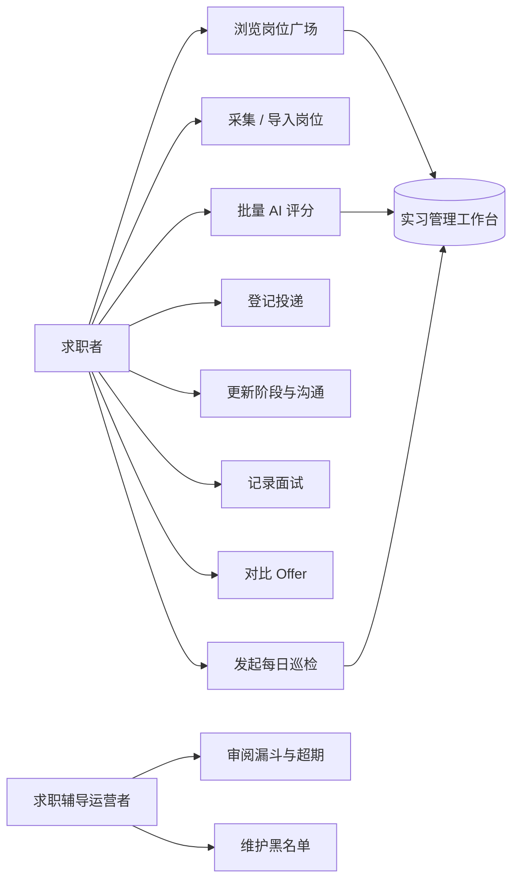
```mermaid
flowchart LR
    U[求职者]
    O[求职辅导运营者]
    U --> UC1[浏览岗位广场]
    U --> UC2[采集 / 导入岗位]
    U --> UC3[批量 AI 评分]
    U --> UC4[登记投递]
    U --> UC5[更新阶段与沟通]
    U --> UC6[记录面试]
    U --> UC7[对比 Offer]
    U --> UC8[发起每日巡检]
    O --> UC9[审阅漏斗与超期]
    O --> UC10[维护黑名单]
    UC1 --> SYS[(实习管理工作台)]
    UC3 --> SYS
    UC8 --> SYS
```

#### 2.3.2 业务流程图

**关键流程清单**（核心业务覆盖度 ≥ 80%）：

| 流程编号 | 流程名 | 起点 | 终点 | 涉及业务域 | 源文件位置 |
| --- | --- | --- | --- | --- | --- |
| BF-01 | 岗位获取与入池 | 岗位线索出现 | 岗位池去重入库 | 岗位获取域 | 本文档内联 Mermaid（§2.3.2） |
| BF-02 | 两段式评分 | 岗位池待评分 | 七维评分报告落库 | 评分决策域 | 本文档内联 Mermaid（§2.3.2） |
| BF-03 | 投递登记与阶段流转 | 用户确认投递 | 看板阶段更新 | 投递跟进域 | 本文档内联 Mermaid（§2.3.2） |
| BF-04 | 智能体每日巡检 | 定时 / 手动触发 | 行动清单产出 | 求职智能体域 | 本文档内联 Mermaid（§3.2.M5.4） |

**BF-01 岗位获取与入池（角色泳道图）**：

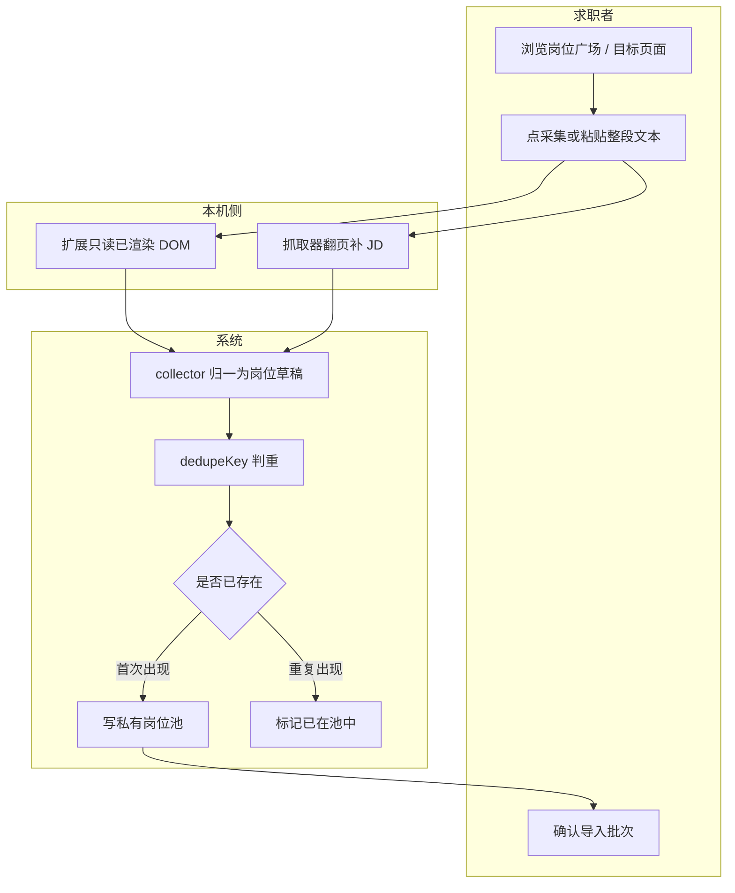
```mermaid
flowchart TB
    subgraph 求职者
        A1[浏览岗位广场 / 目标页面]
        A2[点采集或粘贴整段文本]
        A3[确认导入批次]
    end
    subgraph 本机侧
        B1[扩展只读已渲染 DOM]
        B2[抓取器翻页补 JD]
    end
    subgraph 系统
        C1[collector 归一为岗位草稿]
        C2[dedupeKey 判重]
        C3{是否已存在}
        C4[写私有岗位池]
        C5[标记已在池中]
    end
    A1 --> A2 --> B1
    A2 --> B2
    B1 --> C1
    B2 --> C1
    C1 --> C2 --> C3
    C3 -->|首次出现| C4
    C3 -->|重复出现| C5
    C4 --> A3
```

**判定节点说明**：`是否已存在` 的分支条件为 `dedupeKey` 在私有岗位池中是否命中；命中走"标记已在池中"（不写库），未命中走"写私有岗位池"。

**BF-02 两段式评分（流程）**：

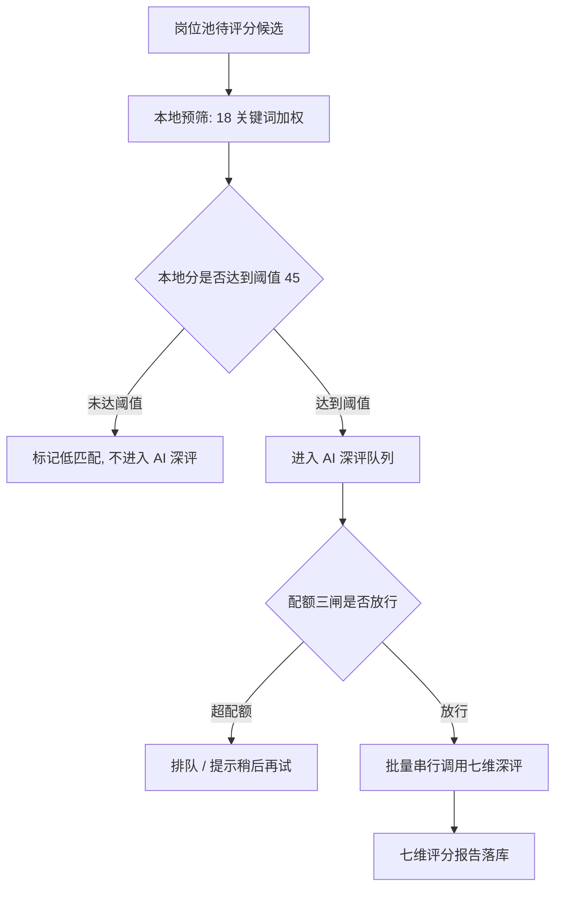
```mermaid
flowchart TB
    S[岗位池待评分候选] --> L1[本地预筛: 18 关键词加权]
    L1 --> L2{本地分是否达到阈值 45}
    L2 -->|未达阈值| L3[标记低匹配, 不进入 AI 深评]
    L2 -->|达到阈值| L4[进入 AI 深评队列]
    L4 --> Q1{配额三闸是否放行}
    Q1 -->|超配额| Q2[排队 / 提示稍后再试]
    Q1 -->|放行| Q3[批量串行调用七维深评]
    Q3 --> R1[七维评分报告落库]
```

**BF-03 投递登记与阶段流转（流程）**：

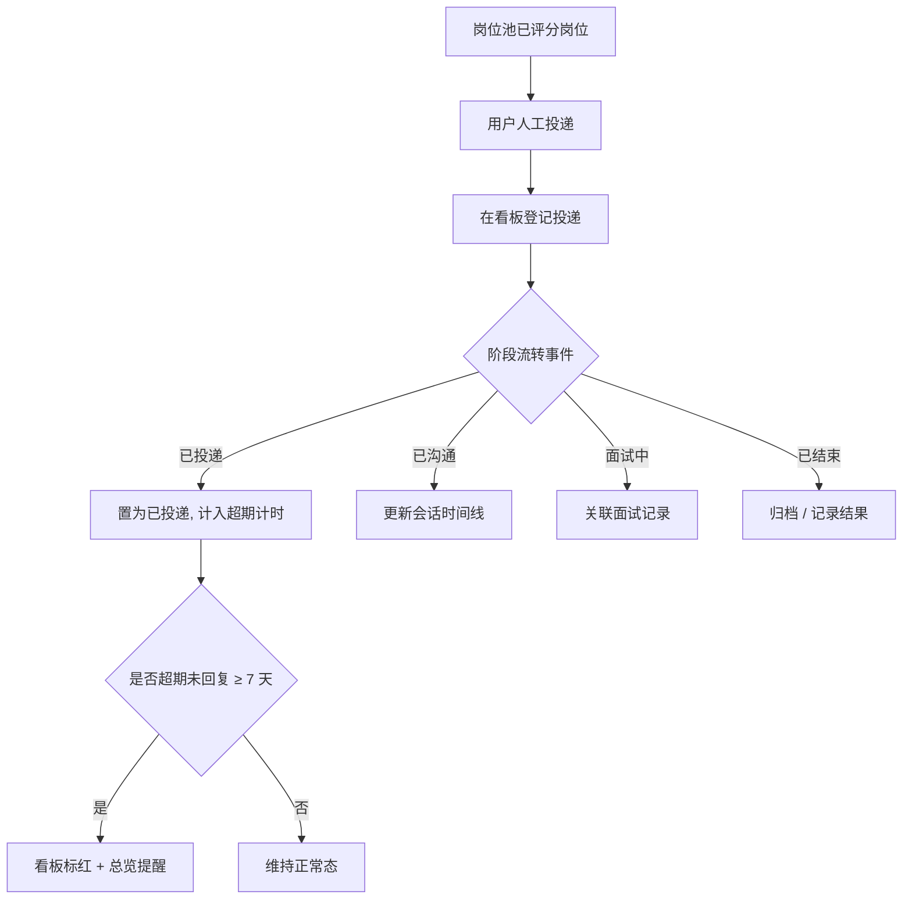
```mermaid
flowchart TB
    T[岗位池已评分岗位] --> T1[用户人工投递]
    T1 --> T2[在看板登记投递]
    T2 --> T3{阶段流转事件}
    T3 -->|已投递| T4[置为已投递, 计入超期计时]
    T3 -->|已沟通| T5[更新会话时间线]
    T3 -->|面试中| T6[关联面试记录]
    T3 -->|已结束| T7[归档 / 记录结果]
    T4 --> T8{是否超期未回复 ≥ 7 天}
    T8 -->|是| T9[看板标红 + 总览提醒]
    T8 -->|否| T10[维持正常态]
```

### 2.4 业务范围与边界

#### 2.4.1 功能模块清单

按"功能编号 → 子功能编号"两层组织，与 §2.1 业务域对应。

| 编号 | 一级功能名 | 子功能描述 | 对应业务域 | 实现状态 |
| --- | --- | --- | --- | --- |
| F1 | 多通道岗位获取 | — | 岗位获取域 | — |
| F1.1 | — | 岗位广场浏览（公共只读） | 岗位获取域 | 完整实现 |
| F1.2 | — | 扩展采集（只读已渲染 DOM） | 岗位获取域 | 完整实现 |
| F1.3 | — | 本机抓取器批量导入 | 岗位获取域 | 完整实现 |
| F1.4 | — | 整段粘贴三档解析 | 岗位获取域 | 完整实现 |
| F2 | 渠道能力边界表 | 投递列恒为字面量"人工" | 跨域 | 完整实现 |
| F3 | 岗位池管理 | RLS 私有隔离 + dedupeKey 去重 | 岗位获取域 | 完整实现 |
| F4 | 本地预筛评分 | 阈值 45，18 技术关键词加权 | 评分决策域 | 完整实现 |
| F5 | AI 七维深评 | 批量串行，七维报告 | 评分决策域 | 完整实现 |
| F6 | 数字口径单点化 | GREETING_RULES 唯一事实源 | 跨域 | 完整实现 |
| F7 | 投递看板 | 五阶段流转 + 超期 ≥ 7 天标红 | 投递跟进域 | 完整实现 |
| F8 | 沟通台账 | 会话时间线 + 招呼话术模板 | 投递跟进域 | 完整实现 |
| F9 | 面试跟进 | 表单关联投递记录 | 投递跟进域 | 完整实现 |
| F10 | Offer 对比 | 多 Offer 多维对比 | 投递跟进域 | 完整实现 |
| F11 | 求职智能体 ReAct 每日巡检 | max_steps 硬上限 + 逐步审计 | 求职智能体域 | 完整实现 |
| F12 | 防幻觉与事实守门 | untrusted 三道防线 + factGate | 跨域 | 完整实现（规则版） |
| F13 | ATS 公开 JSON 直连 | 多源冗余，单源失效可降级 | 岗位获取域 | `[MOCK]` 由 OfferBiu 单源承载，完整版替换为多源直连 |
| F14 | 冻结评测集与评分校准 | 可复现 Hit@1 回归 | 评分决策域 | `[MOCK]` MVP 无评测集，完整版补 1 套冻结评测集 |
| F15 | 推断统计与漏斗归因 | 阶段分布 + 漏斗转化 | 投递跟进域 | `[MOCK]` MVP 只出基础计数，完整版补推断统计 |
| F16 | 项目教练任务包 | 任务包生成 + 公开仓库验收 | 个人资产域 | `[MOCK]` 完整版启用 |
| F17 | 简历附件与 AI 分析 | 附件解析 + 分析增强 | 个人资产域 | `[MOCK]` 完整版启用 |
| F18 | 提醒日历 | 面试 / 截止 / 跟进 / 超期四类汇总 | 投递跟进域 | `[MOCK]` 完整版启用 |

**编号规则**：

| 规则项 | 取值 |
| --- | --- |
| 一级编号 | `F1 / F2 / ... / F18`，与一级业务域对应 |
| 子功能编号 | `F1.1 / F1.2 / ...`，互不重叠 |
| Mock / 简化标注 | `[MOCK]` 或 `[简化]`，并附"完整版替换路径" |

**In-Scope（本期范围内，MVP = F1~F12 + N1~N3，共 15 条 ≤ 15）**：

| 编号 | 本期必做的事项 |
| --- | --- |
| F1 ~ F12 | 岗位获取、渠道能力边界表、岗位池、本地预筛、AI 七维深评、口径单点化、投递看板、沟通台账、面试跟进、Offer 对比、ReAct 巡检、防幻觉守门 |
| N1 | 多端形态（Web + 小程序 + 扩展 + 抓取器）共用一套云后端 |
| N2 | 数据隔离：10 张私有表 RLS（`owner_id = auth.uid()`，`USING` + `WITH CHECK` 两段） |
| N3 | 配额三闸（dailyTasks=20 / maxCallsPerTask=8 / maxCallsPerDay=60，且 maxCallsPerTask = maxSteps） |

**Out-of-Scope（本期不做，共 6 条 ≥ 3）**：

| 编号 | 不做的事项 | 不做的原因 | 未来归属 |
| --- | --- | --- | --- |
| O1 | 自动投递 / 自动发送 | 触碰已冻结不变量，封号与合规风险落到用户真实账号（经中间确认 X7） | 永不做 |
| O2 | 回复监听（抓取平台会话） | 需登录态自动化，违反"只读已渲染 DOM"边界 | 永不做 |
| O3 | 服务端爬虫 / 云上浏览器内核 | 风控后果落到用户账号且无合规落点 | 由本机抓取器承担 |
| O4 | 绕验证码 / 风控 / 登录墙 | 属破对方保护措施，法律与封号风险 | 永不做 |
| O5 | 检测规避（伪装自动化特征） | 与"不做检测规避"边界冲突，账号风险 | 永不做 |
| O6 | 对外 SaaS 商用化 / 订阅收费（不否定多用户公网形态本身） | 与"作品可信度优先"定位冲突；对外售卖与订阅计费带来合规负担 | 待业务确认（经用户 2026-09-29 G4 裁决 X9：维持多用户公网 BaaS 现状，仅收紧对外商用措辞） |

### 2.5 质量与柔性可用

#### 2.5.1 服务质量目标

**质量目标 Top 5**：

| 优先级 | 质量目标 | 业务驱动 | 受影响的关键章节 |
| --- | --- | --- | --- |
| Q1 | 数据隔离与合规（RLS 账号级隔离 100% 生效，审计覆盖率 100%） | 合规底线 + 价值主张"关键动作 100% 留痕" | §4.1 / §7.2 / §3.2.M8 |
| Q2 | 评分可用性（本地预筛单次 P99 ≤ 1s；AI 深评批量串行不中断） | 用户体验阈值 + 目标 V2 | §3.2.M2 / §4.4 / §8.4 |
| Q3 | 成本可控（模型调用硬上限 单人单日 ≤ 60 次） | 价值主张"单人单日模型调用上限" | §3.5.3 / §3.2.M5 / §5.5 |
| Q4 | 抗幻觉（外部文本 100% 经隔离包装；事实守门拦截可追溯） | 目标 V1 + 调研风险 R-5 | §3.2.M6 / §3.4 |
| Q5 | 可维护性（多端规则同源，改一端必须改另一端；新人 1 周上手） | 团队规模 + 目标 V5 口径唯一 | §3.1.4 / §3.2.M9 |

**可验证质量场景**：

| 场景编号 | 关联目标 | 触发源 | 触发条件 | 期望响应 | 度量指标 |
| --- | --- | --- | --- | --- | --- |
| QS-01 | Q1 | 越权写入 | 前端写操作未带 `owner_id` 且命中他人数据 | RLS 拒绝，返回空数组 | 写操作返回空数组一律判为失败，误判率 0 |
| QS-02 | Q2 | 用户批量评分 | 单批 10 个岗位本地预筛 | 正常返回 | 本地预筛单次 P99 ≤ 1s |
| QS-03 | Q3 | 智能体巡检 | 单日累计模型调用 | 达上限即拒绝并提示 | 单人单日调用 ≤ 60 次，硬上限不越界 |
| QS-04 | Q4 | 恶意岗位 JD | JD 含白字隐藏注入指令 | 外部文本被中和，模型结论不被劫持 | 注入样本拦截率 100%（factGate） |
| QS-05 | Q5 | 跨端改规则 | 单端修改评分常量 | 契约测试变红 | 跨端契约测试覆盖关键常量，改一端即失败 |

#### 2.5.2 业务柔性可用策略

**业务功能优先级分层**（每个一级功能 F-x 显式标注一个层级）：

| 层级 | 含义 | 故障态下的处置方向 | 用户感知 |
| --- | --- | --- | --- |
| L0 核心业务 | 系统的生命线，挂掉等于业务停摆 | 不降级；优先消耗所有资源保障 | 无 / 极轻微 |
| L1 重要业务 | 不影响主链路但用户高频使用 | 限流 + 排队 + 异步化 | 变慢 / 排队提示 |
| L2 辅助业务 | 提升体验但非必要 | 关闭 / 返回兜底数据 | 部分功能不可用 + 友好提示 |
| L3 附加业务 | 长尾 / 数据类 / 统计类 | 直接关闭 + 异步补偿 | 通常无感 |

**功能分层映射**：

| 功能 | 层级 | 说明 |
| --- | --- | --- |
| F3 岗位池管理 | L0 | 数据底座，挂掉则整个工作台无内容 |
| F7 投递看板 | L0 | 主链路登记与跟踪 |
| F4 本地预筛评分 | L0 | 本地纯函数，无外部依赖，必须保 |
| F8 沟通台账 | L1 | 高频但非即时 |
| F9 面试跟进 | L1 | 阶段推进依赖 |
| F1 岗位获取 | L1 | 依赖外部通道，可排队 |
| F5 AI 七维深评 | L1 | 依赖 LLM 通道与配额，可排队 |
| F11 ReAct 巡检 | L1 | 可延后至下一窗口 |
| F10 Offer 对比 | L2 | 低频辅助 |
| F12 防幻觉守门 | L2（规则版）/ 降级为透传 | 模型版不可用时退化为规则版 |
| F6 口径单点化 | L2 | 常量，静态保障 |
| F15 推断统计 | L3 | 完整版能力，可异步补偿 |

**业务降级清单**：

| 编号 | 关联功能 | 触发条件 | 降级动作 | 用户感知 | 决策类型 |
| --- | --- | --- | --- | --- | --- |
| BD-01 | F5 AI 七维深评 | 配额三闸触顶或 LLM 通道超时 | 排队至下一窗口 / 返回本地预筛分并提示"深度评估稍后" | 深度评估暂时排队，本地匹配分照常可见 | 自动 |
| BD-02 | F1 岗位获取 | OfferBiu 接口不可用 | 切换本机抓取器通道 / 暂停广场更新 | 岗位广场不更新，本机采集照常可用 | 自动 |
| BD-03 | F12 防幻觉守门 | 模型版守门不可用 | 退化为规则版守门 + 提高人工复核提示 | 部分结论需人工确认后再采用 | 自动 |
| BD-04 | F15 推断统计 | 数据量不足或统计任务异常 | 返回基础计数（不做推断） | 统计口径变粗，功能不中断 | 自动 |

**填写要求**：全部一级功能均已分层（L0~L3）；L0 数量 = 3 / 18 ≈ 17%，满足 ≤ 30%；用户感知列无技术词。

---

## 3. 应用架构

> **本章回答**：系统由哪些模块组成、模块与外部系统怎么集成、每个模块的内部交互链路是什么。
> **本章是系统设计的核心**，占本文档约 40%~50% 篇幅。

### 3.1 应用架构概览

#### 3.1.1 系统上下文

本系统作为**中心节点**，周围辐射出"用户角色 + 外部业务系统 + 上游 / 下游平台"关系。

**系统上下文要素清单**：

| 节点类型 | 节点名 | 与本系统的关系 | 关系语义 |
| --- | --- | --- | --- |
| 角色 | 求职者（核心用户） | 使用 | 工作台操作（岗位 / 评分 / 投递 / 巡检） |
| 角色 | 求职辅导运营者 | 使用 | 监控投递节奏与转化、看板干预 |
| 角色 | 项目发起人 / 产品负责人 | 使用 | 看板审阅、发布、口径复核 |
| 外部业务系统 | E-01 WorkBuddy 云服务 | 双向调用 | 数据库 / 认证 / LLM（本系统主依赖） |
| 外部业务系统 | E-02 招聘平台页面 | 本系统读取 | 只读已渲染 DOM 采集岗位 |
| 第三方平台 | E-03 OfferBiu 公开接口 | 本系统调用 | HTTPS GET 校招岗位 JSON |
| 第三方平台 | E-04 ATS 公开 JSON 源 | 本系统调用 | HTTPS GET 企业岗位 feed（完整版 F13） |
| 第三方平台 | E-05 微信开放平台 | 本系统调用 | 小程序登录 / 服务器域名校验 |
| 第三方平台 | E-06 用户自备 LLM 厂商 | 本系统调用 | 用户设备直发（Key 不过本项目服务端） |
| 第三方平台 | E-07 GitHub 公开仓库 | 本系统调用 | 公开仓库验收（完整版 F16） |
| 下游平台 | E-08 本机浏览器（Edge / Chrome） | 本系统调用 | playwright-core 驱动已装浏览器 |
| 受影响方 | 招聘方 HR | 本系统不直连 | 经用户人工投递触达（投递恒为人工） |

**填写要求**：本系统画成单一节点，不展开内部组件；每条边标注关系语义。

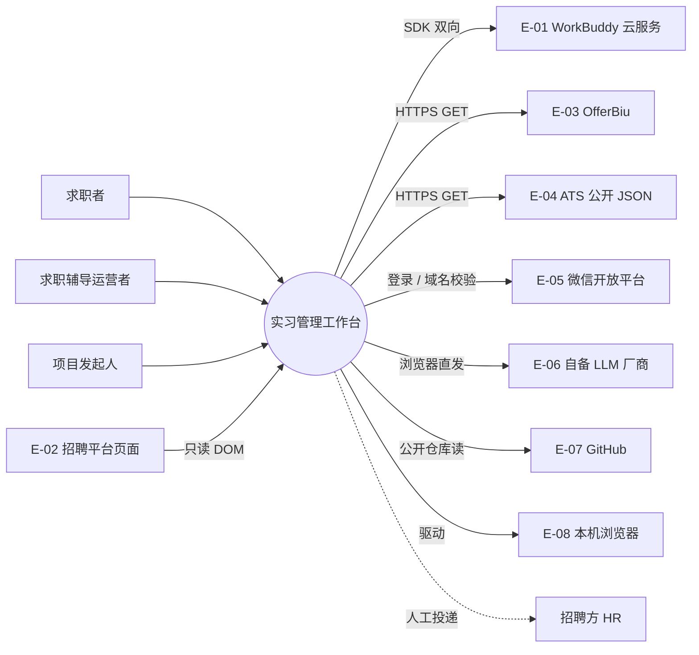
```mermaid
flowchart LR
    U[求职者] --> SYS((实习管理工作台))
    OP[求职辅导运营者] --> SYS
    OW[项目发起人] --> SYS
    SYS -->|SDK 双向| E01[E-01 WorkBuddy 云服务]
    E02[E-02 招聘平台页面] -->|只读 DOM| SYS
    SYS -->|HTTPS GET| E03[E-03 OfferBiu]
    SYS -->|HTTPS GET| E04[E-04 ATS 公开 JSON]
    SYS -->|登录 / 域名校验| E05[E-05 微信开放平台]
    SYS -->|浏览器直发| E06[E-06 自备 LLM 厂商]
    SYS -->|公开仓库读| E07[E-07 GitHub]
    SYS -->|驱动| E08[E-08 本机浏览器]
    SYS -.人工投递.-> HR[招聘方 HR]
```

#### 3.1.2 系统模块图

**分层组件清单**：

| 层次 | 内容 | 数据来源 |
| --- | --- | --- |
| 接入层 | Web 工作台 / 微信小程序端 / Chrome 扩展 / 本机抓取器 / 本机网关 | §2.3 用例图角色 |
| 应用层 | 按 §2.1 业务域划分的业务模块 M1~M7（与 §3.2 一一对应） | §2.1 / §3.2 |
| 中间件层 | 云数据库（RLS）/ 认证服务 / 免密钥 LLM 通道 / 静态托管 / 本机运行时（C-xx） | §3.1.3 云组件清单 |
| 集成对接层 | 与外部系统的对接桩 / SDK 封装入口（E-xx） | §3.1.3 外部依赖清单 |

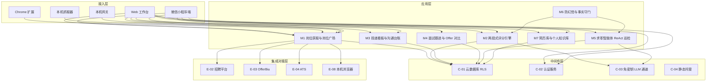
```mermaid
flowchart TB
    subgraph 接入层
        L1[Web 工作台]
        L2[微信小程序端]
        L3[Chrome 扩展]
        L4[本机抓取器]
        L5[本机网关]
    end
    subgraph 应用层
        M1[M1 岗位获取与岗位广场]
        M2[M2 两段式评分引擎]
        M3[M3 投递看板与沟通台账]
        M4[M4 面试跟进与 Offer 对比]
        M5[M5 求职智能体 ReAct 巡检]
        M6[M6 防幻觉与事实守门]
        M7[M7 简历库与个人知识库]
    end
    subgraph 中间件层
        C1[C-01 云数据库 RLS]
        C2[C-02 认证服务]
        C3[C-03 免密钥 LLM 通道]
        C4[C-04 静态托管]
    end
    subgraph 集成对接层
        E1[E-02 招聘平台]
        E2[E-03 OfferBiu]
        E3[E-04 ATS]
        E4[E-08 本机浏览器]
    end
    L1 --> M1 & M2 & M3 & M4 & M5 & M7
    L2 --> M1 & M2 & M3 & M7
    L3 --> M1
    L4 --> M1
    L5 --> M1
    M1 --> C1
    M2 --> C1 & C3
    M3 --> C1
    M4 --> C1
    M5 --> C1 & C3
    M6 --> M2 & M5
    M7 --> C1
    L1 --> C2
    L2 --> C2
    M1 --> E1 & E2 & E3 & E4
```

#### 3.1.3 集成架构

##### 外部依赖清单

| ID | 外部系统 | 归属团队 / 供应商 | 类别 | 使用方式 | 集成方式 | 协议 / 版本 | 功能定位（≤ 30 字） | 联系人 |
| --- | --- | --- | --- | --- | --- | --- | --- | --- |
| E-01 | WorkBuddy 云服务 | WorkBuddy 平台 | 业务协作 | 双向 | SDK（PostgREST 风格） | HTTPS / REST + 流式 | 数据库 / 认证 / 免密钥 LLM | 项目发起人 |
| E-02 | 招聘平台页面 | 各招聘平台 | 第三方业务平台 | 消费 | 扩展 / 抓取器读 DOM | 浏览器渲染 DOM | 岗位信息只读采集 | 项目发起人 |
| E-03 | OfferBiu 公开接口 | 第三方（offerbiu.com） | 第三方业务平台 | 消费 | HTTPS GET | REST / JSON | 校招岗位 JSON 冷启动 | 项目发起人 |
| E-04 | ATS 公开 JSON 源 | 各 ATS 厂商 | 第三方业务平台 | 消费 | HTTPS GET | REST / JSON | 企业岗位 feed 多源冗余 | 项目发起人 |
| E-05 | 微信开放平台 | 腾讯 | 身份认证 | 消费 | 小程序 SDK / 域名校验 | HTTPS / HTTPS 域名 | 小程序登录 / 服务器域名 | 项目发起人 |
| E-06 | 用户自备 LLM 厂商 | DeepSeek / Kimi / OpenRouter / 阿里云百炼 | 第三方业务平台 | 消费 | 浏览器直发 | HTTPS / OpenAI 兼容 | 用户自备 Key 的模型通道 | 项目发起人 |
| E-07 | GitHub 公开仓库 | GitHub | 业务协作 | 消费 | HTTPS GET / git clone | REST / git | 公开仓库验收（完整版 F16） | 项目发起人 |
| E-08 | 本机浏览器 | Microsoft / Google | 业务协作 | 消费 | playwright-core 驱动 | CDP | 驱动已装 Edge / Chrome 抓取 | 项目发起人 |

##### 云组件 / 基础设施清单

| ID | 组件类别 | 选型 | 部署形态 | 规格量级 | 容量预估 | 提供方 / SLA | 用途 |
| --- | --- | --- | --- | --- | --- | --- | --- |
| C-01 | 关系型数据库 | WorkBuddy 云数据库（PostgREST 风格 + RLS） | 平台托管（单 AZ，MVP） | 10 张私有表 + 1 张公共表 | 单用户 ≤ 1 万行，全库 ≤ 500 万行 | 平台方，SLA 99.5% | 业务主数据 |
| C-02 | 认证服务 | WorkBuddy 云 Auth（邮箱验证码 / 密码 + 小程序手机号短信 / 微信登录） | 平台托管 | 账号级隔离 | 单账号单会话 | 平台方 | 登录态 / 账号体系 |
| C-03 | LLM 通道 | WorkBuddy 免密钥 LLM 通道（流式） | 平台托管 | 按配额三闸 | 单人单日 ≤ 60 次调用 | 平台方 | 评分 / 巡检 / 事实守门 |
| C-04 | 静态站点托管 | WorkBuddy 云静态托管（HTTPS 域名） | 平台托管 | 单实例 | 前端构建产物 ≤ 5MB | 平台方 | Web 工作台发布 |
| C-05 | 本机运行时（抓取器） | Node 22 + playwright-core | 用户本机（数据不出机） | 单进程 | 单次 ≤ 站点上限，并发 ≤ 3 | 用户自持 | 批量岗位抓取 |
| C-06 | 本机网关 | Node 22 内置 http（仅监听 127.0.0.1） | 用户本机（数据不出机） | 单进程 | 端口 5178 | 用户自持 | 驱动抓取器 / 托管对话页 |
| C-07 | 浏览器扩展运行时 | Chrome MV3（activeTab + scripting + storage） | 用户本机（不发网络请求） | 单扩展 | 无服务端 | 用户自持 | 采集当前页 / 网申填表 |
| C-08 | 小程序运行时 | 微信小程序基础库 + 云 SDK 子路径 | 平台托管 | 7 页面，用 6 张表 | 单账号 | 微信 + 平台方 | 手机号短信 / 微信登录通道 |
| C-09 | 本机去重与断点存储 | 文件存储（`.seen-站点名.json` / `.profile` / `chrome.storage.local`） | 用户本机（数据不出机） | 文件级 | ≤ 10MB | 用户自持 | 跨轮次去重 / 登录态 / 断点续跑 |

##### 组件依赖关系

| 业务模块（§3.2） | 依赖的外部系统（E-xx） | 依赖的云组件（C-xx） | 故障传导风险 |
| --- | --- | --- | --- |
| M1 岗位获取与岗位广场 | E-02, E-03, E-04, E-08 | C-01, C-02, C-04, C-05, C-06, C-07, C-09 | E-03 不可用 → 广场停更；E-08 无浏览器 → 抓取器不可用 |
| M2 两段式评分引擎 | E-01, E-06 | C-01, C-03 | C-03 超时 → AI 深评排队（本地预筛仍可用） |
| M3 投递看板与沟通台账 | E-01 | C-01, C-02 | C-01 不可用 → 全站不可写（RLS 拒绝） |
| M4 面试跟进与 Offer 对比 | E-01 | C-01 | C-01 不可用 → 面试 / Offer 不可登记 |
| M5 求职智能体 ReAct 巡检 | E-01, E-06 | C-01, C-03 | C-03 不可用 → 巡检降级为本地清单 |
| M6 防幻觉与事实守门 | — | C-01, C-03 | C-03 不可用 → 守门降级为规则版 |
| M7 简历库与个人知识库 | E-01 | C-01, C-04 | C-01 不可用 → 简历 / 知识不可读写 |
| M8 WorkBuddy 云服务底座 | E-01 | C-01, C-02, C-03, C-04 | 底座整体不可用 → 全站不可用（平台级故障域） |
| M9 采集器与站点表底座 | E-02, E-08 | C-05, C-06, C-07, C-09 | 站点改版 → 单站点采集失败，其余站点不受影响 |

**填写要求**：编号与外部依赖 / 云组件清单完全对应；§3.2 模块"涉及的内外部系统"从本矩阵可查。

#### 3.1.4 工程结构

本系统**无自建后端**：后端为 WorkBuddy 云服务（BaaS），业务逻辑集中在 `src/lib/` 纯函数层，数据访问唯一出口 `src/lib/api.ts`；多端各自独立工程，共用同一套云后端与同一批表。公共纯函数模块被多端依赖，禁止公共模块反向依赖页面。

```
internship-workbench/
├── src/                       # Web 工作台（主链路入口）
│   ├── lib/                   # 纯函数业务层（与 React 解耦，now 可注入）
│   │   ├── api.ts             # 唯一数据访问出口（写操作返回空数组 = 被 RLS 拒绝）
│   │   ├── score.ts           # 本地预筛（18 关键词加权，阈值 45）
│   │   ├── ai.ts              # 唯一模型调用入口 streamChat
│   │   ├── agentLoop.ts       # ReAct 循环（max_steps 硬上限）
│   │   ├── agentTools.ts      # 工具注册表
│   │   ├── quota.ts           # 配额三闸
│   │   ├── untrusted.ts       # 外部文本隔离三道防线
│   │   ├── factGate.ts        # 事实守门
│   │   ├── constants.ts       # GREETING_RULES / STAGES / CHANNEL_CAPABILITIES
│   │   └── __tests__/         # 单测 + 契约测试
│   ├── pages/                 # 15 个页面组件
│   ├── components/            # 5 个通用组件
│   └── App.tsx                # 应用壳 + hash 路由
├── miniprogram/               # 微信小程序端（独立工程，7 页面，用 6 张表）
│   ├── pages/                 # index / jobs / pipeline / ai / me / login / conversation
│   └── utils/                 # score.js / pace.js / constants.js（与 Web 同源）
├── extension/                 # Chrome MV3 扩展（独立工程）
│   ├── collector.js           # 采集唯一实现（扩展与抓取器共用）
│   └── manifest.json
├── crawler/                   # 本机抓取器（独立工程）
│   ├── run.mjs                # 主 CLI
│   ├── sites.mjs              # 站点表（27 条）
│   └── lib/normalize.mjs      # 归一（与 import.ts 逐字一致）
├── gateway/                   # 本机网关（只监听 127.0.0.1）
│   └── server.mjs
├── db/                        # 迁移 SQL + 种子数据（人工复核执行）
│   ├── migrations/            # 001 / 002 / 003
│   └── seed/
└── docs/                      # 架构图 / 交接单 / 配置 / 对标
```

**依赖方向约束**：`pages/` → `lib/`（单向）；`miniprogram/` 与 `src/` 通过契约测试钉住同源常量；`extension/collector.js` 是采集唯一实现，`crawler/lib/normalize.mjs` 与 `src/lib/import.ts` 的 `JOB_TYPES` / `dedupeKey` / `normalizeJobType` 必须逐字一致（`contract.test.mjs` 钉住），禁止反向依赖。

#### 3.1.5 技术选型（版本约束）

| 技术分类 | 选型 | 版本 | 备注 / 选型理由（为什么选 A 不选 B） |
| --- | --- | --- | --- |
| 前端框架 | React + TypeScript | React 19 / TypeScript 6 | 选型理由：沿用仓库既定基线，纯手写栈；不选 Vue 因 15 个页面组件与内置 hooks 已定型，重写成本 ≥ 3 人月 |
| 前端构建 | Vite | Vite 8 | 选型理由：选 Vite 因其冷启动与 HMR 显著快于 Webpack，且仓库 vite.config.ts 已定型；不引入额外打包链 |
| 前端样式 | 纯手写 CSS | 无版本（styles.css 单文件） | 选型理由：不引入 UI 组件库（Tailwind / AntD）以避免体积与样式耦合，符合 D2 §3 代码约定 |
| 前端绘图 | 原生 SVG / DOM | 无版本（浏览器原生） | 选型理由：不引入图表库（ECharts / Chart.js），14 个模块图形用原生 SVG 手绘，减小体积与供应链面 |
| 前端状态 | React 内置 hooks | React 19 内置 | 选型理由：不引入状态管理库（Redux / Zustand），业务逻辑已抽到 src/lib/ 纯函数层 |
| 运行时 | Node.js | Node.js 22 LTS | 选型理由：选 Node 22 因仓库与 CI 已锁定（D9 要求 ≥ 20），不引入 Deno / Bun 以复用现有工具链 |
| 测试框架 | Vitest | Vitest 5 | 选型理由：选 Vitest 因其与 Vite 同源、配置成本低，且仓库已有 60 个测试文件基线；不选 Jest 以避免双构建链 |
| 静态检查 | oxlint | oxlint 1.x | 选型理由：选 oxlint 因其零配置且极快，仓库 .oxlintrc.json 已定型；不选 ESLint 以省依赖 |
| 类型检查 | tsc -b | TypeScript 6 内置 | 选型理由：用 tsc -b 项目引用做全量类型门禁，作为四件套之一 |
| CI | GitHub Actions | CI（Ubuntu Latest） | 选型理由：选 GitHub Actions 因仓库已 public 且工作流已含非 UTC 时区复跑；不引入 Jenkins 等自建 CI |
| 后端 | WorkBuddy 云服务 | 平台版本（PostgREST 风格数据库 + RLS + Auth + LLM） | 选型理由：沿用平台 BaaS，无自建服务器；不选自建后端因 RLS 隔离与免密钥 LLM 通道已就绪，自建返工 ≥ 3 人月 |
| 数据库 | 云数据库（PostgREST 风格） | 平台托管版本 | 选型理由：选平台托管库因其原生 RLS 与账号级隔离；不选独立 PostgreSQL 实例以避免自维连接池与备份 |
| 数据隔离 | 数据库 RLS 策略 | 平台策略（`owner_id = auth.uid()`） | 选型理由：隔离在数据库层而非应用层，前端不可绕过；不选应用层过滤因前端可篡改 |
| 模型接入 | 免密钥 LLM 通道 + 用户自备 Key（浏览器直发） | OpenAI 兼容协议 | 选型理由：双通道并存，Key 只在用户设备与厂商之间流动；不选纯平台 Key 因违背"默认不花创建者钱" |
| 本机抓取 | playwright-core | playwright-core 1.x | 选型理由：选 playwright-core 因不下载自带内核、驱动已装 Edge / Chrome；不选 Selenium 与 CDP 手写 |
| 小程序 | 微信小程序原生 | 基础库（style v2） | 选型理由：选原生小程序以复用同一云后端与 6 张表；不选 uniapp 编译产物以避免双端语义漂移 |
| 简历解析 | mammoth + pdfjs-dist | mammoth 与 pdfjs-dist（当前主版本） | 选型理由：docx 用 mammoth、pdf 用 pdfjs-dist，均为纯前端可运行；不引入服务端解析 |
| 扩展权限 | Chrome MV3 | Manifest V3（activeTab + scripting + storage） | 选型理由：仅用三最小权限、不发网络请求；不申请宽 host 权限以守隐私边界 |

**填写要求**：已含版本号；选型理由说明"为什么选 A 不选 B"。

### 3.2 模块详细设计

> **组织原则**：§3.2.1 / §3.2.2 给出跨模块共享约束与模块清单；§3.2.3 给出单模块设计模板（五段式）；之后每个模块在 §3.2.M{N} 下独立成节。

#### 3.2.1 模块公共约束（Common）

**通信方式约束**：

| 约束项 | 取值 |
| --- | --- |
| 接口路径风格 | RESTful（云服务 PostgREST 风格资源 URL） |
| 协议 | HTTPS（云服务）/ CDP（本机浏览器驱动）/ 进程内调用（本机网关） |
| 数据格式 | JSON |
| 字符编码 | UTF-8 |

**通用基础结构**：

| 基类 / 结构 | 用途 | 包路径 |
| --- | --- | --- |
| `Result` | 统一返回结构（含 code / msg / data / traceId） | `src/lib/api.ts` |
| `PageQuery` | 分页与过滤请求 | `src/lib/api.ts` |
| `Row` | 全表公共字段基类（id / owner_id / created_at / updated_at） | `src/types.ts` |
| `ApiError` | 云端错误统一封装（含 RLS 拒绝判定） | `src/lib/api.ts` |
| `CloudErrorHumanizer` | 上游校验类错误转译为用户可读文案 | `src/cloud.ts` |

#### 3.2.2 模块清单与编号规则

**模块清单**：

| 编号 | 模块名 | 业务域（§2.1） | 模块负责人 | 关联子领域 |
| --- | --- | --- | --- | --- |
| M1 | 岗位获取与岗位广场 | 岗位获取域 | 采集与数据组 | JobPool-BC |
| M2 | 两段式评分引擎 | 评分决策域 | AI 能力组 | Scoring-BC |
| M3 | 投递看板与沟通台账 | 投递跟进域 | 工作台组 | Pipeline-BC |
| M4 | 面试跟进与 Offer 对比 | 投递跟进域 | 工作台组 | Pipeline-BC |
| M5 | 求职智能体 ReAct 巡检 | 求职智能体域 | AI 能力组 | Agent-BC |
| M6 | 防幻觉与事实守门 | 跨域（真实性横切） | AI 能力组 | 无独立 BC（横切增强） |
| M7 | 简历库与个人知识库 | 个人资产域 | 工作台组 | Asset-BC |
| M8 | WorkBuddy 云服务底座 | 平台底座域 | 平台底座组 | Platform-BC |
| M9 | 采集器与站点表底座 | 平台底座域 | 采集与数据组 | Platform-BC |

**编号规则**：模块编号 `M{N}` 全局唯一，与 §2.1 业务域名一致；每个模块在 §3.2 下独立成节，编号 `§3.2.M{N}`；节内五段式编号 `§3.2.M{N}.1` ~ `§3.2.M{N}.5`。

#### 3.2.3 单模块设计模板（五段式）

> 本节定义"每个模块在 §3.2.M{N} 下五段各应该产出什么内容、遵守什么格式"。本节本身不是任何模块的内容——以下所有硬性要求表、示意代码、示意表格行都属于规范说明与格式示意；五段顺序固定为：`.1 模块概述` → `.2 接口清单` → `.3 关键结构定义（DTO）` → `.4 模块逻辑时序图` → `.5 关键流程逻辑`。各模块下直接写真实内容，不重复声明本节的项目级规范。

**五段共同遵守的项目级规范**：

| 要求项 | 内容 |
| --- | --- |
| 接口字段 | 路径 / 方法 / 请求与响应 DTO 编号 / 默认超时与重试（引用 §3.5.4）/ 幂等性（引用 §3.5.2）/ 鉴权要求（引用 §7.2.1） |
| DTO | 只列对前后端协议契约有影响的关键字段，按"基本信息 / 业务字段 / 状态 / 时间 / 扩展"分块 |
| 时序图 | 横向参与者分层（前端 / 后端 / 第三方 / 中间件）；命名与 §3.1 一致；含至少 1 条异常分支；写操作标注幂等键 |
| 关键流程 | 仅复杂事务 / 状态机 / 跨多步异步展开；简单模块在该段标题下显式注明"无复杂状态机 / 事务 / 跨多步异步，本段省略" |

#### 3.2.M1 岗位获取与岗位广场

##### §3.2.M1.1 模块概述

`M1 岗位获取与岗位广场` 模块覆盖业务域"岗位获取域"的岗位采集与入池、岗位广场浏览两类场景。业务逻辑在**求职者**与**招聘平台 / OfferBiu / ATS**之间流动，同时涉及**本机浏览器（E-08）**、**本机网关**、**Chrome 扩展（C-07）**、**WorkBuddy 云数据库（C-01）**与**静态托管（C-04）**等内外部系统的数据流动。本模块是主链路入口，承载 F1（多通道岗位获取）、F2（渠道能力边界表）、F3（岗位池管理）、F13（ATS 直连，完整版）。

##### §3.2.M1.2 接口清单

| 子领域 | 方法 | 路径 | 用途（≤ 20 字） | 请求 DTO | 响应 VO | 幂等 |
| --- | --- | --- | --- | --- | --- | --- |
| 岗位广场 | GET | `/rest/v1/jobs_public` | 列出公共岗位（只读） | `PublicJobQuery` | `PublicJob[]` | 天然 |
| 岗位广场 | POST | `/rest/v1/rpc/jobs_public_ingest` | 服务端灌入公共岗位 | `PublicJobIngestRequest` | `IngestResult` | 是（`biz_req_no`） |
| 岗位池 | GET | `/rest/v1/jobs` | 列出本人岗位池 | `JobQuery` | `Job[]` | 天然 |
| 岗位池 | POST | `/rest/v1/jobs` | 批量写入岗位（去重前） | `JobCreateRequest[]` | `Job[]` | 是（`dedupe_key` 唯一） |
| 岗位池 | PATCH | `/rest/v1/jobs` | 更新岗位字段 | `JobPatchRequest` | `Job` | 是（id + version） |
| 岗位池 | DELETE | `/rest/v1/jobs` | 删除岗位（软删） | — | `Job` | 天然 |
| 采集通道 | POST | `/api/crawl`（本机网关） | 下发本机抓取任务 | `CrawlDispatchRequest` | `CrawlTaskVO` | 是（`taskId`） |
| 采集通道 | GET | `/api/tasks/{id}`（本机网关） | 查询抓取进度 | — | `CrawlProgressVO` | 天然 |

**默认超时与重试**：引用 §3.5.4。**幂等性**：引用 §3.5.2。**鉴权**：引用 §7.2.1（云接口需已登录；本机网关仅监听 127.0.0.1）。

##### §3.2.M1.3 关键结构定义（DTO）

```typescript
// ===== 岗位池写入请求 =====
export interface JobCreateRequest {
  // ===== 业务字段 =====
  title: string;            // 岗位名；长度 ≤ 200
  company: string;          // 公司名；长度 ≤ 200
  jdText?: string;          // 岗位正文；用于评分与关键词覆盖
  channel: string;          // 来源渠道；CHANNELS 之一
  sourceUrl?: string;       // 原岗位链接；用于回跳
  // ===== 状态字段 =====
  stage?: string;           // 岗位池阶段；默认 pending
  // ===== 扩展字段 =====
  raw?: object;             // 采集原始快照（键值对象），禁止承载业务核心语义
}

// ===== 岗位池返回 =====
export interface Job {
  // ===== 基本信息 =====
  id: string;
  owner_id: string;         // 由 RLS 注入，前端不传
  // ===== 业务字段 =====
  title: string;
  company: string;
  dedupe_key: string;       // 去重键；唯一
  channel: string;          // 来源渠道
  // ===== 状态字段 =====
  stage: string;            // pending / scored / applied / archived
  // ===== 时间字段 =====
  created_at: string;
  updated_at: string;
}
```

| DTO / VO 名 | 字段名 | 类型 | 必填 | 业务含义 | 约束 / 默认值 |
| --- | --- | --- | --- | --- | --- |
| `JobCreateRequest` | `title` | String | 是 | 岗位名 | 长度 ≤ 200 |
| `JobCreateRequest` | `company` | String | 是 | 公司名 | 长度 ≤ 200 |
| `JobCreateRequest` | `channel` | String | 是 | 来源渠道 | 枚举：CHANNELS 8 渠道 |
| `Job` | `dedupe_key` | String | 是 | 去重键 | 唯一索引；跨端逐字一致 |
| `Job` | `stage` | String | 是 | 岗位池阶段 | 枚举：pending / scored / applied / archived |
| `PublicJobIngestRequest` | `jobs` | Array | 是 | 待灌入公共岗位 | 单人单日 ≤ 200 条 |
| `PublicJobIngestRequest` | `biz_req_no` | String | 是 | 幂等请求号 | 服务端唯一 |

##### §3.2.M1.4 模块逻辑时序图

| 编号 | 标题（模块名 - 场景名） | 场景类别 | 是否包含异常分支 |
| --- | --- | --- | --- |
| SQ-M1-01 | 岗位获取与岗位广场 - 扩展采集入池 | 核心动作的执行 | 是 |
| SQ-M1-02 | 岗位获取与岗位广场 - 公共岗位灌入 | 核心实体的创建 | 是 |
| SQ-M1-03 | 岗位获取与岗位广场 - 写操作被 RLS 拒绝 | 异常 / 补偿 | 是 |

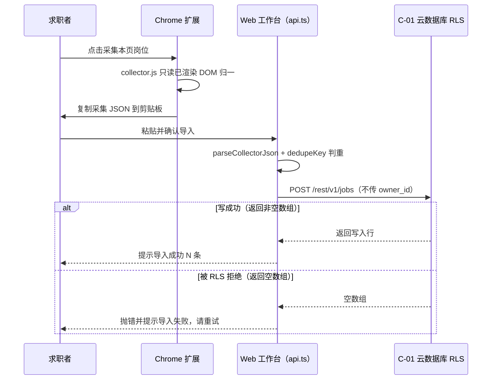
```mermaid
sequenceDiagram
    participant U as 求职者
    participant X as Chrome 扩展
    participant W as Web 工作台（api.ts）
    participant DB as C-01 云数据库 RLS
    U->>X: 点击采集本页岗位
    X->>X: collector.js 只读已渲染 DOM 归一
    X->>U: 复制采集 JSON 到剪贴板
    U->>W: 粘贴并确认导入
    W->>W: parseCollectorJson + dedupeKey 判重
    W->>DB: POST /rest/v1/jobs（不传 owner_id）
    alt 写成功（返回非空数组）
        DB-->>W: 返回写入行
        W-->>U: 提示导入成功 N 条
    else 被 RLS 拒绝（返回空数组）
        DB-->>W: 空数组
        W-->>U: 抛错并提示导入失败，请重试
    end
```

**异常分支**：写操作返回空数组即视为被 RLS 拒绝，必须当失败处理（D2 §2.1 不变量）。

##### §3.2.M1.5 关键流程逻辑

```
触发：岗位线索出现（广场 / 扩展 / 抓取器 / 粘贴）

Step 1: 归一为岗位草稿（同步，本机侧）
  ├── 校验：岗位名 / 公司名非空 → 失败时跳过该条并计数
  ├── ACL 转换：外部 DOM / JSON → JobCreateRequest（O-15 JobFeedAdapter）
  └── 归一：JOB_TYPES / normalizeJobType（与 crawler/lib/normalize.mjs 逐字一致）

Step 2: 去重判定（同步）
  ├── 计算 dedupeKey（company + title + 归一渠道）
  ├── 查询私有岗位池命中集合
  ├── [MOCK] 完整版 F13 走 ATS 多源直连补充候选池
  │     输入：ATS feed JSON
  │     规则：按大厂白名单 + 岗位类型过滤
  │     输出：补充候选草稿
  │     [完整版替换点] 替换现有 OfferBiu 单源冷启动
  └── 状态变更：未命中 → 待写入；命中 → 标记已在池中

Step 3: 批量写入（同步，云侧）
  ├── 校验：单批条数 ≤ 阈值 → 超限分批
  ├── 写库：POST /rest/v1/jobs，不传 owner_id
  ├── 校验：返回数组为空 → 判为失败（RLS 拒绝）
  └── 状态变更：pending（新岗位默认待评分）
```

**状态机迁移表（岗位池阶段）**：

| 起始状态 | 触发事件 | 终止状态 | 触发条件 / 校验 | 副作用 |
| --- | --- | --- | --- | --- |
| 无 | ingest | pending | 去重键未命中且写库成功 | 计入岗位池计数 |
| pending | score | scored | 两段式评分完成 | 关联生成 AiReport |
| scored | apply | applied | 用户登记投递 | 计入投递看板 |
| scored / applied | archive | archived | 用户手动作废 | 移出活跃列表 |

#### 3.2.M2 两段式评分引擎

##### §3.2.M2.1 模块概述

`M2 两段式评分引擎` 覆盖"评分决策域"的本地预筛、AI 七维深评两类场景。业务逻辑在**求职者**与**免密钥 LLM 通道（C-03）/ 用户自备 LLM（E-06）**之间流动，同时涉及**目标条件（O-11 Profile）**、**简历（O-07 Resume）**与**云数据库（C-01）**。本模块是核心域，承载 F4（本地预筛）、F5（AI 七维深评）、F14（冻结评测集，完整版）。

##### §3.2.M2.2 接口清单

| 子领域 | 方法 | 路径 | 用途（≤ 20 字） | 请求 DTO | 响应 VO | 幂等 |
| --- | --- | --- | --- | --- | --- | --- |
| 本地预筛 | POST | `/local/score`（纯函数） | 本地关键词加权打分 | `PreScoreRequest` | `PreScoreResult` | 天然（纯函数） |
| AI 深评 | POST | `/api/ai/deep-score` | 七维深评单岗位 | `DeepScoreRequest` | `AiReport` | 是（`biz_req_no`） |
| 评分报告 | GET | `/rest/v1/ai_reports` | 列出本人评分报告 | `ReportQuery` | `AiReport[]` | 天然 |
| 批量评分 | POST | `/api/ai/deep-score-batch` | 批量串行评分 | `DeepScoreBatchRequest` | `DeepScoreBatchResult` | 是（`biz_req_no`） |

**默认超时与重试**：引用 §3.5.4（外部 LLM 同步调用：超时 10s，重试 2 次指数退避）。**鉴权**：引用 §7.2.1。

##### §3.2.M2.3 关键结构定义（DTO）

```typescript
// ===== 本地预筛请求 =====
export interface PreScoreRequest {
  // ===== 业务字段 =====
  jdText: string;           // 岗位正文
  keywords: string[];       // 目标关键词（来自 Profile 或默认 18 项）
  // ===== 扩展字段 =====
  threshold?: number;       // 阈值；默认 45
}

// ===== AI 七维深评返回 =====
export interface AiReport {
  // ===== 基本信息 =====
  id: string;
  owner_id: string;
  // ===== 业务字段 =====
  score_local: number;      // 本地预筛分（0~100）
  score_ai: number;         // AI 综合分（0~100）
  dims: object;             // 七维分数（键为 ScoreDimension 维度名）
  reasons: string[];        // 评分依据
  // ===== 状态字段 =====
  status: string;           // ok / queued / failed
  // ===== 时间字段 =====
  created_at: string;
}
```

| DTO / VO 名 | 字段名 | 类型 | 必填 | 业务含义 | 约束 / 默认值 |
| --- | --- | --- | --- | --- | --- |
| `PreScoreRequest` | `threshold` | Number | 否 | 本地预筛阈值 | 默认 45 |
| `AiReport` | `dims` | Object | 是 | 七维分数 | 键为 DIMS 七维枚举 |
| `AiReport` | `score_local` | Number | 是 | 本地预筛分 | 0~100 |
| `AiReport` | `status` | String | 是 | 报告状态 | 枚举：ok / queued / failed |
| `DeepScoreBatchRequest` | `biz_req_no` | String | 是 | 幂等请求号 | 服务端唯一 |

##### §3.2.M2.4 模块逻辑时序图

| 编号 | 标题（模块名 - 场景名） | 场景类别 | 是否包含异常分支 |
| --- | --- | --- | --- |
| SQ-M2-01 | 两段式评分引擎 - 批量串行评分 | 核心动作的执行 | 是 |
| SQ-M2-02 | 两段式评分引擎 - 配额触顶排队 | 异常 / 补偿 | 是 |

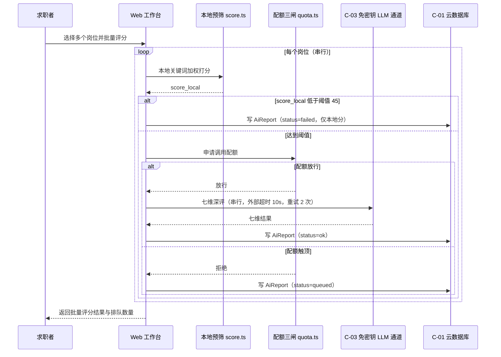
```mermaid
sequenceDiagram
    participant U as 求职者
    participant W as Web 工作台
    participant SC as 本地预筛 score.ts
    participant Q as 配额三闸 quota.ts
    participant LLM as C-03 免密钥 LLM 通道
    participant DB as C-01 云数据库
    U->>W: 选择多个岗位并批量评分
    loop 每个岗位（串行）
        W->>SC: 本地关键词加权打分
        SC-->>W: score_local
        alt score_local 低于阈值 45
            W->>DB: 写 AiReport（status=failed，仅本地分）
        else 达到阈值
            W->>Q: 申请调用配额
            alt 配额放行
                Q-->>W: 放行
                W->>LLM: 七维深评（串行，外部超时 10s，重试 2 次）
                LLM-->>W: 七维结果
                W->>DB: 写 AiReport（status=ok）
            else 配额触顶
                Q-->>W: 拒绝
                W->>DB: 写 AiReport（status=queued）
            end
        end
    end
    W-->>U: 返回批量评分结果与排队数量
```

**异常分支**：LLM 外部调用超时重试 2 次仍失败 → 报告置 failed 并保留本地分；配额触顶 → 报告置 queued 排队至下一窗口。

##### §3.2.M2.5 关键流程逻辑

```
触发：批量评分请求

Step 1: 本地预筛（同步，纯函数）
  ├── 校验：jdText 非空 → 空则跳过
  ├── 计算：18 个技术关键词加权求和
  └── 状态变更：达到阈值 45 → 进入 AI 深评；未达 → 仅落本地分

Step 2: AI 七维深评（同步，串行）
  ├── 校验：配额三闸放行（dailyTasks / maxCallsPerTask / maxCallsPerDay）
  ├── 校验：外部文本经 untrusted 包装后方可进 prompt（见 M6）
  ├── [MOCK] 完整版 F14 冻结评测集回归校准评分阈值
  │     输入：标注样本 + 期望 Hit@1
  │     规则：离线回归，不参与在线评分
  │     输出：阈值与权重校准建议
  │     [完整版替换点] 替换当前固定阈值 45
  └── 状态变更：报告 ok / queued / failed
```

**状态机迁移表（评分报告）**：

| 起始状态 | 触发事件 | 终止状态 | 触发条件 / 校验 | 副作用 |
| --- | --- | --- | --- | --- |
| 无 | local_pass | queued | 本地分 ≥ 45 且配额触顶 | 排队，等待下一窗口 |
| 无 | local_fail | failed | 本地分 低于 45 | 仅保留本地分 |
| queued | quota_release | ok | 配额放行且模型返回成功 | 写七维结果 |
| queued | timeout | failed | 重试 2 次仍失败 | 保留本地分并告警 |

#### 3.2.M3 投递看板与沟通台账

##### §3.2.M3.1 模块概述

`M3 投递看板与沟通台账` 覆盖"投递跟进域"的投递登记、阶段流转、沟通时间线三类场景。业务逻辑在**求职者 / 求职辅导运营者**与**云数据库（C-01）**之间流动，涉及**评分报告（O-09）**与**配额台账**。承载 F7（投递看板）、F8（沟通台账）、F15（推断统计，完整版）。

##### §3.2.M3.2 接口清单

| 子领域 | 方法 | 路径 | 用途（≤ 20 字） | 请求 DTO | 响应 VO | 幂等 |
| --- | --- | --- | --- | --- | --- | --- |
| 投递 | GET | `/rest/v1/applications` | 列出本人投递 | `ApplicationQuery` | `Application[]` | 天然 |
| 投递 | POST | `/rest/v1/applications` | 登记投递 | `ApplicationCreateRequest` | `Application` | 是（`dedupe_key` 唯一） |
| 投递 | PUT | `/rest/v1/applications/{id}/stage` | 更新阶段 | `StageUpdateRequest` | `Application` | 是（id + version） |
| 沟通 | GET | `/rest/v1/messages` | 列出会话时间线 | `MessageQuery` | `Message[]` | 天然 |
| 沟通 | POST | `/rest/v1/messages` | 新增会话条目 | `MessageCreateRequest` | `Message` | 是（`biz_req_no`） |
| 统计 | GET | `/rest/v1/rpc/funnel_stats` | 漏斗转化（完整版） | `FunnelQuery` | `FunnelVO` | 天然 |

**默认超时与重试**：引用 §3.5.4。**鉴权**：引用 §7.2.1。

##### §3.2.M3.3 关键结构定义（DTO）

```typescript
// ===== 投递登记请求 =====
export interface ApplicationCreateRequest {
  // ===== 业务字段 =====
  job_id: string;           // 关联岗位
  dedupe_key: string;       // 去重键
  // ===== 状态字段 =====
  stage: string;            // 投递阶段；STAGES 之一
  // ===== 扩展字段 =====
  note?: string;            // 备注；长度 ≤ 500
}

// ===== 投递返回 =====
export interface Application {
  // ===== 基本信息 =====
  id: string;
  owner_id: string;
  // ===== 业务字段 =====
  job_id: string;
  dedupe_key: string;
  // ===== 状态字段 =====
  stage: string;            // 枚举：STAGES 五阶段
  // ===== 时间字段 =====
  applied_at: string;       // 投递时间；超期计时基准
  updated_at: string;
}
```

| DTO / VO 名 | 字段名 | 类型 | 必填 | 业务含义 | 约束 / 默认值 |
| --- | --- | --- | --- | --- | --- |
| `ApplicationCreateRequest` | `stage` | String | 是 | 投递阶段 | 枚举：STAGES 五阶段 |
| `Application` | `applied_at` | String | 是 | 投递时间 | 超期未回复计时基准 |
| `Application` | `stage` | String | 是 | 投递阶段 | 枚举：STAGES 五阶段 |
| `StageUpdateRequest` | `version` | Number | 是 | 乐观锁版本 | 与 id 组成幂等键 |
| `Message` | `content` | String | 是 | 会话内容 | 长度 ≤ 2000 |

##### §3.2.M3.4 模块逻辑时序图

| 编号 | 标题（模块名 - 场景名） | 场景类别 | 是否包含异常分支 |
| --- | --- | --- | --- |
| SQ-M3-01 | 投递看板与沟通台账 - 投递登记并流转 | 核心动作的执行 | 是 |
| SQ-M3-02 | 投递看板与沟通台账 - 阶段回退补偿 | 异常 / 补偿 / 回滚 | 是 |

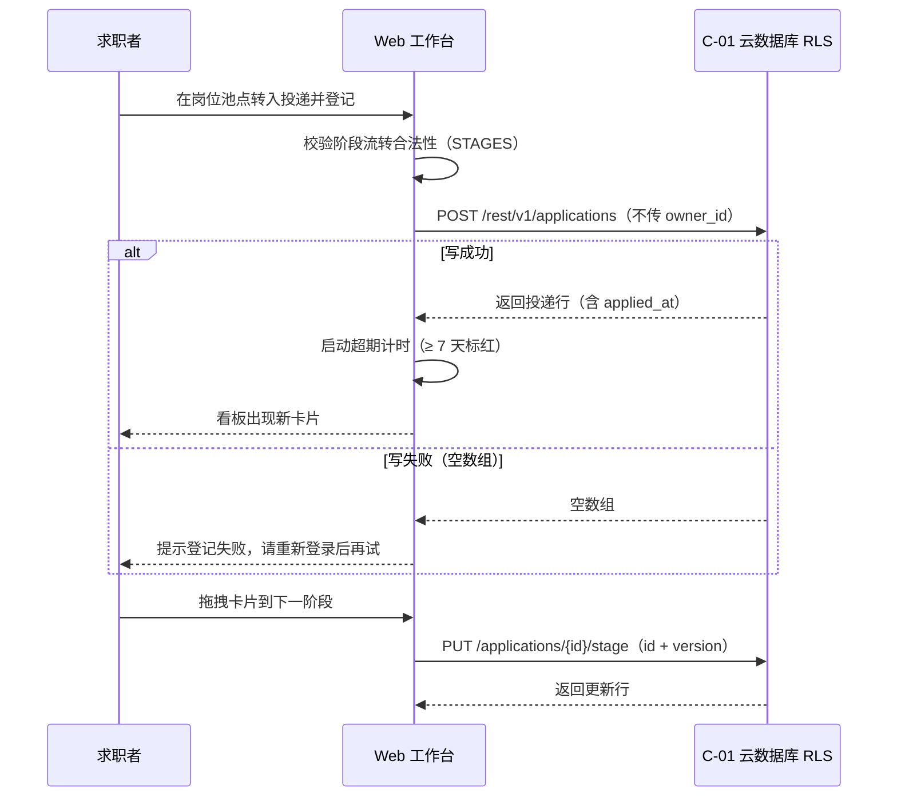
```mermaid
sequenceDiagram
    participant U as 求职者
    participant W as Web 工作台
    participant DB as C-01 云数据库 RLS
    U->>W: 在岗位池点转入投递并登记
    W->>W: 校验阶段流转合法性（STAGES）
    W->>DB: POST /rest/v1/applications（不传 owner_id）
    alt 写成功
        DB-->>W: 返回投递行（含 applied_at）
        W->>W: 启动超期计时（≥ 7 天标红）
        W-->>U: 看板出现新卡片
    else 写失败（空数组）
        DB-->>W: 空数组
        W-->>U: 提示登记失败，请重新登录后再试
    end
    U->>W: 拖拽卡片到下一阶段
    W->>DB: PUT /applications/{id}/stage（id + version）
    DB-->>W: 返回更新行
```

**异常分支**：乐观锁版本冲突 → 重新拉取最新行后重试；写空数组 → 判为失败。

##### §3.2.M3.5 关键流程逻辑

```
触发：投递登记 / 阶段流转

Step 1: 投递登记（同步）
  ├── 校验：阶段属于 STAGES 五阶段 → 非法则拒绝
  ├── 校验：dedupe_key 未重复登记
  └── 状态变更：置为"已投递"，记录 applied_at

Step 2: 超期判定（定时，跨多步异步）
  ├── 校验：stage 为"已投递"或"已沟通"且未回复
  ├── 计算：now - applied_at ≥ 7 天 → 标红；≥ 14 天 → 强标红
  └── 状态变更：附加超期标记（不改 stage）

Step 3: 漏斗统计（完整版 F15，异步）
  ├── [MOCK] MVP 只出阶段基础计数
  └── [完整版替换点] 补推断统计与归因
```

**状态机迁移表（投递阶段）**：

| 起始状态 | 触发事件 | 终止状态 | 触发条件 / 校验 | 副作用 |
| --- | --- | --- | --- | --- |
| 无 | register | 已投递 | 阶段合法且去重键未登记 | 记录 applied_at，启动超期计时 |
| 已投递 | contact | 已沟通 | 存在会话条目 | 更新会话时间线 |
| 已沟通 | interview | 面试中 | 关联面试记录 | 生成面试待办 |
| 面试中 | close | 已结束 | 用户确认结果 | 归档并计入结果统计 |
| 已投递 | close | 已结束 | 用户主动关闭 | 归档 |

#### 3.2.M4 面试跟进与 Offer 对比

##### §3.2.M4.1 模块概述

`M4 面试跟进与 Offer 对比` 覆盖"投递跟进域"的面试记录、Offer 多维对比两类场景。业务逻辑在**求职者**与**云数据库（C-01）**之间流动，涉及**投递记录（O-03）**。承载 F9（面试跟进）、F10（Offer 对比）、F18（提醒日历，完整版）。

##### §3.2.M4.2 接口清单

| 子领域 | 方法 | 路径 | 用途（≤ 20 字） | 请求 DTO | 响应 VO | 幂等 |
| --- | --- | --- | --- | --- | --- | --- |
| 面试 | GET | `/rest/v1/interviews` | 列出本人面试 | `InterviewQuery` | `Interview[]` | 天然 |
| 面试 | POST | `/rest/v1/interviews` | 新增面试记录 | `InterviewCreateRequest` | `Interview` | 是（`biz_req_no`） |
| Offer | GET | `/rest/v1/offers` | 列出本人 Offer | `OfferQuery` | `Offer[]` | 天然 |
| Offer | POST | `/rest/v1/offers` | 新增 Offer | `OfferCreateRequest` | `Offer` | 是（`biz_req_no`） |
| 日历 | GET | `/rest/v1/rpc/calendar_items` | 汇总四类事项（完整版） | `CalendarQuery` | `CalendarVO[]` | 天然 |

**默认超时与重试**：引用 §3.5.4。**鉴权**：引用 §7.2.1。

##### §3.2.M4.3 关键结构定义（DTO）

```typescript
// ===== 面试记录请求 =====
export interface InterviewCreateRequest {
  // ===== 业务字段 =====
  application_id: string;   // 关联投递（必填）
  round: string;            // 面试轮次（一面 / 二面 / HR 面）
  // ===== 时间字段 =====
  scheduled_at: string;     // 面试时间
  // ===== 扩展字段 =====
  note?: string;            // 复盘记录；长度 ≤ 2000
}

// ===== Offer 返回 =====
export interface Offer {
  // ===== 基本信息 =====
  id: string;
  owner_id: string;
  // ===== 业务字段 =====
  application_id: string;   // 关联投递
  salary: string;           // 薪资描述
  city: string;             // 城市
  // ===== 状态字段 =====
  status: string;           // pending / accepted / rejected
  // ===== 时间字段 =====
  created_at: string;
  deadline_at: string;      // Offer 决策截止
}
```

| DTO / VO 名 | 字段名 | 类型 | 必填 | 业务含义 | 约束 / 默认值 |
| --- | --- | --- | --- | --- | --- |
| `InterviewCreateRequest` | `application_id` | String | 是 | 关联投递 ID | 必须属于本人（RLS） |
| `InterviewCreateRequest` | `scheduled_at` | String | 是 | 面试时间 | ISO 8601 |
| `Offer` | `status` | String | 是 | Offer 状态 | 枚举：pending / accepted / rejected |
| `Offer` | `deadline_at` | String | 否 | 决策截止 | 可空 |
| `OfferCreateRequest` | `biz_req_no` | String | 是 | 幂等请求号 | 服务端唯一 |

##### §3.2.M4.4 模块逻辑时序图

| 编号 | 标题（模块名 - 场景名） | 场景类别 | 是否包含异常分支 |
| --- | --- | --- | --- |
| SQ-M4-01 | 面试跟进与 Offer 对比 - 面试记录关联投递 | 核心实体的创建 | 是 |
| SQ-M4-02 | 面试跟进与 Offer 对比 - Offer 多维对比 | 核心动作的执行 | 否 |

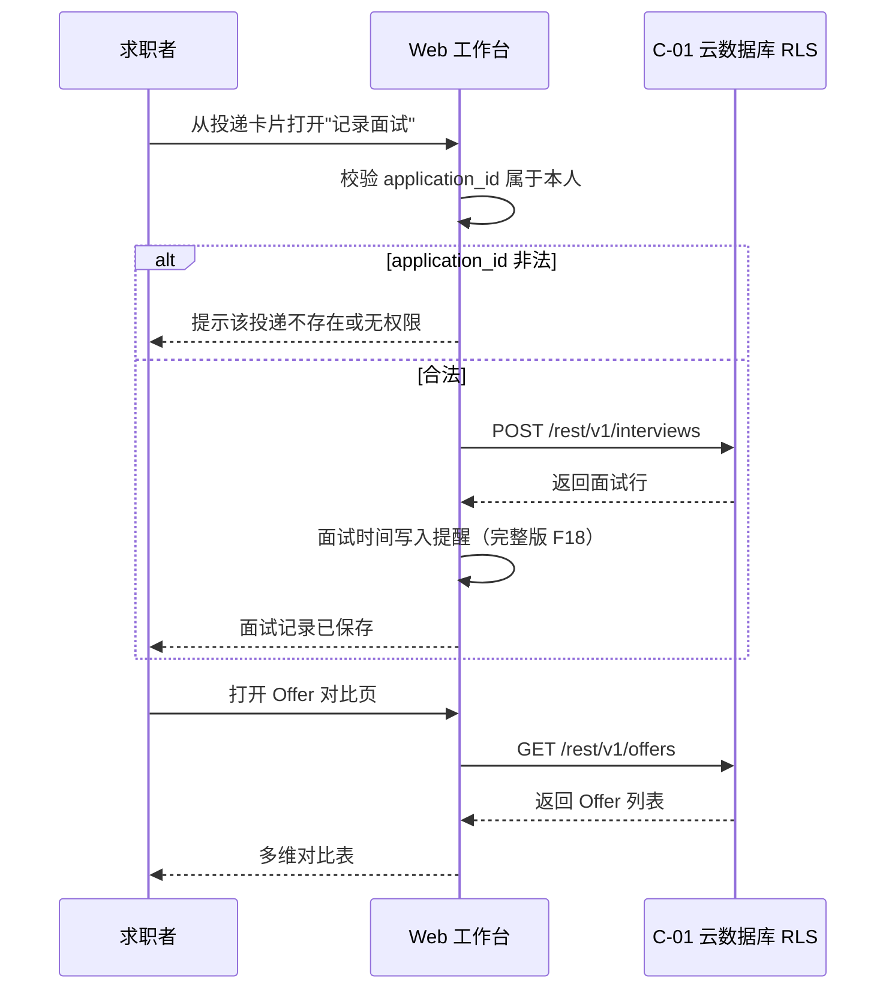
```mermaid
sequenceDiagram
    participant U as 求职者
    participant W as Web 工作台
    participant DB as C-01 云数据库 RLS
    U->>W: 从投递卡片打开"记录面试"
    W->>W: 校验 application_id 属于本人
    alt application_id 非法
        W-->>U: 提示该投递不存在或无权限
    else 合法
        W->>DB: POST /rest/v1/interviews
        DB-->>W: 返回面试行
        W->>W: 面试时间写入提醒（完整版 F18）
        W-->>U: 面试记录已保存
    end
    U->>W: 打开 Offer 对比页
    W->>DB: GET /rest/v1/offers
    DB-->>W: 返回 Offer 列表
    W-->>U: 多维对比表
```

**异常分支**：`application_id` 不属于当前账号 → 被 RLS 拒绝，前端当失败处理。

##### §3.2.M4.5 关键流程逻辑

**无复杂状态机 / 事务 / 跨多步异步，本段省略。**（面试与 Offer 均为单表登记 + 关联校验，无跨聚合事务；Offer 状态为简单枚举流转，已在 §3.2.M4.3 列明取值。）

#### 3.2.M5 求职智能体 ReAct 巡检

##### §3.2.M5.1 模块概述

`M5 求职智能体 ReAct 巡检` 覆盖"求职智能体域"的每日巡检、行动清单生成两类场景。业务逻辑在**求职者 / 求职辅导运营者**与**免密钥 LLM 通道（C-03）**之间流动，涉及**agentLoop / agentTools**、**配额三闸**、**云数据库（C-01）**。承载 F11（ReAct 每日巡检 v1），是核心域。

##### §3.2.M5.2 接口清单

| 子领域 | 方法 | 路径 | 用途（≤ 20 字） | 请求 DTO | 响应 VO | 幂等 |
| --- | --- | --- | --- | --- | --- | --- |
| 巡检 | POST | `/api/agent/daily-run` | 发起每日巡检 | `DailyRunRequest` | `Task` | 是（当日唯一，`biz_req_no`） |
| 巡检 | GET | `/rest/v1/tasks` | 列出巡检任务 | `TaskQuery` | `Task[]` | 天然 |
| 巡检 | GET | `/api/agent/steps/{taskId}` | 查询逐步审计轨迹 | — | `ActionStep[]` | 天然 |
| 工具 | POST | `/api/agent/tool-call` | 单步工具调用（内部） | `ToolCallRequest` | `ToolCallResult` | 是（step + tool） |

**默认超时与重试**：引用 §3.5.4（内部工具同步 3s；外部 LLM 10s 重试 2 次）。**鉴权**：引用 §7.2.1。

##### §3.2.M5.3 关键结构定义（DTO）

```typescript
// ===== 每日巡检请求 =====
export interface DailyRunRequest {
  // ===== 业务字段 =====
  goal: string;             // 目标；默认"生成今日行动清单"
  // ===== 扩展字段 =====
  biz_req_no: string;       // 幂等请求号（当日唯一）
}

// ===== 巡检任务返回 =====
export interface Task {
  // ===== 基本信息 =====
  id: string;
  owner_id: string;
  // ===== 业务字段 =====
  goal: string;
  steps: ActionStep[];      // 逐步审计轨迹
  // ===== 状态字段 =====
  status: string;           // running / done / aborted
  // ===== 时间字段 =====
  created_at: string;
}

// ===== 单步审计 =====
export interface ActionStep {
  // ===== 业务字段 =====
  index: number;            // 步序号；硬上限 max_steps = 8
  tool: string;             // 工具名（agentTools 注册表）
  observation: string;      // 观察结果；只由应用侧填
  // ===== 状态字段 =====
  status: string;           // ok / retry / fail
}
```

| DTO / VO 名 | 字段名 | 类型 | 必填 | 业务含义 | 约束 / 默认值 |
| --- | --- | --- | --- | --- | --- |
| `Task` | `steps` | Array | 是 | 逐步审计轨迹 | 长度 ≤ max_steps = 8 |
| `ActionStep` | `index` | Number | 是 | 步序号 | 1~8；硬上限等于 maxCallsPerTask |
| `ActionStep` | `observation` | String | 是 | 观察结果 | 只由应用侧填，模型不可自填 |
| `ActionStep` | `status` | String | 是 | 步状态 | 枚举：ok / retry / fail |
| `Task` | `status` | String | 是 | 任务状态 | 枚举：running / done / aborted |

##### §3.2.M5.4 模块逻辑时序图

| 编号 | 标题（模块名 - 场景名） | 场景类别 | 是否包含异常分支 |
| --- | --- | --- | --- |
| SQ-M5-01 | 求职智能体 ReAct 巡检 - 每日巡检循环 | 核心动作的执行 | 是 |
| SQ-M5-02 | 求职智能体 ReAct 巡检 - 步数触顶与工具失败 | 异常 / 补偿 | 是 |

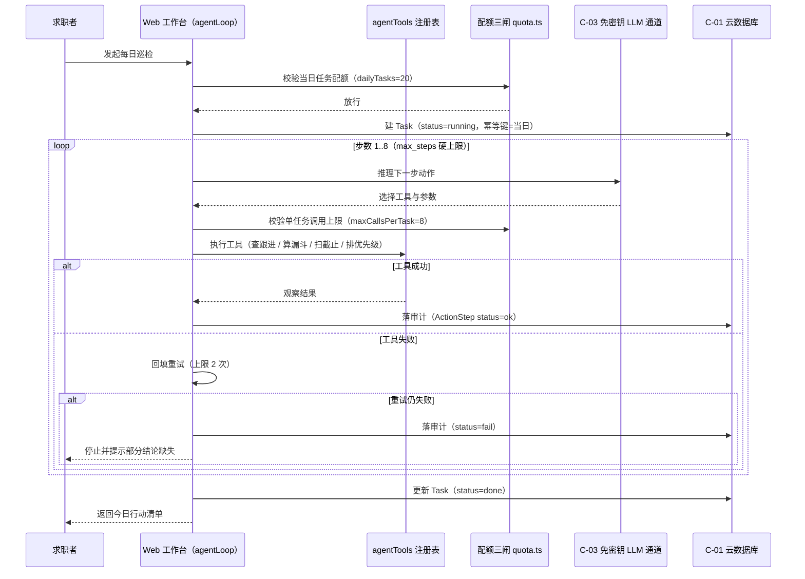
```mermaid
sequenceDiagram
    participant U as 求职者
    participant W as Web 工作台（agentLoop）
    participant T as agentTools 注册表
    participant Q as 配额三闸 quota.ts
    participant LLM as C-03 免密钥 LLM 通道
    participant DB as C-01 云数据库
    U->>W: 发起每日巡检
    W->>Q: 校验当日任务配额（dailyTasks=20）
    Q-->>W: 放行
    W->>DB: 建 Task（status=running，幂等键=当日）
    loop 步数 1..8（max_steps 硬上限）
        W->>LLM: 推理下一步动作
        LLM-->>W: 选择工具与参数
        W->>Q: 校验单任务调用上限（maxCallsPerTask=8）
        W->>T: 执行工具（查跟进 / 算漏斗 / 扫截止 / 排优先级）
        alt 工具成功
            T-->>W: 观察结果
            W->>DB: 落审计（ActionStep status=ok）
        else 工具失败
            W->>W: 回填重试（上限 2 次）
            alt 重试仍失败
                W->>DB: 落审计（status=fail）
                W-->>U: 停止并提示部分结论缺失
            end
        end
    end
    W->>DB: 更新 Task（status=done）
    W-->>U: 返回今日行动清单
```

**异常分支**：步数触顶 → 停止循环并输出"部分结论路径"；工具失败重试上限 2 次；单任务调用触顶 → 中止。

##### §3.2.M5.5 关键流程逻辑

```
触发：每日巡检发起（定时 / 手动）

Step 1: 配额与幂等（同步）
  ├── 校验：当日任务数 低于 dailyTasks=20 → 超限则拒绝
  ├── 校验：当日已有 running 任务 → 复用不新建（幂等键 = 当日）
  └── 状态变更：Task running

Step 2: ReAct 循环（同步，跨多步，硬上限 max_steps=8）
  ├── 校验：每步 observation 只由应用侧填（禁止模型自填）
  ├── 校验：单任务调用数 不超 maxCallsPerTask=8（= max_steps）
  ├── [MOCK] 完整版 F14 冻结评测集回归校准巡检优先级
  │     输入：历史行动清单 + 人工标注
  │     规则：离线校准，不参与在线巡检
  │     输出：优先级权重建议
  │     [完整版替换点] 替换当前启发式优先级
  ├── 校验：工具失败回填重试上限 2 次
  └── 状态变更：每步落审计；触顶 → aborted；完成 → done

Step 3: 配额台账（同步）
  ├── 校验：当日累计调用 不超 maxCallsPerDay=60
  └── 状态变更：配额台账扣减
```

**状态机迁移表（巡检任务）**：

| 起始状态 | 触发事件 | 终止状态 | 触发条件 / 校验 | 副作用 |
| --- | --- | --- | --- | --- |
| 无 | start | running | 配额放行且当无 running 任务 | 建 Task，落首步审计 |
| running | step_ok | running | 步数 低于 8 且工具成功 | 落审计，扣配额 |
| running | step_limit | aborted | 步数达 8 或单任务调用达 8 | 输出部分结论路径 |
| running | complete | done | 目标达成 | 输出行动清单 |

#### 3.2.M6 防幻觉与事实守门

##### §3.2.M6.1 模块概述

`M6 防幻觉与事实守门` 覆盖跨域的**真实性横切增强**场景——外部文本隔离、事实守门、招呼话术硬约束。业务逻辑在**求职者**与**外部不可信文本（岗位 JD / 网页）**之间流动，服务于 M2 评分与 M5 巡检。承载 F12（防幻觉与事实守门），对应 §3.4 跨模块公共能力。

##### §3.2.M6.2 接口清单

| 子领域 | 方法 | 路径 | 用途（≤ 20 字） | 请求 DTO | 响应 VO | 幂等 |
| --- | --- | --- | --- | --- | --- | --- |
| 隔离 | POST | `/lib/agent/wrap-untrusted`（纯函数） | 包装外部不可信文本 | `UntrustedInput` | `UntrustedEnvelope` | 天然（纯函数） |
| 守门 | POST | `/lib/agent/fact-gate`（纯函数） | 校验结论是否越界断言 | `FactGateInput` | `FactGateResult` | 天然（纯函数） |
| 话术 | POST | `/lib/agent/greeting-draft`（纯函数） | 生成受约束的招呼草稿 | `GreetingInput` | `GreetingDraft` | 天然（纯函数） |

**默认超时与重试**：引用 §3.5.4。**鉴权**：引用 §7.2.1（纯函数，无外部鉴权；调用入口在已登录工作台内）。

##### §3.2.M6.3 关键结构定义（DTO）

```typescript
// ===== 外部文本隔离信封 =====
export interface UntrustedEnvelope {
  // ===== 业务字段 =====
  boundary: string;         // 边界标记（第一道防线）
  declaration: string;      // 声明"以下为不可信数据"（第二道防线）
  neutralized: string;      // 中和后的文本（第三道防线）
  // ===== 状态字段 =====
  riskLevel: string;        // low / medium / high
}

// ===== 事实守门结果 =====
export interface FactGateResult {
  // ===== 业务字段 =====
  passed: boolean;          // 是否通过
  violations: string[];     // 触犯的断言清单
  // ===== 状态字段 =====
  action: string;           // pass / downgrade / block
}
```

| DTO / VO 名 | 字段名 | 类型 | 必填 | 业务含义 | 约束 / 默认值 |
| --- | --- | --- | --- | --- | --- |
| `UntrustedEnvelope` | `boundary` | String | 是 | 边界标记 | 所有外部文本必带 |
| `UntrustedEnvelope` | `neutralized` | String | 是 | 中和后文本 | 中和指令性片段 |
| `FactGateResult` | `action` | String | 是 | 处置动作 | 枚举：pass / downgrade / block |
| `FactGateResult` | `violations` | Array | 否 | 越界断言 | 命中即记录 |
| `GreetingDraft` | `text` | String | 是 | 招呼草稿 | 受 GREETING_RULES 七条约束 |

##### §3.2.M6.4 模块逻辑时序图

| 编号 | 标题（模块名 - 场景名） | 场景类别 | 是否包含异常分支 |
| --- | --- | --- | --- |
| SQ-M6-01 | 防幻觉与事实守门 - JD 白字注入中和 | 核心动作的执行 | 是 |
| SQ-M6-02 | 防幻觉与事实守门 - factGate 拦截越界断言 | 异常 / 补偿 | 是 |

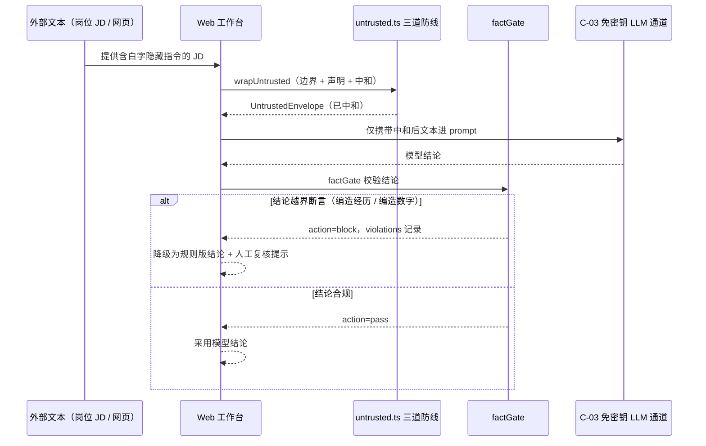
```mermaid
sequenceDiagram
    participant E as 外部文本（岗位 JD / 网页）
    participant W as Web 工作台
    participant U as untrusted.ts 三道防线
    participant G as factGate
    participant LLM as C-03 免密钥 LLM 通道
    E->>W: 提供含白字隐藏指令的 JD
    W->>U: wrapUntrusted（边界 + 声明 + 中和）
    U-->>W: UntrustedEnvelope（已中和）
    W->>LLM: 仅携带中和后文本进 prompt
    LLM-->>W: 模型结论
    W->>G: factGate 校验结论
    alt 结论越界断言（编造经历 / 编造数字）
        G-->>W: action=block，violations 记录
        W-->>W: 降级为规则版结论 + 人工复核提示
    else 结论合规
        G-->>W: action=pass
        W-->>W: 采用模型结论
    end
```

**异常分支**：结论越界 → block 并降级；高风险样本 100% 触发人工复核。

##### §3.2.M6.5 关键流程逻辑

```
触发：外部文本进入 prompt 前

Step 1: 三道防线（同步，纯函数）
  ├── 校验：边界标记（第一道）
  ├── 校验：声明"以下为不可信数据"（第二道）
  ├── 中和：指令性片段替换（第三道）
  └── 状态变更：riskLevel 分级

Step 2: 事实守门（同步，纯函数 + 模型版）
  ├── 校验：结论不得编造个人短板事实（隐私红线）
  ├── 校验：数字口径必须与 GREETING_RULES 一致（518 口径）
  ├── [MOCK] MVP 规则版守门；模型版强化为完整版能力
  │     输入：模型结论
  │     规则：越界断言即降级
  │     输出：pass / downgrade / block
  │     [完整版替换点] 模型版 factGate 替换规则版
  └── 状态变更：action
```

**状态机迁移表（守门动作）**：

| 起始状态 | 触发事件 | 终止状态 | 触发条件 / 校验 | 副作用 |
| --- | --- | --- | --- | --- |
| 无 | inspect | pass | 结论无越界断言 | 采用结论 |
| 无 | inspect | downgrade | 结论部分不确定 | 降级为规则版并提示 |
| 无 | inspect | block | 编造经历 / 数字不一致 | 拦截并转人工复核 |

#### 3.2.M7 简历库与个人知识库

##### §3.2.M7.1 模块概述

`M7 简历库与个人知识库` 覆盖"个人资产域"的简历附件、知识条目、目标条件三类场景。业务逻辑在**求职者**与**云数据库（C-01）/ 静态托管（C-04）**之间流动，为 M2 评分与 M5 巡检提供输入。承载 F16（项目教练，完整版）、F17（简历附件与 AI 分析，完整版）。

##### §3.2.M7.2 接口清单

| 子领域 | 方法 | 路径 | 用途（≤ 20 字） | 请求 DTO | 响应 VO | 幂等 |
| --- | --- | --- | --- | --- | --- | --- |
| 简历 | GET | `/rest/v1/resumes` | 列出本人简历 | `ResumeQuery` | `Resume[]` | 天然 |
| 简历 | POST | `/rest/v1/resumes` | 新增简历 | `ResumeCreateRequest` | `Resume` | 是（`biz_req_no`） |
| 简历 | POST | `/api/resume/parse` | 解析附件（docx / pdf） | `ResumeParseRequest` | `ResumeParseResult` | 是（文件指纹） |
| 知识 | GET | `/rest/v1/knowledge` | 列出知识条目 | `KnowledgeQuery` | `Knowledge[]` | 天然 |
| 知识 | POST | `/rest/v1/knowledge` | 新增知识条目 | `KnowledgeCreateRequest` | `Knowledge` | 是（`biz_req_no`） |
| 目标 | GET | `/rest/v1/profile` | 读取目标条件 | — | `Profile` | 天然 |
| 目标 | PATCH | `/rest/v1/profile` | 更新目标与节奏 | `ProfilePatchRequest` | `Profile` | 是（id + version） |

**默认超时与重试**：引用 §3.5.4。**鉴权**：引用 §7.2.1。

##### §3.2.M7.3 关键结构定义（DTO）

```typescript
// ===== 简历返回 =====
export interface Resume {
  // ===== 基本信息 =====
  id: string;
  owner_id: string;
  // ===== 业务字段 =====
  title: string;            // 简历标题
  content: string;          // 简历正文
  attachment_path?: string; // 附件路径（完整版 F17）
  // ===== 时间字段 =====
  created_at: string;
  updated_at: string;
}

// ===== 目标条件返回 =====
export interface Profile {
  // ===== 基本信息 =====
  id: string;
  owner_id: string;
  // ===== 业务字段 =====
  daily_greet_limit: number;   // 每日招呼上限；默认 8
  greet_window: string;        // 招呼时间窗；默认 09:00-21:00
  min_interval_min: number;    // 最小间隔分钟；默认 30
}
```

| DTO / VO 名 | 字段名 | 类型 | 必填 | 业务含义 | 约束 / 默认值 |
| --- | --- | --- | --- | --- | --- |
| `Resume` | `content` | String | 是 | 简历正文 | 长度 ≤ 20000 |
| `ResumeParseRequest` | `fileKind` | String | 是 | 附件类型 | 枚举：docx / pdf |
| `Profile` | `daily_greet_limit` | Number | 是 | 每日招呼上限 | 默认 8 |
| `Profile` | `greet_window` | String | 是 | 招呼时间窗 | 默认 09:00-21:00 |
| `Profile` | `min_interval_min` | Number | 是 | 最小间隔分钟 | 默认 30 |

##### §3.2.M7.4 模块逻辑时序图

| 编号 | 标题（模块名 - 场景名） | 场景类别 | 是否包含异常分支 |
| --- | --- | --- | --- |
| SQ-M7-01 | 简历库与个人知识库 - 附件解析入库 | 核心实体的创建 | 是 |
| SQ-M7-02 | 简历库与个人知识库 - 目标条件更新 | 核心实体的配置 | 是 |

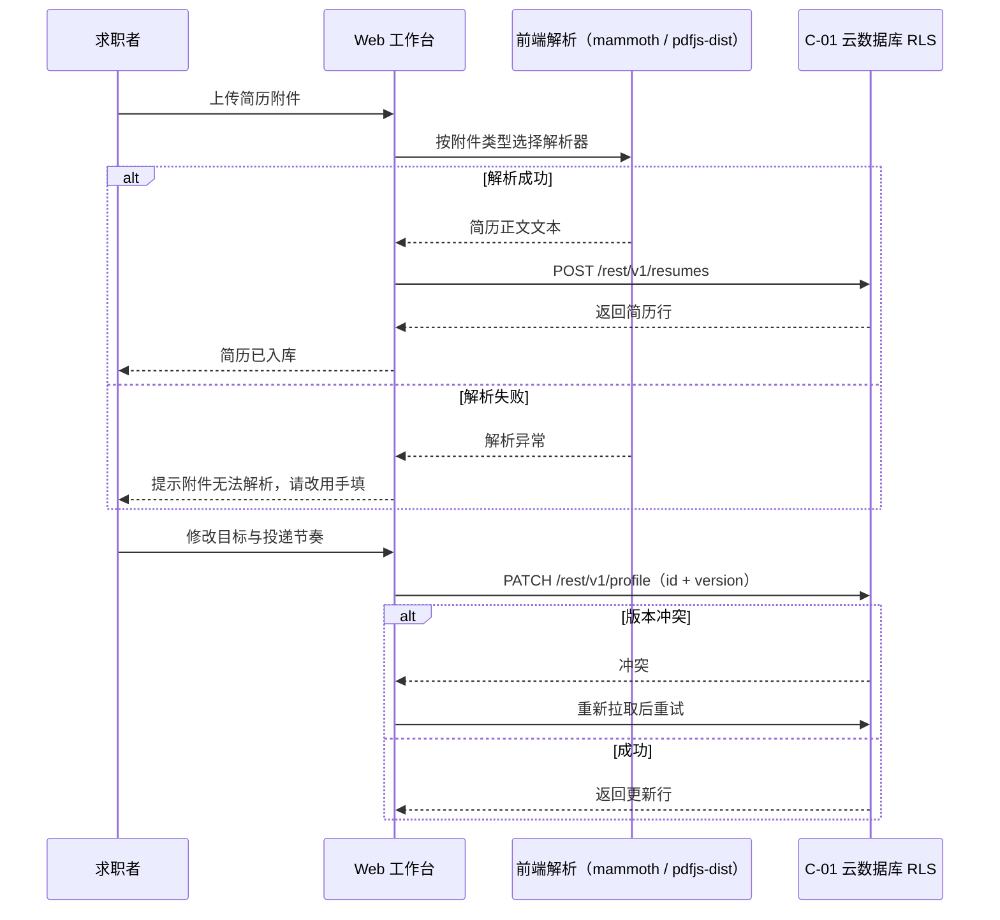
```mermaid
sequenceDiagram
    participant U as 求职者
    participant W as Web 工作台
    participant P as 前端解析（mammoth / pdfjs-dist）
    participant DB as C-01 云数据库 RLS
    U->>W: 上传简历附件
    W->>P: 按附件类型选择解析器
    alt 解析成功
        P-->>W: 简历正文文本
        W->>DB: POST /rest/v1/resumes
        DB-->>W: 返回简历行
        W-->>U: 简历已入库
    else 解析失败
        P-->>W: 解析异常
        W-->>U: 提示附件无法解析，请改用手填
    end
    U->>W: 修改目标与投递节奏
    W->>DB: PATCH /rest/v1/profile（id + version）
    alt 版本冲突
        DB-->>W: 冲突
        W->>DB: 重新拉取后重试
    else 成功
        DB-->>W: 返回更新行
    end
```

**异常分支**：附件解析失败 → 降级手填；乐观锁冲突 → 重取后重试。

##### §3.2.M7.5 关键流程逻辑

**无复杂状态机 / 事务 / 跨多步异步，本段省略。**（简历 / 知识 / 目标条件均为单表读写；附件解析为同步纯前端流程，无跨聚合事务。）

#### 3.2.M8 WorkBuddy 云服务底座

##### §3.2.M8.1 模块概述

`M8 WorkBuddy 云服务底座` 覆盖"平台底座域"的数据库 / 认证 / LLM 通道 / 静态托管四类能力。业务逻辑在**平台方**与**全部业务模块**之间流动，是通用域，被全部业务上下文依赖（C-04 Conformist）。

##### §3.2.M8.2 接口清单

| 子领域 | 方法 | 路径 | 用途（≤ 20 字） | 请求 DTO | 响应 VO | 幂等 |
| --- | --- | --- | --- | --- | --- | --- |
| 数据库 | GET / POST / PATCH / DELETE | `/rest/v1/{table}` | PostgREST 风格表读写 | 表 DTO | 表 VO | 写类见 §3.5.2 |
| 认证 | POST | `/auth/v1/otp` | 邮箱验证码登录 | `OtpRequest` | `OtpSession` | 是（`email` + `verificationId`） |
| 认证 | POST | `/auth/v1/token` | 换取会话 Token | `TokenRequest` | `Session` | 否 |
| LLM | POST | `/llm/v1/chat` | 免密钥流式对话 | `ChatRequest` | `ChatStream` | 否（只读生成） |
| 托管 | GET | `/`（HTTPS 域名） | 提供前端构建产物 | — | 静态资源 | 天然 |

**默认超时与重试**：引用 §3.5.4。**鉴权**：平台 Auth。

##### §3.2.M8.3 关键结构定义（DTO）

```typescript
// ===== RLS 写入结果判定 =====
export interface WriteResult {
  // ===== 业务字段 =====
  data: T[];                // 写操作返回行；空数组 = 被 RLS 拒绝
  // ===== 状态字段 =====
  ok: boolean;              // 由 data.length 推导；空数组置 false
}

// ===== 会话 =====
export interface Session {
  // ===== 基本信息 =====
  userId: string;           // 账号 ID；用于 owner_id 推断（RLS 侧）
  // ===== 状态字段 =====
  active: boolean;
  // ===== 时间字段 =====
  expiresAt: string;
}
```

| DTO / VO 名 | 字段名 | 类型 | 必填 | 业务含义 | 约束 / 默认值 |
| --- | --- | --- | --- | --- | --- |
| `WriteResult` | `data` | Array | 是 | 写返回行 | 空数组判为失败 |
| `WriteResult` | `ok` | Boolean | 是 | 是否成功 | 空数组 → false |
| `Session` | `userId` | String | 是 | 账号 ID | 由平台认证颁发 |
| `OtpRequest` | `email` | String | 是 | 邮箱 | 发码验码分离 |

##### §3.2.M8.4 模块逻辑时序图

| 编号 | 标题（模块名 - 场景名） | 场景类别 | 是否包含异常分支 |
| --- | --- | --- | --- |
| SQ-M8-01 | WorkBuddy 云服务底座 - 邮箱验证码登录 | 核心动作的执行 | 是 |
| SQ-M8-02 | WorkBuddy 云服务底座 - RLS 空数组判定 | 异常 / 补偿 | 是 |

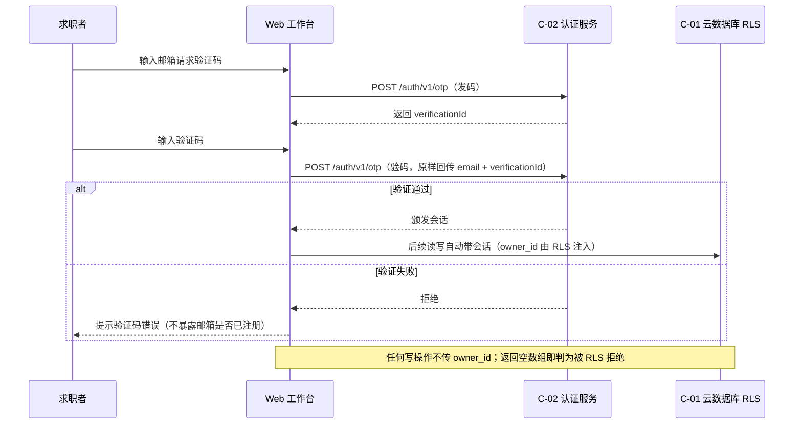
```mermaid
sequenceDiagram
    participant U as 求职者
    participant W as Web 工作台
    participant AU as C-02 认证服务
    participant DB as C-01 云数据库 RLS
    U->>W: 输入邮箱请求验证码
    W->>AU: POST /auth/v1/otp（发码）
    AU-->>W: 返回 verificationId
    U->>W: 输入验证码
    W->>AU: POST /auth/v1/otp（验码，原样回传 email + verificationId）
    alt 验证通过
        AU-->>W: 颁发会话
        W->>DB: 后续读写自动带会话（owner_id 由 RLS 注入）
    else 验证失败
        AU-->>W: 拒绝
        W-->>U: 提示验证码错误（不暴露邮箱是否已注册）
    end
    Note over W,DB: 任何写操作不传 owner_id；返回空数组即判为被 RLS 拒绝
```

**异常分支**：登录失败不暴露账号存在性；写返回空数组 → 抛错当失败。

##### §3.2.M8.5 关键流程逻辑

```
触发：RLS 读写

Step 1: 会话校验（同步）
  ├── 校验：会话有效 → 无效则 401
  └── 状态变更：请求上下文中注入 auth.uid()

Step 2: RLS 策略判定（同步，数据库层）
  ├── 校验：读策略 USING（owner_id = auth.uid()）
  ├── 校验：写策略 WITH CHECK（owner_id = auth.uid()）
  ├── jobs_public 例外：仅 SELECT TO authenticated, anon USING (true)，无写策略
  └── 状态变更：命中 → 返回行；未命中 → 返回空数组

Step 3: 前端失败判定（同步）
  └── 校验：写操作返回空数组 → 抛 ApiError，当失败处理（D8 §3 不变量）
```

**状态机迁移表（RLS 写入判定）**：

| 起始状态 | 触发事件 | 终止状态 | 触发条件 / 校验 | 副作用 |
| --- | --- | --- | --- | --- |
| 请求中 | write | 成功 | WITH CHECK 命中 | 返回非空数组 |
| 请求中 | write | 拒绝 | WITH CHECK 未命中或跨账号 | 返回空数组，前端抛错 |
| 请求中 | read | 成功 | USING 命中 | 返回本人行 |
| 请求中 | read | 空集 | USING 未命中 | 返回空数组（合法空态） |

#### 3.2.M9 采集器与站点表底座

##### §3.2.M9.1 模块概述

`M9 采集器与站点表底座` 覆盖"平台底座域"的 DOM 提取唯一实现、站点表、抓取任务驱动三类能力。业务逻辑在**本机浏览器（E-08）**与**求职者本机**之间流动（数据不出机），被 M1 依赖。承载 F1（通道侧底座）。

##### §3.2.M9.2 接口清单

| 子领域 | 方法 | 路径 | 用途（≤ 20 字） | 请求 DTO | 响应 VO | 幂等 |
| --- | --- | --- | --- | --- | --- | --- |
| 提取 | POST | `/lib/collector/collect`（共用实现） | 从已渲染 DOM 提取岗位 | `CollectInput` | `CollectorJson` | 天然（纯函数） |
| 站点 | GET | `/api/sites`（本机网关） | 列出可抓站点 | — | `SiteEntry[]` | 天然 |
| 抓取 | GET | `/sites`（抓取器 CLI） | 列出站点表 | — | `SiteEntry[]` | 天然 |
| 抓取 | POST | `/crawl`（抓取器 CLI） | 发起批量抓取 | `CrawlArgs` | `CollectorJson` | 是（`--out` + 站点 id） |

**默认超时与重试**：引用 §3.5.4。**鉴权**：本机侧，无云端鉴权（仅监听 127.0.0.1）。

##### §3.2.M9.3 关键结构定义（DTO）

```typescript
// ===== 采集器 JSON 契约 =====
export interface CollectorJson {
  // ===== 基本信息 =====
  source: string;           // 来源标识
  version: string;          // 契约版本
  channel: string;          // 渠道；固定值之一
  site_id: string;          // 站点 id
  // ===== 业务字段 =====
  jobs: JobDraft[];         // 岗位草稿列表
  count: number;            // 条数
  // ===== 时间字段 =====
  collected_at: string;
}

// ===== 站点条目 =====
export interface SiteEntry {
  // ===== 业务字段 =====
  id: string;               // 站点 id
  name: string;             // 站点名
  status: string;           // live / offline / unverified
}
```

| DTO / VO 名 | 字段名 | 类型 | 必填 | 业务含义 | 约束 / 默认值 |
| --- | --- | --- | --- | --- | --- |
| `CollectorJson` | `channel` | String | 是 | 来源渠道 | 与前端 CHANNELS 逐字一致 |
| `CollectorJson` | `jobs` | Array | 是 | 岗位草稿 | 字段名与扩展逐字一致 |
| `SiteEntry` | `status` | String | 是 | 站点状态 | 枚举：live / offline / unverified |
| `CrawlArgs` | `delay` | Number | 否 | 请求间隔毫秒 | 默认 1200 |
| `CrawlArgs` | `pages` | Number | 否 | 翻页数 | 受站点上限约束 |

##### §3.2.M9.4 模块逻辑时序图

| 编号 | 标题（模块名 - 场景名） | 场景类别 | 是否包含异常分支 |
| --- | --- | --- | --- |
| SQ-M9-01 | 采集器与站点表底座 - 断点续跑批量抓取 | 核心动作的执行 | 是 |
| SQ-M9-02 | 采集器与站点表底座 - 站点无浏览器可用 | 异常 / 补偿 | 是 |

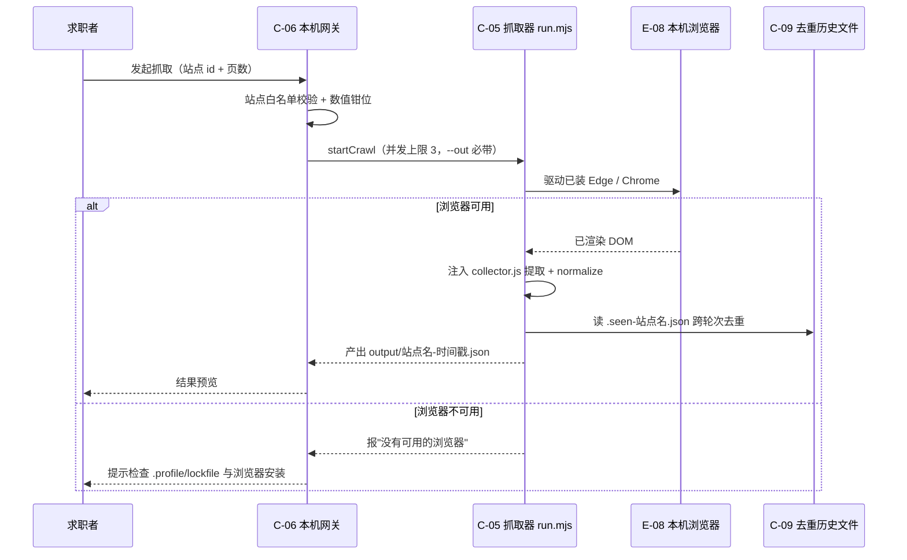
```mermaid
sequenceDiagram
    participant U as 求职者
    participant G as C-06 本机网关
    participant C as C-05 抓取器 run.mjs
    participant B as E-08 本机浏览器
    participant F as C-09 去重历史文件
    U->>G: 发起抓取（站点 id + 页数）
    G->>G: 站点白名单校验 + 数值钳位
    G->>C: startCrawl（并发上限 3，--out 必带）
    C->>B: 驱动已装 Edge / Chrome
    alt 浏览器可用
        B-->>C: 已渲染 DOM
        C->>C: 注入 collector.js 提取 + normalize
        C->>F: 读 .seen-站点名.json 跨轮次去重
        C-->>G: 产出 output/站点名-时间戳.json
        G-->>U: 结果预览
    else 浏览器不可用
        C-->>G: 报"没有可用的浏览器"
        G-->>U: 提示检查 .profile/lockfile 与浏览器安装
    end
```

**异常分支**：无浏览器 → 提示排查 `.profile/lockfile`；站点改版 → 单站点失败，其余站点不受影响。

##### §3.2.M9.5 关键流程逻辑

```
触发：批量抓取

Step 1: 参数校验（同步，本机网关）
  ├── 校验：站点 id 在白名单内 → 否则拒绝
  ├── 校验：数值钳位（页数 / 间隔在界内）
  └── 状态变更：生成 taskId

Step 2: 驱动浏览器（同步，跨多步）
  ├── 校验：`.profile/lockfile` 无残留 → 有则报错
  ├── 回退：浏览器来源三级回退（Edge → Chrome → 报错）
  ├── 提取：注入 collector.js（唯一实现）
  ├── 去重：读 `.seen-*.json` 跨轮次去重
  └── 状态变更：产出站点 JSON

Step 3: 契约一致性（同步）
  └── 校验：normalize.mjs 的 JOB_TYPES / dedupeKey / normalizeJobType 与 import.ts 逐字一致（contract.test.mjs 钉住）
```

**状态机迁移表（抓取任务）**：

| 起始状态 | 触发事件 | 终止状态 | 触发条件 / 校验 | 副作用 |
| --- | --- | --- | --- | --- |
| 无 | dispatch | running | 站点白名单校验通过 | 生成 taskId，启动进程 |
| running | finish | done | 采集完成且产出文件 | 写 output JSON |
| running | browser_missing | failed | 无可用浏览器 | 提示排查 lockfile |
| running | abort | canceled | 用户取消 | 清理临时文件 |

### 3.3 核心业务对象清单

#### 3.3.1 对象定义

| 编号 | 对象名（代码类名） | 对象类型 | 包路径 | 模块归属 | 被哪些模块复用 | 实例化策略 | 序列化约定 | 持久化策略 |
| --- | --- | --- | --- | --- | --- | --- | --- | --- |
| O-01 | `Job` | 聚合根 | `src/lib/` | M1 | M1 / M2 / M3 | 由采集归一创建 | JSON | 落表 → `jobs` |
| O-02 | `PublicJob` | 聚合根 | `src/lib/square.ts` | M1 | M1 | 由服务端灌入创建 | JSON | 落表 → `jobs_public` |
| O-03 | `Application` | 聚合根 | `src/lib/` | M3 | M3 / M4 | 由投递登记创建 | JSON | 落表 → `applications` |
| O-04 | `Message` | 实体 | `src/lib/conversation.ts` | M3 | M3 | 由聚合根创建 | JSON | 落表 → `messages` |
| O-05 | `Interview` | 实体 | `src/lib/interviews.ts` | M4 | M4 | 由投递关联创建 | JSON | 落表 → `interviews` |
| O-06 | `Offer` | 实体 | `src/lib/` | M4 | M4 | 由手填创建 | JSON | 落表 → `offers` |
| O-07 | `Resume` | 聚合根 | `src/lib/resumeFile.ts` | M7 | M2 / M7 | 由上传 / 手填创建 | JSON | 落表 → `resumes` |
| O-08 | `Task` | 聚合根 | `src/lib/agentRun.ts` | M5 | M5 | 由巡检发起创建 | JSON | 落表 → `tasks` |
| O-09 | `AiReport` | 聚合根 | `src/lib/score.ts` | M2 | M2 / M5 | 由评分流水线创建 | JSON | 落表 → `ai_reports` |
| O-10 | `Knowledge` | 实体 | `src/lib/` | M7 | M5 / M7 | 由手填创建 | JSON | 落表 → `knowledge` |
| O-11 | `Profile` | 聚合根 | `src/lib/profileFill.ts` | M7 | M2 / M5 / M7 | 单例（每账号一行） | JSON | 落表 → `profile` |
| O-12 | `DedupeKey` | 值对象 | `src/lib/import.ts` | M1 | M1 / M3 / M9 | new（不可变） | String | 嵌入字段 `dedupe_key` |
| O-13 | `Stage` | 共享枚举 | `src/lib/constants.ts` | M3 | M3 / M4 | — | String | 落表为 `stage VARCHAR(30)` |
| O-14 | `ScoreDimension` | 共享枚举 | `src/lib/constants.ts` | M2 | M2 / M5 | — | String | 落表为 `dims` 键 |
| O-15 | `JobFeedAdapter` | 防腐层 ACL | `src/lib/import.ts` + `crawler/lib/normalize.mjs` | M9 | M1 / M9 | new + 适配 | — | 不落表，瞬时转换 |

**对象类型说明**：

| 类型 | 含义 |
| --- | --- |
| 聚合根（Aggregate Root） | 业务一致性边界；外部引用必须通过聚合根 ID；跨聚合修改禁止 |
| 实体（Entity） | 有标识、生命周期独立，但归属某个聚合根 |
| 值对象（Value Object） | 无标识、不可变；如去重键 |
| 共享 DTO | 跨模块传输用的数据结构，无业务行为 |
| 共享枚举 | 跨模块的状态值 / 类型值 |
| 防腐层 ACL | 对接外部系统时的转换层（与 §2.2 C-02 ACL 关系对齐） |

**填写要求**：编号 O-xx 全局唯一；对象名为代码类名（PascalCase）；防腐层对象 O-15 与 §2.2 上下文映射 C-02 呼应。

#### 3.3.2 命名漂移登记表

| 业务实体（§2） | 代码类名（§3.3.1） | 数据表名（§4.2） | 漂移原因 |
| --- | --- | --- | --- |
| 岗位广场岗位 | `PublicJob` | `jobs_public` | 公共只读岗位与私有岗位同构但分表，代码层用 Public 前缀区分 |
| 评分报告 | `AiReport` | `ai_reports` | 业务界面称"AI·JD 评估报告"，代码与表名统一为 AiReport / ai_reports |

**填写要求**：仅登记命名不一致的对象；命名一致的对象无需出现。

### 3.4 跨模块公共能力

> 仅登记**横切多个模块、以 SDK / 拦截器 / 共享纯函数形式提供**的能力——这些能力没有独立业务边界，靠"约定接入"被多个模块共享。

**公共能力清单**：

| 公共能力 | 简述 | 提供方（SDK / 切面 / Bean） | 被哪些模块复用 | 接入方式 |
| --- | --- | --- | --- | --- |
| 数据访问适配 | 唯一数据访问出口 + RLS 空数组失败判定 | `src/lib/api.ts` 的 `Result` / `ApiError` | M1 / M2 / M3 / M4 / M5 / M7 | 模块内 import `api.ts` 方法 |
| 外部文本隔离 | 边界 + 声明 + 中和三道防线 | `src/lib/untrusted.ts` 的 `wrapUntrusted` | M2 / M5 / M6 | 纯函数调用，所有外部文本必经包装 |
| 事实守门 | 越界断言拦截与降级 | `src/lib/factGate.ts` | M2 / M5 / M6 | 纯函数调用 |
| 数字口径单点 | GREETING_RULES 唯一事实源 | `src/lib/constants.ts` 的 `GREETING_RULES` | M6 / M7（助手）/ 小程序同源 constants.js | 常量引用 |
| 配额三闸 | 模型调用配额硬上限 | `src/lib/quota.ts` | M2 / M5 | 调用前校验，超限拒绝 |
| 时间口径 | 统一日期解析与"剩 N 天" | `src/lib/format.ts` 的 `parseDate` | 全部模块 | 纯函数调用，禁止自造日期逻辑 |
| 采集契约 | 采集 JSON 跨端逐字一致 | `extension/collector.js` + `crawler/lib/normalize.mjs` | M1 / M9 | 注入 / import，契约测试钉住 |
| 用户提示 | 统一 toast 与错误转译 | `src/lib/toast.ts` + `src/cloud.ts` | 全部模块 | 调用 toast API |

**填写要求**：提供方为具体模块 / 函数名；接入方式说明研发怎么用；空表才可省略（本表非空）。

### 3.5 接口契约

> 本系统对外暴露的接口（含云端同步 API、本机进程调用）在错误码、幂等、限流、超时上的全局约定。**所有接口必须遵守，不在每个接口下重复声明**。

#### 3.5.1 全局错误码体系

**错误码格式**：

| 项 | 取值 |
| --- | --- |
| 错误码格式 | 6 位纯数字，如 `100401`、`200503` |
| 分段规则 | 2 位类别 + 2 位模块 + 2 位错误序号 |
| 类别取值 | `10` = 业务错误（HTTP 200，业务语义失败）/ `20` = 系统错误（HTTP 5xx）/ `30` = 客户端错误（HTTP 4xx） |
| 模块取值 | `00` 全局 / `01` 岗位获取 / `02` 评分决策 / `03` 投递跟进 / `04` 求职智能体 / `05` 防幻觉 / `06` 个人资产 / `07` 平台底座 |

**错误响应统一结构**：

```json
{
  "code": "100401",
  "msg": "巡检步数已达上限",
  "msgI18n": { "zh-CN": "巡检步数已达上限", "en-US": "Agent step limit reached" },
  "data": null,
  "traceId": "9f2c7e1a",
  "tenantId": "u_7f3a91",
  "timestamp": "2026-09-29T10:00:00.000Z"
}
```

**错误码注册表**（每模块登记关键业务错误 + 全局通用错误）：

| 错误码 | HTTP 状态 | 所属模块 | 含义 | 重试建议 | 用户文案 |
| --- | --- | --- | --- | --- | --- |
| 100101 | 200 | M1 | 岗位去重键冲突 | 不重试 | 该岗位已在你的岗位池中 |
| 100102 | 200 | M1 | 单批导入条数超限 | 分批后重试 | 一次导入条数过多，请分批导入 |
| 100201 | 200 | M2 | 评分调用配额不足 | 退避后重试 | 今日 AI 评估额度已用完，本地匹配分仍可用 |
| 100202 | 200 | M2 | 岗位正文超过长度上限 | 不重试 | 岗位描述过长，请精简后重试 |
| 100301 | 200 | M3 | 投递阶段流转非法 | 不重试 | 该阶段流转不允许 |
| 100401 | 200 | M5 | 巡检步数已达上限 | 不重试 | 本次巡检步数已达上限，已输出部分结论 |
| 100402 | 200 | M5 | 工具调用失败重试耗尽 | 稍后重试 | 工具调用失败，请稍后重试 |
| 100501 | 200 | M6 | 外部文本被事实守门拦截 | 不重试 | 该结论需人工确认后再采用 |
| 100601 | 200 | M7 | 简历附件解析失败 | 不重试 | 附件无法解析，请改用手填 |
| 200001 | 500 | 全局 | 系统内部错误 | 可重试 | 系统繁忙，请稍后再试 |
| 200503 | 500 | M6 | 模型通道超时 | 退避后重试 | AI 服务暂时不可用，请稍后再试 |
| 200701 | 500 | M8 | 云数据库不可用 | 退避后重试 | 数据服务暂时不可用，请稍后再试 |
| 300001 | 400 | 全局 | 参数校验失败 | 不重试 | 参数错误，请检查后重试 |
| 300701 | 403 | M8 | 写操作被 RLS 拒绝（返回空数组） | 不重试 | 保存失败，请重新登录后再试 |
| 300801 | 429 | 全局 | 触发限流 | 退避后重试 | 操作太频繁，请稍后再试 |
| 300901 | 401 | 全局 | 未登录或会话过期 | 重新登录 | 请重新登录 |

#### 3.5.2 幂等性约定

| 接口类型 | 是否要求幂等 | 幂等键来源（建议） |
| --- | --- | --- |
| 写入类（POST 创建） | 涉及通知 / 配额 / 记录类"重复执行有副作用"的，**必须幂等** | Header `biz_req_no`（调用方生成）或业务唯一键 `dedupe_key` |
| 更新类（PUT / PATCH） | 必须幂等 | 资源 ID + `version`（乐观锁） |
| 删除类（DELETE） | 天然幂等 | — |
| 查询类（GET） | 天然幂等 | — |
| 配额 / 通知 / 巡检类 | **强制幂等** | 业务侧请求号（`biz_req_no`，巡检按"当日"唯一） |

**幂等设计需考虑的问题**：

| 问题维度 | 设计要点 |
| --- | --- |
| 幂等键的生命周期 | 短期防抖（会话内）与长期对账（配额台账按日）分开保留 |
| 重复请求的语义 | 写入类返回首次结果；巡检类返回同一 `Task` 不重复建 |
| 执行中态的处理 | 巡检类若已有 running 任务，第二个请求复用而非拒绝 |
| 失败请求的可重试性 | 系统错误允许同键重试；业务错误（配额 / 校验）不允许 |
| 存储兜底 | `dedupe_key` 与 `biz_req_no` 落库唯一索引作为最终防线 |

#### 3.5.3 限流约定

| 维度 | 默认值 | 触发动作 | 调整方式 |
| --- | --- | --- | --- |
| 全局 QPS | 平台托管默认 | 返回 300801 | 平台配置 |
| 单账号 QPS | 30 | 返回 300801 | 平台配置 |
| 模型调用（单账号单日） | 60 次（maxCallsPerDay） | 返回 100201 | 配额台账 |
| 模型调用（单任务） | 8 次（maxCallsPerTask = maxSteps） | 返回 100401 | 配额台账 |
| 巡检任务（单账号单日） | 20 次（dailyTasks） | 返回 100201 | 配额台账 |
| 公共岗位灌入 | 单人单日 200 条 | 返回 300801 | 服务端函数配额 |
| 招聘平台接口节流 | OfferBiu 默认 1200ms 间隔、不做并发 | 触发即等待 | 采集代码常量 |
| 重保接口（登录） | 单账号 5 次 / 分钟 | 锁定 15 分钟 | 认证服务 |

**降级策略**：

| 策略项 | 内容 |
| --- | --- |
| 前端退避 | 触发限流后按 `Retry-After` 退避重试 |
| 后端记录 | 写入类接口同时记录到配额台账 |
| 红线联动 | 限流红线值与 §5.5.4 容量水位线"红线"一致 |

#### 3.5.4 默认超时与重试基线

> 全局**单一来源**——本节定义跨模块、跨调用类型的默认超时与重试策略。各模块接口清单（§3.2.M{N}.2）通过引用本节继承默认值。

| 调用类型 | 默认超时 | 默认重试 | 重试条件 |
| --- | --- | --- | --- |
| 本模块纯函数 | 无（进程内） | 0 次 | — |
| 云端同步 API（内部） | 3s | 0 次 | — |
| 外部同步 API（E-xx / LLM 通道） | 10s | 2 次（指数退避 1s / 2s） | 仅网络错误 / 5xx |
| 本机网关进程调用 | 5min | 1 次 | 失败告警 |
| 本机抓取器任务 | 30min | 0 次（断点续跑） | 失败后手动续跑 |
| 定时任务（超期扫描 / 巡检） | 5min | 3 次 | 失败告警 |

**填写要求**：超时值禁止"无限"；所有重试有上限；重试不产生副作用（依赖 §3.5.2 幂等性）。

#### 3.5.5 路由设计规范

**API 路由规范**：

| 维度 | 取值 |
| --- | --- |
| 风格 | RESTful（资源化 URL，云服务 PostgREST 风格） |
| 版本控制 | `/rest/v1/...`（平台路径版本） |
| 命名 | 小写 + 下划线（表名）/ 中划线（自建 API） |
| 资源命名 | 名词复数（`/rest/v1/jobs`） |
| 子资源 | `/rest/v1/applications/{id}/stage` |
| 动作类接口 | `/api/{resource}/{id}/action`（POST） |

**前端页面路由清单**：

| 路径 | 页面 / 功能 | 入口角色（§2.3） | 鉴权要求 | 关联模块（§3.2.M{N}） |
| --- | --- | --- | --- | --- |
| `#/login` | 登录页 | 全部 | 公开 | M8 |
| `#/overview` | 总览页 | 求职者 | 已登录 | M2 / M3 |
| `#/square` | 岗位广场页 | 求职者 | 已登录 | M1 |
| `#/jobs` | 岗位池页 | 求职者 | 已登录 | M1 / M2 |
| `#/pipeline` | 投递看板页 | 求职者 / 运营者 | 已登录 | M3 |
| `#/interviews` | 面试跟进页 | 求职者 | 已登录 | M4 |
| `#/offers` | Offer 对比页 | 求职者 | 已登录 | M4 |
| `#/ai` | AI·JD 评估页 | 求职者 | 已登录 | M2 |
| `#/knowledge` | 个人知识库页 | 求职者 | 已登录 | M7 |
| `#/resumes` | 简历库页 | 求职者 | 已登录 | M7 |
| `#/crawler` | 抓取任务页 | 求职者 | 已登录 | M1 / M9 |
| `#/settings` | 目标条件与账号页 | 求职者 | 已登录 | M7 / M8 |

**前端路由约定**：

| 维度 | 取值 |
| --- | --- |
| 路由模式 | Hash（单页应用无服务端路由） |
| 命名风格 | 小写 + 中划线（kebab-case） |
| 动态参数 | 通过查询串或组件内选中态，不暴露裸 ID 路径 |
| 鉴权方式 | 全局路由守卫读会话，未登录跳转 `#/login` |
| 嵌套路由 | 列表页 → 详情抽屉（组件级，非路由级） |

**填写要求**：每条路径显式标注鉴权要求；关联模块填实，无"待定"。

---

## 4. 数据库设计

> **本章回答**：每个模块的状态用什么表存、表怎么建、数据怎么清理、缓存怎么用。
> **核心方法论**：**数据库按业务域组织，业务域与第 2 章 / 第 3 章保持一致**，禁止按"用户表 / 订单表 / 日志表"这种横向技术维度组织。

### 4.1 全局数据约定

| 约定项 | 取值 | 说明 |
| --- | --- | --- |
| 命名规范（表名） | 小写名词复数，无前缀 | 沿用既有 11 张表基线（`jobs` / `applications` / ...），不引入 `t_` 前缀以避免全库重命名返工 |
| 命名规范（字段名） | 小写 + 下划线（snake_case） | 禁止驼峰 |
| 主键类型 | UUID（字符串主键 `id`） | 全项目统一，平台生成，禁止混用自增 |
| 字符集 / 排序 | utf8mb4 / utf8mb4_unicode_ci | 支持 emoji 与多语言 |
| 时间字段类型 | timestamptz（UTC 存储，ISO 8601 序列化） | 统一精度与时区；前端展示走 `format.ts` |
| 软删除字段 | 通过 `stage` / `status` 归档，不做行级软删 | 既有实现选择，简化 RLS 与索引 |
| 审计字段 | `created_at` / `updated_at` | 由平台自动维护，命名锁定 |
| 隔离字段（多租户） | `owner_id`（uuid NOT NULL） | 多租户必备；RLS 强制 = `auth.uid()`；查询与写入必带 |
| 业务唯一标识 | `dedupe_key VARCHAR(200)` | 岗位与投递去重；跨端逐字一致 |
| 状态枚举 | `VARCHAR` 字符串 | 二选一锁定为字符串；DDL 注释列出全部取值 |
| 金额字段 | 无（本项目不含资金流） | — |
| 手机号存储 | 不落库 | 认证由平台托管，项目库不含手机号明文 |

**填写要求**：每条约定给出具体取值，不允许"两种都行"；一旦锁定所有表必须遵循。

### 4.2 单表设计

> 每张表严格按 5 段编写，不得省略任何一段。表按 §2.1 业务域分组。

#### 4.2.1 数据库分组与表清单

| 业务域（§2.1） | 表名 | 读写属性 | 归属模块（§3.2） |
| --- | --- | --- | --- |
| 岗位获取域 | `jobs` | 私有（RLS） | M1 |
| 岗位获取域 | `jobs_public` | 公共只读（唯一例外） | M1 |
| 评分决策域 | `ai_reports` | 私有（RLS） | M2 |
| 投递跟进域 | `applications` | 私有（RLS） | M3 |
| 投递跟进域 | `messages` | 私有（RLS） | M3 |
| 投递跟进域 | `interviews` | 私有（RLS） | M4 |
| 投递跟进域 | `offers` | 私有（RLS） | M4 |
| 求职智能体域 | `tasks` | 私有（RLS） | M5 |
| 个人资产域 | `resumes` | 私有（RLS） | M7 |
| 个人资产域 | `knowledge` | 私有（RLS） | M7 |
| 个人资产域 | `profile` | 私有（RLS） | M7 |

#### 4.2.2 表 jobs（岗位池）

**库表元信息**：

| 字段 | 取值 |
| --- | --- |
| 数据库类型 | PostgREST 风格云数据库（PostgreSQL） |
| 库名 | `public` |
| 表名 | `jobs` |
| 业务含义（≤ 50 字） | 用户私有岗位池，按账号隔离，含去重键与阶段 |
| 模块归属（§3.2） | M1 岗位获取与岗位广场 |
| 对应核心对象（§3.3） | O-01 `Job` |

**库表结构定义**：

| 列名 | 数据类型 | 可为空 | 约束 | 默认值 | 备注 |
| --- | --- | --- | --- | --- | --- |
| id | UUID | NOT NULL | PRIMARY KEY | gen_random_uuid() | 主键 ID |
| owner_id | UUID | NOT NULL | RLS 隔离 | auth.uid() | 账号隔离字段，查询必带 |
| title | VARCHAR(200) | NOT NULL | | | 岗位名 |
| company | VARCHAR(200) | NOT NULL | | | 公司名 |
| jd_text | TEXT | NULL | | | 岗位正文 |
| channel | VARCHAR(40) | NOT NULL | | | 来源渠道（CHANNELS 之一） |
| source_url | TEXT | NULL | | | 原岗位链接 |
| dedupe_key | VARCHAR(200) | NOT NULL | | | 去重键 |
| stage | VARCHAR(30) | NOT NULL | | 'pending' | 枚举：pending / scored / applied / archived |
| created_at | TIMESTAMPTZ | NULL | | now() | 创建时间 |
| updated_at | TIMESTAMPTZ | NULL | | now() | 更新时间 |

**索引设计**：

| 索引名 | 索引类型 | 字段（含顺序） | 设计目的 | 关联查询场景 |
| --- | --- | --- | --- | --- |
| `jobs_pkey` | 主键 | `id` | 唯一标识 | 按主键查询 |
| `uk_jobs_owner_dedupe` | 唯一索引 | `owner_id, dedupe_key` | 账号内去重 | 入池去重判定 |
| `idx_jobs_owner_stage` | 普通索引 | `owner_id, stage` | 账号内按阶段列表 | 岗位池过滤 |
| `idx_jobs_created_at` | 普通索引 | `created_at` | 时间排序 | 按时间倒序列表 |

**DDL**：

```sql
CREATE TABLE jobs (
  id UUID PRIMARY KEY DEFAULT gen_random_uuid(),
  owner_id UUID NOT NULL DEFAULT auth.uid(),
  title VARCHAR(200) NOT NULL,
  company VARCHAR(200) NOT NULL,
  jd_text TEXT,
  channel VARCHAR(40) NOT NULL,
  source_url TEXT,
  dedupe_key VARCHAR(200) NOT NULL,
  stage VARCHAR(30) NOT NULL DEFAULT 'pending' COMMENT 'pending/scored/applied/archived',
  created_at TIMESTAMPTZ DEFAULT now(),
  updated_at TIMESTAMPTZ DEFAULT now(),
  CONSTRAINT uk_jobs_owner_dedupe UNIQUE (owner_id, dedupe_key)
);
CREATE INDEX idx_jobs_owner_stage ON jobs (owner_id, stage);
CREATE INDEX idx_jobs_created_at ON jobs (created_at);
ALTER TABLE jobs ENABLE ROW LEVEL SECURITY;
CREATE POLICY jobs_owner ON jobs FOR ALL
  USING (owner_id = auth.uid()) WITH CHECK (owner_id = auth.uid());
```

**数据清理机制（扩展逻辑）**：

| 清理机制 | 适用场景 | 配置 |
| --- | --- | --- |
| 软删（归档） | 用户作废岗位 | 置 `stage = 'archived'`，不物理删 |
| 物理删除 | 用户硬删岗位 | 用户主动删除，按行物理删（RLS 校验归属） |
| 归档 | 长期不用岗位 | 无独立归档表，靠 stage 过滤 |

#### 4.2.3 表 jobs_public（岗位广场）

**库表元信息**：

| 字段 | 取值 |
| --- | --- |
| 数据库类型 | PostgREST 风格云数据库（PostgreSQL） |
| 库名 | `public` |
| 表名 | `jobs_public` |
| 业务含义（≤ 50 字） | 公共只读岗位库，所有人可读无人可写 |
| 模块归属（§3.2） | M1 岗位获取与岗位广场 |
| 对应核心对象（§3.3） | O-02 `PublicJob` |

**库表结构定义**：

| 列名 | 数据类型 | 可为空 | 约束 | 默认值 | 备注 |
| --- | --- | --- | --- | --- | --- |
| id | UUID | NOT NULL | PRIMARY KEY | gen_random_uuid() | 主键 ID |
| title | VARCHAR(200) | NOT NULL | | | 岗位名 |
| company | VARCHAR(200) | NOT NULL | | | 公司名 |
| jd_text | TEXT | NULL | | | 岗位正文 |
| channel | VARCHAR(40) | NOT NULL | | | 来源渠道 |
| source_url | TEXT | NULL | | | 原岗位链接 |
| company_type | VARCHAR(40) | NULL | | | 公司性质 |
| industry | VARCHAR(80) | NULL | | | 行业分类 |
| deadline_at | TIMESTAMPTZ | NULL | | | 投递截止日（结构化源才有） |
| dedupe_key | VARCHAR(200) | NOT NULL | | | 去重键 |
| created_at | TIMESTAMPTZ | NULL | | now() | 创建时间 |

**说明**：本表**无 `owner_id`**、**无私有字段**；只读，加入岗位池时复制快照而非引用。

**索引设计**：

| 索引名 | 索引类型 | 字段（含顺序） | 设计目的 | 关联查询场景 |
| --- | --- | --- | --- | --- |
| `jobs_public_pkey` | 主键 | `id` | 唯一标识 | 按主键查询 |
| `uk_jobs_public_dedupe` | 唯一索引 | `dedupe_key` | 全局去重 | 灌入去重 |
| `idx_jobs_public_created_at` | 普通索引 | `created_at` | 时间排序 | 广场按时间倒序 |

**DDL**：

```sql
CREATE TABLE jobs_public (
  id UUID PRIMARY KEY DEFAULT gen_random_uuid(),
  title VARCHAR(200) NOT NULL,
  company VARCHAR(200) NOT NULL,
  jd_text TEXT,
  channel VARCHAR(40) NOT NULL,
  source_url TEXT,
  company_type VARCHAR(40),
  industry VARCHAR(80),
  deadline_at TIMESTAMPTZ,
  dedupe_key VARCHAR(200) NOT NULL,
  created_at TIMESTAMPTZ DEFAULT now(),
  CONSTRAINT uk_jobs_public_dedupe UNIQUE (dedupe_key)
);
CREATE INDEX idx_jobs_public_created_at ON jobs_public (created_at);
ALTER TABLE jobs_public ENABLE ROW LEVEL SECURITY;
-- 唯一策略：只有一条 SELECT 策略，无写策略
CREATE POLICY jobs_public_read ON jobs_public
  FOR SELECT TO authenticated, anon USING (true);
-- 唯一写入口：SECURITY DEFINER 函数（每人每日 200 条配额）
CREATE FUNCTION jobs_public_ingest(payload JSONB)
  RETURNS INTEGER SECURITY DEFINER AS $$ /* 校验配额后插入 */ $$ LANGUAGE plpgsql;
```

**数据清理机制（扩展逻辑）**：

| 清理机制 | 适用场景 | 配置 |
| --- | --- | --- |
| 物理删除 | 过期公共岗位 | 由服务端灌入脚本按截止日清理 |
| 幂等重建 | 种子灌入 | `seed.sql` 开头 `DELETE FROM jobs_public;` 保证幂等 |

#### 4.2.4 表 ai_reports（评分报告）

**库表元信息**：

| 字段 | 取值 |
| --- | --- |
| 数据库类型 | PostgREST 风格云数据库（PostgreSQL） |
| 库名 | `public` |
| 表名 | `ai_reports` |
| 业务含义（≤ 50 字） | 两段式评分产出的七维评估报告 |
| 模块归属（§3.2） | M2 两段式评分引擎 |
| 对应核心对象（§3.3） | O-09 `AiReport` |

**库表结构定义**：

| 列名 | 数据类型 | 可为空 | 约束 | 默认值 | 备注 |
| --- | --- | --- | --- | --- | --- |
| id | UUID | NOT NULL | PRIMARY KEY | gen_random_uuid() | 主键 ID |
| owner_id | UUID | NOT NULL | RLS 隔离 | auth.uid() | 账号隔离字段 |
| job_id | UUID | NOT NULL | | | 关联岗位 |
| score_local | NUMERIC(5,2) | NOT NULL | | | 本地预筛分 0~100 |
| score_ai | NUMERIC(5,2) | NULL | | | AI 综合分 0~100 |
| dims | JSONB | NULL | | | 七维分数（ScoreDimension 为键） |
| reasons | JSONB | NULL | | | 评分依据数组 |
| status | VARCHAR(20) | NOT NULL | | 'ok' | 枚举：ok / queued / failed |
| created_at | TIMESTAMPTZ | NULL | | now() | 创建时间 |

**索引设计**：

| 索引名 | 索引类型 | 字段（含顺序） | 设计目的 | 关联查询场景 |
| --- | --- | --- | --- | --- |
| `ai_reports_pkey` | 主键 | `id` | 唯一标识 | 按主键查询 |
| `idx_ai_reports_owner_job` | 普通索引 | `owner_id, job_id` | 账号内按岗位查报告 | 评分报告展示 |
| `idx_ai_reports_owner_status` | 普通索引 | `owner_id, status` | 账号内按状态过滤 | 排队报告查询 |

**DDL**：

```sql
CREATE TABLE ai_reports (
  id UUID PRIMARY KEY DEFAULT gen_random_uuid(),
  owner_id UUID NOT NULL DEFAULT auth.uid(),
  job_id UUID NOT NULL,
  score_local NUMERIC(5,2) NOT NULL,
  score_ai NUMERIC(5,2),
  dims JSONB,
  reasons JSONB,
  status VARCHAR(20) NOT NULL DEFAULT 'ok' COMMENT 'ok/queued/failed',
  created_at TIMESTAMPTZ DEFAULT now()
);
CREATE INDEX idx_ai_reports_owner_job ON ai_reports (owner_id, job_id);
CREATE INDEX idx_ai_reports_owner_status ON ai_reports (owner_id, status);
ALTER TABLE ai_reports ENABLE ROW LEVEL SECURITY;
CREATE POLICY ai_reports_owner ON ai_reports FOR ALL
  USING (owner_id = auth.uid()) WITH CHECK (owner_id = auth.uid());
```

**数据清理机制（扩展逻辑）**：

| 清理机制 | 适用场景 | 配置 |
| --- | --- | --- |
| 无（永久保留） | 评分报告 | 随岗位删除级联清理 |
| 物理删除 | 岗位被删 | 级联删除对应报告 |

#### 4.2.5 表 applications（投递）

**库表元信息**：

| 字段 | 取值 |
| --- | --- |
| 数据库类型 | PostgREST 风格云数据库（PostgreSQL） |
| 库名 | `public` |
| 表名 | `applications` |
| 业务含义（≤ 50 字） | 用户投递记录与阶段状态 |
| 模块归属（§3.2） | M3 投递看板与沟通台账 |
| 对应核心对象（§3.3） | O-03 `Application` |

**库表结构定义**：

| 列名 | 数据类型 | 可为空 | 约束 | 默认值 | 备注 |
| --- | --- | --- | --- | --- | --- |
| id | UUID | NOT NULL | PRIMARY KEY | gen_random_uuid() | 主键 ID |
| owner_id | UUID | NOT NULL | RLS 隔离 | auth.uid() | 账号隔离字段 |
| job_id | UUID | NOT NULL | | | 关联岗位 |
| dedupe_key | VARCHAR(200) | NOT NULL | | | 去重键 |
| stage | VARCHAR(30) | NOT NULL | | | 枚举：STAGES 五阶段 |
| note | TEXT | NULL | | | 备注 |
| applied_at | TIMESTAMPTZ | NULL | | now() | 投递时间；超期计时基准 |
| updated_at | TIMESTAMPTZ | NULL | | now() | 更新时间 |

**索引设计**：

| 索引名 | 索引类型 | 字段（含顺序） | 设计目的 | 关联查询场景 |
| --- | --- | --- | --- | --- |
| `applications_pkey` | 主键 | `id` | 唯一标识 | 按主键查询 |
| `uk_applications_owner_dedupe` | 唯一索引 | `owner_id, dedupe_key` | 账号内防重复登记 | 投递登记去重 |
| `idx_applications_owner_stage` | 普通索引 | `owner_id, stage` | 账号内看板分列 | 看板按阶段展示 |
| `idx_applications_applied_at` | 普通索引 | `applied_at` | 超期扫描 | 超期未回复计算 |

**DDL**：

```sql
CREATE TABLE applications (
  id UUID PRIMARY KEY DEFAULT gen_random_uuid(),
  owner_id UUID NOT NULL DEFAULT auth.uid(),
  job_id UUID NOT NULL,
  dedupe_key VARCHAR(200) NOT NULL,
  stage VARCHAR(30) NOT NULL COMMENT '已投递/已沟通/面试中/已结束/已归档',
  note TEXT,
  applied_at TIMESTAMPTZ DEFAULT now(),
  updated_at TIMESTAMPTZ DEFAULT now(),
  CONSTRAINT uk_applications_owner_dedupe UNIQUE (owner_id, dedupe_key)
);
CREATE INDEX idx_applications_owner_stage ON applications (owner_id, stage);
CREATE INDEX idx_applications_applied_at ON applications (applied_at);
ALTER TABLE applications ENABLE ROW LEVEL SECURITY;
CREATE POLICY applications_owner ON applications FOR ALL
  USING (owner_id = auth.uid()) WITH CHECK (owner_id = auth.uid());
```

**数据清理机制（扩展逻辑）**：

| 清理机制 | 适用场景 | 配置 |
| --- | --- | --- |
| 软删（归档） | 已结束投递 | 置 `stage = '已归档'` |
| 无（永久保留） | 活跃投递 | 保留至用户主动归档 |

#### 4.2.6 表 messages（沟通台账）

**库表元信息**：

| 字段 | 取值 |
| --- | --- |
| 数据库类型 | PostgREST 风格云数据库（PostgreSQL） |
| 库名 | `public` |
| 表名 | `messages` |
| 业务含义（≤ 50 字） | 与招聘方会话的时间线条目 |
| 模块归属（§3.2） | M3 投递看板与沟通台账 |
| 对应核心对象（§3.3） | O-04 `Message` |

**库表结构定义**：

| 列名 | 数据类型 | 可为空 | 约束 | 默认值 | 备注 |
| --- | --- | --- | --- | --- | --- |
| id | UUID | NOT NULL | PRIMARY KEY | gen_random_uuid() | 主键 ID |
| owner_id | UUID | NOT NULL | RLS 隔离 | auth.uid() | 账号隔离字段 |
| application_id | UUID | NOT NULL | | | 关联投递 |
| direction | VARCHAR(10) | NOT NULL | | | 枚举：out / in |
| content | TEXT | NOT NULL | | | 会话内容 |
| created_at | TIMESTAMPTZ | NULL | | now() | 创建时间 |

**索引设计**：

| 索引名 | 索引类型 | 字段（含顺序） | 设计目的 | 关联查询场景 |
| --- | --- | --- | --- | --- |
| `messages_pkey` | 主键 | `id` | 唯一标识 | 按主键查询 |
| `idx_messages_owner_app` | 普通索引 | `owner_id, application_id` | 账号内按投递查时间线 | 会话详情 |
| `idx_messages_created_at` | 普通索引 | `created_at` | 时间线排序 | 按时间正序 |

**DDL**：

```sql
CREATE TABLE messages (
  id UUID PRIMARY KEY DEFAULT gen_random_uuid(),
  owner_id UUID NOT NULL DEFAULT auth.uid(),
  application_id UUID NOT NULL,
  direction VARCHAR(10) NOT NULL COMMENT 'out/in',
  content TEXT NOT NULL,
  created_at TIMESTAMPTZ DEFAULT now()
);
CREATE INDEX idx_messages_owner_app ON messages (owner_id, application_id);
CREATE INDEX idx_messages_created_at ON messages (created_at);
ALTER TABLE messages ENABLE ROW LEVEL SECURITY;
CREATE POLICY messages_owner ON messages FOR ALL
  USING (owner_id = auth.uid()) WITH CHECK (owner_id = auth.uid());
```

**数据清理机制（扩展逻辑）**：

| 清理机制 | 适用场景 | 配置 |
| --- | --- | --- |
| 无（永久保留） | 会话记录 | 随投递归档一并归档 |
| 物理删除 | 用户删除单条 | 用户主动删除 |

#### 4.2.7 表 interviews（面试）

**库表元信息**：

| 字段 | 取值 |
| --- | --- |
| 数据库类型 | PostgREST 风格云数据库（PostgreSQL） |
| 库名 | `public` |
| 表名 | `interviews` |
| 业务含义（≤ 50 字） | 关联投递的面试安排与复盘记录 |
| 模块归属（§3.2） | M4 面试跟进与 Offer 对比 |
| 对应核心对象（§3.3） | O-05 `Interview` |

**库表结构定义**：

| 列名 | 数据类型 | 可为空 | 约束 | 默认值 | 备注 |
| --- | --- | --- | --- | --- | --- |
| id | UUID | NOT NULL | PRIMARY KEY | gen_random_uuid() | 主键 ID |
| owner_id | UUID | NOT NULL | RLS 隔离 | auth.uid() | 账号隔离字段 |
| application_id | UUID | NOT NULL | | | 关联投递 |
| round | VARCHAR(20) | NOT NULL | | | 面试轮次（一面 / 二面 / HR 面） |
| scheduled_at | TIMESTAMPTZ | NULL | | | 面试时间 |
| note | TEXT | NULL | | | 复盘记录 |
| created_at | TIMESTAMPTZ | NULL | | now() | 创建时间 |

**索引设计**：

| 索引名 | 索引类型 | 字段（含顺序） | 设计目的 | 关联查询场景 |
| --- | --- | --- | --- | --- |
| `interviews_pkey` | 主键 | `id` | 唯一标识 | 按主键查询 |
| `idx_interviews_owner_app` | 普通索引 | `owner_id, application_id` | 账号内按投递查面试 | 投递详情 |
| `idx_interviews_scheduled_at` | 普通索引 | `scheduled_at` | 面试时间排序与提醒 | 提醒日历 |

**DDL**：

```sql
CREATE TABLE interviews (
  id UUID PRIMARY KEY DEFAULT gen_random_uuid(),
  owner_id UUID NOT NULL DEFAULT auth.uid(),
  application_id UUID NOT NULL,
  round VARCHAR(20) NOT NULL,
  scheduled_at TIMESTAMPTZ,
  note TEXT,
  created_at TIMESTAMPTZ DEFAULT now()
);
CREATE INDEX idx_interviews_owner_app ON interviews (owner_id, application_id);
CREATE INDEX idx_interviews_scheduled_at ON interviews (scheduled_at);
ALTER TABLE interviews ENABLE ROW LEVEL SECURITY;
CREATE POLICY interviews_owner ON interviews FOR ALL
  USING (owner_id = auth.uid()) WITH CHECK (owner_id = auth.uid());
```

**数据清理机制（扩展逻辑）**：

| 清理机制 | 适用场景 | 配置 |
| --- | --- | --- |
| 无（永久保留） | 面试记录 | 随投递归档 |

#### 4.2.8 表 offers（Offer）

**库表元信息**：

| 字段 | 取值 |
| --- | --- |
| 数据库类型 | PostgREST 风格云数据库（PostgreSQL） |
| 库名 | `public` |
| 表名 | `offers` |
| 业务含义（≤ 50 字） | 收到的录用结果与对比维度 |
| 模块归属（§3.2） | M4 面试跟进与 Offer 对比 |
| 对应核心对象（§3.3） | O-06 `Offer` |

**库表结构定义**：

| 列名 | 数据类型 | 可为空 | 约束 | 默认值 | 备注 |
| --- | --- | --- | --- | --- | --- |
| id | UUID | NOT NULL | PRIMARY KEY | gen_random_uuid() | 主键 ID |
| owner_id | UUID | NOT NULL | RLS 隔离 | auth.uid() | 账号隔离字段 |
| application_id | UUID | NOT NULL | | | 关联投递 |
| salary | VARCHAR(100) | NULL | | | 薪资描述 |
| city | VARCHAR(50) | NULL | | | 城市 |
| status | VARCHAR(20) | NOT NULL | | 'pending' | 枚举：pending / accepted / rejected |
| deadline_at | TIMESTAMPTZ | NULL | | | 决策截止 |
| created_at | TIMESTAMPTZ | NULL | | now() | 创建时间 |

**索引设计**：

| 索引名 | 索引类型 | 字段（含顺序） | 设计目的 | 关联查询场景 |
| --- | --- | --- | --- | --- |
| `offers_pkey` | 主键 | `id` | 唯一标识 | 按主键查询 |
| `idx_offers_owner_status` | 普通索引 | `owner_id, status` | 账号内按状态过滤 | Offer 对比 |
| `idx_offers_deadline_at` | 普通索引 | `deadline_at` | 截止提醒 | 提醒日历 |

**DDL**：

```sql
CREATE TABLE offers (
  id UUID PRIMARY KEY DEFAULT gen_random_uuid(),
  owner_id UUID NOT NULL DEFAULT auth.uid(),
  application_id UUID NOT NULL,
  salary VARCHAR(100),
  city VARCHAR(50),
  status VARCHAR(20) NOT NULL DEFAULT 'pending' COMMENT 'pending/accepted/rejected',
  deadline_at TIMESTAMPTZ,
  created_at TIMESTAMPTZ DEFAULT now()
);
CREATE INDEX idx_offers_owner_status ON offers (owner_id, status);
CREATE INDEX idx_offers_deadline_at ON offers (deadline_at);
ALTER TABLE offers ENABLE ROW LEVEL SECURITY;
CREATE POLICY offers_owner ON offers FOR ALL
  USING (owner_id = auth.uid()) WITH CHECK (owner_id = auth.uid());
```

**数据清理机制（扩展逻辑）**：

| 清理机制 | 适用场景 | 配置 |
| --- | --- | --- |
| 无（永久保留） | Offer 记录 | 随投递归档 |
| 物理删除 | 用户误录 | 用户主动删除 |

#### 4.2.9 表 tasks（巡检任务）

**库表元信息**：

| 字段 | 取值 |
| --- | --- |
| 数据库类型 | PostgREST 风格云数据库（PostgreSQL） |
| 库名 | `public` |
| 表名 | `tasks` |
| 业务含义（≤ 50 字） | 智能体每日巡检的执行单元与审计轨迹 |
| 模块归属（§3.2） | M5 求职智能体 ReAct 巡检 |
| 对应核心对象（§3.3） | O-08 `Task` |

**库表结构定义**：

| 列名 | 数据类型 | 可为空 | 约束 | 默认值 | 备注 |
| --- | --- | --- | --- | --- | --- |
| id | UUID | NOT NULL | PRIMARY KEY | gen_random_uuid() | 主键 ID |
| owner_id | UUID | NOT NULL | RLS 隔离 | auth.uid() | 账号隔离字段 |
| goal | TEXT | NOT NULL | | | 巡检目标 |
| steps | JSONB | NULL | | | 逐步审计（ActionStep 数组） |
| status | VARCHAR(20) | NOT NULL | | 'running' | 枚举：running / done / aborted |
| biz_req_no | VARCHAR(100) | NOT NULL | | | 幂等请求号（当日唯一） |
| created_at | TIMESTAMPTZ | NULL | | now() | 创建时间 |

**索引设计**：

| 索引名 | 索引类型 | 字段（含顺序） | 设计目的 | 关联查询场景 |
| --- | --- | --- | --- | --- |
| `tasks_pkey` | 主键 | `id` | 唯一标识 | 按主键查询 |
| `uk_tasks_owner_bizreq` | 唯一索引 | `owner_id, biz_req_no` | 当日巡检唯一（幂等） | 防重复发起 |
| `idx_tasks_owner_status` | 普通索引 | `owner_id, status` | 账号内按状态过滤 | 任务列表 |

**DDL**：

```sql
CREATE TABLE tasks (
  id UUID PRIMARY KEY DEFAULT gen_random_uuid(),
  owner_id UUID NOT NULL DEFAULT auth.uid(),
  goal TEXT NOT NULL,
  steps JSONB,
  status VARCHAR(20) NOT NULL DEFAULT 'running' COMMENT 'running/done/aborted',
  biz_req_no VARCHAR(100) NOT NULL,
  created_at TIMESTAMPTZ DEFAULT now(),
  CONSTRAINT uk_tasks_owner_bizreq UNIQUE (owner_id, biz_req_no)
);
CREATE INDEX idx_tasks_owner_status ON tasks (owner_id, status);
ALTER TABLE tasks ENABLE ROW LEVEL SECURITY;
CREATE POLICY tasks_owner ON tasks FOR ALL
  USING (owner_id = auth.uid()) WITH CHECK (owner_id = auth.uid());
```

**数据清理机制（扩展逻辑）**：

| 清理机制 | 适用场景 | 配置 |
| --- | --- | --- |
| 物理删除 | 审计轨迹超期 | 按 `created_at` 保留 180 天，由定时任务清理 |
| 归档 | 历史任务 | 归档至对象存储（完整版可选） |

#### 4.2.10 表 resumes（简历库）

**库表元信息**：

| 字段 | 取值 |
| --- | --- |
| 数据库类型 | PostgREST 风格云数据库（PostgreSQL） |
| 库名 | `public` |
| 表名 | `resumes` |
| 业务含义（≤ 50 字） | 用户简历正文与附件 |
| 模块归属（§3.2） | M7 简历库与个人知识库 |
| 对应核心对象（§3.3） | O-07 `Resume` |

**库表结构定义**：

| 列名 | 数据类型 | 可为空 | 约束 | 默认值 | 备注 |
| --- | --- | --- | --- | --- | --- |
| id | UUID | NOT NULL | PRIMARY KEY | gen_random_uuid() | 主键 ID |
| owner_id | UUID | NOT NULL | RLS 隔离 | auth.uid() | 账号隔离字段 |
| title | VARCHAR(200) | NOT NULL | | | 简历标题 |
| content | TEXT | NULL | | | 简历正文 |
| attachment_path | TEXT | NULL | | | 附件路径（完整版 F17） |
| created_at | TIMESTAMPTZ | NULL | | now() | 创建时间 |
| updated_at | TIMESTAMPTZ | NULL | | now() | 更新时间 |

**索引设计**：

| 索引名 | 索引类型 | 字段（含顺序） | 设计目的 | 关联查询场景 |
| --- | --- | --- | --- | --- |
| `resumes_pkey` | 主键 | `id` | 唯一标识 | 按主键查询 |
| `idx_resumes_owner_created` | 普通索引 | `owner_id, created_at` | 账号内按时间列表 | 简历库列表 |

**DDL**：

```sql
CREATE TABLE resumes (
  id UUID PRIMARY KEY DEFAULT gen_random_uuid(),
  owner_id UUID NOT NULL DEFAULT auth.uid(),
  title VARCHAR(200) NOT NULL,
  content TEXT,
  attachment_path TEXT,
  created_at TIMESTAMPTZ DEFAULT now(),
  updated_at TIMESTAMPTZ DEFAULT now()
);
CREATE INDEX idx_resumes_owner_created ON resumes (owner_id, created_at);
ALTER TABLE resumes ENABLE ROW LEVEL SECURITY;
CREATE POLICY resumes_owner ON resumes FOR ALL
  USING (owner_id = auth.uid()) WITH CHECK (owner_id = auth.uid());
```

**数据清理机制（扩展逻辑）**：

| 清理机制 | 适用场景 | 配置 |
| --- | --- | --- |
| 无（永久保留） | 简历 | 用户主动删除 |
| 物理删除 | 附件替换 | 换附件时删旧路径文件 |

#### 4.2.11 表 knowledge（个人知识库）

**库表元信息**：

| 字段 | 取值 |
| --- | --- |
| 数据库类型 | PostgREST 风格云数据库（PostgreSQL） |
| 库名 | `public` |
| 表名 | `knowledge` |
| 业务含义（≤ 50 字） | 个人知识库的沉淀条目 |
| 模块归属（§3.2） | M7 简历库与个人知识库 |
| 对应核心对象（§3.3） | O-10 `Knowledge` |

**库表结构定义**：

| 列名 | 数据类型 | 可为空 | 约束 | 默认值 | 备注 |
| --- | --- | --- | --- | --- | --- |
| id | UUID | NOT NULL | PRIMARY KEY | gen_random_uuid() | 主键 ID |
| owner_id | UUID | NOT NULL | RLS 隔离 | auth.uid() | 账号隔离字段 |
| category | VARCHAR(40) | NOT NULL | | | 知识分类（KNOW_CATEGORIES 之一） |
| title | VARCHAR(200) | NOT NULL | | | 标题 |
| content | TEXT | NULL | | | 正文 |
| created_at | TIMESTAMPTZ | NULL | | now() | 创建时间 |

**索引设计**：

| 索引名 | 索引类型 | 字段（含顺序） | 设计目的 | 关联查询场景 |
| --- | --- | --- | --- | --- |
| `knowledge_pkey` | 主键 | `id` | 唯一标识 | 按主键查询 |
| `idx_knowledge_owner_category` | 普通索引 | `owner_id, category` | 账号内按分类列表 | 知识库分组 |

**DDL**：

```sql
CREATE TABLE knowledge (
  id UUID PRIMARY KEY DEFAULT gen_random_uuid(),
  owner_id UUID NOT NULL DEFAULT auth.uid(),
  category VARCHAR(40) NOT NULL,
  title VARCHAR(200) NOT NULL,
  content TEXT,
  created_at TIMESTAMPTZ DEFAULT now()
);
CREATE INDEX idx_knowledge_owner_category ON knowledge (owner_id, category);
ALTER TABLE knowledge ENABLE ROW LEVEL SECURITY;
CREATE POLICY knowledge_owner ON knowledge FOR ALL
  USING (owner_id = auth.uid()) WITH CHECK (owner_id = auth.uid());
```

**数据清理机制（扩展逻辑）**：

| 清理机制 | 适用场景 | 配置 |
| --- | --- | --- |
| 无（永久保留） | 知识条目 | 用户主动删除 |

#### 4.2.12 表 profile（目标条件）

**库表元信息**：

| 字段 | 取值 |
| --- | --- |
| 数据库类型 | PostgREST 风格云数据库（PostgreSQL） |
| 库名 | `public` |
| 表名 | `profile` |
| 业务含义（≤ 50 字） | 用户求职目标与投递节奏配置（每账号一行） |
| 模块归属（§3.2） | M7 简历库与个人知识库 |
| 对应核心对象（§3.3） | O-11 `Profile` |

**库表结构定义**：

| 列名 | 数据类型 | 可为空 | 约束 | 默认值 | 备注 |
| --- | --- | --- | --- | --- | --- |
| id | UUID | NOT NULL | PRIMARY KEY | gen_random_uuid() | 主键 ID |
| owner_id | UUID | NOT NULL | RLS 隔离 | auth.uid() | 账号隔离字段（唯一） |
| daily_greet_limit | INTEGER | NOT NULL | | 8 | 每日招呼上限 |
| greet_window | VARCHAR(20) | NOT NULL | | '09:00-21:00' | 招呼时间窗 |
| min_interval_min | INTEGER | NOT NULL | | 30 | 最小间隔分钟 |
| target_roles | TEXT | NULL | | | 目标岗位方向 |
| created_at | TIMESTAMPTZ | NULL | | now() | 创建时间 |
| updated_at | TIMESTAMPTZ | NULL | | now() | 更新时间 |

**索引设计**：

| 索引名 | 索引类型 | 字段（含顺序） | 设计目的 | 关联查询场景 |
| --- | --- | --- | --- | --- |
| `profile_pkey` | 主键 | `id` | 唯一标识 | 按主键查询 |
| `uk_profile_owner` | 唯一索引 | `owner_id` | 每账号唯一 | 单例读取 |

**DDL**：

```sql
CREATE TABLE profile (
  id UUID PRIMARY KEY DEFAULT gen_random_uuid(),
  owner_id UUID NOT NULL DEFAULT auth.uid(),
  daily_greet_limit INTEGER NOT NULL DEFAULT 8,
  greet_window VARCHAR(20) NOT NULL DEFAULT '09:00-21:00',
  min_interval_min INTEGER NOT NULL DEFAULT 30,
  target_roles TEXT,
  created_at TIMESTAMPTZ DEFAULT now(),
  updated_at TIMESTAMPTZ DEFAULT now(),
  CONSTRAINT uk_profile_owner UNIQUE (owner_id)
);
ALTER TABLE profile ENABLE ROW LEVEL SECURITY;
CREATE POLICY profile_owner ON profile FOR ALL
  USING (owner_id = auth.uid()) WITH CHECK (owner_id = auth.uid());
```

**数据清理机制（扩展逻辑）**：

| 清理机制 | 适用场景 | 配置 |
| --- | --- | --- |
| 无（永久保留） | 目标条件 | 随账号存续 |

### 4.3 数据部署与备份

#### 4.3.1 存储清单

| 存储类型 | 用途 | 部署模式 | HA 方案 | 备份策略 | 日志 / 审计去向 |
| --- | --- | --- | --- | --- | --- |
| 云数据库（C-01） | 业务主数据（11 张表） | 平台托管（MVP 单 AZ） | 平台托管主备 + 故障自动切换 | 平台全量日备 + 增量备份（平台托管策略） | 云审计日志 |
| 本机文件存储（C-09） | 去重历史 / 登录态 / 断点 | 用户本机（数据不出机） | 无（用户自持） | 无（可重建） | 不入云 |
| 浏览器本地存储 | 模型偏好 / 扩展数据 | 用户本机 | 无 | 无 | 不入云 |

#### 4.3.2 备份与恢复

| 维度 | 取值 |
| --- | --- |
| 备份方式 | 平台托管全量 + 增量；热备 |
| 备份位置 | 与生产环境物理隔离的云存储 |
| 保留策略 | 全量保留 30 天；增量保留 7 天 |
| RPO（数据丢失容忍） | RPO ≤ 15 分钟（与 §5.3 SLA 自洽） |
| RTO（恢复时间目标） | RTO ≤ 60 分钟 |
| 恢复演练 | 频率 每季度；负责人 平台底座组 |

**填写要求**：每类持久化存储均出现在 §4.3.1；主库具备平台 HA；备份与生产隔离；RPO / RTO 有数字且与 §5.3 SLA 自洽。

### 4.4 缓存与 Key 规范

> 本系统**不使用服务端 Redis 缓存**，本节承载"**客户端本地缓存与 Key 规范**"——`localStorage` / `chrome.storage.local` / 本机去重历史文件的命名与 TTL 约定，它们是"分布在本机的隐形数据库"。

#### 4.4.1 Key 命名规范

| 规则项 | 取值 |
| --- | --- |
| 统一前缀 | 使用 `iw:` 前缀，后接业务域（如 `iw:model` / `iw:seen`） |
| 多级分隔符 | 用冒号 `:` 分层，禁止用下划线、点号 |
| 变量占位 | 用 `{}` 表示变量部分，如 `iw:seen:{site_id}` |
| 存储位置隔离 | `localStorage`（Web）/ `chrome.storage.local`（扩展）/ 本机文件（抓取器）分别存放，禁止跨端混用同一 Key |

#### 4.4.2 缓存策略与一致性

| 维度 | 在设计阶段需要明确的内容 |
| --- | --- |
| 读写策略 | Cache-Aside：本地缓存仅作加速与离线兜底，权威数据始终在云数据库 | 
| 一致性级别 | 最终一致；本地缓存与云库不要求强一致，刷新即覆盖 |
| 更新顺序 | 先写云库 → 成功后更新本地缓存；写云库失败则本地缓存不更新 |
| 失效防护 | 去重历史按站点独立文件，避免单文件过大；模型偏好为单值 Key，无击穿面 |
| 降级策略 | 本地缓存不可用（隐私模式）时退化为纯云端直查 |

#### 4.4.3 Key 清单

| Key 模式 | 类型 | TTL | 用途 | 写入位置 | 删除时机 |
| --- | --- | --- | --- | --- | --- |
| `iw:model:choice` | String | 永久 | 记录用户选择的模型偏好 | `ai.ts` 的 `MODEL_CHOICE_KEY` | 用户主动更换时覆盖 |
| `iw:seen:{site_id}` | JSON 文件 | 永久（滚动） | 抓取器跨轮次去重历史 | `crawler/run.mjs` | 手动 `--purge` 清理 |
| `iw:ext:clipboard` | String | 会话 | 扩展采集结果暂存 | `chrome.storage.local` | 导入后清除 |
| `iw:profile:default` | String | 永久 | 出厂目标条件模板骨架 | `constants.ts` 的 `PROFILE_TEMPLATE` | 用户覆盖后以库为准 |
| `iw:lock:{resource}` | String | 60s | 抓取器进程锁（`.profile/lockfile`） | `crawler/run.mjs` | 进程退出自动释放 |

**填写要求**：每条 Key 给出 TTL 数字；用途列明确"为什么用本地缓存而不直接查云端"（离线兜底 / 跨进程 / 加速）；写入位置写到函数级。

### 4.5 数据迁移与兼容性

> **适用范围**：本系统为**既有系统增量演进**（v0.8.13 → 目标版本），**无跨库 / 跨系统存量迁移**；本节承载"**schema 演进与兼容性**"——新迁移文件的执行顺序、并行期兼容与回滚。

#### 4.5.1 迁移范围与数据源

| 数据域 | 源系统 | 源存储 | 数据量 | 增量速度 | 目标库表（§4.2） |
| --- | --- | --- | --- | --- | --- |
| 岗位获取域 | 既有云库 v0.8.x | 云数据库 | 单账号 ≤ 1 万行 | 用户操作产生 | `jobs` / `jobs_public` |
| 评分决策域 | 既有云库 v0.8.x | 云数据库 | 单账号 ≤ 5000 行 | 评分产生 | `ai_reports` |
| 投递跟进域 | 既有云库 v0.8.x | 云数据库 | 单账号 ≤ 3000 行 | 用户操作产生 | `applications` / `messages` / `interviews` / `offers` |
| 求职智能体域 | 既有云库 v0.8.x | 云数据库 | 单账号 ≤ 2000 行 | 巡检产生 | `tasks` |
| 个人资产域 | 既有云库 v0.8.x | 云数据库 | 单账号 ≤ 1000 行 | 用户操作产生 | `resumes` / `knowledge` / `profile` |

#### 4.5.2 迁移方案选型

| 方案 | 适用场景 | 是否选用 | 说明 |
| --- | --- | --- | --- |
| 停机全量迁移 | 数据量小、可接受停机 | 否 | 无跨库迁移需求 |
| 存量 + 增量（双写） | 数据量大、不可停机 | 否 | 同一套库，无新旧双写 |
| 灰度切流 | 风险敏感 | 否 | 前端增量发布，无流量切换 |
| Schema 前向演进 | 同库加表 / 加列 | 是 | 采用 `db/migrations/` 顺序编号迁移，人工复核执行 |

**选型理由**：本系统数据始终在同一套云库，演进方式为"新增迁移文件 + 人工复核执行"（PostgREST 只接受单语句，SQL 由人复读后执行），不引入双写或 CDC。

#### 4.5.3 迁移分阶段计划

| 阶段 | 阶段名称 | 进入条件 | 退出条件 | 回滚预案 | Owner |
| --- | --- | --- | --- | --- | --- |
| T0 | 迁移评审 + 拆分脚本 | 评审通过 | `db/exec/singles/` 拆分脚本就绪 | 保留迁移文件原稿 | 平台底座组 |
| T1 | 001 jobs_public 建表 + 只读策略 | T0 完成 | 公共表可读且不可写 | DROP TABLE jobs_public | 平台底座组 |
| T2 | 002 resume_attachment 加列 | T1 稳定 | 简历附件四列就绪 | DROP COLUMN 四列 | 平台底座组 |
| T3 | 003 jobs_public_ingest 函数 | T2 完成 | SECURITY DEFINER 函数 + 配额生效 | DROP FUNCTION | 平台底座组 |
| T4 | 前端增量发布 + seed 灌库 | T3 稳定 | 线上 `app-version` 与期望一致 | 回滚前端构建 | 工作台组 |

#### 4.5.4 数据校验

| 校验类型 | 方式 | 阈值 |
| --- | --- | --- |
| 行数对比 | 迁移前后 COUNT(*) 抽样 | 偏差 = 0 |
| 内容对比 | 抽样 1‰ + 关键字段 checksum（dedupe_key） | 不一致率 ≤ 0.001% |
| 业务对账 | 岗位池 / 投递阶段计数对比 | 偏差 ≤ 0.01% |
| 实时差异告警 | seed 灌入幂等性检查（DELETE 后重建） | 重复灌入行数 = 0 |

#### 4.5.5 回滚预案

| 阶段 | 回滚动作 | RTO | 数据丢失风险 |
| --- | --- | --- | --- |
| T1 建表 | DROP TABLE jobs_public | ≤ 5 min | 0（公共库可重建） |
| T2 加列 | DROP COLUMN | ≤ 5 min | 0（列可空） |
| T3 函数 | DROP FUNCTION | ≤ 5 min | 0 |
| T4 发布 | 回滚前端构建 + 恢复旧 seed | ≤ 30 min | 切换窗口内的写入需补偿 |

---

## 5. 部署架构

> **本章定位**：本章只承载**对开发产生约束的部署结论**——开发要据此设计容错、降级、限流、分片、连接池、外部访问。具体节点规格、CICD 流水线阶段、回滚 SOP 等施工细节见《部署设计》。

### 5.1 环境与集群划分

> 部署形态经用户 2026-09-29 G4 裁决维持多用户公网 BaaS（单 AZ，MVP）。

| 环境名称 | 环境定位 | 集群隔离 | 集群规格 |
| --- | --- | --- | --- |
| dev | 本地开发自测（`npm run dev`，localhost:5173） | 与线上共用云服务实例的公开域 | 无独立规格（本地进程） |
| int | 联调（分支预览部署到平台预览发布源） | 共享（与 uat 共用发布源，独立预览命名空间） | 平台托管预览命名空间（**不新增运行单元**） |
| uat | 预发 / 验收（WorkBuddy 平台托管静态站） | 独立发布源 | 平台托管单实例 |
| prod | 生产（线上站点 + 云数据库） | 独立（平台托管） | 平台托管（MVP 单 AZ） |

> **环境数量 = 4（dev / int / uat / prod）**，经用户 2026-09-29 G5 裁决采纳，与《部署设计》§2.1 环境矩阵一致；其中 int 由平台预览发布源承载，**不新增运行单元**。

**填写要求**：仅锁定"环境数量 + 是否独立集群"两项，规格细节见《部署设计》。

**配置策略**：

| 配置层级 | 存放位置 | 适用内容 | 变更生效 | 对开发的约束 |
| --- | --- | --- | --- | --- |
| L1 代码内 | 代码仓库 | 默认常量、枚举、`PREFILTER_THRESHOLD=45`、`GREETING_RULES` | 重新部署 | 禁止写入：环境差异、密码、地址 |
| L2 配置中心 | 仓库常量 + 云服务配置 | 业务开关、配额三闸阈值、节奏默认值 | 重新部署（MVP 无热更新） | 改配额 / 阈值须同步契约测试 |
| L3 环境变量 / 云端配置 | 平台环境配置 | 云服务 endpoint、publishableKey（可公开） | 重启 / 重新部署 | 启动失败 fail-fast，禁止跑默认值 |
| L4 Secret | 用户本机 / 平台托管 | 用户自备 Key（`chrome.storage.local` / 本机）、会话 Token | 动态拉取 | 禁止落日志、禁止入代码、Key 不过本项目服务端 |

### 5.2 运行时高可用与弹性

#### 5.2.1 负载均衡

| 维度 | 取值 |
| --- | --- |
| 类型 | 7 层（L7，平台托管入口） |
| 健康检查路径 | 平台托管（静态站 + 云服务内置） |
| 健康检查频率 | 10s |
| 失败阈值 | 连续 3 次失败标记不健康 |
| 恢复阈值 | 连续 2 次成功标记健康 |
| 会话保持 | 是；策略：会话 Token（无服务端粘性） |

#### 5.2.2 弹性伸缩

| 维度 | 取值 |
| --- | --- |
| 触发指标 | 平台托管（静态站按请求；云服务按平台策略） |
| 扩容阈值 | 平台托管默认（不可自助配置） |
| 缩容阈值 | 平台托管默认 |
| 副本区间 | 平台托管 |
| 冷却时间 | 平台托管 |

**说明**：本系统无自建服务器，弹性完全由平台托管；本机侧（扩展 / 抓取器 / 网关）为单用户进程，无伸缩需求。

#### 5.2.3 容灾级别

| 维度 | 取值 |
| --- | --- |
| 容灾级别 | 单 AZ（MVP）；完整版评估多 AZ |
| 故障切换 RTO | ≤ 60 分钟（与 §5.3 SLA 自洽） |
| 跨 Region 数据同步策略 | 不启用（MVP 单 Region）；完整版评估异步复制 |

#### 5.2.4 可用性来源拆分

| 可用性来源 | 范围 | 责任方 |
| --- | --- | --- |
| 云厂商 SLA 兜底 | 数据库 / 认证 / LLM 通道 / 静态托管 | 平台方 |
| 本系统自身保障 | RLS 隔离、空数组失败判定、降级与兜底数据、本地预筛离线可用 | 研发团队 |
| 强依赖外部（E-xx）故障策略 | LLM 超时排队、OfferBiu 切本机抓取器、微信登录降级为邮箱登录 | 研发团队 |

**对开发的约束**：

| 契约项 | 本系统取值 | 开发实现要求 |
| --- | --- | --- |
| 无状态化 | 前端全部无状态（会话在云端；本机侧无跨请求状态） | 本机进程禁止依赖内存长状态；状态落 `.profile` / local storage |
| 优雅停机 | 本机网关收到 SIGTERM 后停止接入新任务并等待在飞抓取（超时上限 30s） | 网关实现 shutdown 钩子 |
| Liveness | 无自建（平台托管） | — |
| Readiness | 无自建（平台托管）；本机网关以 `/healthz` 上报存活 | 本机网关实现健康检查 |
| 幂等性范围 | 全部写接口必须幂等（见 §3.5.2） | 幂等键来源、存储、有效期在模块详细设计中说明 |
| 超时与重试基线 | 默认值见 §3.5.4 | 外部调用必须显式设置超时；任何重试必须配合幂等键 |

### 5.3 服务级别（SLA）

| SLA 指标项 | 指标定义 | 目标值 | 度量方式 |
| --- | --- | --- | --- |
| 系统开放时间 | 对外提供服务的时间窗口 | 7×24 | 业务侧约定 |
| 系统可用性 | 月度可用时长 / 月度总时长 | ≥ 99.5%（MVP） | 监控统计 |
| 单接口分位响应时延 | 端到端响应时间 | 列表接口 P95 ≤ 300ms；P99 ≤ 800ms | APM 采样 |
| 本地预筛响应时延 | 本地纯函数响应 | 单次 P99 ≤ 1s | 前端埋点 |
| 故障恢复目标（RTO、RPO） | 故障到恢复的时间 / 数据丢失容忍 | RTO ≤ 60 分钟；RPO ≤ 15 分钟 | 演练验证 |
| 计划内停机窗口 | 升级 / 维护窗口 | 每两周 ≤ 30 分钟，提前 24h 通知 | 公告 |
| 不可用界定 | 何为"不可用" | 错误率 大于 1% 持续 5 分钟，或连续 3 次健康检查失败 | 告警规则 |

**判定合格**：可用性 / RTO / RPO / P99 四项均有数字，且与 §4.3 备份恢复、§5.2 容灾级别自洽。

### 5.4 部署拓扑图

#### 5.4.1 物理拓扑图

```mermaid
flowchart TB
    subgraph 公网
        U[用户浏览器 / 小程序]
    end
    subgraph 平台托管（云端）
        HOST[静态站点托管 C-04]
        DB[云数据库 C-01 RLS]
        AU[认证服务 C-02]
        LLM[免密钥 LLM 通道 C-03]
    end
    subgraph 用户本机（数据不出机）
        EXT[Chrome 扩展 C-07]
        GATE[本机网关 C-06]
        CRA[本机抓取器 C-05]
        BRO[已装 Edge / Chrome E-08]
    end
    U --> HOST
    HOST --> AU
    HOST --> DB
    HOST --> LLM
    U --> EXT
    U --> GATE
    GATE --> CRA
    CRA --> BRO
    EXT -.只读 DOM.-> BRO
```

#### 5.4.2 拓扑要素清单

| 要素 | 取值 |
| --- | --- |
| 跨 Region 部署 | 否；Region 数量 1（MVP） |
| 跨 AZ 部署 | 否；AZ 数量 1（MVP，平台托管单 AZ） |
| 流量入口路径 | DNS → 平台 HTTPS 入口 → 静态托管 → 云服务 API |
| 内部调用路径 | 进程内调用 + 平台托管云服务（无自建服务发现） |
| 数据库访问路径 | 云 SDK（PostgREST 风格）→ 平台连接池 → 云数据库（RLS 生效） |

#### 5.4.3 故障域划分

| 故障域 | 影响范围 | 容错机制 | 预期 RTO |
| --- | --- | --- | --- |
| 单个浏览器标签页 | 单会话 | 刷新恢复（会话在云端） | 瞬时（无影响） |
| 本机抓取器进程 | 本机采集 | 断点续跑 + 重启 | ≤ 1 min |
| 本机网关进程 | 本机驱动 | 重启网关 | ≤ 1 min |
| 云服务单组件（LLM 通道） | AI 深评 / 巡检 | 排队降级 + 本地预筛兜底 | ≤ 5 min |
| 云数据库（单 AZ） | 全站读写 | 平台主备切换 | ≤ 60 min |

### 5.5 容量规划

#### 5.5.1 业务量预估

| 业务指标 | 当前值 | MVP 阶段值 | 生产阶段值 | 备注 |
| --- | --- | --- | --- | --- |
| 注册用户数 | 个位数（内部） | 10（灰度） | 100 | 发起人估算 |
| DAU | 1 | 5 | 30 | 发起人估算 |
| 峰值 QPS | 远低于 1 | 5 | 30 | 推算（DAU × 人均 PV × 峰值系数） |
| 数据写入量 / 天 | 少量 | 500 行 | 3000 行 | 推算 |
| 数据存量 | ≤ 1 万行 | ≤ 10 万行 | ≤ 500 万行 | 推算（增量累加） |

#### 5.5.2 资源容量推算

| 资源 | 推算公式 | 当前配置 | 生产阶段配置 |
| --- | --- | --- | --- |
| 应用实例数 | 平台托管（无自建实例） | 平台托管 | 平台托管 |
| 带宽 | 峰值 QPS × 平均大小 × 1.3 | 平台托管 | 平台托管 |
| 云数据库 | 行数 × 平均行宽 → 存储 | 平台托管共享实例 | 平台托管共享实例 |
| LLM 通道 | 单人单日 ≤ 60 次调用 | 按配额三闸 | 按配额三闸 |
| 本机文件存储 | 站点数 × 单站历史上限 | ≤ 10MB | ≤ 50MB |

#### 5.5.3 扩容触发与路径

| 资源 | 扩容触发指标 | 扩容方式 | 扩容耗时 |
| --- | --- | --- | --- |
| 云数据库 | 存储 / QPS 接近平台托管阈值 | 升配（平台侧） | ≤ 30min |
| LLM 通道 | 配额长期触顶 | 引导用户自备 Key | 即时 |
| 本机文件存储 | `.seen-*` 文件过大 | `--purge` 清理历史 | ≤ 1min |

#### 5.5.4 容量水位线

| 水位 | 阈值 | 动作 | 对开发的约束 |
| --- | --- | --- | --- |
| 健康水位 | 小于 60% | 无动作 | — |
| 预警水位 | 60%~80% | 告警，启动扩容评审 | — |
| 危险水位 | 大于 80% | 紧急扩容 | — |
| 红线 | 大于 95% | 触发限流 / 降级（与 §3.5.3 联动） | 限流红线值需与本表一致；降级开关在 L2 常量预埋 |

**判定合格**：业务量预估 1-3 年区间齐全；红线水位 → §3.5.3 限流默认值 → §8.4 告警规则数值一致。

---

## 6. 网络架构

> **本章定位**：本章只承载**对开发产生约束的网络结论**——开发要据此处理 HTTPS、限流位置、外部访问出口、服务发现与服务间通信。VPC / 子网 / CIDR 划分等运维施工细节见《部署设计》。

### 6.1 网络环境规划

| 网络环境 | 用途 | 说明 / 访问策略 |
| --- | --- | --- |
| 公网 | 用户浏览器 / 小程序访问云端站 | 仅 HTTPS；静态站与云服务入口统一走平台域名 |
| 平台托管网络 | 云数据库 / 认证 / LLM 通道 | 由平台托管，业务方无直接网络配置权 |
| 本机回环 | 本机网关 / 抓取器 | 网关仅监听 127.0.0.1，禁止对外暴露 |
| 用户本机浏览器 | 扩展与抓取器读取已渲染 DOM | 只读 activeTab；不发网络请求（扩展） |
| 外部出网 | OfferBiu / ATS / 微信 / LLM 厂商 / GitHub | 受 §6.2.2 出口白名单约束 |

### 6.2 流量入口与南北向流量

#### 6.2.1 入口流量链路

| 组件 | 作用 | 部署位置 |
| --- | --- | --- |
| DNS | 域名解析 | 公网 |
| 平台 HTTPS 入口 | TLS 终结 / 静态站与 API 分发 | 平台托管 |
| 静态托管（C-04） | 提供前端构建产物 | 平台托管 |
| 云服务 API | 数据库 / 认证 / LLM | 平台托管 |
| 本机网关（C-06） | 驱动抓取器 / 托管对话页 | 用户本机（127.0.0.1:5178） |

**入口决策（对开发的约束）**：

| 决策项 | 取值 | 对开发的约束 |
| --- | --- | --- |
| TLS 终结点 | 平台 HTTPS 入口 | 全链路强制 HTTPS；本机网关仅回环 HTTP |
| 限流位置 | 平台入口 + 业务自实现（配额三闸） | 业务侧配额须对接 §3.5.3 限流红线 |
| 鉴权位置 | 平台认证服务统一鉴权 | 与 §7.2.1 用户认证一致 |
| 真实客户端 IP 获取 | 平台注入头（`X-Forwarded-For`） | 业务获取客户端 IP 必须用本字段，不能直接用 socket 远端 IP |

#### 6.2.2 出口流量

| 决策项 | 取值 | 对开发的约束 |
| --- | --- | --- |
| 出口方式 | 平台 NAT 出口 + 本机直连 | 云端出网走平台；本机抓取器直连招聘平台 |
| 是否需要固定出口 IP | 否 | 无需对方白名单；OfferBiu 无鉴权无 SLA |
| 出口白名单 | OfferBiu 域名、ATS 域名、微信开放平台域名、LLM 厂商域名、GitHub 域名 | 业务对接 E-xx 必须使用白名单内域名；新增 E-xx 必须先登记 |
| 跨地域 / 跨云出口 | 公网 | 单一链路；延迟敏感操作（LLM）设 10s 超时 |

### 6.3 内部互联（东西向流量）

| 决策项 | 取值 | 对开发的约束 |
| --- | --- | --- |
| 服务发现 | 无（无自建服务）；本机进程用固定端口 127.0.0.1:5178 | 本机调用禁止硬编码外部 IP |
| 服务间通信协议 | 进程内调用 + 平台 HTTPS API | 与 §3.5.4 超时重试基线对齐 |
| 内部 mTLS | 不启用（无自建服务间通信） | — |
| 跨 VPC 互联 | 不适用（平台托管） | — |
| 跨账号互联 | 不适用 | — |
| 跨地域互联 | 不适用（单 Region） | — |
| 跨服务调用幂等性 | 必须遵循 §3.5.2 幂等键传递 | 跨调用必须在请求 Header 透传幂等键与 traceId（§8.3） |

**判定合格**：§6.1 / §6.2 / §6.3 决策项已锁定；TLS 终结点、限流位置、鉴权位置与 §3.5 / §7 一致；服务发现与服务间通信协议已锁定。

---

## 7. 安全设计

> **本章回答**：本系统在安全维度做了哪些选择、对应到哪些安全产品 / 能力域、关键机制如何落地。
> 更深细节（完整威胁模型 STRIDE、OWASP 防御对照）见《安全设计》，本章承载"机制选择 + 关键参数基线"。

### 7.1 架构安全全景

| 能力域 | 选用产品 / 机制 | 作用范围 | 是否启用 |
| --- | --- | --- | --- |
| 抗 DDoS | 平台托管入口防护 | 公网入口 | 是（由 WorkBuddy 平台统一保障） |
| WAF | 平台托管 WAF | Web 应用层 | 是（由平台统一保障） |
| 防火墙 / 安全组 | 平台托管网络隔离 | 平台托管网络 | 是（由平台统一保障） |
| 主机安全 | 无自建主机（BaaS） | — | 不适用（无自建服务器） |
| 容器安全 | 无自建容器（BaaS） | — | 不适用（无自建容器） |
| 数据安全审计 | 云服务审计日志 + RLS 策略审计 | 关键数据库 | 是 |
| 密钥管理（KMS） | 平台托管密钥 + 用户本机自持 Key | 敏感数据 / 自备 Key | 是 |
| 安全运营中心（SOC） | 平台托管安全监控 | 平台托管资源 | 是（由平台统一保障） |
| 堡垒机 | 无运维通道（无自建主机） | — | 不适用（无自建主机） |

**填写要求**：每个能力域均出现；不适用项填"不适用（无自建主机）"，无留空。

### 7.2 业务安全架构

#### 7.2.1 用户认证

| 维度 | 取值 |
| --- | --- |
| 账号体系 | 基于 WorkBuddy 云服务的平台账号体系（邮箱验证码 / 邮箱密码） |
| 登录方式 | Web 端邮箱验证码 / 邮箱密码；小程序端手机号短信 / 微信登录 |
| 多因素认证（MFA） | 不启用（MVP 单用户工具；完整版评估） |
| 密码强度 | 由平台认证服务强制（最小长度与复杂度由平台策略） |
| 登录失败锁定 | 单账号连续失败 5 次锁定 15 分钟 |
| Token 有效期 | 访问 Token 2h；刷新 Token 7d（平台托管） |
| 会话管理 | 多点登录允许；会话在云端；前端路由守卫校验会话有效性；注销即失效 |

**认证能力边界（与 D6 §6 一致）**：网页端仅邮箱验证码 / 密码；手机号短信与微信登录仅小程序端；不暴露某邮箱是否已注册；发码与验码分离，重试不重复发码，原样回传 `email` / `verificationId` / `isExistingUser`。

#### 7.2.2 数据安全

| 维度 | 取值 |
| --- | --- |
| 数据分级 | 三级：L1 公开（岗位广场） / L2 私有业务数据（岗位池 / 投递 / 面试 / Offer / 简历 / 知识 / 目标条件） / L3 敏感（邮箱、手机号等账号标识 / 用户会话 Token / 用户自备 Key） |
| 传输加密 | 云端强制 HTTPS（TLS）；本机网关仅回环 HTTP（数据不出机） |
| 存储加密 | 由平台托管存储加密（TDE）；本系统不额外做字段级加密 |
| 敏感字段清单 | 邮箱（账号标识） / 手机号（不落本项目库，仅平台认证托管） / 用户自备 Key（不落本项目库） / 会话 Token |
| 数据导出与共享 | 用户可导出 JSON 备份（不入仓库）；不向任何第三方共享 |

**敏感字段处理策略表**：

| 字段 | 分级 | 存储策略 | 展示策略（脱敏） | 导出策略 |
| --- | --- | --- | --- | --- |
| 邮箱 | L3 | 平台托管（账号标识） | 顶栏展示，列表内按需 | 可随本人备份导出；禁止整串打印日志，必要时掩码 |
| 手机号 | L3 | 不落本项目库（平台认证托管） | 仅小程序端按需；网页端不生成手机号路径 | 禁止导出 |
| 用户自备 Key | L3 | 不落本项目库（存用户设备） | 仅掩码展示 | 禁止导出 |
| 会话 Token | L3 | 平台托管（内存 / 安全存储） | 不展示 | 禁止导出 |
| 简历正文 | L2 | 私有表 RLS 存储 | 仅本人可见 | 可随备份导出 |
| 岗位 / 投递数据 | L2 | 私有表 RLS 存储 | 仅本人可见 | 可随备份导出 |

> **2026-09-29 修订**：邮箱 / 手机号由 L2 上调至 L3 敏感，修正原「敏感字段清单」与「敏感字段处理策略表」之间的分级不自洽。经用户裁决定点核准，与《安全设计》§3.1、《部署设计》口径统一为**三级**（L1 公开 / L2 私有业务数据 / L3 敏感）。

#### 7.2.3 密钥与凭证

| 维度 | 取值 |
| --- | --- |
| 存储方式 | 平台托管密钥（云端）+ 用户本机自持 Key（不发往本项目服务端） |
| 下发方式 | 平台会话 Token 由认证服务颁发；用户 Key 仅存用户设备 |
| 轮换策略 | 会话 Token 随过期轮换（2h / 7d）；用户 Key 由用户自管 |
| 红线 | 禁止入库 / 入代码 / 入配置文件明文；禁止跨环境共用密钥；publishableKey 可公开（隔离靠 RLS 不靠藏 key） |

#### 7.2.4 审计日志

| 维度 | 取值 |
| --- | --- |
| 启用的日志类型 | 业务操作 / 数据库访问 / 认证 / 智能体逐步审计 |
| 审计内容 | 必须包含"谁、何时、对什么资源、做了什么、结果如何、来源 IP"；智能体每步落 `ActionStep` |
| 不可篡改保障 | 智能体审计轨迹落 `tasks.steps`，只追加不修改；平台日志独立存储 |
| 保留期 | 审计日志 ≥ 1 年（与 §8.2 一致） |

#### 7.2.5 访问控制

| 维度 | 取值 |
| --- | --- |
| 权限模型 | RBAC0（单角色"账号所有者"；MVP 无多角色）；裁剪依据：单用户私有工作台，无组织内多角色需求 |
| 多租户隔离 | 逻辑隔离（隔离字段 `owner_id`，见 §4.1）；RLS 强制 `owner_id = auth.uid()` |
| 越权防护 | 列表与详情接口都必须校验数据归属；横向越权由 RLS 阻断（写返回空数组 = 拒绝）；纵向越权因无多角色不适用 |
| 接口级权限 | 与 §3.5 调用契约对齐：云接口=已登录；本机网关=仅回环；`jobs_public`=公共只读 |

**判定合格**：
- §7.1 安全能力全景表无空白；
- §7.2 五项维度均给出"本系统的选择 + 关键基线"，无"待定"。

---

## 8. 可观测设计

> **本章回答**：系统跑起来之后，怎么知道它健康、出问题怎么定位、用户体验是否达标。
> **三大支柱**：Metrics（指标）/ Logs（日志）/ Traces（链路追踪）。

### 8.1 Metrics

#### 8.1.1 指标分层

| 指标层 | 代表指标 | 工具 |
| --- | --- | --- |
| 业务指标 | 岗位入池数 / 评分转化率 / 投递漏斗 / 巡检行动数 | 系统监控 & 前端埋点 |
| 应用指标 | RED：Rate / Errors / Duration（评分 / 巡检 / 写接口） | 系统监控 & 前端埋点 |
| 中间件指标 | 云数据库响应 / RLS 拒绝率 / LLM 通道时延与配额水位 | 平台监控 |
| 资源指标 | USE：Utilization / Saturation / Errors（配额台账 / 本机进程） | 系统监控 |

#### 8.1.2 关键指标 Dashboard 清单

| Dashboard 名 | 受众 | 核心指标 | 刷新频率 |
| --- | --- | --- | --- |
| 业务大盘 | 产品 / 发起人 | 岗位入池数、评分转化率、投递漏斗、巡检行动数 | 1min |
| 评分质量大盘 | AI 能力组 | 本地预筛分布、AI 深评成功率、queued / failed 比例 | 1min |
| 服务健康大盘 | 研发 | RED（写接口 Rate / Errors / Duration） | 30s |
| 底座与中间件大盘 | 研发 / 平台底座组 | 云数据库响应、RLS 拒绝率、LLM 通道时延 | 30s |
| 配额与容量大盘 | 研发 | 三闸水位（dailyTasks / maxCallsPerTask / maxCallsPerDay）、存储水位 | 1min |
| 智能体与防幻觉大盘 | AI 能力组 | 巡检步数分布、工具失败率、factGate 拦截数 | 1min |
| 业务预警大盘 | On-call | 当前活跃告警 | 实时 |

**Dashboard 数量 = 7（≥ 5）。**

### 8.2 Logs

#### 8.2.1 日志分级与去向

| 日志类型 | 级别 | 保存时间 | 日志去向 |
| --- | --- | --- | --- |
| 应用日志（业务） | INFO+ | 30 天热 + 180 天冷 | 日志组件（结构化 JSON） |
| 应用日志（异常） | ERROR+ | 90 天热 + 1 年冷 | 日志组件 + 实时告警 |
| 接入日志 | INFO+ | 30 天 | 日志组件 |
| 审计日志 | INFO+ | ≥ 1 年 | 独立存储（`tasks.steps` 只追加） |
| 智能体逐步审计 | INFO+ | 180 天 | 私有表 `tasks.steps` |

#### 8.2.2 结构化日志规范

单行结构化日志样例（关键字段同处一行）：

```json
{"timestamp":"2026-09-29T10:00:00.000Z","level":"INFO","service":"internship-workbench","instance":"web-1","traceId":"9f2c7e1a","tenantId":"u_7f3a91","userId":"u_7f3a91","module":"M2 两段式评分引擎","event":"deep_score_done","msg":"七维深评完成","extra":{"job_id":"j_123","status":"ok"}}
```

```json
{
  "timestamp": "2026-09-29T10:00:00.000Z",
  "level": "INFO",
  "service": "internship-workbench",
  "instance": "web-1",
  "traceId": "9f2c7e1a",
  "spanId": "b31d",
  "tenantId": "u_7f3a91",
  "userId": "u_7f3a91",
  "module": "M2 两段式评分引擎",
  "event": "deep_score_done",
  "msg": "七维深评完成",
  "extra": { "job_id": "j_123", "status": "ok" }
}
```

**硬性要求**：

| 要求项 | 内容 |
| --- | --- |
| 必含字段（所有日志同一行） | `traceId`（W3C TraceContext）在前，`tenantId`（账号隔离 ID）紧随其后，二者必须在同一行结构化日志中同时出现 |
| 敏感字段 | 禁止打印敏感字段明文（自备 Key / 会话 Token，与 §7.2.2 联动） |
| ERROR 级别 | 必须含完整堆栈 + 业务上下文（岗位 ID / 投递 ID / 用户 ID 等） |

### 8.3 Traces

| 项 | 取值 |
| --- | --- |
| 协议标准 | OpenTelemetry / W3C TraceContext |
| 采样策略 | 默认 1% 采样；错误请求 100% 采样；慢请求（大于 1s）100% 采样 |
| 透传方式 | HTTP Header `traceparent` / `tracestate`；本机网关透传请求头 |
| 关键 Span 命名 | `M{N}.{method}` / `db.{operation}` / `llm.{task}` / `agent.step.{index}` |
| 跨外部系统 | 调用 E-xx 时透传 `traceId`（若对方支持），并记录 `peer.service` |

**与时序图的关联**：§3.2.M{N}.4 模块内时序图标注 traceId 透传节点，本节是其落地规范。

### 8.4 告警体系

#### 8.4.1 告警分级

| 级别 | 适用场景 | 响应时间 | 通知方式 |
| --- | --- | --- | --- |
| P0 紧急 | 业务中断 / 关键指标严重劣化 | ≤ 5 min | 电话 + 短信 + IM |
| P1 高 | 部分功能受影响 | ≤ 15 min | 短信 + IM |
| P2 中 | 单点异常但有冗余 | ≤ 1 h | IM |
| P3 低 | 趋势性预警 | 工作时间 | IM / 邮件 |

#### 8.4.2 告警规则编排

| 编号 | 级别 | 触发条件 | 维度 | Owner | Runbook |
| --- | --- | --- | --- | --- | --- |
| AL-01 | P0 | 写接口 5xx 错误率 大于 1% 持续 5min | 接口可用性 | 工作台组 | `wiki/runbook/AL-01-写接口不可用` |
| AL-02 | P0 | 云数据库不可访问 / 会话大面积失效 | 中间件健康 | 平台底座组 | `wiki/runbook/AL-02-数据库不可用` |
| AL-03 | P1 | RLS 拒绝率 突增（300701 激增） | 权限与隔离 | 平台底座组 | `wiki/runbook/AL-03-RLS拒绝激增` |
| AL-04 | P1 | LLM 通道 P99 大于 10s 持续 5min | 外部依赖 | AI 能力组 | `wiki/runbook/AL-04-LLM通道超时` |
| AL-05 | P1 | 本地预筛 P99 大于 1s 持续 5min | 前端性能 | 工作台组 | `wiki/runbook/AL-05-本地预筛变慢` |
| AL-06 | P2 | 配额三闸日水位 大于 80% | 成本水位 | AI 能力组 | `wiki/runbook/AL-06-配额水位告警` |
| AL-07 | P2 | 智能体工具失败率 大于 20% 持续 10min | 智能体健康 | AI 能力组 | `wiki/runbook/AL-07-工具失败率` |
| AL-08 | P2 | factGate 拦截数 突增（疑似注入攻击） | 安全 | AI 能力组 | `wiki/runbook/AL-08-注入拦截突增` |
| AL-09 | P3 | 岗位广场 24h 无新增 | 业务趋势 | 采集与数据组 | `wiki/runbook/AL-09-广场停更` |
| AL-10 | P3 | 抓取器站点失败率上升 | 采集趋势 | 采集与数据组 | `wiki/runbook/AL-10-站点采集失败` |

**判定合格**：
- 关键指标覆盖业务 / 应用 / 中间件 / 资源四层；
- 关键告警均能映射到具体指标；
- 全部 P0 / P1 / P2 / P3 告警均有 Owner 与 Runbook；
- 关键 Dashboard ≥ 5 个（本章 7 个）；
- 日志含 traceId + tenantId（§8.2.2 同一行）；
- 采样策略覆盖错误 / 慢请求兜底；
- §5.3 SLA、§2.5.1 质量目标与本章告警阈值数值自洽。

---

## 附录 A：中间确认自检报告

> 依据 `intermediate_confirmation.md` §2.4，在 §2 业务架构、§3 应用架构、§4 数据库设计、§5 部署架构四处关键章节产出后各插入一次自检：先按 §2.1 判定，再按 §2.3 反向验证 3 问。**本轮 4 次自检均未命中触发标准，故未发起 `[中间确认]`**，逐条给出证据如下。

### A.1 自检点一：§2 业务架构（业务域 / 限界上下文 / 上下文映射）完成后

- **§2.1 判定**：本系统为既有系统 v0.8.13 的高层架构冻结版下游，业务域（6 个）、限界上下文（6 个）、上下文映射（C-01~C-05）均**逐条继承《高层架构设计》§5.1 三层业务架构、§5.2 系统依赖架构与 §6.2 模块全景**，不存在 ≥ 2 种会显著改变下游模块拆分 / 表归属的合理边界理解。→ 未命中。
- **反向验证 3 问**：
  - **Q1（返工成本）**：若推翻业务域划分，返工范围 = §2.1 / §2.2 / §3.2 模块清单 / §4.2 表分组 4 节 + 模块编码重编，约 15%~20% 篇幅，切换成本 低于 1 人月。
  - **Q2（可感知性）**：业务域与限界上下文属内部架构划分，用户 / 客户 / 监管均不可感知；判断依据：该划分不进入产品交互路径、合同条款或合规属性。
  - **Q3（与诉求一致性）**：直接引用《高层架构设计》§5.1「接入层（用户与触点）→ 业务能力层（核心业务模块）→ 基础能力层（平台底座与数据能力）」与 §6.2 的 9 个模块卡片，本域划分与之一致，未新增业务域。
- **结论**：未命中，未发起。

### A.2 自检点二：§3 应用架构（模块设计 / 接口契约风格）完成后

- **§2.1 判定**：接口契约风格（同步 REST 云服务）为**仓库既定基线**（D6 §3、D10 §④），非本阶段新选；模块拆分（M1~M9）逐条继承《高层架构设计》§6.2 模块全景；配额三闸、RLS、agentLoop 均为仓库不变量。§2.1 第 3 条"用户诉求 / 上游未冻结"不成立——风格与模块划分均已由上游冻结。→ 未命中。
- **反向验证 3 问**：
  - **Q1（返工成本）**：若把接口风格从"云服务 PostgREST 同步 REST"改为"自建 gRPC 服务"，返工 = §3.1.3 / §3.1.4 / §3.2 全部模块接口清单 / §3.5 接口契约 + 下游《部署设计》《安全设计》，≥ 3 人月；但本决策**沿用既有基线、未选择推翻**，故不构成当前触发。
  - **Q2（可感知性）**：接口风格对用户不可感知（前端交互与数据结果不变）；仅研发侧可见。
  - **Q3（与诉求一致性）**：引用 D1 §技术栈「后端 WorkBuddy 云服务（PostgREST 风格数据库 + 认证 + 免密钥大模型调用，无自建服务器）」；本决策与之一致；用户诉求未显式要求自建后端。
- **结论**：未命中，未发起。

### A.3 自检点三：§4 数据库设计（数据一致性等级 / 数据迁移路径）完成后

- **§2.1 判定**：数据一致性等级 = **最终一致**（客户端本地缓存 Cache-Aside，权威在云库），非强一致分布式事务；数据迁移路径 = **schema 前向演进**（同库顺序迁移，无双写 / 无 CDC / 无停机切换）。两者均为既有系统既成事实（无跨库迁移、无服务端缓存），不存在 ≥ 2 种会改变业务结果可见性的合理方案。→ 未命中。
- **反向验证 3 问**：
  - **Q1（返工成本）**：若日后引入服务端缓存层（Redis）或改为强一致分布式事务，返工 = §4.4 / §4.2.4（幂等）/ §3.5.2 三节，≤ 15% 篇幅，切换成本 低于 1 人月；本决策未引入，故不触发。
  - **Q2（可感知性）**：最终一致等级对本系统用户不可感知——本系统无资金流、无跨表强一致约束，写后读场景均为单表；判断依据：`applications` / `jobs` 的写入与读取均在同一账号同一表，无跨表读己之写冲突。
  - **Q3（与诉求一致性）**：引用 D8 §3「本系统数据始终位于同一套云库」与 D3 §[0.7.0]「数据模型从 10 张表扩为 11 张」；schema 演进方式与之一致。
- **结论**：未命中，未发起。

### A.4 自检点四：§5 部署架构（高可用模式）完成后（最后一次完整复核）

- **§2.1 判定**：高可用模式 = **单 AZ 平台托管（无自建）**。逐条核对：§2.1 三条——(1) 存在 ≥ 2 种方案？"单 AZ / 多 AZ"确有候选，但 (3) 该决策点已由上游冻结在《高层架构设计》§4.2 部署形态与 §4.3「云实例单 AZ」，且 (2) 影响下游——SLSA 承诺层面。**关键判定**：部署形态属协议 §2.2(2) 跨界感知（对外承诺 SLA / 数据驻留），**必须单独走反向验证 3 问**，不能仅凭"上游已冻结"跳过。
- **反向验证 3 问**：
  - **Q1（返工成本）**：若把可用性从 99.5% 单 AZ 提升为多 AZ 多活，返工 = §5.1 / §5.2 / §5.4 / §5.5 + §4.3 备份策略 + 下游《部署设计》全量，≥ 1 人月，接近 §2.2(1) 月级阈值；但**本决策维持上游单 AZ 基线，未选择提升**，故为假设性冲击，不构成当前触发。
  - **Q2（可感知性）**：仅有**客户合同 / 对外承诺**一侧可能感知（SLA 承诺 99.5% 单 AZ）；用户功能与交互**不可感知**（单 AZ 故障时的 RTO ≤ 60 分钟已写入 §5.3 SLA，与承诺自洽）；判断依据：本系统为单用户私有工具，无对外客户 SLA 合同，SLA 为内部质量目标。→ 维持上游承诺，感知点不变。
  - **Q3（与诉求一致性）**：直接引用《高层架构设计》§4.2「部署形态 | 混合形态：云端 BaaS + 本机侧」与 §4.3「云实例单 AZ」；本决策与上游**逐字一致**，未偏离用户诉求（用户诉求未要求多活）。
- **判定结论**：Q1 假设性可控、Q2 感知点不变、Q3 与上游一致 → **未命中，未发起**。

### A.5 自检结论汇总

| 自检点 | §2.1 判定 | 反向验证 Q1 / Q2 / Q3 | 是否发起 [中间确认] |
| --- | --- | --- | --- |
| §2 业务架构后 | 未命中（逐条继承上游 §5.1/§5.2/§6.2） | 15%~20% 篇幅 / 不可感知 / 与上游一致（有引用） | 否 |
| §3 应用架构后 | 未命中（接口风格为仓库基线） | ≥ 3 人月（假设性）/ 不可感知 / 与上游一致（有引用） | 否 |
| §4 数据库设计后 | 未命中（最终一致 + schema 演进为既成事实） | ≤ 15% 篇幅 / 不可感知（单表读写）/ 与上游一致（有引用） | 否 |
| §5 部署架构后 | 未命中（单 AZ 维持上游冻结值） | ≥ 1 人月（假设性）/ 承诺感知点不变 / 与上游逐字一致 | 否 |

**关于 X7（不得重复发起）**：《高层架构设计》已就"不自动投递 / 不自动发送"边界经 `[中间确认] X7` 由用户裁决（维持不自动发送）。本《系统设计》全文承接该裁决（§1.1 设计原则、§2.4.1 Out-of-Scope O1、§3.2.M3 投递恒为人工），**按协议 §6 禁止就已裁决论题在同一阶段重复发起，故本轮不发起**。

**说明**：4 轮自检均严格按"先 §2.1 判定、再 §2.3 反向验证 3 问"执行，且每问均给出具体证据（返工范围 + 成本估值 / 感知方与感知点 / 原文引用），未出现只答"可控 / 感知不到 / 一致"而无证据的情况。

---

## 附录 B：生成方法论与工具清单

### B.1 生成流程

| 步骤 | 动作 | 落入章节 |
| --- | --- | --- |
| Step0 | 读取模板、《高层架构设计》全文、`material_digest.md` 全文、`research_report.md` 全文 | — |
| Step1 | 以模板八章为骨架，逐章替换占位内容 | §0~§8 |
| Step2 | 业务架构（业务域 / 限界上下文 / 上下文映射 / 用例 / 流程 / 质量） | §2 |
| Step3 | 应用架构（上下文 / 模块图 / 集成 / 工程结构 / 选型 / 模块五段式 / 对象 / 公共能力 / 接口契约） | §3 |
| Step4 | 数据库设计（全局约定 / 11 张表五段式 / 备份 / 缓存 / 迁移） | §4 |
| Step5 | 部署 / 网络 / 安全 / 可观测 | §5~§8 |
| Step6 | 中间确认自检（§2/§3/§4/§5 各一次）+ 硬指标复核 | 附录 A |

### B.2 工具与方法

- **图示**：系统上下文图、模块图、业务全景图、用例图、业务流程图、模块时序图、状态机、部署拓扑图均以**内联 Mermaid** 绘制（markdown 原生渲染，无外部依赖，随文档版本管理）；如需高保真导出，可调用 `diagrams-generator` 输出 PNG / SVG。
- **承接一致性**：功能清单 F1~F18、模块全景 9 模块、11 张表、配额三闸、RLS 三件套、数字口径 518 均逐条承接上游；关键处引用《高层架构设计》章节号。
- **数字口径**：采用权威口径 **518 = 156 + 71 + 79 + 48 + 164**（发起人 2026-09-25 复核）；X1 已裁决，518 唯一权威（见 §2.2.4），本设计统一采用 518。

### B.3 与上游文档的可追溯性

| 本文章节 | 上游来源 |
| --- | --- |
| §2.1 业务域清单 | 《高层架构设计》§5.1 三层业务架构、§6.2 模块全景 |
| §2.3 业务流程图 | 《高层架构设计》§5.3 业务闭环主链路 |
| §2.4 功能清单 F1~F18 | 《高层架构设计》§6.3 功能清单（逐条承接） |
| §3.1.3 外部依赖 / 云组件 | 《高层架构设计》§5.2 系统依赖架构 |
| §4.2 11 张表 | 《高层架构设计》§5.2、`material_digest.md` D1 / D6 |
| §7.2 认证能力边界 | `material_digest.md` D6 §6 |
| §2.4.1 Out-of-Scope | 《高层架构设计》§6.1（O1~O6，含经中间确认 X7） |

---

**decision: 系统设计冻结，部署和安全可进入**
