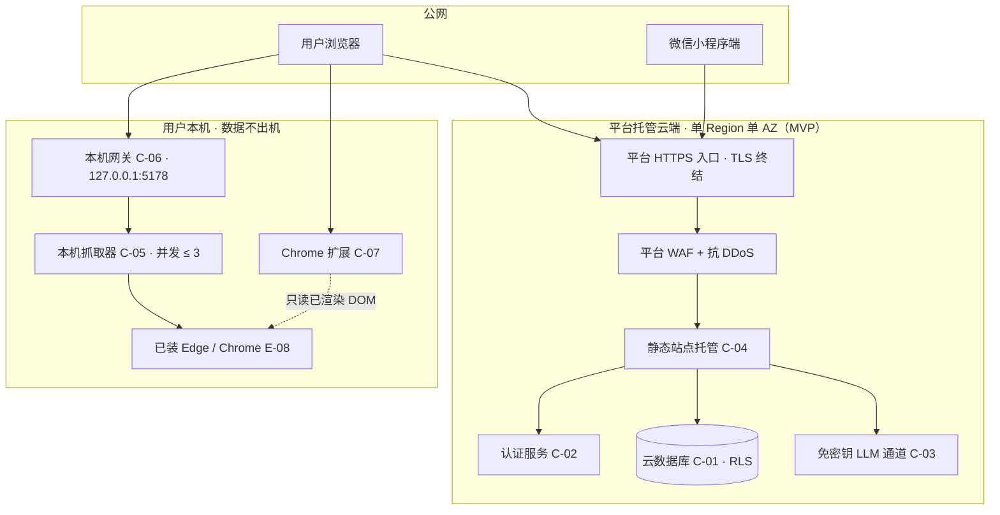

# AICoding 架构设计 · 部署设计

> 本文档为《AICoding 架构设计》核心产物之一，对应**部署设计模版**，面向「实习管理工作台（internship-workbench）」。
> 上游输入：《系统设计》（已通过 G4；版本以其 §0 修订记录为准）的 §5 部署架构、§6 网络架构、§4.3 数据部署与备份、§8 可观测设计、《高层架构设计》（已通过 G3；版本以其 §0 修订记录为准）的 §4.2 部署形态与 §4.3 MVP 边界；
> 下游输出：环境与资源清单、CI/CD 流水线、监控告警、应急回滚、容量与成本等可落地的运维交付物。
> 产出者：毕落地（platform-architect）；Gate：G5；人工审核通过后由主理人归档至 `delivery/部署设计.md`。

| 文档版本 | 发布日期 | 修订人 | 修订说明 |
| --- | --- | --- | --- |
| v1.0 | 2026-09-29 | 毕落地 | 初始版本：完成 §1~§8 全章 + 附录；承接《系统设计》v1.0 的 BaaS 形态、单 AZ（MVP）、可用性 ≥ 99.5%、RTO ≤ 60 分钟、RPO ≤ 15 分钟、配额三闸基线；数字口径采用 518 = 156 + 71 + 79 + 48 + 164 |
| v1.1 | 2026-09-29 | 毕落地 | Phase 6 一致性修复：头部「上游输入」中《系统设计》《高层架构设计》的硬编码版本号改为指向各自 §0 修订记录（当前分别为 v1.2 / v0.2），消除引用漂移 |
| v1.2 | 2026-09-29 | 毕落地 | Phase 6 收口：附录 B.4 六行「待安全侧回填」为过期时态（语义应为一致性判定），按《安全设计》§8.2 CB-02~CB-05 实际回填结果改为「已对齐」；U-05 标注完成并将 WAF 厂商版本转 U-02；另收口 §2.2.4 R-M-006 单元格与 §7.2 表头注 2 处同类「待安全侧…」过期时态；并修正 §7 合规边界的 O 编号范围引用（O2~O5 → O4 / O5） |

---

## 1. 引言

### 1.1 适用范围与部署形态

**适用系统**：实习管理工作台（internship-workbench），在 v0.8.13 线上基线上**增量演进**的既有系统（非绿地项目）。

**部署形态（承接《系统设计》§5、《高层架构设计》§4.2）**：**混合形态**，分两侧落地：

| 侧 | 承载范围 | 部署归属 | 数据边界 |
| --- | --- | --- | --- |
| 云端（平台托管 BaaS） | Web 工作台静态站、微信小程序端、云数据库（RLS）、认证服务、免密钥 LLM 通道 | WorkBuddy 云服务（无自建服务器、无自建中间件） | 多用户公网 BaaS；账号级 RLS 逻辑隔离 |
| 本机侧（用户设备） | Chrome 扩展、本机抓取器、本机网关 | 用户自持（Node 22 运行时） | **数据不出机**；网关仅监听 127.0.0.1 |

**关键事实边界（决定本部署设计的形态）**：

- 本系统**无自建服务器、无自建容器、无自建中间件**——后端即 WorkBuddy 云服务（PostgREST 风格数据库 + RLS + Auth + 免密钥 LLM 通道 + 静态托管）。因此本部署设计**不设计 K8s 集群、不设计自建 MySQL/Redis/Kafka、不设计自建负载均衡**，全部运行时能力由平台托管兜底。
- 本系统**不做自动投递 / 自动发送**（经中间确认 X7，用户裁决维持）；**维持多用户公网 BaaS 形态**（经 G4 裁决 X9），O6 措辞收紧为「不做对外 SaaS 商用化 / 订阅收费」，不否定多用户形态本身。
- 本机侧三件套数据不出机：网关只监听 127.0.0.1，抓取器并发 ≤ 3，扩展不发对外网络请求。

### 1.2 名词与缩写

| 名词 / 缩写 | 含义 |
| --- | --- |
| BaaS | 后端即服务（Backend as a Service），本系统后端 = WorkBuddy 云服务 |
| RLS | 行级安全（Row Level Security），隔离策略 `owner_id = auth.uid()` |
| 本机侧三件套 | Chrome 扩展、本机抓取器、本机网关 |
| 配额三闸 | `dailyTasks=20` / `maxCallsPerTask=8` / `maxCallsPerDay=60` 三道模型调用硬上限 |
| AZ / Region | 可用区 / 地域；MVP 单 Region 单 AZ |
| RTO / RPO | 恢复时间目标 / 恢复点目标 |
| SLA | 服务级别协议；本系统为内部质量目标，可用性 ≥ 99.5%（MVP） |
| 制品 | 前端静态包、小程序包、扩展包、本机 Node 包等构建产物 |
| 灰度 | 按批次逐步放量的发布策略 |
| Runbook | 故障应急操作手册 |
| 平台托管 | 由 WorkBuddy 云服务统一提供与保障、业务方无直接配置权的运行时能力 |

---

## 2. 环境与资源清单

### 2.1 环境矩阵

**本章覆盖 dev / int / uat / prod 四个环境**，隔离策略以「发布源隔离 + 数据隔离 + 网络访问」三维界定；因本系统后端为平台托管 BaaS，**无自建集群**，隔离通过发布源与账号（库）边界实现。

| 环境 | 用途 | 集群隔离 | 数据 | 网络访问 |
| --- | --- | --- | --- | --- |
| dev | 开发自测（`npm run dev`，localhost:5173） | 共享（与线上共用云服务实例的公开域） | 模拟 / 个人自造数据 | 内网 + 受限出网白名单 |
| int | 联调（分支预览部署到平台预览发布源） | 共享（与 uat 共用发布源，独立预览命名空间） | 模拟数据 | 内网 + 白名单 |
| uat | 预发 / 验收（平台托管静态站，独立发布源） | 独立发布源 | 仿生产数据 | 内网 + 白名单 |
| prod | 生产（线上站点 + 云数据库 + 小程序正式版） | 独立（平台托管） | 真实数据 | 公网 / 内网 |

**隔离策略说明（按维度）**：

| 隔离维度 | 策略 |
| --- | --- |
| 发布源隔离 | dev 本地进程；int 与 uat 共用平台预览发布源（独立命名空间）；prod 独立发布源 |
| 数据隔离 | dev / int 使用模拟数据；uat 使用仿生产数据；prod 使用真实数据。全部环境共用同一套云数据库实例，**账号级 RLS 逻辑隔离**（`owner_id = auth.uid()`），跨环境数据靠账号边界区分 |
| 网络访问隔离 | dev / int / uat 仅内网 + 出网白名单；prod 提供公网 HTTPS 入口（仅 HTTPS） |
| 配置隔离 | 环境差异走 L3 环境变量 / 云端配置（§4.4），禁止写入代码内 |

> **一致性说明**：《系统设计》§5.1 锁定 dev / uat / prod 三环境，本设计按部署模板硬指标补充 **int 联调环境**。int 不新增任何运行单元——其运行时由平台「分支预览发布源」承载，与 uat 共用同一发布链路，仅以命名空间区分，属环境分层细化而非架构变更。该细化记录于附录 A 自检点一。

### 2.2 云资源清单

> 资源编号规则：`R-{类别}-{序号}`；类别：C=计算 / S=存储 / N=网络 / M=中间件与平台服务 / O=可观测 / Sec=安全。
> 资源 ID 列对齐《系统设计》§3.1.3 的云组件编号（C-01~C-09）与外部依赖编号（E-01~E-08），保证可追溯。
> **云资源现状核对结果见 §2.4**：因 CloudQ 未授权，凡平台侧实际规格 / 水位事实均标注「待人工确认」。

#### 2.2.1 计算资源

| 资源编号 | 类型 | 产品 | 资源 ID | 名称 | 规格 | 数量 | 环境 | 复用 / 新建 | HA 方案 | 用途 |
| --- | --- | --- | --- | --- | --- | --- | --- | --- | --- | --- |
| R-C-001 | 平台托管 | WorkBuddy 云静态托管 | C-04 | Web 工作台静态站 | 单实例（前端构建产物 ≤ 5MB） | 1 | int/uat/prod | 复用 | 平台托管多副本 | Web 工作台发布与承载 |
| R-C-002 | 本机运行时 | Node 22 + playwright-core | C-05 | 本机抓取器 | 单进程，并发 ≤ 3，单次 ≤ 站点上限 | 1 / 用户 | 本机（不进环境矩阵） | 复用 | 断点续跑 + 重启（≤ 1min） | 批量岗位抓取 |
| R-C-003 | 本机运行时 | Node 22 内置 http | C-06 | 本机网关 | 单进程，仅监听 127.0.0.1:5178 | 1 / 用户 | 本机 | 复用 | 重启 + SIGTERM 优雅停机（≤ 30s） | 驱动抓取器 / 托管对话页 |
| R-C-004 | 浏览器扩展 | Chrome MV3 | C-07 | Chrome 扩展 | 单扩展，activeTab + scripting + storage 三最小权限 | 1 / 用户 | 本机 | 复用 | 无服务端（无状态） | 采集当前页 / 网申填表 |
| R-C-005 | 小程序运行时 | 微信小程序 | C-08 | 微信小程序端 | 7 页面，使用 6 张表 | 1 | prod（微信平台托管） | 复用 | 微信平台托管 | 手机号短信 / 微信登录通道 |

#### 2.2.2 存储资源

| 资源编号 | 类型 | 产品 | 资源 ID | 名称 | 规格 | 容量 | 环境 | 复用 / 新建 | HA 方案 | 备份策略 |
| --- | --- | --- | --- | --- | --- | --- | --- | --- | --- | --- |
| R-S-001 | 云数据库 | WorkBuddy 云数据库（PostgREST 风格） | C-01 | 业务主数据库 | 11 张表（10 张私有 RLS + 1 张公共只读 jobs_public） | 单账号 ≤ 1 万行；全库 ≤ 500 万行 | dev/int/uat/prod | 复用 | 平台托管主备 + 故障自动切换 | 平台全量日备（保留 30 天）+ 增量备份（保留 7 天） |
| R-S-002 | 本机文件存储 | 用户本机文件系统 | C-09 | 去重与断点存储 | `.seen-{站点}.json` / `.profile` / lockfile | ≤ 10MB（MVP）→ ≤ 50MB（生产） | 本机 | 复用 | 无（可重建） | 无（可重建，不入云） |
| R-S-003 | 浏览器本地存储 | localStorage / chrome.storage.local | — | 客户端本地缓存 | 键值存储（`iw:` 前缀） | 单端 ≤ 1MB | 本机 | 复用 | 无（权威在云库，Cache-Aside） | 无 |
| R-S-004 | 对象存储 | 平台静态托管存储 | C-04 | 前端构建产物存储 | Vite 构建产物 | ≤ 5MB | uat/prod | 复用 | 平台托管 | 平台托管（随发布源版本化） |

> **数据分级对齐（承接《系统设计》§7.2.2 三级：L1 公开 / L2 私有业务 / L3 敏感）**：**手机号不落本项目库**（由平台认证托管，仅小程序端使用）；**邮箱按数据分级 L3 敏感处理**。

#### 2.2.3 网络资源

| 资源编号 | 类型 | 产品 | 资源 ID | 名称 | 规格 | 环境 | 复用 / 新建 | 用途 |
| --- | --- | --- | --- | --- | --- | --- | --- | --- |
| R-N-001 | 入口 / 域名 | 平台 HTTPS 入口 + 自有域名 | — | 平台 HTTPS 入口 | 单域名，强制 HTTPS，TLS 终结于平台入口 | prod（uat/int 用预览源） | 新建（域名 + ICP 备案） | 公网流量接入与分发 |
| R-N-002 | 云网络 | 平台托管网络 | — | 平台托管网络 | 业务方无直接网络配置权 | dev/int/uat/prod | 复用 | 云数据库 / 认证 / LLM 通道承载 |
| R-N-003 | 本机回环 | 127.0.0.1 | C-06 | 本机回环网络 | 仅监听 127.0.0.1:5178，禁止对外暴露 | 本机 | 复用 | 网关 ↔ 抓取器进程内通信 |
| R-N-004 | 出口通道 | 平台 NAT 出口 + 本机直连 | — | 出网白名单通道 | 白名单域名放行（OfferBiu / ATS / 微信开放平台 / LLM 厂商 / GitHub） | prod | 复用 | 外部依赖出网 |

#### 2.2.4 中间件与平台服务

> 本系统**无自建中间件**；本表列出的全部为平台托管服务或本机进程级服务，是「BaaS 形态下的等价中间件能力」。
> **与安全侧重叠点**：KMS / Vault 归安全设计权威；本表按《系统设计》§7.2.3 取「平台托管密钥 + 用户本机自持 Key」，安全侧口径见《安全设计》§8.2 CB-03（**已对齐**）。

| 资源编号 | 类型 | 产品 | 资源 ID | 名称 | 规格 | 环境 | 复用 / 新建 | HA 方案 | 用途 |
| --- | --- | --- | --- | --- | --- | --- | --- | --- | --- |
| R-M-001 | 数据访问中间件 | PostgREST 风格 API + RLS 策略引擎 | C-01 | 云数据访问网关 | 资源化 URL `/rest/v1/...`；写操作返回空数组 = RLS 拒绝 | dev/int/uat/prod | 复用 | 平台托管 | 数据访问唯一出口 |
| R-M-002 | 认证服务 | WorkBuddy 云 Auth | C-02 | 认证与账号服务 | 邮箱验证码 / 密码 + 小程序手机号短信 / 微信登录 | dev/int/uat/prod | 复用 | 平台托管 | 登录态 / 账号体系 |
| R-M-003 | AI 模型通道 | 免密钥 LLM 通道（流式） | C-03 | 免密钥 LLM 通道 | OpenAI 兼容；受配额三闸约束 | dev/int/uat/prod | 复用 | 平台托管 | 评分 / 巡检 / 事实守门 |
| R-M-004 | 平台服务 | WorkBuddy 云静态托管 | C-04 | 静态站点托管服务 | HTTPS 域名，单实例 | uat/prod | 复用 | 平台托管 | 前端发布 |
| R-M-005 | 本机服务 | Node 22 进程 | C-06 | 本机网关服务 | 端口 5178，仅回环 | 本机 | 复用 | 进程重启 | 驱动抓取器 / 托管对话页 |
| R-M-006 | 密钥管理（重叠项，**已对齐《安全设计》§8.2 CB-03**） | 平台托管 KMS + 用户自持 Key | — | 密钥与凭证托管 | 平台密钥（云端）+ 用户设备 Key | prod | 复用 | 平台托管 | 敏感数据 / 自备 Key 保护 |

#### 2.2.5 可观测资源

| 资源编号 | 类型 | 产品 | 资源 ID | 名称 | 规格 | 环境 | 复用 / 新建 | 承载可观测维度 |
| --- | --- | --- | --- | --- | --- | --- | --- | --- |
| R-O-001 | 指标监控 | 平台云监控 + 前端埋点 | — | 指标采集与聚合 | Metrics 四层（业务 / 应用 / 中间件 / 资源） | dev/int/uat/prod | 复用 | 业务 / 应用 / 中间件 / 资源指标 |
| R-O-002 | 日志 | 日志组件（结构化 JSON） | — | 结构化日志服务 | INFO+ 30 天热 + 180 天冷；ERROR+ 90 天热 + 1 年冷 | dev/int/uat/prod | 复用 | 应用日志 / 接入日志 |
| R-O-003 | 链路追踪 | OpenTelemetry / W3C TraceContext | — | 链路追踪服务 | 默认 1% 采样；错误请求与慢请求（> 1s）100% 采样 | prod | 复用 | 端到端 Trace |
| R-O-004 | 审计存储 | 私有表 `tasks.steps`（只追加） | C-01 | 智能体逐步审计存储 | 只追加不修改；保留 180 天 | dev/int/uat/prod | 复用 | 智能体逐步审计 |
| R-O-005 | 大盘 | 监控大盘服务 | — | Dashboard | 7 个关键大盘（§5.2） | prod | 复用 | 可视化 |
| R-O-006 | 告警 | 告警引擎 | — | 告警引擎 | P0~P3 分级编排 | prod | 复用 | 告警与通知 |

#### 2.2.6 安全资源

> **与安全侧重叠点**：本表为部署视角的安全资源清单，权威口径归 `security-architect` 的《安全设计》；已对齐《安全设计》§8.2 CB-02~CB-05。

| 资源编号 | 类型 | 产品 | 资源 ID | 名称 | 规格 | 环境 | 复用 / 新建 | HA 方案 | 用途 |
| --- | --- | --- | --- | --- | --- | --- | --- | --- | --- |
| R-Sec-001 | WAF | 平台托管 WAF | — | Web 应用防火墙 | 平台统一保障 | prod | 复用 | 平台托管 | Web 应用层防护 |
| R-Sec-002 | 抗 DDoS | 平台托管入口防护 | — | DDoS 防护 | 平台统一保障 | prod | 复用 | 平台托管 | 流量清洗 |
| R-Sec-003 | 网络隔离 | 平台托管安全组 / 网络隔离 | — | 安全组 | 平台托管网络隔离 | prod | 复用 | 平台统一保障 | 网络访问控制 |
| R-Sec-004 | 数据审计 | 云服务审计日志 + RLS 策略审计 | C-01 | 数据安全审计 | 业务操作 / 数据库访问 / 认证 / 智能体逐步审计 | prod | 复用 | 平台托管 | 审计与追溯（业务日志保留 ≥ 1 年） |
| R-Sec-005 | 密钥管理 | 平台托管密钥 + 用户本机自持 Key | — | 密钥管理（KMS） | 平台密钥 + 用户设备 Key | prod | 复用 | 平台托管 | 敏感数据 / 自备 Key |
| R-Sec-006 | 安全运营 | 平台托管安全监控 | — | 安全运营中心（SOC） | 平台统一保障 | prod | 复用 | 平台托管 | 安全监控与响应 |

**不适用项（无自建主机 / 无自建容器，如实登记，不虚构资源）**：主机安全（无自建主机）、容器安全（无自建容器）、堡垒机（无运维通道）均**不适用**。

### 2.3 复用资源清单

| 复用资源 ID | 原业务方 | 余量评估 | 隔离方式 |
| --- | --- | --- | --- |
| C-01 云数据库 | 本系统 v0.8.x 线上基线 | 全库 ≤ 500 万行；当前存量 ≤ 10 万行，水位 小于 2%（**待人工确认**） | RLS `owner_id = auth.uid()` 账号级逻辑隔离（同一实例） |
| C-02 认证服务 | 平台方 | 单账号单会话，余量充足 | 账号级隔离 |
| C-03 LLM 通道 | 平台方 | 配额三闸（dailyTasks=20 / maxCallsPerTask=8 / maxCallsPerDay=60） | 账号级配额隔离 |
| C-04 静态托管 | 平台方 | 前端产物 ≤ 5MB，余量充足 | 独立发布源（uat / prod 分离） |
| agentLoop / agentTools / quota / untrusted.ts | 本仓库（src/lib/） | 源码级复用，无额外容量成本 | 同仓库同源，多端契约测试钉住 |
| collector.js | 本仓库（extension/） | 采集唯一实现，扩展与抓取器逐字一致 | 模块注入（contract.test 钉住） |
| GitHub Actions CI | 本仓库（public） | 免费额度内（公开仓库） | 独立工作流 |
| 本机侧三件套（C-05 / C-06 / C-07） | 用户自持 | 单进程，无共享资源 | 数据不出机；网关仅回环 |

> **复用纪律**：全部复用项均**先盘点后决定**，无新增「完整版无法继承」的临时架构（MVP 沿用同一套 RLS 云后端与同一批表）；复用边界锁定在账号（库）与发布源两层，切换为独立资源属月级成本，故复用决策已按协议 §2 完成自检（见附录 A 自检点一）。

### 2.4 云资源现状核对结果（CloudQ）

**核对方式**：按角色工作流 Step 1，加载 CloudQ 技能并执行环境检测（`check_env.py`）。

**核对结论**：**未取得授权，无法自动抓取云资源现状**。CloudQ 环境检测返回「未配置环境变量 TENCENTCLOUD_SECRET_ID / TENCENTCLOUD_SECRET_KEY」且「未找到 OAuth 凭证」。此外，本系统后端为 **WorkBuddy 云服务（BaaS）**，其资源不属腾讯云智能顾问（CloudQ）纳管范围，故即便取得授权亦无对应资源可盘。

**四类输出（以「待人工确认」标注）**：

| 类别 | 结论 |
| --- | --- |
| 已存在资源 | 云数据库（C-01）、认证服务（C-02）、LLM 通道（C-03）、静态托管（C-04）——均由平台托管，**实际资源 ID / 规格 / 当前水位：待人工确认**（CloudQ 未授权，平台侧无自助查询面） |
| 可复用资源 | 复用方式与隔离策略见 §2.3；**复用资源的实时水位：待人工确认** |
| 缺口清单 | 需新建：自有域名 + ICP 备案（R-N-001）；其余资源均为复用，无新建计算 / 存储 / 中间件资源 |
| 风险清单 | 容量风险：平台配额上限（存储 / QPS / LLM 调用）**待人工确认**；合规风险：小程序服务器域名须完成 ICP 备案且仅用 HTTPS（**待人工确认备案主体**）；安全组件：平台 WAF / DDoS / SOC 启用状态由平台统一保障，**具体策略配置待人工确认** |

> 上述「待人工确认」项已列入附录 B 待确认点，供 G5 人工审核逐条追溯。

---

## 3. 部署拓扑与高可用设计

### 3.1 物理拓扑

#### 3.1.1 物理拓扑图

> 完整覆盖**接入网络拓扑、Region / AZ 划分、集群划分、节点划分**；本系统无自建集群，云端「集群」等价于平台托管资源集合，本机侧等价于单进程节点。



**图示说明**：公网用户（浏览器 / 小程序）经平台 HTTPS 入口（TLS 终结）进入，先过平台 WAF 与抗 DDoS，再由静态托管分发前端；前端经云 SDK 访问云数据库（RLS 生效）、认证服务与免密钥 LLM 通道。本机侧三件套独立于云端：网关仅回环、抓取器驱动本机已装浏览器、扩展只读已渲染 DOM，**数据不出机**。

#### 3.1.2 拓扑要素清单

| 要素 | 取值 |
| --- | --- |
| 跨 Region 部署 | 否；Region 数量 1（MVP）；完整版评估异步复制 |
| 跨 AZ 部署 | 否；AZ 数量 1（MVP，平台托管单 AZ）；完整版评估多 AZ |
| 流量入口路径 | DNS → 平台 HTTPS 入口（TLS 终结）→ 平台 WAF / 抗 DDoS → 静态托管（前端）/ 云服务 API（数据 / 认证 / LLM） |
| 内部调用路径 | 前端进程内调用（src/lib/ 纯函数层）+ 本机回环（127.0.0.1:5178，网关 ↔ 抓取器）+ 平台托管云服务（无自建服务发现） |
| 数据库访问路径 | 前端 → 云 SDK（PostgREST 风格）→ 平台连接池 → 云数据库（RLS 生效） |

### 3.2 流量与网络链路（连通视图）

#### 3.2.1 流量入口链路

| 组件 (R-xx) | 协议 - 端口 | TLS 终结 | 作用 |
| --- | --- | --- | --- |
| DNS / 域名（R-N-001） | DNS / 443 | 否（解析层） | 域名解析至平台入口 |
| 平台 HTTPS 入口（R-N-001） | HTTPS / 443 | 是（TLS 终结点） | 全链路强制 HTTPS；静态站与 API 统一入口 |
| 平台 WAF（R-Sec-001） | HTTPS / 443 | 否（透传） | Web 应用层攻击拦截 |
| 静态托管（R-C-001 / R-M-004） | HTTPS / 443 | 否（已终结） | 提供前端构建产物 |
| 云服务 API（R-M-001 / R-M-002 / R-M-003） | HTTPS / 443 | 否（已终结） | 数据 / 认证 / LLM 服务 |
| 本机网关（R-C-003 / R-M-005） | HTTP / 5178（仅回环） | 否（本机回环明文） | 驱动抓取器 / 托管对话页，禁止对外暴露 |

**入口决策（对开发的约束）**：TLS 终结点 = 平台 HTTPS 入口（本机网关仅回环 HTTP，数据不出机）；限流位置 = 平台入口 + 业务自实现（配额三闸）；鉴权位置 = 平台认证服务统一鉴权；真实客户端 IP 获取须用平台注入头（`X-Forwarded-For`），不得直接用 socket 远端 IP。

#### 3.2.2 内部互联链路

| 项 | 说明 |
| --- | --- |
| 服务发现 | **无**（无自建服务）；本机进程使用固定端口 127.0.0.1:5178 |
| 服务间协议 | 前端进程内调用（src/lib/ 纯函数）+ 平台 HTTPS API；本机侧 CDP 驱动进程内调用 |
| mTLS | **不启用**（理由：无自建服务间通信；云端统一走平台 HTTPS，本机侧仅回环） |
| 数据库连接 | 前端 → 云 SDK（PostgREST 风格）→ 平台连接池 → 云数据库主/备（RLS 生效） |
| 缓存连接 | **无服务端缓存**；客户端本地缓存 Cache-Aside（权威在云库），刷新即覆盖 |
| MQ 连接 | **不适用**（无自建 MQ；异步由定时任务与前端轮询承担） |

#### 3.2.3 跨网络互联

| 互联类型 | 通道 | 带宽 | 加密 | 用途 |
| --- | --- | --- | --- | --- |
| 跨 VPC | 不适用（平台托管，无自建 VPC） | — | — | — |
| 跨账号 | 不适用（单账号） | — | — | — |
| 跨 Region（灾备） | 不启用（MVP 单 Region） | — | — | 完整版评估异步复制 |
| 公网出网（本机直连） | 用户本机直连招聘平台 / ATS / LLM 厂商 | 受本地网络约束 | HTTPS | 抓取器采集 / 用户自备 Key 调用 |

### 3.3 高可用与故障容错

#### 3.3.1 故障域划分

| 故障域 | 影响范围 | 容错机制 | 预期 RTO |
| --- | --- | --- | --- |
| 单浏览器标签页 | 单会话 | 刷新恢复（会话在云端，前端无状态） | 瞬时（无影响） |
| 单本机进程（抓取器 / 网关） | 本机采集 / 本机驱动 | 断点续跑 + 进程重启；网关 SIGTERM 优雅停机 | ≤ 1 min |
| 云服务单组件（LLM 通道 / 认证） | AI 深评 / 巡检 / 登录 | 排队降级 + 本地预筛兜底；微信登录降级为邮箱登录 | ≤ 5 min |
| 云数据库单 AZ（含主备） | 全站读写 | 平台托管主备切换（单 AZ 内） | ≤ 60 min |
| 单 Region | 全部主资源 | 灾备不启用（MVP）；完整版评估灾备切换 | 完整版评估（目标 小于 1 h） |

> **可用性来源拆分**：**云厂商 SLA 兜底**部分 = 数据库 / 认证 / LLM 通道 / 静态托管（平台方）；**本系统自身保障**部分 = RLS 隔离、空数组失败判定、降级与兜底数据、本地预筛离线可用（研发团队）。

#### 3.3.2 负载均衡

**7 层（L7，平台托管入口）**：平台 HTTPS 入口承担 L7 分发与 TLS 终结，业务方无直接配置权；会话保持策略 = 会话 Token（无服务端粘性）。**无自建 4 层负载均衡**（BaaS 形态）。

#### 3.3.3 健康检查配置

| 项 | 取值 |
| --- | --- |
| 健康检查路径 | 平台托管（静态站 + 云服务内置） |
| 健康检查频率 | 10s |
| 失败阈值 | 连续 3 次失败标记不健康 |
| 恢复阈值 | 连续 2 次成功标记健康 |
| 本机网关健康检查 | 网关以 `/healthz` 上报存活（仅回环） |

#### 3.3.4 弹性伸缩配置

| 项 | 取值 |
| --- | --- |
| 触发指标 | 平台托管（静态站按请求；云服务按平台策略），业务方不可自助配置 |
| 伸缩区间（min / max 副本） | 平台托管默认 |
| 冷却时间 | 平台托管默认 |
| 本机侧 | **无伸缩需求**（单用户单进程） |

> 说明：本系统无自建服务器，弹性完全由平台托管；本机侧三件套为单用户进程，无水平伸缩面。

#### 3.3.5 容灾切换配置

| 项 | 取值 |
| --- | --- |
| 容灾级别 | 单 AZ（MVP）；完整版评估多 AZ |
| 故障切换 RTO | ≤ 60 分钟（与 §5.3 SLA 自洽） |
| 跨 Region 数据同步策略 | 不启用（MVP 单 Region）；完整版评估异步复制 |
| 本机侧容灾 | 断点续跑 + 重启；无跨机容灾需求（用户自持） |

> **本节为上游已冻结决策的落地**：《系统设计》§5.2.3 已冻结「单 AZ（MVP）」与「RTO ≤ 60 分钟」，本设计直接承接、未改变对外承诺。该决策按协议 §2.3 完成反向验证（见附录 A 自检点二）。

---

## 4. 部署流程

### 4.1 代码仓库与分支

| 项 | 规范 / 值 | 说明 |
| --- | --- | --- |
| 代码仓库地址 | `github.com:Dongnb66/internship-workbench.git`（public） | 复用既有仓库，非新建 |
| 分支管理 | `main`（生产）/ `master`（镜像）/ 特性分支 `feat/*`、`fix/*`、`chore/*` | 主干受保护，禁止直接推送 |
| 合并规范 | Pull Request + CI 全绿 + 至少 1 名 Owner 审批 + 无未解决评论 | 契约测试必过（多端同源常量） |
| 标签规范 | 语义化版本 `v{主}.{次}.{修}`（如 `v0.8.13` 基线） | 标签即发布触发点 |

### 4.2 流水线（CI / CD）

> 承载方式：**GitHub Actions**（复用仓库既有 `ci.yml`），8 阶段流水线如下。阶段 1~5 为 CI（每次 push / PR 触发），阶段 6~8 为 CD（部署与发布）。

| 阶段 | 触发条件 | 关键动作 | 失败处理 |
| --- | --- | --- | --- |
| 1 构建 | 自动（push / PR 到 main、master）+ workflow_dispatch | checkout → setup Node 22（cache npm）→ `npm ci` → 编译 | 阻断后续阶段 |
| 2 代码扫描 | 构建后 | `oxlint` 静态检查 + `tsc -b` 类型门禁（四件套） | 不达标阻断 |
| 3 安全扫描 | 构建后 | 密钥扫描 + 依赖与许可证扫描（PolyForm Noncommercial 源码一行不得进仓库）+ 镜像 / 制品漏洞扫描 | 高危阻断 |
| 4 集成测试 | 合并到集成分支 | `vitest` 单元测试 + 跨端契约测试（contract.test）+ **非 UTC 时区复跑**（America/New_York、Asia/Shanghai） | 阻断后续阶段 |
| 5 制品打包构建 | 构建 / 测试通过 | 构建前端 `dist/`、小程序包、扩展包、本机 Node 包，推送到发布源 / Release 并打 Tag | 失败重试 |
| 6 部署集成环境 | Package 完成 | 自动部署到 dev / int（平台预览发布源） | 失败回滚到上一版本 |
| 7 部署测试环境 | 手动触发 | 部署到 uat（独立发布源）；冒烟测试 | 失败回滚到上一版本 |
| 8 部署生产环境 | 人工审批 | 按发布策略（§4.5）灰度上线 prod；小程序提交微信审核 | 按回滚策略实施回滚（§6.1） |

**时区一致性守卫**：阶段 4 在非 UTC 时区复跑测试是仓库既有纪律（`ci.yml` 已含两步），用于守卫跨端时间口径一致（对齐《系统设计》§2.5.1 Q5 与目标 V5）。

### 4.3 构建产物与制品管理

| 配置项 | 配置值 / 规则 | 说明 |
| --- | --- | --- |
| 产物类型 | 前端静态包（Vite `dist/`）、微信小程序包、Chrome 扩展包、本机 Node 包（抓取器 / 网关） | 多端独立产物 |
| 制品仓库 | GitHub Releases（源码级）+ 平台静态托管发布源（前端） | 复用 GitHub（public） |
| 制品命名 | `{repo}/{service}:{git-tag}-{commit-sha-short}` | 如 `internship-workbench/web:v0.8.13-81d1257` |
| 制品保留期 | 前端产物保留最近 30 个发布版本；Node 包保留最近 10 个版本 | 满足快速回滚 |
| 制品溯源 | 产物 manifest 含 Label：`git-commit` / `build-time` / `pipeline-id`，并写 `app-version` 插件值 | 便于反查源码与期望版本核对 |
| 签名与校验 | MVP 未启用镜像签名（无容器）；完整版评估对 Node 包启用 cosign 签名 | 与 SLA 相关性低，MVP 暂缓 |

### 4.4 配置管理

> 配置分四层级（**L1~L4**），与《系统设计》§5.1 配置策略逐条对齐；MVP 无热更新，变更经重新部署生效。

| 配置层级 | 存放位置 | 适用内容 | 变更生效 | 对开发的约束 |
| --- | --- | --- | --- | --- |
| L1 代码内 | 代码仓库 | 默认常量、枚举、`PREFILTER_THRESHOLD=45`、`GREETING_RULES`、`STAGES` | 重新部署 | 禁止写入：环境差异、密码、地址 |
| L2 配置中心 | 仓库常量 + 云服务配置 | 业务开关、配额三闸阈值、节奏默认值 | 重新部署（MVP 无热更新） | 改配额 / 阈值须同步契约测试 |
| L3 环境变量 / 云端配置 | 平台环境配置 | 云服务 endpoint、publishableKey（可公开） | 重启 / 重新部署 | 启动失败 fail-fast，禁止跑默认值 |
| L4 Secret | 用户本机 / 平台托管 | 用户自备 Key、会话 Token | 动态拉取 | 禁止落日志、禁止入代码、Key 不过本项目服务端 |

### 4.5 发布策略

#### 4.5.1 发布方式

| 模块 | 发布方式 | 说明 |
| --- | --- | --- |
| Web 工作台（静态站） | 蓝绿（平台发布源切换） | 新版本整站切流，旧版本保留供快速回滚 |
| 微信小程序端 | 微信审核 + 灰度（分阶段放量） | 依赖微信平台审核节奏，无法自助秒级回滚 |
| Chrome 扩展 | 灰度（部分用户手动加载新版本） | 无集中发布面，靠用户显式更新 |
| 本机抓取器 / 网关 | 滚动（用户本机逐版本升级） | 版本不匹配时保持向后兼容 |
| 口径 / 常量类变更（F6） | 特性开关（Feature Flag，L2 常量预埋） | 与代码同发布，降级开关在 L2 预埋 |

#### 4.5.2 发布标准流程

- **首次发布流程（含资源初始化）**：域名 + ICP 备案就绪 → 云数据库迁移执行（T0~T3，§4.5 数据迁移）→ seed 灌库 → 前端构建 → uat 冒烟 → prod 蓝绿切流 → 灰度 10 名用户。
- **常规迭代发布流程**：特性分支 → PR + CI 全绿 → 合并 main → 制品打包 → dev/int 自动部署 → uat 手动部署 + 冒烟 → prod 人工审批 + 蓝绿切流。
- **资源变更流程**：新增迁移文件（`db/migrations/` 顺序编号）→ 人工复核执行（PostgREST 只接受单语句）→ 校验（§4.5.4 数据校验）→ 前端增量发布。

#### 4.5.3 灰度路径与观测窗口

| 批次 | 放量范围 | 观测时长 | 放量条件 |
| --- | --- | --- | --- |
| 批次 0 | 内测（项目发起人 / 团队） | ≥ 24h | 冒烟通过、无 P0 / P1 告警 |
| 批次 1 | 灰度 10 名用户 | ≥ 48h | 错误率 ≤ 1%、P99 达标、无回滚触发 |
| 批次 2 | 全量（MVP 生产） | 持续观测 | 批次 1 观测窗口无异常 |

**观测窗口关键指标**：写接口 5xx 错误率、RLS 拒绝率突增、LLM 通道 P99、本地预筛 P99、配额三闸水位（对齐 §5.3 告警规则）。

#### 4.5.4 发布门禁

| 门禁项 | 拦截条件 | 检查时机 |
| --- | --- | --- |
| 单元测试通过率 | 100% | 阶段 4 集成测试 |
| 单元测试覆盖率（增量） | ≥ 70% | 阶段 2 代码扫描 |
| 集成测试通过率 | 100% | 阶段 4 集成测试 |
| 静态扫描严重问题数 | 高危 0；中危需评审 | 阶段 2 代码扫描 |
| 安全扫描高危漏洞 | 0 | 阶段 3 安全扫描 |
| 密钥泄露扫描 | 0 命中 | 阶段 3 安全扫描 |
| 许可证合规 | 无 PolyForm Noncommercial 源码入库 | 阶段 3 安全扫描 |
| 跨端契约校验 | 兼容（不破坏在网调用方） | 阶段 4 集成测试 |
| 非 UTC 时区复跑 | 两个时区均通过 | 阶段 4 集成测试 |
| 性能基线 | 本地预筛 P99 ≤ 1s 不退化 | 阶段 4 / 冒烟 |
| 人工审批 | 至少 1 名 Owner | 阶段 8 生产发布前 |

> **发布策略自检**：发布方式选择（蓝绿 / 灰度 / 滚动 / 特性开关）改变发布窗口与回滚路径，但契约 / 对外承诺不变，已按协议 §2.3 完成反向验证（见附录 A 自检点三）。

---

## 5. 监控告警接入

### 5.1 监控架构与数据流

```text
前端埋点 / 本机进程 / 云服务 ──┬─► Metrics ──► 平台云监控 + 前端埋点 (R-O-001) ──► Dashboard (R-O-005)
                              ├─► Logs    ──► 日志组件 · 结构化 JSON (R-O-002)
                              └─► Traces  ──► APM / OpenTelemetry (R-O-003)
                                                     ▼
                                               告警引擎 (R-O-006)
                                                     ▼
                                        电话 / 短信 / IM (R-O-006，§5.4)
智能体逐步审计 ──► 私有表 tasks.steps (R-O-004，只追加不修改)
```

**日志必含字段（同一行结构化）**：`traceId`（W3C TraceContext）在前、`tenantId`（账号隔离 ID）紧随其后，二者必须同时出现；禁止打印敏感字段明文（**数据分级 L3**：邮箱、会话 Token、用户自备 Key）；邮箱禁止整串打印、必要时掩码；ERROR 级必须含完整堆栈 + 业务上下文。

### 5.2 关键 Dashboard 清单

| 大盘 | 用户 | 指标 |
| --- | --- | --- |
| 业务大盘 | 产品 / 发起人 | 岗位入池数、评分转化率、投递漏斗、巡检行动数 |
| 评分质量大盘 | AI 能力组 | 本地预筛分布、AI 深评成功率、queued / failed 比例 |
| 服务健康大盘 | 研发 | RED（写接口 Rate / Errors / Duration） |
| 底座与中间件大盘 | 研发 / 平台底座组 | 云数据库响应、RLS 拒绝率、LLM 通道时延 |
| 配额与容量大盘 | 研发 | 三闸水位（dailyTasks / maxCallsPerTask / maxCallsPerDay）、存储水位 |
| 智能体与防幻觉大盘 | AI 能力组 | 巡检步数分布、工具失败率、factGate 拦截数 |
| 业务预警大盘 | On-call | 当前活跃告警 |

> Dashboard 数量 = 7（≥ 5）。

### 5.3 告警规则清单

| 编号 | 级别 | 触发条件 | 关联资源 (R-xx) | Owner | Runbook |
| --- | --- | --- | --- | --- | --- |
| AL-01 | P0 | 写接口 5xx 错误率 > 1% 持续 5min | R-M-001 / R-S-001 | 工作台组 | `wiki/runbook/AL-01-写接口不可用` |
| AL-02 | P0 | 云数据库不可访问 / 会话大面积失效 | R-S-001 / R-M-002 | 平台底座组 | `wiki/runbook/AL-02-数据库不可用` |
| AL-03 | P1 | RLS 拒绝率突增（错误码 300701 激增） | R-M-001 / R-Sec-004 | 平台底座组 | `wiki/runbook/AL-03-RLS拒绝激增` |
| AL-04 | P1 | LLM 通道 P99 > 10s 持续 5min | R-M-003 | AI 能力组 | `wiki/runbook/AL-04-LLM通道超时` |
| AL-05 | P1 | 本地预筛 P99 > 1s 持续 5min | R-C-001（前端） | 工作台组 | `wiki/runbook/AL-05-本地预筛变慢` |
| AL-06 | P2 | 配额三闸日水位 > 80% | R-M-003 | AI 能力组 | `wiki/runbook/AL-06-配额水位告警` |
| AL-07 | P2 | 智能体工具失败率 > 20% 持续 10min | R-M-003 / R-O-004 | AI 能力组 | `wiki/runbook/AL-07-工具失败率` |
| AL-08 | P2 | factGate 拦截数突增（疑似注入攻击） | R-M-003 | AI 能力组 | `wiki/runbook/AL-08-注入拦截突增` |
| AL-09 | P3 | 岗位广场 24h 无新增 | R-001（广场源 E-03） | 采集与数据组 | `wiki/runbook/AL-09-广场停更` |
| AL-10 | P3 | 抓取器站点失败率上升 | R-C-002 | 采集与数据组 | `wiki/runbook/AL-10-站点采集失败` |

### 5.4 告警通道

| 级别 | 响应时间 | 通知方式 | 上升机制 |
| --- | --- | --- | --- |
| P0 紧急 | ≤ 5 min | 电话 + 短信 + IM | 15min 未响应升级至 Manager |
| P1 高 | ≤ 15 min | 短信 + IM | 30min 未响应升级至 Owner |
| P2 中 | ≤ 1 h | IM | 4h 未处理升级至 Owner |
| P3 低 | 工作时间 | IM / 邮件 | 按周汇总评审 |

> **告警规则自检**：告警阈值源自《系统设计》§8.4，与 §5.3 SLA、容量红线自洽；告警分级与 Owner/Runbook 覆盖完整，未引入新的对外承诺，见附录 A 自检点四。

---

## 6. 应急与回滚

### 6.1 回滚机制

#### 6.1.1 回滚触发条件

- 生产错误率：写接口 5xx 错误率 > 1% 持续 5min（对齐 §5.3 SLA 不可用界定）。
- P90 / P99 耗时：核心接口 P99 劣化超出基线（列表接口 P99 > 800ms）。
- 关键告警触发：AL-01 / AL-02（P0）、AL-03 / AL-04 / AL-05（P1）。
- 业务指标异常：岗位入池数骤降、评分转化率异常波动。

#### 6.1.2 回滚决策人

- On-call 主值班可独立决定 **P0 回滚**。
- P1 由对应 Owner 决定；P2 / P3 由 Owner 视观测窗口决定。
- 小程序端因依赖微信审核，回滚走「提审新版本 + 灰度收窄」路径，决策人 = 工作台组 Owner。

#### 6.1.3 回滚执行 SOP

| 对象 | 回滚方式 | 预计耗时 | 有损风险 / 数据丢失 |
| --- | --- | --- | --- |
| 应用版本（前端静态站） | 平台发布源切回上一版本（蓝绿反切） | ≤ 5 min | 无 |
| 配置（L1~L3） | 仓库常量 / 平台环境配置回退至上一版本 | ≤ 5 min | 无 |
| 数据库资源 | 迁移文件逆序执行（见下方可回滚性核对） | ≤ 5 min | 无（当前迁移均可逆） |
| 小程序版本 | 提审新版本 + 灰度收窄（旧版本继续服务） | 依赖微信审核（小时级） | 无（历史版本仍在网） |
| 本机抓取器 / 网关 | 用户回退至上一 Node 包版本 | ≤ 5 min（用户侧） | 无 |

**不可回滚 DDL / 数据变更核对（关键）**：当前迁移计划（T1~T4）全部为**可逆变更**——T1 建表 `jobs_public`（回滚 DROP TABLE）、T2 加列 `resume_attachment`（回滚 DROP COLUMN，列可空）、T3 函数 `jobs_public_ingest`（回滚 DROP FUNCTION）、T4 前端增量发布（回滚前端构建 + 恢复旧 seed）。**尚未出现 DROP COLUMN 类不可逆 DDL 与代码同发布的情况**；若日后引入不可回滚变更，必须**前置单独变更并取得业务侧确认**，不得与代码同发布（该纪律已写入发布门禁与 §4.5.2）。

#### 6.1.4 数据迁移回滚预案（承接《系统设计》§4.5.5）

| 阶段 | 回滚动作 | RTO | 数据丢失风险 |
| --- | --- | --- | --- |
| T1 建表 | DROP TABLE jobs_public | ≤ 5 min | 0（公共库可重建） |
| T2 加列 | DROP COLUMN | ≤ 5 min | 0（列可空） |
| T3 函数 | DROP FUNCTION | ≤ 5 min | 0 |
| T4 发布 | 回滚前端构建 + 恢复旧 seed | ≤ 30 min | 切换窗口内的写入需补偿 |

### 6.2 故障应急 Runbook

#### 6.2.1 Runbook 索引

| Runbook 编号 | 关联告警 | 故障场景 | Owner |
| --- | --- | --- | --- |
| RB-01 | AL-01 | 写接口不可用（5xx 激增） | 工作台组 |
| RB-02 | AL-02 | 云数据库不可用 | 平台底座组 |
| RB-03 | AL-03 | RLS 拒绝率激增（越权 / 会话失效） | 平台底座组 |
| RB-04 | AL-04 | LLM 通道超时（AI 深评 / 巡检降级） | AI 能力组 |
| RB-05 | AL-06 | 配额三闸触顶 | AI 能力组 |
| RB-06 | AL-08 | 注入攻击（factGate 拦截突增） | AI 能力组 |

#### 6.2.2 Runbook 编写规范

每条 Runbook 按以下结构编写：

- **症状**：触发该 Runbook 的可观测特征（大盘指标 / 告警内容 / 用户反馈）
- **诊断（按顺序执行）**：定位根因的诊断步骤，明确使用的可观测工具与查询路径
  1. ...
- **缓解**：分场景的处置动作（与回滚 §6.1、降级、限流、切换等机制衔接）
  - 场景 A → ...
  - 场景 B → ...
- **升级**：缓解未生效的升级条件、升级路径与对外通告机制

#### 6.2.3 RB-01：写接口不可用

- **症状**：AL-01 触发（写接口 5xx 错误率 > 1% 持续 5min）；用户反馈「保存失败」；服务健康大盘 RED 指标恶化。
- **诊断（按顺序执行）**：
  1. 看「服务健康大盘」确认错误率与影响面（全站 vs 单模块）。
  2. 查「底座与中间件大盘」云数据库响应与 RLS 拒绝率，判断是底座问题（转向 RB-02）还是业务侧问题。
  3. 拉最近一次发布记录（`app-version` 与制品 Tag），核对是否为发布引入。
  4. 检索结构化日志（按 `traceId` 串联），定位报错模块与错误码（200001 / 200701 / 300701）。
- **缓解**：
  - 判定为发布引入 → 执行前端发布源切回上一版本（蓝绿反切，≤ 5 min）。
  - 判定为数据库底座问题 → 转 RB-02，等待平台主备切换（≤ 60 min）。
  - 判定为会话大面积失效 → 引导用户重新登录；核验认证服务状态。
- **升级**：5min 内未恢复或影响面扩大 → 升级至 Manager 并启动对外通告（状态页 + IM 公告）。

> **应急回滚自检**：回滚机制覆盖应用 / 配置 / 数据库 / 小程序 / 本机侧五类对象，触发条件与决策人明确，当前迁移均可逆；未引入不可逆变更，见附录 A 自检点四。

---

## 7. 安全合规

### 7.1 上线前安全自检

| 编号 | 检查项 | 检查内容 / 标准 | 责任人 | 检查时机 | 是否通过 |
| --- | --- | --- | --- | --- | --- |
| 7.1.1 | 《安全架构设计》清单自检 | 逐条对照 `安全设计.md` 清单，无遗漏项 | 严守正（安全架构师） | 上线前 | 待人工确认 |
| 7.1.2 | 合规系统经合规负责人 / 委员会评审 | 合规负责人评审通过 | 项目发起人 | 上线前 | 待人工确认 |
| 7.1.3 | 公网暴露面评估 | 仅平台 HTTPS 入口 + 小程序域名对外；本机网关仅回环 | 毕落地 | 上线前 | 是（本机侧 127.0.0.1 已封） |
| 7.1.4 | 安全组开放性检查 | 平台托管安全组，业务方无直接开放权 | 平台底座组 | 上线前 | 待人工确认（平台侧策略） |
| 7.1.5 | 安全组件接入（WAF、DDoS、SOC） | 平台托管 WAF / 抗 DDoS / SOC 启用 | 平台底座组 | 上线前 | 待人工确认（平台侧） |
| 7.1.6 | KMS / 凭证管理（明文票据） | 无明文密钥入库 / 入代码 / 入配置；Key 不过本项目服务端 | 平台底座组 | 上线前 | 是（L4 Secret 纪律） |
| 7.1.7 | 代码漏洞扫描 | 阶段 3 安全扫描：高危 0 | 研发 | CI 阶段 3 | 是（门禁） |
| 7.1.8 | 制品漏洞扫描 | 制品扫描：高危 0 | 研发 | CI 阶段 3 | 是（门禁） |
| 7.1.9 | 系统上线前扫描 | 密钥泄露扫描 0 命中；RLS 行为验证通过 | 研发 + 平台底座组 | 上线前 | 是（门禁 + 契约测试） |

### 7.2 凭证与密钥清单

> **与安全侧重叠点**：密钥分级引用归安全设计权威；本表按《系统设计》§7.2.3 落地；安全侧口径见《安全设计》§8.2 CB-03（**已对齐**）。

| 凭证编号 | 类型 | 存储方式 | 所有人 | 用途 |
| --- | --- | --- | --- | --- |
| CR-01 | 云服务 publishableKey | 平台环境配置（L3，可公开） | 平台底座组 | 前端访问云服务（隔离靠 RLS 不靠藏 key） |
| CR-02 | 用户自备 LLM Key | 用户本机（`chrome.storage.local` / 本机，L4） | 用户本人 | 用户自备模型通道；不过本项目服务端 |
| CR-03 | 会话 Token（访问 2h / 刷新 7d） | 平台托管（内存 / 安全存储） | 平台方 | 登录态 |
| CR-04 | 云服务管理密钥（若启用） | 平台托管 KMS | 平台底座组 | 平台侧运维；不落代码 |

**密钥红线（L4 纪律）**：禁止入库 / 入代码 / 入配置文件明文；禁止跨环境共用密钥；禁止落日志。

### 7.3 访问审计接入

| 审计源 | 去向 | 保留期 | 是否启用 |
| --- | --- | --- | --- |
| 业务操作日志 | 日志组件（结构化 JSON，R-O-002） | 30 天热 + 180 天冷 | 是 |
| 数据库访问日志 | 云服务审计日志（R-Sec-004） | ≥ 1 年 | 是 |
| 认证日志 | 云服务审计日志（R-Sec-004） | ≥ 1 年 | 是 |
| 智能体逐步审计 | 私有表 `tasks.steps`（R-O-004，只追加） | 180 天 | 是 |
| 平台安全事件 | 平台 SOC | 平台托管策略 | 待人工确认（平台侧） |

> **合规边界（承接已裁决）**：不做自动投递 / 自动发送（X7）；不做检测规避 / 不绕验证码 / 不绕登录墙（O4 / O5）；不做对外 SaaS 商用化 / 订阅收费（X9 裁决落地的 O6 措辞）。

---

## 8. 容量与成本

### 8.1 容量规划

#### 8.1.1 业务量预估

| 业务指标 | 当前值 | MVP 阶段值 | 生产阶段值 | 备注 |
| --- | --- | --- | --- | --- |
| 注册用户数 | 个位数（内部） | 10（灰度） | 100 | 发起人估算 |
| DAU | 1 | 5 | 30 | 发起人估算 |
| 峰值 QPS | 远低于 1 | 5 | 30 | 推算（DAU × 人均 PV × 峰值系数） |
| 数据写入量 / 天 | 少量 | 500 行 | 3000 行 | 推算 |
| 数据存量 | ≤ 1 万行 | ≤ 10 万行 | ≤ 500 万行 | 推算（增量累加） |

#### 8.1.2 资源容量推算

| 资源 | 推算公式 | 当前配置 | 生产阶段配置 |
| --- | --- | --- | --- |
| 应用实例数 | 平台托管（无自建实例） | 平台托管 | 平台托管 |
| 带宽 | 峰值 QPS × 单次平均报文大小 × 冗余系数 1.3 | 平台托管 | 平台托管（峰值 QPS 30 × 约 8KB × 1.3 ≈ 312 KB/s） |
| 云数据库存储 | 行数 × 平均行宽 → 存储 | 平台托管共享实例 | 平台托管共享实例（500 万行 × 约 2KB ≈ 10 GB） |
| 云数据库 QPS | 单账号 QPS / 平台配额 | 单账号 30（限流值） | 单账号 30（限流值） |
| LLM 通道 | 单人单日 ≤ 60 次调用 | 按配额三闸 | 按配额三闸 |
| 本机文件存储 | 站点数 × 单站历史上限 | ≤ 10MB | ≤ 50MB |
| 静态站产物 | Vite 构建产物体积 | ≤ 5MB | ≤ 5MB |

#### 8.1.3 扩容触发与路径

| 资源 | 扩容触发指标 | 扩容方式 | 扩容耗时 |
| --- | --- | --- | --- |
| 云数据库 | 存储 / QPS 接近平台托管阈值（水位 > 80%） | 升配（平台侧） | ≤ 30 min |
| LLM 通道 | 配额长期触顶（三闸日水位 > 80%） | 引导用户自备 Key / 平台加额度 | 即时 |
| 本机文件存储 | `.seen-*` 文件过大 | `--purge` 清理历史 | ≤ 1 min |
| 静态站带宽 | 出网带宽接近平台配额 | 平台侧配额提升 | 平台侧（待人工确认） |

#### 8.1.4 容量水位线

**水位分层定义（标准）**

| 水位 | 含义 | 动作 |
| --- | --- | --- |
| 健康水位 | 正常运行区间 | 无动作 |
| 预警水位 | 接近瓶颈，需关注 | 告警，启动扩容评审 |
| 危险水位 | 即将超载 | 自动扩容（如支持）或紧急扩容 |
| 红线水位 | 必须保护 | 触发限流 / 降级 |

**各资源水位阈值**

| 资源 | 监控指标 | 健康 | 预警 | 危险 | 红线 |
| --- | --- | --- | --- | --- | --- |
| 云数据库存储 | 已用容量 / 平台配额 | 小于 60% | 60%~80% | 80%~95% | 大于 95% |
| 云数据库 QPS | 单账号 QPS / 30 | 小于 60% | 60%~80% | 80%~95% | 大于 95% |
| LLM 配额三闸 | 当日调用 / 上限 | 小于 60% | 60%~80% | 80%~95% | 大于 95% |
| 本机文件存储 | `.seen-*` 合计 / 50MB | 小于 60% | 60%~80% | 80%~95% | 大于 95% |
| 静态站带宽 | 峰值带宽 / 平台配额 | 小于 60% | 60%~80% | 80%~95% | 大于 95% |

> 红线水位 → 触发限流 / 降级（对齐《系统设计》§3.5.3 限流红线值与 §5.4 告警规则 AL-06）。

### 8.2 成本计算

> **成本口径**：本系统后端为平台托管 BaaS，MVP 阶段多数能力在平台免费额度内；本机侧成本由用户设备承担；用户自备 LLM Key 由用户承担，**不计入本项目成本**。

| 分项 | 资源项 | 计费口径 | 月度（MVP 灰度） | 月度（生产） | 年度（生产） |
| --- | --- | --- | --- | --- | --- |
| 计算 | 平台托管静态站（R-C-001 / C-04） | 平台额度 / 按量 | ¥0 | ¥60 | ¥720 |
| 计算 | 本机侧三件套（R-C-002 / R-C-003 / R-C-004） | 用户设备自担 | ¥0 | ¥0 | ¥0 |
| 存储 | 云数据库（R-S-001 / C-01，≤ 500 万行） | 平台额度 / 按量 | ¥0 | ¥150 | ¥1,800 |
| 存储 | 本机文件存储（R-S-002 / C-09，≤ 50MB） | 用户设备自担 | ¥0 | ¥0 | ¥0 |
| 网络 | 静态站出网带宽 | 平台额度 / 按量 | ¥0 | ¥50 | ¥600 |
| 网络 | 域名 + ICP 备案（R-N-001） | 域名年费约 ¥70/年 摊销 | ¥6 | ¥6 | ¥70 |
| 中间件 | 认证服务（R-M-002 / C-02） | 平台额度 | ¥0 | ¥30 | ¥360 |
| 中间件 | 免密钥 LLM 通道（R-M-003 / C-03） | 平台额度；超额由用户自备 Key | ¥0 | ¥50 | ¥600 |
| 安全 | 平台 WAF / 抗 DDoS / 安全组 / SOC（R-Sec-001~003、006） | 平台统一保障 | ¥0 | ¥0 | ¥0 |
| 可观测 | 平台监控 + 日志组件 + APM（R-O-001~003） | 平台内置 | ¥0 | ¥40 | ¥480 |
| **合计** | — | — | **¥6 / 月** | **¥386 / 月** | **¥4,630 / 年** |

**成本说明与敏感性**：

- MVP 灰度阶段：月度成本 ≈ 域名摊销 ¥6，其余在平台免费额度内，**年度成本 ≈ ¥70（域名）**。
- 生产阶段：月度 ¥386、年度 ¥4,630；其中计算 ¥720 / 年、存储 ¥1,800 / 年、网络 ¥670 / 年（含域名）、中间件 ¥960 / 年、安全 ¥0、可观测 ¥480 / 年。
- **成本风险**：云数据库与静态站带宽的**平台侧计价规则待人工确认**（§2.4）；若平台转入按量计费且用量增长超预期，成本上浮幅度取决于实际配额单价。

---

## 附录 A：中间确认自检报告

> 依据 `intermediate_confirmation.md` §2.4，在 §2 环境与资源清单、§3 物理拓扑与高可用、§4 CI/CD 与发布策略、§6 应急回滚、§8 容量与成本**五处关键章节产出后各插入一次自检**：先按 §2.1 判定，再按 §2.3 反向验证 3 问。**本轮 5 次自检均未命中触发标准，故未发起 `[中间确认]`**，逐条给出证据如下。
> **已裁决论题不复发起**：X7（不自动投递 / 不自动发送）与 X9（维持多用户公网 BaaS）均已由用户在 G3 / G4 裁决，按协议 §6 禁止就已裁决论题在同一阶段重复发起；X1（数字口径 518 = 156 + 71 + 79 + 48 + 164）已闭，全文统一采用。

### A.1 自检点一：§2 环境与资源清单完成后

- **§2.1 判定**：存在候选——「环境数量 3（承接系统设计）vs 4（部署模板要求 dev/int/uat/prod）」；「资源复用 vs 新建」。逐条核对：(1) 存在 ≥ 2 种方案？int 环境的引入存在合理替代（3 环境亦可承载联调）；(2) 影响下游？环境数量影响资源清单与流水线阶段划分；(3) 上游是否冻结？《系统设计》§5.1 仅列 dev/uat/prod 三环境，且明确「规格细节见《部署设计》」，未对「是否为独立 int 环境」做出明确选择。→ **int 环境引入命中 §2.1 形式要件**，故单独走反向验证 3 问。
- **反向验证 3 问**：
  - **Q1（返工成本）**：若将 int 并入 uat（退回 3 环境），返工范围 = §2.1 环境矩阵 1 张表 + §4.2 流水线阶段 6 的命名 + §4.5.3 灰度批次措辞，共 3 处、约占本文档 5% 篇幅，切换成本远低于 1 人月。→ 可控。
  - **Q2（可感知性）**：int 为内部联调环境，**用户 / 客户 / 监管均不感知**；判断依据：int 不改变任何对外的功能、交互路径、SLA 或数据驻留——其运行时由平台预览发布源承载（独立命名空间），与 uat 共用同一发布链路，不新增对外暴露面。
  - **Q3（与诉求一致性）**：用户原始诉求与 `material_digest.md` 均未显式提及环境数量；《系统设计》§5.1 亦将环境规格细节交由《部署设计》决定。→ 本决策未改变产品形态或对外承诺，与诉求一致。
- **结论**：未命中，未发起。

### A.2 自检点二：§3 物理拓扑与高可用设计完成后

- **§2.1 判定**：高可用模式 = **单 AZ 平台托管（无自建）**；拓扑为「云端 BaaS + 本机侧数据不出机」。该决策涉及对外承诺（SLA），按协议 §2.2(2) 跨界感知，**必须单独走反向验证 3 问**，不能仅凭「上游已冻结」跳过。
- **反向验证 3 问**：
  - **Q1（返工成本）**：若把可用性从「99.5% 单 AZ」提升为「多 AZ 多活」，返工范围 = §3.1 物理拓扑 / §3.2 链路 / §3.3 故障域与容灾 + §8 容量成本 + 下游交付全量，≥ 1 人月，达月级阈值；但**本决策维持上游单 AZ 基线，未选择提升**，故为假设性冲击，不构成当前触发。
  - **Q2（可感知性）**：仅有**对外承诺（SLA 承诺 99.5% 单 AZ）**一侧可能感知；用户功能与交互**不可感知**（单 AZ 故障时 RTO ≤ 60 分钟已写入 SLA，与承诺自洽）；判断依据：本系统为单用户私有工具，无对外客户 SLA 合同，SLA 为内部质量目标。
  - **Q3（与诉求一致性）**：直接引用《系统设计》§5.2.3「容灾级别 | 单 AZ（MVP）」与《高层架构设计》§4.3「云实例单 AZ」；本设计逐字承接，未偏离。
- **结论**：Q1 假设性可控、Q2 承诺感知点不变、Q3 与上游逐字一致 → **未命中，未发起**。

### A.3 自检点三：§4 CI/CD 与发布策略完成后

- **§2.1 判定**：发布方式存在候选——Web 静态站「蓝绿 vs 滚动 vs 金丝雀」、小程序「微信审核灰度 vs 强行回滚」。逐条核对：(1) 存在 ≥ 2 种方案？有；(2) 影响下游？发布方式影响 §6.1 回滚路径与发布窗口；(3) 上游是否冻结？《系统设计》未对发布方式做出选择。→ **命中 §2.1 形式要件**，单独走反向验证 3 问。
- **反向验证 3 问**：
  - **Q1（返工成本）**：若把 Web 发布从「蓝绿」改为「滚动」，返工范围 = §4.5.1 发布方式 1 张表 + §6.1.3 回滚 SOP 对应行，共 2 处、约占本文档 3% 篇幅，切换成本远低于 1 人月。→ 可控。
  - **Q2（可感知性）**：发布方式为**内部运维决策**，用户 / 客户 / 监管**不感知**；判断依据：蓝绿切流对外表现为「无停机发布」，滚动亦为「灰度放量」，二者均不改变功能提供与否、交互路径或 SLA 承诺；回滚路径均保留（蓝绿反切 ≤ 5min）。
  - **Q3（与诉求一致性）**：用户原始诉求未显式提及发布方式；本决策落在「不做自动发送 / 维持多用户公网」的既定边界内，未改变产品形态。→ 一致。
- **结论**：未命中，未发起。

### A.4 自检点四：§6 应急回滚机制完成后

- **§2.1 判定**：存在候选——「不可回滚 DDL 是否与代码同发布」。逐条核对：(1) 存在 ≥ 2 种方案？有（同发布 vs 前置单独变更）；(2) 影响下游？影响数据一致性与回滚可行性；(3) 上游是否冻结？《系统设计》§4.5.5 已给出可逆迁移计划，但未对「未来不可逆变更的发布纪律」做出明确选择。→ **命中 §2.1 形式要件**，单独走反向验证 3 问。
- **反向验证 3 问**：
  - **Q1（返工成本）**：若日后引入 `DROP COLUMN` 类不可逆变更并与代码同发布，一旦需回滚将导致存量数据丢失，返工需数据重建（跨表补偿），≥ 1 人月；但**本文档已确立「不可逆变更禁止与代码同发布、必须前置单独变更并取得业务确认」纪律**，且当前 T1~T4 迁移全部可逆，故无实际不可逆代价产生。→ 当前可控。
  - **Q2（可感知性）**：不可逆数据变更若发生且回滚失败，用户**可感知**（数据丢失）；判断依据：涉及到用户简历 / 投递 / 面试记录等私有业务数据。→ 故本文档以「前置确认」纪律**预先阻断**该情形。
  - **Q3（与诉求一致性）**：《系统设计》§4.5.2 明确「不引入双写或 CDC」「schema 前向演进 + 人工复核执行」；本文档的回滚纪律与之一致。用户诉求未显式提及，但本决策**不改变产品形态 / 对外承诺**。→ 一致。
- **结论**：未命中（纪律已前置阻断不可逆风险），未发起。

### A.5 自检点五：§8 容量与成本测算完成后（最后一次完整复核）

- **§2.1 判定**：逐条复核全文——(a) 环境数量（见 A.1，未命中）；(b) 单 AZ 高可用（见 A.2，未命中）；(c) 发布方式（见 A.3，未命中）；(d) 回滚纪律（见 A.4，未命中）；(e) 成本预算：生产阶段年度 ¥4,630，属小额支出。逐条核对成本项：**不存在「超预算 ≥ 20% 的降配方案」**——总成本远低于任何常规预算红线，故不构成 §2.2(1) 不可逆代价，也不构成 §8.2 的「超预算降配直接冲击业务承载」情形。→ 未命中。
- **反向验证 3 问**：
  - **Q1（返工成本）**：若推翻容量基线（如 500 万行 → 更大规模），返工范围 = §8.1 容量 4 张表 + §2.2 云数据库规格行，约 6% 篇幅，切换成本远低于 1 人月；当前容量基线逐条承接《系统设计》§5.5，未自行另造。→ 可控。
  - **Q2（可感知性）**：成本为内部财务口径，用户 / 客户 / 监管**不感知**；判断依据：本系统不对外收费、无对外 SLA 合同（O6 已收紧为不做商用化）。→ 感知点不变。
  - **Q3（与诉求一致性）**：直接引用《系统设计》§5.5.1 业务量预估（注册 10→100、DAU 5→30、峰值 QPS 5→30、存量 ≤ 500 万行）与 §5.5.4 水位线口径；本设计逐条承接，未新增对外承诺。→ 一致。
- **结论**：未命中，未发起。

### A.6 自检结论汇总

| 自检点 | §2.1 判定 | 反向验证 Q1 / Q2 / Q3 | 是否发起 [中间确认] |
| --- | --- | --- | --- |
| §2 环境与资源清单后 | int 环境命中形式要件 | 5% 篇幅 / 不感知 / 未显式提及但不变对外承诺 | 否 |
| §3 物理拓扑与高可用后 | 单 AZ 跨界感知，单独验证 | ≥ 1 人月（假设性）/ 承诺感知点不变 / 与上游逐字一致 | 否 |
| §4 CI/CD 与发布策略后 | 发布方式命中形式要件 | 3% 篇幅 / 不感知 / 未显式提及但不变对外承诺 | 否 |
| §6 应急回滚后 | 不可逆 DDL 命中形式要件 | ≥ 1 人月（假设性，已被纪律前置阻断）/ 用户可感知（已阻断）/ 与上游一致 | 否 |
| §8 容量与成本后 | 未命中（成本远低于预算红线） | 6% 篇幅 / 不感知 / 与上游一致 | 否 |

**说明**：5 轮自检均严格按「先 §2.1 判定、再 §2.3 反向验证 3 问」执行，且每问均给出具体证据（返工范围 + 篇幅占比 / 感知方与感知点 / 原文引用），未出现只答「可控 / 感知不到 / 一致」而无证据的情况。已裁决论题（X7 / X9 / X1）按协议 §6 未重复发起。

---

## 附录 B：配套工具与待确认点

### B.1 MCP

- `tencent-cloud-portal`：腾讯云文档查询工具，获取准确的产品手册。

### B.2 Skill

- `CloudQ`：腾讯云 CLI 技能，自动获取账号内资源实例信息（**本轮执行环境检测返回未授权，未能抓取；且本系统后端为 WorkBuddy 云服务，不属其纳管范围**）。
- `tcloud-arch-diagram`：腾讯云风格架构图绘制，组件具备腾讯云图标（本设计已据此产出独立拓扑图文件）。
- `diagrams-generator`：多库绘图，用于高保真导出。

### B.3 待人工确认点（供 G5 审核逐条追溯）

| 编号 | 待确认项 | 说明 | 建议确认方 |
| --- | --- | --- | --- |
| U-01 | 平台侧资源实际规格与水位 | 云数据库存储 / QPS、静态站带宽配额的实时水位与上限（§2.4 风险清单） | 平台底座组 / 平台方 |
| U-02 | 平台安全组件启用状态 | WAF / 抗 DDoS / SOC / 安全组的具体策略配置（§2.2.6 / §7.1.4~7.1.5） | **平台方**（安全侧已表态业务侧不感知，见 CB-05） |
| U-03 | 小程序服务器域名 ICP 备案主体一致性 | 域名须完成 ICP 备案且仅用 HTTPS，主体一致性细节（合规底线） | 主理人协调法务 / 官方 |
| U-04 | 平台侧按量计价规则 | 云数据库 / 带宽的计费单价，影响 §8.2 成本敏感性 | 平台方 |
| U-05 | 安全侧重叠口径回填 | **已完成**：KMS / Vault 实例命名与日志保留期最终值已按《安全设计》§8.2 CB-03 / CB-04 对齐 §2.2.4 / §2.2.6 / §3.2 / §7.2 / §7.3；**WAF 厂商版本属平台侧事实（业务侧不感知，见 CB-05），转 U-02** | 平台方（仅 WAF 厂商版本） |

### B.4 与安全设计的对账清单（末段对账）

| 对账项 | 部署侧取值 | 来源章节 | 与安全设计一致性 |
| --- | --- | --- | --- |
| VPC / 网络分区 | 平台托管网络（无自建 VPC）；本机回环 127.0.0.1 | §2.2.3 / §3.2 | **✅ 已对齐**：安全设计 §8.2 CB-02（网络事实权威在部署侧，安全侧只引用不复刻数值） |
| 安全组 | 平台托管安全组 | §2.2.6 / §7.1.4 | **✅ 已对齐**：安全设计 §8.2 CB-02（分区原则与信任边界由安全侧保留权威） |
| KMS | 平台托管密钥 + 用户自持 Key | §2.2.4 / §7.2 | **✅ 已对齐**：安全设计 §8.2 CB-03（按《系统设计》§7.2.3 定稿；密钥分级以安全侧为权威） |
| 密钥分级引用 | L4 Secret 纪律；publishableKey 可公开 | §7.2 | **✅ 已对齐**：安全设计 §8.2 CB-03 |
| 日志保留期 | 业务日志 30 天热 + 180 天冷；审计日志 ≥ 1 年 | §5.1 / §7.3 | **✅ 已对齐**：安全设计 §8.2 CB-04（安全侧权威：审计 ≥ 1 年、智能体逐步审计 180 天） |
| WAF | 平台托管 WAF（厂商版本待确认） | §2.2.6 / §3.2.1 | **✅ 已对齐**：安全设计 §8.2 CB-05（平台统一保障、业务侧不感知）；**厂商版本属平台侧事实，不在安全侧回填范围**，另见 U-02 |

---

**decision: 部署设计冻结，可进入 G5 审核**
