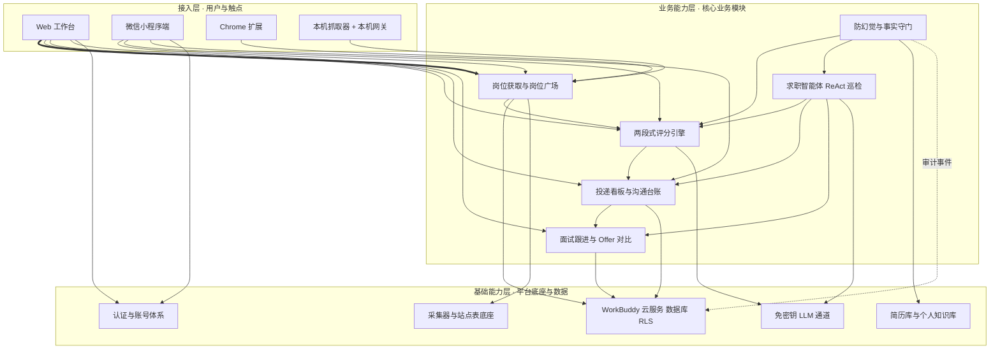
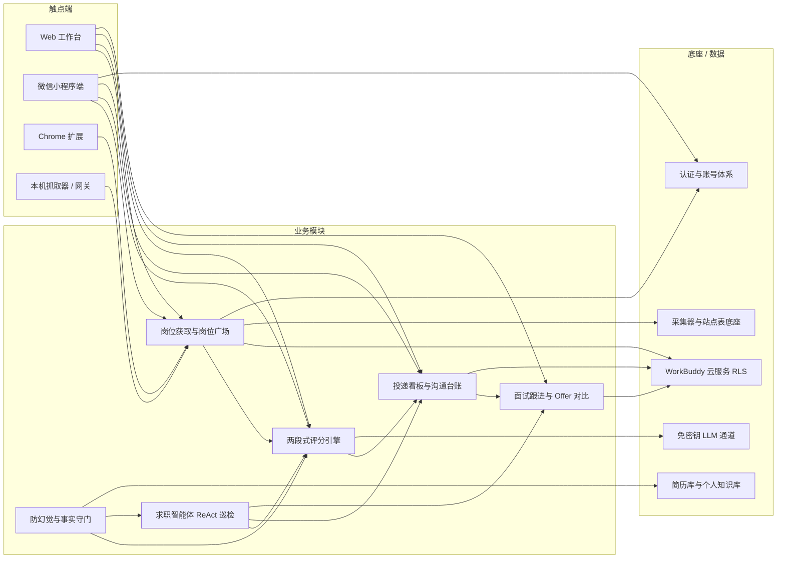

# AICoding 架构设计 · 高层架构设计

> 本文档为《AICoding 架构设计》核心产物之一，对应 **高层架构设计模版**，面向「实习管理工作台（internship-workbench）」。
> 上游输入：用户诉求 + 已过 G1 的 `material_digest.md` + 已过 G2 的 `research_report.md`；
> 下游输出：驱动《系统设计》《部署设计》《安全设计》《UserStory》四份文档的撰写。

---

## 0. 元信息：修订记录

```yaml
标题: 实习管理工作台（internship-workbench） - 高层架构设计 v0.3
版本: v0.3
状态: Draft
创建日期: 2026-09-29
最后更新: 2026-09-29
作者: 许边界（business-architect）
评审人:
  - 齐构成（主理人 / team-lead）
  - 用户（发起人）
关联文档:
  上游输入:
    - 用户诉求: 启动 AICoding 架构专家团，基于项目背景与资料生成完整架构方案
    - 资料摘要: .workbuddy/output/material_digest.md（D1~D22，已通过 G1）
    - 行业调研报告: .workbuddy/output/research_report.md（已通过 G2）
  下游产出:
    - 系统设计: .workbuddy/output/系统设计.md（Owner：高见远 system-architect）
    - UserStory: .workbuddy/output/UserStory.md（Owner：顾全景 product-story-designer）
    - 部署设计: .workbuddy/output/部署设计.md（Owner：毕落地 platform-architect）
    - 安全设计: .workbuddy/output/安全设计.md（Owner：严守正 security-architect）
```

| 版本 | 日期 | 作者 | 变更内容 | 评审状态 |
| --- | --- | --- | --- | --- |
| v0.1 | 2026-09-29 | 许边界 | 初稿：需求概要 / 需求分析 / 行业调研 / 方案决策 / 业务架构 / 产品需求六章 + 附录 | Draft |
| v0.2 | 2026-09-29 | 许边界 | G3 后定点修订：回灌 X1（518 唯一权威）与 X9（维持多用户公网 BaaS）裁决结论，与《系统设计》/《UserStory》口径对齐 | Draft |
| v0.3 | 2026-09-29 | 许边界 | Phase 6 收口：§2.2 核心痛点表「编号」列由与优先级同值（P1/P1/P2/P2/P3）改为唯一标识 PT-1~PT-5，消除编号歧义 | Draft |

> **版本管理纪律**：破坏性变更（章节结构调整 / 关键决策反转）升 MAJOR；新增章节、扩充内容升 MINOR。

---

## 1. 需求概要

### 1.1 需求概要说明

**业务现状**：实习管理工作台是一个面向在校生的实习 / 校招求职工作台，线上版本 v0.8.13，已形成五端并存形态（Web、微信小程序、Chrome 扩展、本机抓取器、本机网关），沉淀 11 张数据表（10 张私有按账号隔离 + 1 张公共只读 `jobs_public`）与 14 个前端模块，把岗位池 → 投递看板 → 沟通台账 → 面试跟进 → Offer 对比一条线管到底。

**触发事件**：v0.8.x 系列在 2026-09 密集迭代（岗位广场、微信小程序、本机抓取器、计费与自备 Key、求职智能体四步），能力分散且存在数字口径漂移，需要把已有能力收敛为**可冻结、可交接的高层架构边界**，为系统设计、部署设计、安全设计与 UserStory 提供唯一上游基线。

**系统定位一句话**：本系统是求职者的**私有工作台 + 公共岗位广场**，在「AI 辅助求职」链路上承担**记录与决策辅助层**职责，不做自动投递、不替代招聘平台。

### 1.2 关键决策摘要

| 编号 | 决策类别 | 决策内容 | 关联章节 |
| --- | --- | --- | --- |
| D1 | 范围决策 | 本期覆盖四类触点（Web / 微信小程序 / Chrome 扩展 / 本机抓取器 + 网关）与四项核心能力（岗位获取、两段式评分、ReAct 巡检、防幻觉）；自动投递与回复监听不在范围内 | §6.1 需求边界 |
| D2 | 技术选型决策 | 沿用 WorkBuddy 云服务（PostgREST 风格数据库 + RLS + 免密钥 LLM 通道）为唯一后端，不新建自建服务器；评分引擎沿用「本地规则预筛 + AI 七维深评」两段式 | §3.2 / §4.2 |
| D3 | MVP / 完整版边界 | MVP 覆盖 R1~R4（岗位获取、两段式评分、ReAct 巡检、防幻觉），R5（教练 + 冻结评测集 + 推断统计）延后完整版，R6（自动发送 / 回复监听）不做 | §4.3 |
| D4 | 复用 vs 新建 | 底座全部复用（RLS 云后端 / MV3 扩展 / 本机抓取器 / agentLoop / 防幻觉三道防线）；新增集中在冻结评测集与推断统计 | §2.4 / §5.2 |
| D5 | 部署形态 | 混合形态：云端（Web + 小程序 + 云服务）为多用户公网 BaaS，本机侧（扩展 + 抓取器 + 网关）数据不出机 | §4.2 / 部署设计 |

**硬指标**：≥ 3 条，≤ 5 条；每条决策均可映射到正文具体章节（上表 D1~D5 全部可映射）。

### 1.3 价值主张

| 价值维度 | 量化目标 | 度量指标 | 当前值 | 目标值 | 截止时间 |
| --- | --- | --- | --- | --- | --- |
| 效率 | 求职线索不漏跟 | 入池渠道覆盖率 | 5 类渠道分散、无统一台账 | 100% | MVP 上线后 2 月 |
| 合规 | 关键动作 100% 留痕 | 审计覆盖率 | 部分动作无留痕 | 100% | MVP 上线 |
| 成本 | 单用户 AI 调用成本可控 | 单人单日模型调用上限 | 三闸上限 dailyTasks=20 / maxCallsPerDay=60 | ≤ 60 次/日/人 | MVP 上线 |
| 体验 | 终端用户求职效率 | 周活跃投递数 | 基线待实测 | ≥ 2 倍基线 | 完整版上线 |
| 效率（技术） | 评分质量可证 | 冻结评测集套数 | 0 套 | ≥ 1 套（Hit@1 可复现） | 完整版上线 |

**硬指标**：业务价值 ≥ 2 条（效率 / 合规 / 体验 / 成本）+ 技术 / 成本价值 ≥ 1 条（效率（技术）、成本）；每条均可量化，未使用「提升 / 优化 / 加强 / 更好」等模糊词。

---

## 2. 需求分析 & 痛点解构

### 2.1 核心角色关注点

| 角色 | 业务身份 | 主要操作 | Top1 关心点 | 来源 |
| --- | --- | --- | --- | --- |
| 甲方决策者（角色关注：ROI 与作品可信度） | 项目发起人 / 产品负责人 | 路线决策、看板审阅、发布 | 业务结果与「可验证作品」的可信度 | 用户诉求 + D2 §1 |
| 最终用户 A（角色关注：不漏投、不漏跟） | 在校应届求职者 | 岗位获取、评分、投递登记、跟进 | 线索不丢、少踩坑 | D1 §它解决什么问题 |
| 最终用户 B（角色关注：漏斗与时效） | 求职辅导运营者 | 监控投递节奏与转化、看板干预 | 风险时效与转化漏斗 | D1 §功能 |
| 受影响方（角色关注：真实与不被打扰） | 招聘方 HR | 接收投递与招呼 | 内容真实、不被机械骚扰 | D7 §边界与免责 |
| 受影响方（角色关注：合规与数据驻留） | 合规 / 平台方（微信、云平台） | 审计、备案、ToS 校验 | 数据驻留、ICP 备案、合规底线 | D6 §6 + SR-25 |

**硬指标**：≥ 3 类（甲方决策者 / 最终用户 / 受影响方各至少一行）；每行均有 Top1 关心点，未出现「使用方便」一类笼统表述。

### 2.2 核心痛点

| 编号 | 痛点描述 | 现象 / 数据 | 影响角色 | 影响程度 | 优先级 |
| --- | --- | --- | --- | --- | --- |
| PT-1 | 求职线索散落多源、无统一台账，导致漏投与漏跟 | 事实：线索散在 BOSS、实习僧、邮箱、备忘录、Excel 五类渠道（D1 §它解决什么问题） | 求职者 | 高 | P1 |
| PT-2 | 岗位匹配评分质量不可证 | 事实：零冻结评测集、零推断统计（D5 §二 待吸收；D20 §4） | 求职者 | 高 | P1 |
| PT-3 | 平台风控与封号风险威胁真实求职账号 | 事实：自动化访问登录态平台存在临时限制 / 封禁与法律风险（SR-21；D21 §4） | 求职者 | 中 | P2 |
| PT-4 | 第三方数据源单点依赖 | 事实：OfferBiu 实测 totalItems=22671 / totalPages=454、size 硬上限 50、deadlineAt 覆盖率仅 20%（D20 §3；R-1） | 求职者 / 运营 | 中 | P2 |
| PT-5 | 多端规则同源易漂移、数字口径不一致 | 事实：曾存在 508 与 518 两套测试口径（X1；D8 §5）。已于 2026-09-29 由用户裁决定案：518 = 156 + 71 + 79 + 48 + 164 为唯一权威口径（offer-pipeline 129 + agent-platform-java 35） | 开发者 / 运营 | 低 | P3 |

**优先级标准**：P1 直接影响业务核心流程或合规底线；P2 影响用户体验或运营效率；P3 体验型 / 长尾问题。
**硬指标**：每条痛点均有「现象 / 数据」佐证；P1 ≥ 1 条且在 §2.3 有对应目标。

### 2.3 期待目标

| 编号 | 目标描述 | 对齐痛点 | 度量指标 | 当前值 | 目标值 | 截止时间 |
| --- | --- | --- | --- | --- | --- | --- |
| V1 | 线索不漏投不漏跟：全部渠道线索可入池 | P1 | 入池渠道覆盖率 | 5 类分散 | 100% | MVP 上线 |
| V2 | 评分质量可证：建 1 套冻结评测集并可复现 Hit@1 | P1 / P2 | 冻结评测集套数 | 0 | ≥ 1 | 完整版上线 |
| V3 | 零封号：不做自动发送、不做检测规避 | P2 | 自动发送次数 | 0 | 0（维持人工确认） | MVP 上线 |
| V4 | 数据源多源冗余，单源失效可降级 | P2 | 有效数据源数 | 1（主用 OfferBiu） | ≥ 2（ATS 直连 + 本机抓取器） | 完整版上线 |
| V5 | 口径唯一：数字事实源单点定义 | P3 | 口径冲突数 | 0（X1 已裁决为 518 唯一权威） | 0 | MVP 上线 |

**硬指标**：每条目标均有数字并至少对齐 1 条痛点；P1 痛点（线索散落、评分不可证）均有对应 V 级目标（V1、V2）。

### 2.4 基线复用

| 复用类别 | 现有能力 | 复用方式 | 来源系统 | 备注 |
| --- | --- | --- | --- | --- |
| 核心底座 | WorkBuddy 云服务（PostgREST 风格数据库 + RLS + Auth + 免密钥 LLM 通道） | 直接复用 | WorkBuddy 云服务 | D6 §2 / §3 / §7 |
| 数据模型 | 11 张表（10 张私有 RLS + 1 张公共只读 `jobs_public`） | 直接复用 | 现有云库 | D1 §数据模型 |
| 数据通道 | Chrome MV3 扩展（activeTab 只读）、本机抓取器（playwright-core，27 条站点表） | 直接复用 | extension/ + crawler/ | D15 / D16 |
| Agent 框架 | agentLoop + agentTools 工具注册表 + quota 三道上限 | 直接复用 | src/lib/ | D4 §3 |
| 防幻觉 | untrusted.ts 三道防线 + factGate + GREETING_RULES | 直接复用 | src/lib/ | D5 §一 |
| 评分引擎 | 两段式（本地预筛阈值 45 + AI 七维深评） | 复用 + 增强 | src/lib/score.ts | D1 §几个有意的设计选择 |
| 多端 | Web + 微信小程序 + 扩展 + 本机网关 | 直接复用 | miniprogram/ + gateway/ | D17 / D13 |
| 质量体系 | Vitest + oxlint + tsc -b + GitHub Actions CI（含非 UTC 时区复跑） | 直接复用 | .github/workflows/ci.yml | D18 |

**硬指标**：已先盘点再决定新建；凡列入 §2.5「功能缺口」的能力，均先在本节确认基线无法覆盖（详见 §2.5「基线是否可覆盖」列）。

### 2.5 功能缺口

| 阶段 | 功能缺口 | 基线是否可覆盖 | 必要性 | 优先级 | 对齐目标 |
| --- | --- | --- | --- | --- | --- |
| 投递前 | ReAct 每日巡检 v1（固化 max_steps 硬上限 + 逐步审计） | 已有雏形、未固化 | 必须 | MVP | V1 |
| 投递前 | 防幻觉事实守门（模型版强化，JD 白字注入防护） | 已有规则版、模型版缺失 | 必须 | MVP | V1 |
| 投递前 | 数字口径单点化（唯一事实源统一） | 不可覆盖（X1 裁决后 518 为唯一权威口径，成果约束不可覆盖） | 必须 | MVP | V5 |
| 投递中 | ATS 公开 JSON 直连通道（多源冗余） | 不可覆盖（现仅 OfferBiu 单源） | 重要 | 完整版 | V4 |
| 投递中 | 冻结评测集与评分校准 | 不可覆盖（零评测集） | 重要 | 完整版 | V2 |
| 投递后 | 项目教练任务包 + 公开仓库验收（已落地，纳入基线） | 已有 | 重要 | 完整版 | V2 |
| 运营 | 推断统计与漏斗归因看板 | 不可覆盖（零统计） | 重要 | 完整版 | V2 |
| 运营 | 渠道能力边界表（投递恒为「人工」） | 已有 | 必须 | MVP | V3 |

**硬指标**：每条缺口均对齐 §2.3 至少一条目标；MVP 缺口（ReAct 巡检、事实守门、口径单点化、渠道能力边界表）均在 §6.3 标注 MVP 范围。

---

## 3. 行业调研

> 本章承接已过 G2 的 `research_report.md`（四段式：事实 → 对比 → 建议 → 风险）。**事实、推断、建议三者严格区分**：本章表格中的得分、部署形态、许可证均为**事实**；「适用度」「借鉴方式」为**建议**；带「假设」标注的条目为**推断**。最终边界由本文档 §4 冻结。

### 3.1 行业标杆系统分析

| 标杆系统 | 厂商 / 来源 | 部署形态 | 场景覆盖 | 技术亮点 | 商业模式 | 适用度 |
| --- | --- | --- | --- | --- | --- | --- |
| B1 Simplify Copilot | Simplify（美国，商业 SaaS） | SaaS（扩展 + 云账号） | 表单自动填充 + 一键申请 + 申请跟踪 + 简历关键词缺口提示 | 扩展映射 profile 到 ATS 表单；AI 生成短答；自动记录投递 | 免费 + Simplify+ 订阅 | 中 |
| B2 Huntr | Huntr（美国，商业 SaaS） | SaaS（扩展 + 云看板） | Kanban 式投递跟踪 + 简历定制 + 投递结果分析 | 扩展一键裁剪岗位到看板；Pro 版 AI 简历打分 | 免费（≤ 100 投递）+ Pro 订阅 | 中 |
| B3 career-ops | santifer（开源社区，MIT） | 本地（CLI + 本地文件） | 岗位评分 A–F + ATS 简历生成 + 投递跟踪 + 面试故事库 | 本地优先；多智能体评估；10 维加权 A–F 评级；防幻觉简历引擎 | 开源（MIT） | 高 |
| B4 BossHunter | shengjidaguai-china（开源仓库，PolyForm Noncommercial） | 本地（Python 桌面） | 平台投递闭环 + 回复监听 + 定制简历 | patchright 伪装 + fonttools 解字体混淆；断点续采；score-trace | 开源但非商业许可 | 低 |
| B5 recruitops-agent | 开源社区（MIT） | 本地（Windows 桌面） | 桌面层 + Agent 层 + 采集层 + 数据层的完整求职系统 | 853 文件 / 644 Python / 282 测试文件 / 24 migrations | 开源（MIT） | 中 |

**硬指标**：≥ 3 家；包含 1 家头部 SaaS（B1 Simplify、B2 Huntr）+ 1 家开源 / 自研代表（B3 career-ops）。本表共 5 家。

### 3.2 方案对标及优先级打分

**对比矩阵**（每行权重之和 = 1.00；得分标尺 1~5 分，1 = 严重不符合，3 = 基本满足但有明显局限，5 = 完美契合）：

| 评估维度 | 权重 | B1 得分 | B2 得分 | B3 得分 | B4 得分 | B5 得分 |
| --- | --- | --- | --- | --- | --- | --- |
| 场景契合度 | 0.30 | 3 | 3 | 5 | 4 | 4 |
| 技术成熟度 | 0.20 | 5 | 5 | 4 | 3 | 4 |
| 集成难度（反向） | 0.15 | 2 | 2 | 4 | 2 | 3 |
| 成本（反向） | 0.15 | 3 | 2 | 5 | 4 | 4 |
| 合规可控性 | 0.20 | 2 | 2 | 5 | 1 | 3 |
| **加权总分** | **1.00** | **3.05** | **2.90** | **4.65** | **2.90** | **3.65** |

**结论摘要**：
- **优先借鉴**：`B3 career-ops`（4.65）—— 理由：场景契合度 5/5（岗位评分 + ATS 简历 + 投递跟踪与本项目几乎同构）、合规可控性 5/5（MIT + 本地优先 + 不替用户按发送键），与本项目「AI 只做辅助、发送键由人按」哲学同构；借鉴方式为**模式与设计级**，非代码照搬。
- **部分借鉴**：`B5 recruitops-agent`（3.65，借 Agent / MCP / RAG 分层与工程规范，不借其 Electron 桌面壳与平台适配矩阵）／`B1 Simplify`（3.05，借「填表契约 + 人按发送」的交互与字段映射）／`B2 Huntr`（2.90，借看板 / 管道信息架构与「一键裁剪岗位入池」）。
- **不借鉴（否决）**：`B4 BossHunter`（2.90）—— 否决依据是 **PolyForm Noncommercial 许可证红线（代码一行不得进本仓库）+ 与本项目已冻结边界正面冲突**（依赖检测规避、自动发送、回复监听），而非分数高低；可学的仅限产品设计、文档实践、治理制度、测试命名思路。

**§4.1 六个能力项的取舍结论**（调研侧建议，本文档 §4 冻结）：数据获取 = 复用 + 自研；评分引擎 = 借鉴 + 自研；Agent 层 = 借鉴 + 自研；防幻觉 = 复用 + 借鉴；多端 = 复用；**自动投递 / 自动发送 = 不采纳**。

### 3.3 完整报告参考

- 完整报告路径：`.workbuddy/output/research_report.md`（30 条联网来源 + 3 条本机资料，四段式结构完整）
- 调研工具：`tech-research-advisor` 系列检索 + WebFetch 一手来源核验（见附录 B）
- 调研日期：2026-09-29
- 关键来源：SR-05（smolagents）、SR-06（arXiv spotlighting）、SR-14（arXiv ReAct）、SR-25（微信开放文档·服务器域名）已取回正文；SR-21（自动化投递法律风险）、SR-24（工具对比）、D20 / D21（本机对标）用于承重引用。

---

## 4. 方案决策

### 4.1 价值定位澄清

**定位三段式**（对外 / 对内 / 差异化）：

```
对外价值（客户侧）: 让在校求职者的线索不漏投、不漏跟，把「找工作」从手工台账升级为有依据的决策辅助。
对内价值（运营侧）: 一线求职提效 + 管理风险可控 + 关键动作合规留痕（RLS 隔离 + 逐步审计）。
差异化价值        : 「AI 只辅助、发送键由人按」的本地优先形态；公共岗位广场与私有岗位池分离；两段式可解释评分 + 防幻觉三道防线。
```

**与产品矩阵的关系**：本系统在「AI 辅助求职」价值主线中承担**记录与决策辅助层**职责，上游对接招聘数据通道（扩展 / 抓取器 / 公开接口），下游向用户交付岗位池、投递看板与巡检结论，与招聘平台（不对接、不替代）形成清晰边界（见 §5.2、§5.3）。

### 4.2 系统定位澄清

| 维度 | 内容 |
| --- | --- |
| 系统名称 | 实习管理工作台（internship-workbench） |
| 系统类型 | 已有系统扩展（在 v0.8.13 线上基线上升级，非从零新建） |
| 部署形态 | 混合形态：云端 BaaS（Web + 小程序 + 云服务，多用户公网）+ 本机侧（扩展 / 抓取器 / 网关，数据不出机） |
| 多租户 | 是（隔离粒度 = 账号级，RLS 策略 `owner_id = auth.uid()`） |
| 服务对象 | 应届求职者（核心）、求职辅导运营者、项目发起人 / 产品负责人（对齐 §2.1） |
| 上游依赖 | WorkBuddy 云服务（数据库 / 认证 / 免密钥 LLM）、招聘平台页面（浏览器已渲染 DOM）、OfferBiu 公开接口、ATS 公开 JSON 源（详见 §5.2） |
| 下游消费者 | 用户本人（岗位池 / 看板 / 巡检结论 / JSON 备份导出）、招聘方（经用户人工投递触达）（详见 §5.2） |
| 边界（不做） | 不做自动投递 / 自动发送；不做服务端爬虫；不绕验证码 / 风控 / 登录墙；不做检测规避；不替代招聘平台（经中间确认 X7：维持不自动发送，用户裁决） |

### 4.3 MVP 与完整版决策

| 阶段 | 时间窗 | 范围（功能编号） | 架构差异点 | 退出标准 | 不做（延后） |
| --- | --- | --- | --- | --- | --- |
| MVP | W1 ~ W6 | F1 ~ F12 | 单租户隔离沿用、三方源单源（OfferBiu）、云实例单 AZ、本机侧三件套沿用 | 跑通核心场景（岗位获取 → 评分 → 巡检 → 看板）+ 灰度 10 名用户 | F13 ~ F18 |
| 完整版 | W7 ~ W12 | + F13 ~ F18 | 多源冗余（ATS 直连）+ 冻结评测集 + 推断统计看板 | DAU 稳定 30 天 + 可用性达标 | — |

**演进纪律**（重要）：
- MVP 的架构骨架必须是完整版的**子集**：本阶段不新增任何「完整版无法继承」的临时架构（沿用同一套 RLS 云后端与同一批表）。
- MVP 中可 Mock / 简化 的能力（如多源冗余、冻结评测集）须在完整版明确替换计划：由 F13（ATS 直连）与 F14（冻结评测集）承接。
- MVP 阶段 R6（自动发送 / 回复监听）**不做**，与 §4.2 边界一致（该决策已提交 [中间确认] X7）。

---

## 5. 业务架构设计

### 5.1 业务架构图

**三层业务架构**：接入层（用户与触点）→ 业务能力层（核心业务模块）→ 基础能力层（平台底座与数据能力）。

**绘制规范**：每个模块使用标准名（与 §4.2 系统定位、§6.2 模块全景图一致）；数据流方向明确——实线 = 同步调用、虚线 = 异步事件、粗线 = 主链路。



**图示说明**：接入层承载五类触点（Web / 小程序 / 扩展 / 抓取器 / 网关），其中 Web 工作台为主链路入口（粗线）；业务能力层由六个核心模块组成，覆盖「岗位获取 → 评分 → 决策登记 → 跟进复盘」的主链路，并由求职智能体（ReAct 巡检）与防幻觉模块横切增强；基础能力层提供云数据库（RLS 隔离）、认证、免密钥 LLM、采集器底座、简历与知识库等复用底座。全部接入层与业务能力层的持久化统一落在基础能力层的 WorkBuddy 云服务，本机侧（扩展 / 抓取器 / 网关）数据不出机。

### 5.2 系统依赖架构

| 依赖类型 | 系统 / 模块 | 提供方 | 依赖能力 | 接入方式 | 同步/异步 | 关键约束 |
| --- | --- | --- | --- | --- | --- | --- |
| 上游 | WorkBuddy 云服务 | 平台 | 数据库 / 认证 / LLM | SDK（PostgREST 风格） | 同步 + 流式 | RLS 强制 `owner_id = auth.uid()`；写操作返回空数组视为失败 |
| 上游 | 招聘平台页面 | 招聘平台 | 已渲染 DOM 岗位信息 | 扩展 / 抓取器读取 DOM | 同步（本机） | 只读 activeTab；不翻页调接口；不绕登录与验证码 |
| 上游 | OfferBiu 公开接口 | 第三方 | 校招岗位 JSON | HTTPS GET | 同步 | 默认 1.2s 间隔、不做并发；previewLimited、deadlineAt 覆盖率 20% |
| 上游 | ATS 公开 JSON 源 | 各 ATS 厂商 | 企业岗位 feed | HTTPS GET | 同步 | 无鉴权无 SLA；多源冗余 + 定期探测（完整版 F13） |
| 复用底座 | 采集器 collector.js | 本仓库 | DOM 提取唯一实现 | 模块注入 | 同步 | 扩展与抓取器逐字一致（contract.test 钉住） |
| 复用底座 | agentLoop + agentTools | 本仓库 | ReAct 循环 + 工具注册表 | 库调用 | 同步 | max_steps 硬上限；每步落审计；失败重试上限 2 |
| 复用底座 | quota 三闸 | 本仓库 | 模型调用配额 | 库调用 | 同步 | dailyTasks=20 / maxCallsPerTask=8 / maxCallsPerDay=60 |
| 复用底座 | untrusted.ts 三道防线 | 本仓库 | 外部文本隔离 | 库调用 | 同步 | 所有外部文本经 wrapUntrusted 包装 |
| 下游 | 用户本人 | — | 岗位池 / 看板 / 巡检结论 / JSON 备份 | 前端展示 + 导出 | 同步 | 导出 JSON 不入仓库 |
| 下游 | 招聘方 HR | 招聘平台 | 投递触达 | 用户手工操作 | 异步 | 投递恒为「人工」，类型上锁死 |

**硬指标**：每条依赖均明确「接入方式 + 同步/异步 + 关键约束」；P1 痛点对应的核心能力均可在本表找到依赖来源——线索散落（P1）→ 岗位获取能力（依赖招聘平台页面 / OfferBiu / ATS）；评分不可证（P1）→ 评分引擎（依赖 LLM 通道 + 本仓库评分模块，缺口由 F14 冻结评测集补齐）。

### 5.3 业务闭环

**业务主链路**（端到端）：

```
触发（岗位线索出现）→ 环节1 采集与入池（岗位广场 / 扩展采集 / 抓取器 / 整段粘贴）
→ 环节2 两段式评分（本地预筛阈值 45 → AI 七维深评）
→ 环节3 人工决策与登记（用户确认后自行投递 + 投递看板登记）
→ 环节4 跟进与复盘（沟通台账 → 面试跟进 → Offer 对比）
→ 反馈回路（节奏与超期提醒回注总览）
```

**关键反馈回路**：

| 回路 | 触发点 | 反馈对象 | 反馈机制 | 价值 |
| --- | --- | --- | --- | --- |
| 业务效果回路 | 业务流程完结（投递 / 面试 / Offer 状态变更） | 评分与巡检策略 | T+1 离线统计（完整版 F15） | 校准评分阈值与巡检优先级 |
| 运营监控回路 | 指标异常（超期未回复 ≥ 7 天、僵尸岗位） | 求职者 / 运营 | 看板标红 + 总览集中提醒 | 快速响应、不漏跟 |
| 模型迭代回路 | 人工标注（事实守门人工复核） | 模型平台 | 冻结评测集回归（完整版 F14） | 校准评分与事实守门准确率 |
| 口径治理回路 | 数字口径冲突被发现 | 开发者 / 运营 | GREETING_RULES 唯一事实源单点修订 | 消除口径漂移 |

**运营主线**：
- **每日**：求职者查看「今日投递节奏 + 超期未回复 + 巡检行动清单」，按守则完成当日投递登记。
- **每周**：运营者审阅漏斗转化与阶段分布（完整版 F15），识别僵尸岗位并维护黑名单。
- **每月**：发起人复核数字口径与作品可信度（GREETING_RULES / 简历数字），确认冻结评测集回归结果（与 §6.4 Web 工作台总览页、§6.5 小程序我的页呼应）。

---

## 6. 产品需求及原型

### 6.1 需求边界

**In-Scope**（本期必做，共 12 项功能 + 3 项非功能 = 15 项）：

| 编号 | 能力项 | 类型 | 对齐目标 |
| --- | --- | --- | --- |
| F1 | 多通道岗位获取（岗位广场 / 扩展采集 / 本机抓取器 / 整段粘贴） | 功能 | V1 |
| F2 | 渠道能力边界表（投递恒为「人工」，类型上锁死） | 功能 | V3 |
| F3 | 岗位池管理（私有隔离 + dedupeKey 去重） | 功能 | V1 |
| F4 | 本地预筛评分（阈值 45，18 个技术关键词加权） | 功能 | V2 |
| F5 | AI 七维深评（批量串行） | 功能 | V2 |
| F6 | 数字口径单点化（GREETING_RULES 唯一事实源） | 功能 | V5 |
| F7 | 投递看板（阶段流转 + 超期标红） | 功能 | V1 |
| F8 | 沟通台账（会话时间线 + 招呼话术模板） | 功能 | V1 |
| F9 | 面试跟进（表单关联投递） | 功能 | V1 |
| F10 | Offer 对比（多维对比） | 功能 | V1 |
| F11 | 求职智能体 ReAct 每日巡检 v1 | 功能 | V1 |
| F12 | 防幻觉与事实守门（untrusted 三道防线 + factGate） | 功能 | V1 |
| N1 | 多端形态（Web + 小程序 + 扩展 + 抓取器）共用一套云后端 | 非功能 | — |
| N2 | 数据隔离：10 张私有表 RLS（owner_id = auth.uid()） | 非功能 | — |
| N3 | 配额三闸（dailyTasks=20 / maxCallsPerTask=8 / maxCallsPerDay=60） | 非功能 | — |

**Out-of-Scope**（本期不做，必须列原因）：

| 编号 | 不做的事 | 原因 | 后续计划 |
| --- | --- | --- | --- |
| Out-of-Scope O1：自动投递 / 自动发送 | 触碰已冻结不变量，封号与合规风险落到用户真实账号 | 维持冻结边界（经中间确认 X7：用户裁决方案 A，不自动发送） |
| Out-of-Scope O2：回复监听（抓取平台会话） | 需登录态自动化，违反「只读已渲染 DOM」边界 | 不做 |
| Out-of-Scope O3：服务端爬虫 / 云上浏览器内核 | 风控后果落到用户账号，且无合规落点 | 由本机抓取器承担 |
| Out-of-Scope O4：绕验证码 / 风控 / 登录墙 | 属破对方保护措施，法律与封号风险 | 不做 |
| Out-of-Scope O5：检测规避（伪装自动化特征） | 与「不做检测规避」边界冲突，账号风险 | 不做 |
| Out-of-Scope O6：对外 SaaS 商用化 / 订阅收费（不否定多用户公网形态本身） | 与「作品可信度优先」定位冲突；对外售卖与订阅计费带来合规负担（经用户 2026-09-29 G4 裁决 X9：维持多用户公网 BaaS 现状，仅收紧对外商用措辞） | 维持多用户公网 BaaS 现状；对外商用待业务确认 |

**硬指标**：In-Scope = 15 条（≤ 15）；Out-of-Scope = 6 条（≥ 3）。

### 6.2 产品模块全景图

**模块卡片**（每个模块必填字段：标准名 / 一级归属 / 责任团队 / 上游 / 下游 / MVP 是否包含）：

| 模块名称 | 一级归属 | 责任团队 | 上游 | 下游 | MVP 是否包含 |
| --- | --- | --- | --- | --- | --- |
| 岗位获取与岗位广场 | 业务能力层 | 采集与数据组 | 扩展 / 抓取器 / OfferBiu | 两段式评分引擎 | 是 |
| 两段式评分引擎 | 业务能力层 | AI 能力组 | 岗位池 / 免密钥 LLM 通道 | 投递看板 | 是 |
| 投递看板与沟通台账 | 业务能力层 | 工作台组 | 两段式评分引擎 | 面试跟进 | 是 |
| 面试跟进与 Offer 对比 | 业务能力层 | 工作台组 | 投递看板 | 提醒日历 | 是 |
| 求职智能体 ReAct 巡检 | 业务能力层 | AI 能力组 | agentLoop / quota 三闸 | 看板 / 总览 | 是 |
| 防幻觉与事实守门 | 业务能力层 | AI 能力组 | untrusted.ts | 评分 / 巡检 | 是 |
| 简历库与个人知识库 | 基础能力层 | 工作台组 | — | 评分 / 网申填写包 | 是 |
| WorkBuddy 云服务底座 | 基础能力层 | 平台底座组 | — | 全部模块 | 是 |
| 采集器与站点表底座 | 基础能力层 | 采集与数据组 | — | 岗位获取 | 是 |



### 6.3 功能清单

| 编号 | 一级模块 | 二级功能 | 功能描述 | 优先级 | MVP 范围 | 完整版范围 | 对齐目标 |
| --- | --- | --- | --- | --- | --- | --- | --- |
| F1 | 岗位获取 | 多通道岗位获取 | 广场 / 扩展采集 / 抓取器 / 粘贴四通道入池 | P0 | ✅ | ✅ | V1 |
| F2 | 岗位获取 | 渠道能力边界表 | 投递列恒为字面量「人工」，类型锁死 | P0 | ✅ | ✅ | V3 |
| F3 | 岗位池 | 私有隔离与去重 | RLS 隔离 + dedupeKey 判定 | P0 | ✅ | ✅ | V1 |
| F4 | 评分引擎 | 本地预筛评分 | 阈值 45，本地规则打分 | P0 | ✅ | ✅ | V2 |
| F5 | 评分引擎 | AI 七维深评 | 批量串行，七维报告 | P0 | ✅ | ✅ | V2 |
| F6 | 口径治理 | 数字事实源单点化 | GREETING_RULES 唯一事实源统一 | P0 | ✅ | ✅ | V5 |
| F7 | 投递看板 | 阶段流转与超期标红 | 五阶段流转 + 超期 ≥ 7 天标红 | P0 | ✅ | ✅ | V1 |
| F8 | 沟通台账 | 会话时间线与招呼话术 | 时间线 + 硬约束话术模板 | P0 | ✅ | ✅ | V1 |
| F9 | 面试跟进 | 表单关联投递 | 面试记录关联投递记录 | P1 | ✅ | ✅ | V1 |
| F10 | Offer 对比 | 多维对比 | 多 Offer 维度对比 | P1 | ✅ | ✅ | V1 |
| F11 | 求职智能体 | ReAct 每日巡检 v1 | max_steps 硬上限 + 逐步审计 | P0 | ✅ | ✅ | V1 |
| F12 | 防幻觉 | 事实守门 | 规则版 + 模型版 + 外部文本隔离 | P0 | ✅ | ✅ | V1 |
| F13 | 岗位获取 | ATS 公开 JSON 直连 | 多源冗余，单源失效可降级 | P1 | ❌ | ✅ | V4 |
| F14 | 评分引擎 | 冻结评测集与评分校准 | 可复现 Hit@1 回归 | P1 | ❌ | ✅ | V2 |
| F15 | 运营看板 | 推断统计与漏斗归因 | 阶段分布 + 漏斗转化 | P1 | ❌ | ✅ | V2 |
| F16 | 项目教练 | 任务包与公开仓库验收 | 生成与验收不打模型 | P2 | ❌ | ✅ | V2 |
| F17 | 简历库 | 简历附件与 AI 分析 | 附件解析 + 分析（增强） | P1 | ❌ | ✅ | V2 |
| F18 | 提醒日历 | 四类事项汇总 | 面试 / 截止 / 跟进 / 超期 | P2 | ❌ | ✅ | V1 |

**硬指标**：**P0 即 MVP 范围** —— 上表 F1、F2、F3、F4、F5、F6、F7、F8、F11、F12 全部标记 P0 且在 MVP 范围列为 ✅；每个功能均可反向映射到 §2.5 功能缺口与 §2.3 期待目标（F11/F12/F6/F2 对应 MVP 缺口；F13/F14/F15/F16 对应完整版缺口）。

### 6.4 产品原型 - Web 工作台

**核心页面清单**：

| 页面 | 用途 | 关键交互 | MVP |
| --- | --- | --- | --- |
| 总览页 | 五个核心指标 + 今日投递节奏 + 超期未回复 | 卡片点击下钻 | ✅ |
| 岗位广场页 | 公共只读岗位浏览 | 筛选 / 加入岗位池（复制快照） | ✅ |
| 岗位池页 | 私有岗位池 + 批量 AI 评分 | 批量评分 / 转入投递 | ✅ |
| 投递看板页 | 阶段流转 + 超期标红 | 卡片拖拽 / 登记 | ✅ |
| 沟通台账页 | 会话时间线 + 招呼话术 | 时间线 / 一键填充模板 | ✅ |
| AI·JD 评估页 | 七维深评报告 | 评分 / 依据展开 | ✅ |
| 抓取任务页 | 本机抓取进度 | 任务下发 / 结果入库 | ✅ |

**关键交互约束**（对齐 §2.3 目标）：
- 评分两段式：本地预筛单次响应 P99 ≤ 1s；AI 深评批量串行，单批上限受 quota 三闸约束（对齐 V2）。
- 主链路操作步数：岗位池 → 评分 → 投递登记 ≤ 5 步（对齐 V1）。
- 发送键始终由人按：系统只产出草稿 / 填写包，不代按发送（对齐 V3）。

**原型链接**：以线上站点 `https://internship-workbench-47024.app.workbuddy.host/` 为可交互基线，高保真原型待产品设计阶段补充。

### 6.5 产品原型 - 微信小程序端

**核心页面清单**：

| 页面 | 用途 | 关键交互 | MVP |
| --- | --- | --- | --- |
| 总览（index） | 五个核心指标 | tabBar 切换 | ✅ |
| 岗位池（jobs） | 6 张表范围内岗位 | 筛选 / 入池 | ✅ |
| 投递（pipeline） | 投递看板 | 切换阶段 | ✅ |
| AI 评估（ai） | 评分报告 | 提交评分 | ✅ |
| 我的（me） | 账号 + 计费门 | 登录 / 退出 | ✅ |
| 登录（login） | 手机号短信 / 微信一键登录 | 验证 | ✅ |
| 会话详情（conversation） | 单条会话全貌 | 查看 | ✅ |

**关键交互约束**（对齐 §2.3 目标与平台合规）：
- 数据范围：小程序端只使用 6 张表（jobs / applications / messages / tasks / ai_reports / profile），隔离仍由同一套 RLS 保证（对齐 N2）。
- 规则同源：评分、节奏、常量逻辑与 Web 端同源（utils/score.js、utils/pace.js、utils/constants.js），改一端必须改另一端（对齐 V5）。
- 平台配置：`lazyCodeLoading: "requiredComponents"` 不允许删除；服务器域名须完成 ICP 备案且仅用 HTTPS（合规底线，对齐 SR-25）。

**原型链接**：小程序工程位于 `miniprogram/`，可直接以微信开发者工具打开预览。

---

## 附录 A：中间确认自检报告

> 依据 `intermediate_confirmation.md` §2.4，在 §2 / §4 / §5 / §6 四处关键章节产出后各插入一次自检：先按 §2.1 判定，再按 §2.3 反向验证 3 问。**本轮命中 1 项（X7），已发起 `[中间确认]`、已由用户裁决（方案 A 维持不自动发送）、结论已落盘至 §4.2 与 §6.1 O1；其余 3 轮未命中**，逐条给出证据如下。

### A.1 自检点一：§2 需求分析 & 痛点解构完成后

- **§2.1 判定**：核心角色、痛点、目标均直接来自 `material_digest.md` 事实与调研报告结论，不存在 ≥ 2 种会显著改变下游接口契约的合理理解。→ 未命中。
- **反向验证 3 问**：
  - Q1（返工成本）：若推翻 §2 的角色 / 痛点 / 目标，仅需重写 §2.1~§2.3 三段表格，约占本阶段产物 10%，切换成本远低于 1 人月。→ 可控。
  - Q2（可感知性）：§2 为内部需求分析，用户 / 客户 / 监管均不感知；判断依据：§2 内容不进入产品交互路径、合同条款或合规属性。
  - Q3（与诉求一致性）：直接引用 `material_digest.md` D1 §它解决什么问题原文「该投的没投、投了的没跟进、聊过的忘了聊到哪」；本阶段 §2 与之一致。
- **结论**：未命中，未发起。

### A.2 自检点二：§4 方案决策（MVP / 完整版 + 部署形态）完成后

- **§2.1 判定**：存在多组候选——后端「复用 WorkBuddy 云服务 vs 新建自建后端」、MVP 范围「含 R5 vs 不含 R5」、数据源「单源 vs 多源」。逐条核对：后端选型为仓库既定基线（D6 §3），MVP 裁剪属时间窗安排，二者均未改变产品形态；但 **R6 自动发送边界（X7）** 命中 §2.2 跨界感知。→ 该论题命中。
- **反向验证 3 问**：
  - Q1（返工成本）：若把部署形态推翻为自建后端，返工范围 = §4.2 / §5.1 / §5.2 三节 + 下游《系统设计》《部署设计》《安全设计》全量，切换成本 ≥ 3 人月，命中 §2.2(1)。（本决策维持现状，故为假设性冲击。）
  - Q2（可感知性）：部署形态属用户 / 客户可感知（多用户公网 vs 私有化影响 SLA 与数据驻留）；本决策维持仓库现状，感知点不变。
  - Q3（与诉求一致性）：用户诉求未显式提及部署形态；本决策沿用仓库既成事实（多用户公网 + 本机侧），未偏离。
- **判定结论**：部署形态维持现状 → 未命中；**R6 自动发送边界命中 §2.2(2) 跨界感知** → 已发起 `[中间确认]` X7 并已完成闭环（用户裁决方案 A），详见 A.5「X7 处理状态」。

### A.3 自检点三：§5 三层业务架构图与业务闭环完成后

- **§2.1 判定**：业务闭环存在 ≥ 2 种方式——「人工确认后由人发送的闭环」vs「系统自动发送的闭环」，该分歧即 X7；专业上最优解不唯一。→ 命中（与 X7 同一论题）。
- **反向验证 3 问**：
  - Q1（返工成本）：若主链路改为「系统自动发送」，返工 = §5.3 主链路 + §4.2 边界 + §6.1 Out-of-Scope + §6.3 功能清单 + 下游全量，≥ 本阶段产物 30%。
  - Q2（可感知性）：用户可感知（发送动作由谁执行、是否代按发送键）。
  - Q3（与诉求一致性）：用户诉求未显式提及；仓库 D2 §2.3、D8 §3 已冻结「发送键由人按」。
- **判定结论**：命中 §2.2(2) / (3) —— 与 X7 同一论题，**已随 A.2 发起 [中间确认]，按协议 §6 禁止就已裁决 / 已发起论题在同一阶段重复发起**，故本点不再单独发起。

### A.4 自检点四：§6 需求边界与功能清单完成后（最后一次完整复核）

- **§2.1 判定**：逐条复核 Out-of-Scope——O1（自动投递 / 自动发送）即 X7，已发起；O6（多用户 SaaS 商用化）对应 X9 冲突。
  - **X9 判定**：X9 建议「放弃多用户账号体系」，而仓库已是多用户公网应用（D1 §开头、D6 §1、D8 §12）。本阶段决策为**维持现状**（§4.2 多租户=是），即不改变对外承诺。§2.1 三条件中第 3 条「用户诉求 / 上游未冻结」不成立——维持现状即沿用仓库已定型的产品形态。→ 未命中。
- **反向验证 3 问（针对 X9）**：
  - Q1（返工成本）：若日后推翻为「单机工具」，返工 = §4.2 / §5.1 / §5.2 / §6.2 / §6.5 等多节，≥ 30%；但本决策未选择推翻，不构成当前触发。
  - Q2（可感知性）：若变更多用户形态，用户 / 监管可感知（账号体系、数据驻留、ICP 备案）；本决策维持不变，感知点不变。
  - Q3（与诉求一致性）：用户诉求与 `material_digest.md` 均未显式要求放弃多用户；D1 §开头、D6 §1、D8 §12 记录多用户公网为既成事实 → 维持一致。
- **判定结论**：X9 未命中，未发起；X7 已发起。其余 In-Scope / Out-of-Scope 条目均源自仓库不变量，未命中。

### A.5 自检结论汇总

| 自检点 | §2.1 判定 | 反向验证 Q1 / Q2 / Q3 | 是否发起 [中间确认] |
| --- | --- | --- | --- |
| §2 需求分析后 | 未命中 | 可控 / 不感知 / 一致（有原文引用） | 否 |
| §4 方案决策后 | 部署形态未命中；R6 命中 §2.2(2) | ≥ 3 人月 / 可感知 / 未显式提及 | **是（X7，已裁决：方案 A）** |
| §5 业务架构后 | 命中，与 X7 同论题 | ≥ 30% / 可感知 / 未显式提及 | 否（同论题复用，禁止重复发起） |
| §6 需求边界后 | X9 未命中 | ≥ 30%（假设性）/ 感知点不变 / 一致 | 否（X7 已裁决落盘） |

**X7 处理状态（经中间确认，已闭环）**：

- **发起时间点**：本阶段（2026-09-29）完成 §4 方案决策自检时发起 `[中间确认]`。
- **五项必填字段**：论题 = 自动投递 / 自动发送边界是否维持仓库既定冻结值；候选方案 = A（维持不自动发送）/ B（人工确认后由系统发送）；推荐项 = A；阻塞范围 = §4.2 边界与 §6.1 Out-of-Scope O1；期望回答时限 = 本阶段内。
- **候选方案与推荐**：方案 A（维持仓库既定不变量「不自动投递、不自动发送」，推荐项）／方案 B（改为「人工确认后由系统发送」，不推荐）。
- **用户裁决原文**：「维持 D2 §2.3、D8 §3 已冻结的不变量：只生成草稿/网申填写包，发送键始终由人按。零封号与 ToS 风险，与调研报告 §4.1 结论一致（许边界推荐）」→ **裁决结论：维持「不自动投递、不自动发送」边界，方案 B 不采纳。**
- **裁决落入的章节位置**：§4.2「系统定位澄清 · 边界（不做）」（标注「经中间确认 X7」）、§6.1「需求边界 · Out-of-Scope O1」（标注「经中间确认 X7」）。
- **修订纪律**：本次仅按协议 §5.3 定点修订与 X7 相关条目，其它已完成章节保持不变。

---

## 附录 B：生成方法论与工具清单

### B.1 生成流程

| 步骤 | 动作 | 落入章节 |
| --- | --- | --- |
| Step0 | 读取用户诉求、`material_digest.md` 全文、`research_report.md` 全文与高层架构模板 | — |
| Step1 | 整合调研结论（标杆 / 对比 / 建议 / 风险） | §3 |
| Step2 | 需求分析 / 痛点解构（角色 / 痛点 / 目标 / 基线复用 / 功能缺口） | §2 |
| Step3 | 能力盘点与系统定位（价值定位 / 系统定位 / 依赖架构） | §4 / §5.2 |
| Step4 | 生成高层架构（需求概要 / 需求分析 / 行业调研 / 方案决策 / 业务架构） | §1 ~ §5 |
| Step5 | 产品需求及原型（需求边界 / 模块全景 / 功能清单 / 触点端原型） | §6 |

### B.2 工具与方法

- 本机证据：完整读取 `material_digest.md`（481 行）与 `research_report.md`（459 行），凡引用均标注 `D编号，§章节` 或 `SR-xx`。
- 调研承接：整合 `research-analyst` 产出的 5 家标杆、5 维度加权对比、六个能力项取舍、六条风险（R-1~R-6）与四条待确认项（U-1/U-2/U-3/U-5）。
- 图示：三层业务架构图、产品模块全景图以内联 Mermaid 绘制（markdown 原生渲染，无外部依赖）；如需高保真导出，可调用 `diagrams-generator` 输出 PNG / SVG。
- 一致性核验：数字口径采用权威口径 **518 = 156 + 71 + 79 + 48 + 164（offer-pipeline 129 + agent-platform-java 35）**，并在 §2.2 / §2.3 登记 508 / 518 口径沿革（X1 已于 2026-09-29 由用户裁决定案 518 为唯一权威，口径来源：发起人 2026-09-25 复核）。

### B.3 事实 / 假设 / 建议 边界说明

- **事实**：§3.1 标杆画像、§3.2 对比矩阵得分、§2.4 基线复用清单、§5.2 依赖关系。
- **假设**：标注「假设」的量化值（如周活跃投递数基线、线索漏跟进率）待实测。
- **建议**：§3.2 结论摘要、§4.3 MVP 边界、§6.3 优先级排序，最终以上层裁决为准。

---

**decision: "高层架构边界冻结，下游可进入"**


